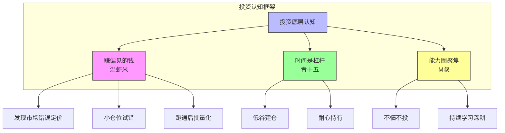
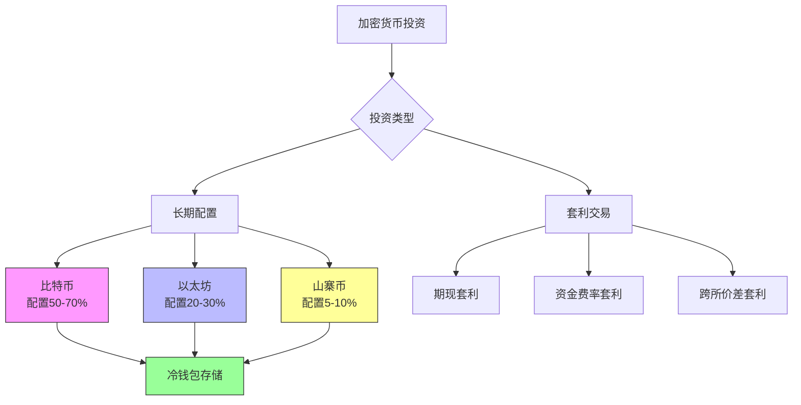
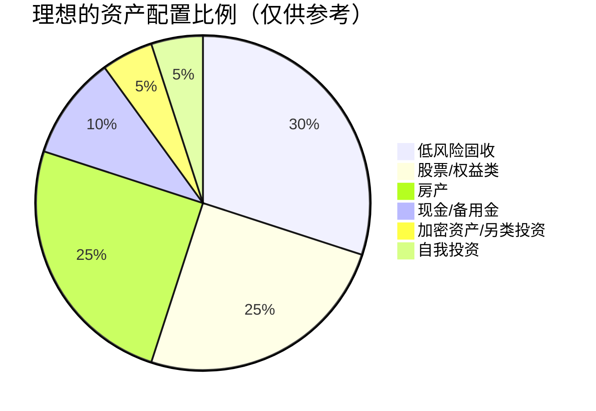

# 第07课：投资理财与资产配置

## 学习目标

- 建立正确的投资底层认知框架
- 了解加密货币投资的逻辑与风险
- 掌握低风险套利的核心方法论
- 理解房产投资的基本判断标准
- 建立科学的投资心态与风险管理体系

---

## 一、投资的底层认知

### 1.1 赚偏见的钱

> [!QUOTE]
> 投资要赚偏见的钱；失败的经验更值钱；投资永远不能All-in；遇到好的套利项目尽快程序化批量化；小仓位持续做小概率事件。 —— 温虾米

温虾米的观点非常犀利。所谓**赚偏见的钱**，指的是市场中充斥着各种偏见和错误认知——当大多数人对某个资产有错误判断时，就是你的机会。他还强调：

- **失败的经验更值钱**：赚钱的经验可能有运气成分，但亏钱的教训往往能教会你真正的风控
- **永远不能All-in**：无论多看好一个机会，都要留有余地
- **程序化批量化**：一旦发现可复制的套利机会，尽快用程序自动化执行
- **小仓位做小概率事件**：用亏得起的钱去博高赔率的机会

### 1.2 时间是最大的杠杆

> [!QUOTE]
> 时间是一种杠杆；看好资产在低谷建仓。 —— 青十五

青十五点出了投资中最简单却最难做到的真理：**时间是最好的杠杆**。在资产被低估时买入，耐心持有等到价值回归。这个策略听起来简单，但绝大多数人做不到——因为低谷时往往伴随着恐慌和负面消息，敢于逆势买入需要极强的认知和定力。

### 1.3 聚焦能力圈

> [!QUOTE]
> 聚焦在能力圈内做好一件事；幸福感与金钱无关。 —— M叔

M叔提醒我们：**投资不是什么都做，而是把一件事做透**。看不懂的不投，不熟悉的领域不碰。同时，他也点出了一个常常被忽视的真相——**幸福感与金钱多少并不直接相关**，投资是为了更好的生活，而不是为了数字的增长。

---

## 二、加密货币投资

### 2.1 比特币的破圈效应

> [!QUOTE]
> 比特币暴涨带来破圈效应；拿亏得起的钱投资；配置比特币和以太坊；非主流资产最多5-10%资金；保持理智和耐心；资产安全最重要使用冷钱包；不要过度加杠杆玩期货合约。 —— 馋嘴猫

馋嘴猫对加密货币投资给出了非常系统且稳健的建议：

**关于仓位配置：**
- **拿亏得起的钱投资**：加密货币波动极大，如果投入的钱亏了会影响生活，那你就不该投
- **核心配置比特币和以太坊**：这两个是加密货币领域的"蓝筹"，相对风险较低
- **非主流资产（山寨币）最多5-10%**：可能有百倍收益，也可能归零

**关于安全性：**
- **使用冷钱包**：将资产存储在离线钱包中，避免交易所被黑客攻击或跑路的风险
- **不要过度加杠杆**：期货合约在极端行情下可能让你瞬间归零

> [!WARNING]
> 加密货币市场7×24小时交易，波动剧烈。**永远不要用生活费、房贷钱、孩子学费去投资加密货币**。只投入你"亏了也不影响生活"的那部分资金。

### 2.2 牛市中的套利机会

> [!QUOTE]
> 2021年币圈大牛市有大量低风险套利机会；港股打新是低风险高收益机会。 —— 金马

金马同时关注到了两个不同领域的套利机会。在加密货币领域，他提到牛市中存在大量**低风险套利机会**——比如期现套利、资金费率套利、不同交易所之间的价差套利等。这类机会在牛市中尤其丰富，但需要一定的技术能力和快速执行力。

---

## 三、低风险套利

### 3.1 港股打新

金马把**港股打新**视为低风险高收益的机会。与A股打新不同，港股打新的特点包括：

- **中签率较高**：相比A股万分之几的中签率，港股打新中签率更友好
- **需要港币账户**：需要开通香港证券账户并存入资金
- **有破发风险**：不是所有港股新股都稳赚，需要精选标的

> [!TIP]
> 港股打新的核心策略是：**精选标的、多账户参与、暗盘及时止盈止损**。不要盲目申购每一只新股，而是选择基本面好、热度高的标的参与。

### 3.2 套利方法论

> [!QUOTE]
> 和持续赚钱的人交朋友；火力全开不断输出思考；开通所有证券账户权限；丰富投资武器库不只股票债券；先找项目再找钱；第一时间止损。 —— 胭脂王

胭脂王分享了一整套套利投资的系统方法论：

1. **和持续赚钱的人交朋友**：圈子决定信息质量，持续赚钱的人一定有值得学习的地方
2. **火力全开输出思考**：通过写作、分享来倒逼自己深入思考
3. **开通所有账户权限**：科创板、港股通、融资融券、期货期权……先把"武器"准备好，机会来了才能抓住
4. **丰富武器库**：不只局限于股票和债券，可转债、REITs、分级基金等都是工具
5. **先找项目再找钱**：不要先问"我有10万投什么"，而是先找到好项目，再解决资金问题
6. **第一时间止损**：发现判断错误立刻止损，不要等回本

> [!WARNING]
> 套利的核心不是"稳赚"，而是**计算概率后做正期望值的操作**。每一次套利都有风险，所以胭脂王特别强调"第一时间止损"——错了就认，快速转向下一个机会。

---

## 四、房产投资

### 4.1 买房是被动收入的手段

> [!QUOTE]
> 离开小城市到大城市去；买房是赢得被动收入最简单的手段；保护好信用。 —— 喵一布

喵一布的观点非常直接：**买房是普通人获得被动收入最简单的手段**。他的核心逻辑：

- **去大城市**：人口流入的城市，房产才有长期价值
- **保护好信用**：信用是买房加杠杆的基础，信用卡按时还款、贷款不逾期

### 4.2 商业地产的陷阱

> [!QUOTE]
> 商业地产不是越高级越赚钱；存款几千万以下不要随便投资商铺。 —— 66

66给出了一个非常实用的建议：**普通投资者不要碰商铺**。商铺投资的门槛极高——需要专业的选铺眼光、对周边商业环境的判断力、以及承受空置期的资金实力。对于存款几千万以下的投资者来说，住宅远比商铺安全。

> [!QUOTE]
> 国内房地产过了快速涨价阶段。 —— 萧遥

萧遥的补充也很重要：过去二十年房地产的"黄金时代"已经过去，房产投资不再是闭眼买入就能翻倍的阶段，需要更加精挑细选。

---

## 五、投资心态与风险管理

### 5.1 存钱与省钱

> [!QUOTE]
> 存钱和理财不会让你不自由；不懂合理省钱赚再多也不是盈余。 —— 范米索

范米索颠覆了一个常见的认知误区：很多人觉得存钱和理财会"降低生活质量""限制自由"，但实际上**没有财务基础的"自由"是虚假的自由**。她进一步指出：**省钱本身就是一种盈利**——赚100块花掉100块，你没有任何积累；赚100块省下30块，你有了30块的盈余和未来投资的本金。

### 5.2 止损与学习

> [!QUOTE]
> 保持学习为学习付费；懂得止损敢于止损；乱世危机另一面就是机会。 —— 济颠

济颠的观点给投资心态画了一个完整的闭环：

| 原则 | 含义 | 行动建议 |
|------|------|---------|
| 为学习付费 | 投资自己的认知是最值得的投资 | 买书、上课、请教高手 |
| 敢于止损 | 错误的坚持比放弃更可怕 | 设定止损线，严格执行 |
| 危机即机会 | 市场恐慌时往往是最好的买入时机 | 保持现金储备，等待危机 |

### 5.3 永远不要All-in

温虾米反复强调的"永远不能All-in"，是所有投资中最重要的一条纪律。无论多确定的机会，都要留一部分现金。原因有三：

1. **任何投资都有不确定性**——黑天鹅事件永远存在
2. **All-in后心态会失衡**——涨跌都容易做出错误决策
3. **机会成本**——All-in后遇到更好的机会只能干瞪眼

---

## 六、要点回顾与行动清单

### 要点回顾

| 主题 | 核心观点 | 提出者 |
|------|---------|--------|
| 投资认知 | 赚偏见的钱，永远不All-in | 温虾米 |
| 时间杠杆 | 看好资产在低谷建仓 | 青十五 |
| 加密货币 | 拿亏得起的钱配置BTC和ETH | 馋嘴猫 |
| 低风险套利 | 先找项目再找钱，第一时间止损 | 胭脂王 |
| 房产投资 | 去大城市，保护信用 | 喵一布 |
| 商铺陷阱 | 存款几千万以下别碰商铺 | 66 |
| 省钱即盈利 | 不懂合理省钱赚再多也没用 | 范米索 |
| 危机即机会 | 敢于止损，为学习付费 | 济颠 |

> [!QUESTION]
> **自测问题 1**：温虾米说"投资要赚偏见的钱"，这句话怎么理解？能举一个实际例子吗？
>
> 

> 
点击查看答案

> "赚偏见的钱"指的是利用市场中其他人的错误认知来获利。例如，当某只股票因为短期利空消息被恐慌抛售，但公司基本面并没有实质恶化时，大多数人因为恐惧而低价卖出——这就是偏见。你如果看清了真相，就可以在低估时买入，等到市场情绪恢复后卖出获利。简单说：**别人恐惧时我贪婪，别人贪婪时我恐惧**。
> 

> [!QUESTION]
> **自测问题 2**：馋嘴猫对加密货币仓位配置的建议是什么？为什么非主流资产不能超过10%？
>
> 

> 
点击查看答案

> 馋嘴猫建议：核心配置比特币和以太坊，非主流资产（山寨币）最多占5-10%。原因是山寨币波动极大、项目质量参差不齐，有归零风险。用不超过10%的资金去博取高收益，既不会影响整体资产安全，又能保留参与高赔率机会的可能。
> 

> [!QUESTION]
> **自测问题 3**：胭脂王说"先找项目再找钱"和"第一时间止损"是什么意思？
>
> 

> 
点击查看答案

> "先找项目再找钱"是指：不要先看自己有多少钱再决定投什么，而是先发现好的投资机会，再想办法解决资金问题。好项目比资金更难找。"第一时间止损"是指：一旦发现判断错误或市场走势与预期不符，立即止损离场，不要等回本。胭脂王认为**止损是套利中最重要的一环**，很多人亏大钱就是因为不肯认错。
> 

### 下一步行动清单

1. **梳理财务状况**：盘点自己的资产、负债、现金流，明确可用于投资的资金
2. **建立知识框架**：至少精读2本投资经典书籍（如《穷查理宝典》《投资最重要的事》）
3. **开通账户权限**：检查并开通各类证券账户权限（科创板、港股通等）
4. **设定止损规则**：为自己设定每笔投资的止损线（建议8-15%）
5. **学习加密货币基础**：了解比特币和以太坊的基本原理，配置一个小仓位体验