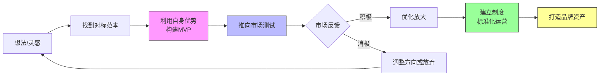
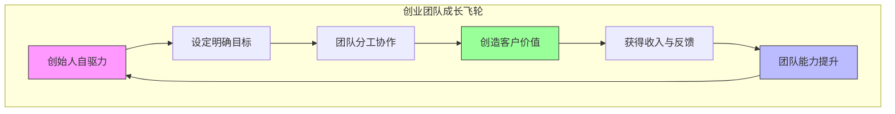

# 第08课：创业实战与团队管理

## 学习目标

- 了解创业前的关键准备工作
- 掌握从零到一的MVP验证方法
- 学会合伙人与团队管理的核心原则
- 建立创业公司的财务管理意识
- 识别创业中的常见陷阱并提前规避

---

## 一、创业前的准备

### 1.1 咨询行业的启示

> [!QUOTE]
> 咨询行业效果反馈很慢要做好三五年的准备；咨询是专家生意；赚短期的钱靠资源，持续赚钱靠真正价值。 —— 小马宋

小马宋虽然是针对咨询行业的观察，但对所有创业者都有借鉴意义：

- **做好长期准备**：很多创业项目在前期看不到明显效果，需要至少3-5年的耐心
- **专家生意**：创业的本质是用你的专业知识或能力为别人创造价值
- **短期靠资源，长期靠价值**：靠关系和人脉可以赚到快钱，但只有真正创造价值才能持续赚钱

### 1.2 从小处着手

> [!QUOTE]
> 赚小钱不难，看百篇选五篇择一篇先做；不要有割韭菜心态。 —— 王一的爸爸

王一的爸爸给出了一个非常落地的行动指南：**先行动起来，从小处着手**。不要总想着找到一个"完美的项目"，而是看100篇成功案例，从中选5篇你感兴趣的，然后从中选1篇马上去做。同时他特别强调**不要有割韭菜心态**——如果你只想收割别人，迟早会被反噬。

### 1.3 入世检验

> [!QUOTE]
> 尽早入世检验所学；经营生意/他人/自己；打磨200字自我介绍。 —— 白一喵

白一喵提出了创业前的三项核心准备：

1. **尽早入世**：不要等"准备好了"再开始，先跳到市场中去检验你的想法
2. **经营三件事**：经营生意（赚钱）、经营他人（协作）、经营自己（成长）
3. **打磨200字自我介绍**：能不能在200字内说清楚你是谁、你做什么、你能提供什么价值？这是最基本的商业沟通能力

> [!TIP]
> 如果你不能在200字内清晰地介绍自己的业务，说明你还没有想清楚自己在做什么。**一个好的自我介绍就是最小的商业计划书**。

---

## 二、从零到一的路径

### 2.1 MVP：最小可行产品

> [!QUOTE]
> 利用自身优势完成MVP；找到对标的范本。 —— 天枢
>
> 创业就要做品牌资产；去除自嗨直面事实；创业初期生存是第一大事；公司再小制度要有。 —— 大树

天枢和大树的观点结合起来，构成了从零到一的完整方法论：

**天枢的MVP方法论：**
- **利用自身优势**：不要去做自己不擅长的事，充分利用已有的技能和资源
- **找到对标范本**：不要闭门造车，找到行业里做得好的公司，学习他们的模式

**大树的补充：**
- **去除自嗨**：很多创业者自我感觉良好，但市场反应冷淡——要直面事实，及时调整
- **生存第一**：在创业初期，活下来比什么都重要
- **制度要有**：即使只有2-3个人，也要有基本的制度和分工



### 2.2 跑通商业模式

> [!QUOTE]
> 创业公司先活下来；赚钱后不要盲目扩张；抄袭都抄不好不如趁早放弃。 —— 洪坤
>
> 躬身入局把自己变成解决问题的关键变量；立项时就要考虑变现闭环。 —— 罗玲

洪坤和入海的观点直击创业的本质：

**洪坤的三条军规：**
1. **先活下来**：现金流是创业公司的命，在盈利之前控制一切不必要的支出
2. **不要盲目扩张**：赚钱后最大的诱惑就是扩张——招人、租更大的办公室、做更多的产品线，但这是最常见也最致命的错误
3. **抄袭都抄不好趁早放弃**：如果一个模式连抄袭都做不好，说明你不适合这个领域

**入海的提醒：**
- **躬身入局**：创业者必须亲自下海，不能做甩手掌柜
- **变现闭环**：在立项的时候就要想清楚——谁来买单？怎么收钱？利润在哪里？

> [!WARNING]
> "先活下来"不是一句口号。对于创业公司来说，**现金流断裂是死亡的第一原因**。在跑通商业模式之前，每一分钱都要花在刀刃上。

---

## 三、合伙人与团队

### 3.1 团队建设的基本原则

> [!QUOTE]
> 公司再小制度要有。 —— 大树
>
> 管公司不能偏科；重视健康。 —— MAGGIE

大树强调**制度的重要性**。很多初创公司觉得人少没必要搞制度，但恰恰因为人少，每个人的角色和权责更需要明确。MAGGIE则从更宏观的角度提醒创业者：**不要偏科**——产品、运营、销售、财务都要管，同时**健康是革命的本钱**。

### 3.2 合伙的艺术

> [!QUOTE]
> 赚工资和做生意是完全两回事；如果合伙做生意要时刻准备好让合伙人赚得比自己多。 —— 乔里奥

乔里奥的合伙人原则非常值得深思：

- **工资思维 vs 生意思维**：打工是确定性的收入（做了就有），做生意是风险性的收益（不一定有）
- **让合伙人赚得比自己多**：这是合伙能够长久的核心——如果你总是计较"凭什么他分得比我多"，那合伙迟早会散

### 3.3 创始人与团队共成长

> [!QUOTE]
> 拥有强大自驱力是把事做成的基础；收入只是工作的副产品；创始人和团队都必须成长。 —— Sin

Sin的观点定义了创业团队的文化基调：

- **自驱力**：创业没有KPI能真正驱动你，只有内在的自驱力
- **收入是副产品**：如果只盯着钱，很难做出一家好公司；专注于创造价值，收入会随之而来
- **共同成长**：创始人不成长，公司就卡住了；团队不成长，创始人也推不动



---

## 四、创业公司的财务管理

### 4.1 财务是创业的底线

> [!QUOTE]
> 创业初期生存是第一大事。 —— 大树
>
> 躬身入局核心环节亲自做。 —— 入海

大树和入海的观点提示我们：**财务是创业者必须亲自抓的环节**。很多创业者把财务外包给代账公司就完事了，但现金流规划、成本控制、定价策略这些核心决策，必须创始人自己参与。

### 4.2 传统工厂的互联网转型机会

> [!QUOTE]
> 传统工厂急于拥抱互联网，帮助他们转型有利可图。 —— 小梅

小梅发现了一个被很多人忽视的创业方向：**帮助传统工厂做互联网转型**。很多工厂有产能、有产品，但不懂电商、不懂新媒体，这正是创业者的机会——你可以成为他们的电商代运营、直播服务商、或品牌合作伙伴。

### 4.3 不同阶段的财务策略

创业公司在不同阶段有不同的财务重点：

| 阶段 | 财务重点 | 常见错误 |
|------|---------|---------|
| 种子期 | 控制成本，维持6-12个月现金流 | 过早租办公室、招太多人 |
| 成长期 | 在验证过的方向加大投入 | 盲目扩张新业务线 |
| 成熟期 | 优化利润，建立财务制度 | 忽视财报分析、税务风险 |

> [!QUOTE]
> 不同阶段设计不同运营攻守策略；一条路走的人多了不妨开辟新路。 —— 汉勤

---

## 五、创业中的常见坑

### 5.1 自负与盲目扩张

云帆提到的"愚昧之巅"在创业中同样常见——**在红利期赚钱后误判自己的能力**。一个典型的创业死亡螺旋是：

```
赚到第一桶金 → 自信心爆棚 → 盲目扩张（招人、铺新线、增加固定成本）
→ 市场环境变化 → 收入下降 → 成本降不下来 → 现金流断裂 → 公司倒闭
```

> [!TIP]
> 避免方法：**不要把运气当能力**。在赚钱的时候就要做压力测试——如果收入下降50%，你的公司能撑多久？

### 5.2 混淆手段和目的

> [!QUOTE]
> 做事前确定好目的；不要混淆手段和目的。 —— 阿发Alpha
>
> 创业就像升级游戏；创业失败几率99%。 —— 三笙

阿发Alpha和三笙的观点从两个角度敲打创业者：

- **手段 vs 目的**：开公司是手段，赚钱和创造价值才是目的。如果开公司让你一直在亏钱且看不到希望，不妨关掉换一条路
- **99%的失败率**：三笙的"创业就像升级游戏"是个很好的比喻——不是所有人最终都能通关，多数人会卡在某个阶段。接受失败的可能性，同时保持升级的心态

### 5.3 其他常见陷阱

| 陷阱 | 表现 | 建议 |
|------|------|------|
| 追求完美 | 一直在准备，从不开始 | 先跑通MVP再说 |
| 单打独斗 | 什么都要自己做 | 学会协作和外包 |
| 不重视现金流 | 只看利润不看现金流 | 利润是纸上的，现金是手里的 |
| 混日子心态 | 公司开起来了就不努力了 | 定期回顾创业初心 |

---

## 六、要点回顾与行动清单

### 要点回顾

| 主题 | 核心观点 | 提出者 |
|------|---------|--------|
| 创业准备 | 做好3-5年长期准备，短期靠资源长期靠价值 | 小马宋 |
| 最小行动 | 看百篇选五篇择一篇先做 | 王一的爸爸 |
| 入世检验 | 尽早到市场中去验证，打磨200字自我介绍 | 白一喵 |
| MVP | 利用自身优势，找到对标范本 | 天枢 |
| 生存第一 | 先活下来，不要盲目扩张 | 洪坤 |
| 合伙人 | 让合伙人赚得比自己多 | 乔里奥 |
| 团队成长 | 创始人和团队必须一起成长 | Sin |
| 手段目的 | 不要混淆手段和目的 | 阿发Alpha |
| 失败率 | 创业99%会失败，保持升级心态 | 三笙 |

> [!QUESTION]
> **自测问题 1**：大树说"公司再小制度要有"，但小公司人少灵活，为什么还需要制度？
>
> <details>
> <summary>点击查看答案</summary>
> 制度不是为了限制灵活性，而是为了**明确权责、减少内耗**。即使只有2-3个人，也需要明确谁负责什么、利润怎么分、决策怎么做。没有制度的小公司，往往会把大量时间花在"谁说了算""谁该做什么"的内耗上。
> </details>

> [!QUESTION]
> **自测问题 2**：乔里奥说"让合伙人赚得比自己多"是合伙长久的关键，为什么？
>
> <details>
> <summary>点击查看答案</summary>
> 合伙生意最大的挑战是**利益分配**。如果计较"凭什么他分得比我多"，合作迟早会散。反过来，如果你主动让合伙人赚得更多，对方也会更愿意付出。乔里奥认为，合伙的本质是**共赢而非竞争**——只有让各方都觉得"赚到了"，合伙才能长久。
> </details>

> [!QUESTION]
> **自测问题 3**：为什么洪坤说"抄袭都抄不好不如趁早放弃"？
>
> <details>
> <summary>点击查看答案</summary>
> 抄袭（模仿）已经是最低成本的创业方式了——别人跑通了模式，你只需要复制执行。如果你连模仿都做不好（执行不到位、效率太低、成本控制不了），说明你在这个领域缺乏基本的能力和竞争力。那就应该趁早放弃，换个真正适合你的方向。
> </details>

### 下一步行动清单

1. **打磨自我介绍**：写一个200字的自我介绍，说清楚你做什么、为谁解决什么问题、有什么优势
2. **找一个对标**：找到你所在行业的1-2个成功案例，分析他们的商业模式和关键动作
3. **计算生存期**：计算你的资金能支撑公司运营多久（月支出 ÷ 可用资金 = 生存月数）
4. **建立基本制度**：至少确立3条基本制度（决策权归属、利润分配、工作分工）
5. **破除一个自嗨点**：找一位信任的朋友或潜在客户，让他们对你的产品或想法给出真实反馈