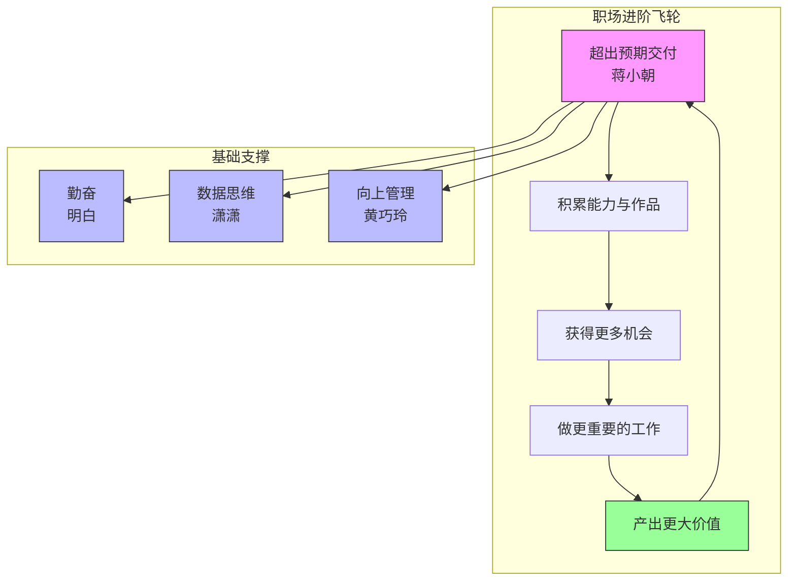
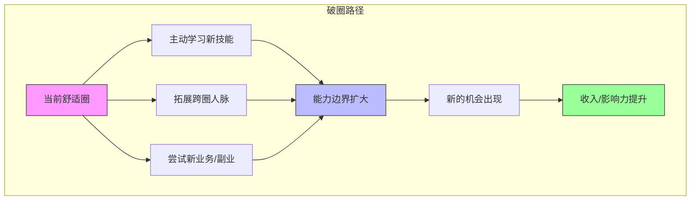
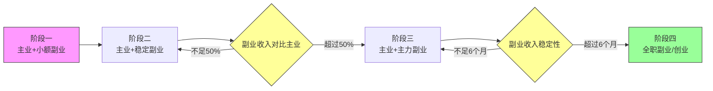

# 第09课：职场进阶与副业选择

## 学习目标

- 建立正确的职业心态：为自己工作而非为工资工作
- 掌握副业选择与执行的核心策略
- 理解职场破圈的方法与路径
- 学会时间管理与精力分配
- 了解从副业过渡到主业的正确节奏

---

## 一、打工人的自我修养

### 1.1 你不是为工资工作

> [!QUOTE]
> 把工资1万的工作做出价值10万效果；你不是为工资工作而是为自己。 —— 蒋小朝

蒋小朝的观点代表了职场进阶的第一性原理：**打工的本质是为自己积累**。工资只是你当下获得的最小回报，真正的回报是能力、经验、作品和口碑。把月薪1万的工作做出10万的价值，你积累的能力会帮你拿到10万甚至更高的收入。

具体做法：
- **超出预期交付**：领导要60分，你做到80分；要80分，你做到100分
- **建立个人作品集**：每一份工作产出都是你的"作品"，是你下次跳槽时谈判的筹码
- **关注增量价值**：不要只做分内的事，思考如何为团队和公司创造额外价值

### 1.2 勤奋是最底层的竞争力

> [!QUOTE]
> 勤则百弊皆除。 —— 明白

明白的四个字极其简单，却道出了职场的核心。在天赋、资源、运气之外，**勤奋是唯一完全由你自己掌控的变量**。勤能补拙不是空话——你比别人多花时间学习、多花时间琢磨、多花时间执行，结果自然会不同。

### 1.3 数据是决策的依据

> [!QUOTE]
> 鱼和熊掌不可兼得；大部分爆款都是精心设计的；不尊重数据会摔得很惨。 —— 潇潇

潇潇从内容运营的角度给职场人提了三个醒：

1. **鱼和熊掌不可兼得**：做选择时要有取舍，不可能既要又要
2. **爆款是设计出来的**：你以为的"偶然爆款"，背后往往有精心的策划和数据分析
3. **不尊重数据会摔得很惨**：凭感觉做决策是最危险的，让数据说话

---

## 二、副业的选择与执行

### 2.1 不要轻易辞职做副业

> [!QUOTE]
> 不要轻易辞职做副业；当手头有项目时不要看新项目；花钱找人完成重复性工作。 —— 汪小哥

汪小哥的副业建议非常务实：

1. **不要轻易辞职做副业**：副业的目的是增加收入，而不是增加风险。在主业稳定的前提下探索副业，是最安全的路径
2. **专注当前项目**：很多人手头有事做的时候，看到新机会就蠢蠢欲动，结果哪个都没做好
3. **花钱买时间**：重复性、低价值的工作花钱外包出去，把时间花在更高价值的事情上

> [!WARNING]
> **副业最大的坑就是冲动辞职。** 主业提供的稳定现金流和社保是你探索副业的安全垫。等到副业收入稳定超过主业3-6个月后，再考虑是否全职做副业。

### 2.2 圈子的重要性

> [!QUOTE]
> 和谁在一起工作比在哪里工作更重要；跟牛人学思维方式和解决问题的能力；学会赚钱决定公司能否活下来，学会分钱决定活多久。 —— 黄巧玲

黄巧玲强调了**圈子对个人成长的影响**。你是谁不重要，你和谁在一起很重要。跟厉害的人共事，你能学到的是思维方式、解决问题的方法论，这些比工资更值钱。她还把"分钱"提到了战略高度——无论是合伙创业还是团队协作，会分钱的人才能走得远。

### 2.3 打造个人IP

> [!QUOTE]
> 在公司内卷严重可以考虑斜杠青年；最低成本打造个人IP成为朋友圈KOL。 —— 夏夏

夏夏的观点呼应了副业领域的一个重要趋势：**个人IP化**。在人人都有社交媒体账号的时代，打造个人IP是成本最低、复利最高的副业方式。

她的建议：
- **从朋友圈开始**：不需要一开始就做公众号、视频号，先从朋友圈经营开始
- **打造专业形象**：在你的领域持续输出有价值的内容，成为朋友圈里的"专业人士"
- **空杯心态**：放下偶像包袱，持续学习，持续输出

> [!QUOTE]
> 放下偶像包袱经营朋友圈；空杯心态不断学习。 —— 颖杰

---

## 三、职场破圈策略

### 3.1 突破舒适圈

> [!QUOTE]
> 想要突破就必须破圈。 —— 家永

家永的观点直白有力：**待在原地是不会进步的**。破圈意味着要做你没做过的事、接触你没接触过的人、学习你不懂的知识。破圈的方式包括：

- **跨部门协作**：主动参与跨部门项目，拓宽视野和人脉
- **行业交流**：参加行业会议、线下活动，了解行业最新动态
- **跨界学习**：学习与你本职工作相关的其他领域知识

### 3.2 输出是最好的输入

> [!QUOTE]
> 有足够积累长期保持输出可以出书。 —— 滕滕
>
> 写书是人生最好的投资之一。 —— 阿may

滕滕和阿may提出了一个少有人走但回报极高的路径——**写作输出**。长期坚持输出（写文章、写书）不仅能帮助你梳理思路、加深理解，还能建立你的专业权威和个人品牌。阿may甚至把写书称为"人生最好的投资之一"——一本书可以持续销售多年，持续为你带来收入和影响力。

### 3.3 敬畏年轻人

> [!QUOTE]
> 科技进展越快越要敬畏年轻人。 —— 张五哥

张五哥提醒职场人不要倚老卖老：**在科技快速迭代的时代，年轻人对新事物的理解往往更快、更深**。保持谦逊，向年轻人学习，是职场长青的秘诀。

---

## 四、时间管理与精力分配

### 4.1 经营自己

> [!QUOTE]
> 尽早入世检验所学；经营生意他人和自己；持续内观探索自我。 —— 白一喵

白一喵提出的"经营三件事"同样适用于职场和副业场景：

1. **经营生意**：你的主业就是你的"生意"——你用自己的时间和技能换取报酬
2. **经营他人**：与同事、领导、客户、合作伙伴建立良好的关系
3. **经营自己**：持续学习、保持健康、管理情绪

他还特别强调**持续内观**——定期反思自己的状态、目标和方法，及时调整方向。

### 4.2 变现时间与技能

> [!QUOTE]
> 无风险赚钱还是做打工人——变现时间和技能。 —— 解忧彭老师

解忧彭老师点出了打工和创业的本质区别：**打工是变卖时间，创业是变卖产品或模式**。当你明白了这个区别，就能更好地规划自己的职业路径：

- **初级阶段**：出卖时间换取报酬（打工）
- **中级阶段**：出卖技能换取更高报酬（技术专家/顾问）
- **高级阶段**：出卖产品或模式（创业/投资）

副业的价值就在于帮助你从中级向高级过渡。

> [!TIP]
> 问自己一个问题：**你的时间是卖了一次，还是可以被反复售卖？** 写一篇文章可以持续被阅读，录一个课程可以持续被购买——这就是"一次投入，多次产出"的杠杆思维。

---

## 五、从副业到主业的过渡

### 5.1 稳步过渡的策略

> [!QUOTE]
> 每天列待办事项清单；自由职业前要有稳定收入；帮助过自己的人要发红包。 —— 古辛

古辛为想要从副业过渡到自由职业的人提供了三条建议：

1. **列待办清单**：自由职业后没有人管你，自律全靠自己。每天列好待办事项并执行
2. **先有稳定收入再辞职**：确保副业收入已经稳定覆盖生活开支再考虑全职
3. **感恩回馈**：帮助过你的人要表达感谢——发红包、请吃饭、送礼物，维护好关键人脉

### 5.2 专注与聚焦

> [!QUOTE]
> 不要轻易辞职做副业；当手头有项目时不要看新项目。 —— 汪小哥

汪小哥再次强调**专注的重要性**。很多人在做副业的时候，看到一个项目做几个月没出成果就换另一个，结果一直在"开始—放弃—开始"的循环里打转。选择一个方向，坚持至少6-12个月，才能真正看到成果。

### 5.3 分阶段的过渡路径

**分阶段的过渡路径详解：**

| 阶段 | 状态 | 关键任务 |
|------|------|---------|
| 阶段一 | 主业+小额副业 | 每周花5-10小时探索副业方向，验证可行性 |
| 阶段二 | 主业+稳定副业 | 副业月收入达到主业的20-50%，开始积累客户 |
| 阶段三 | 主业+主力副业 | 副业收入超过主业50%，考虑减少主业时间 |
| 阶段四 | 全职副业/创业 | 副业收入稳定超过主业6个月，正式转型 |

---

## 六、要点回顾与行动清单

### 要点回顾

| 主题 | 核心观点 | 提出者 |
|------|---------|--------|
| 为自己工作 | 把1万工资的工作做出10万效果 | 蒋小朝 |
| 勤奋 | 勤则百弊皆除 | 明白 |
| 数据思维 | 不尊重数据会摔得很惨 | 潇潇 |
| 副业节奏 | 不要轻易辞职做副业 | 汪小哥 |
| 圈子价值 | 和谁在一起比在哪里工作更重要 | 黄巧玲 |
| 个人IP | 最低成本打造朋友圈KOL | 夏夏 |
| 破圈 | 想要突破就必须破圈 | 家永 |
| 写作输出 | 写书是人生最好的投资之一 | 阿may |
| 敬畏年轻人 | 科技越快越要敬畏年轻人 | 张五哥 |
| 过渡策略 | 自由职业前要有稳定收入 | 古辛 |

> [!QUESTION]
> **自测问题 1**：蒋小朝说"把工资1万的工作做出价值10万的效果"，怎么理解这句话？实际中该怎么做？
>
> 

> 
点击查看答案

> 这句话的意思是：**不要用工资来衡量你的工作价值，而要用你创造的实际价值来衡量**。当你月薪1万但做出了10万的效果，意味着你具备了拿10万月薪的能力。具体做法：超出预期交付、主动承担更多责任、把工作成果变成自己的"作品"、关注能为公司创造多少增量价值而非只做分内事。
> 

> [!QUESTION]
> **自测问题 2**：汪小哥说"不要轻易辞职做副业"，那什么时候才应该从副业过渡到主业？
>
> 

> 
点击查看答案

> 建议满足以下条件再考虑全职做副业：①副业月收入**稳定超过主业**至少3-6个月；②副业有**可持续的增长空间**，而非昙花一现；③有**足够的储蓄**（至少6个月的生活费）作为缓冲。在副业收入不稳定之前，主业就是你最好的保护伞。
> 

> [!QUESTION]
> **自测问题 3**：夏夏说"最低成本打造个人IP成为朋友圈KOL"，朋友圈KOL具体怎么做？
>
> 

> 
点击查看答案

> 朋友圈KOL不是天天发广告，而是：①**选一个专业方向**（如读书、理财、职场、育儿等）；②**持续输出有价值的内容**（每周至少3-5条原创分享）；③**提供实用信息**（行业洞察、实用技巧、经验总结）；④**保持真人感**（不要全是干货，适当分享生活和观点）。你的目标是成为朋友圈里"这个领域的专家"。
> 

### 下一步行动清单

1. **重新定义工作**：列出你当前工作能创造的3个"超额价值"点，主动去实现它们
2. **启动副业探索**：选定一个副业方向，每周投入至少5小时，坚持3个月
3. **经营朋友圈**：围绕你的专业方向，每周至少输出3条有价值的原创内容
4. **建立待办清单习惯**：每天早晨列出最重要的3件事，晚上复盘完成情况
5. **拓展人脉**：每月至少参加1次行业活动或在线上认识3位新朋友
6. **评估过渡条件**：对照"副业到主业"的四阶段模型，评估你现在处于哪个阶段