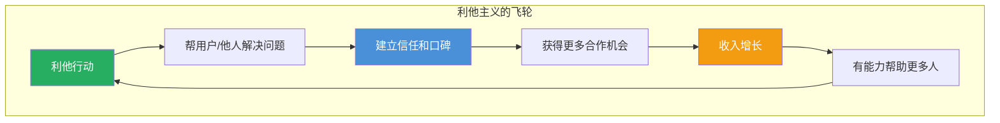
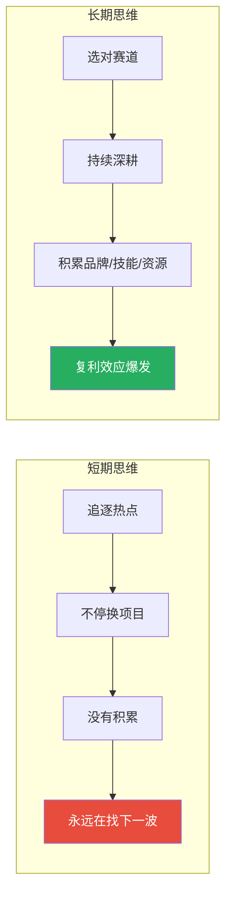
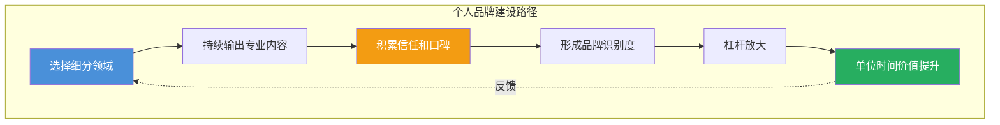

# 第10课：价值观与长期主义

## 学习目标

完成本课后，你将能够：

- 理解诚信为什么是最低成本的长期策略
- 掌握利他思维在赚钱中的实际应用
- 建立长期主义的复利思维框架
- 正确看待金钱与幸福感的关系
- 识别哪些钱不能赚，守住底线
- 开始构建个人品牌护城河

---

## 一、诚信是最低成本的长期策略

### 1.1 诚信的短期成本与长期回报

「诚信永远是第一位。」——杨涛

在商业世界，诚信看似是一个"隐性成本"——你诚实地告诉客户产品的缺点，可能会损失一单生意。但长期来看，诚信是**负成本**的。因为信任一旦建立，后续的交易成本会大幅下降。

> 不要不把合同当回事。——唐梦

「做人要厚道。」——小梅

厚道不是软弱，而是选择。在信息高度透明的时代，耍小聪明的代价越来越高。一个差评可能毁掉几年的积累，而一句"诚实的建议"可能赢得一个终身客户。

> [!QUOTE]
> 「明明白白的失败好过糊里糊涂的成功。」——白一喵
>
> 糊里糊涂的成功会让你把运气当能力，下次必然会加倍还回去。而诚实的失败，至少让你知道"此路不通"，这是宝贵的认知积累。

### 1.2 说真话的勇气和听真话的能力

「修炼说真话的勇气和听真话的能力。」——黑小喵

这两者都不容易。说真话可能得罪人、失去利益；听真话需要克服自我防御心理。但正是这两项能力，构成了一个人商业成长的底层操作系统。

> [!TIP]
> 建立一个"真相顾问"机制：找到1-2个愿意对你说真话的人（不要找只会说好话的人），定期请他们给你提意见。坦然接受负面反馈的能力，比任何技能都重要。

---

## 二、利他思维：赚钱的终极心法

### 2.1 利他不是道德说教，是商业智慧

「越分享越幸运。」——小蚁

「赚第一个100万靠术，赚500万需要道和利他。」——小蚁

小蚁的观点揭示了一个规律：在原始积累阶段，靠技巧和勤奋就够了；但要做到更大的规模，必须有"道"——利他思维。因为只靠"术"做大的生意，会触碰到资源和信任的天花板。

### 2.2 真诚地带人

「真诚待人。」——11

「帮助过自己的人要发红包。」——古辛

这些都是利他在日常行为中的具体体现。利他不是让你做圣人，而是建立一种正向的人际循环：你对别人好，别人愿意帮你，你的路越走越宽。

### 2.3 利他的商业应用

「真诚利他，时间会给你最好的反馈。」——北风

「保持平静耐烦。」——北风

利他在商业中的具体应用：

1. **先提供价值再谈交易**：在卖出产品之前，先通过免费内容帮助用户解决问题
2. **超出预期的交付**：每次都让客户感受到"物超所值"
3. **主动让利**：在合作中考虑对方的利益，而不是单方面追求最大化

> 赚钱是长期主义+利他主义。——盛添财

> 凡事靠自己。——盛添财

这两句话放在一起很有意思。盛添财的意思不是"不求人"，而是"靠自己先行动起来，然后在行动中为他人创造价值"。

---

## 三、长期主义的复利效应

### 3.1 做有积累的事

「赚短期的钱靠资源关系，持续赚钱靠真正的价值。」——小马宋

小马宋一针见血地指出：短期赚钱可以靠信息差、靠关系、靠运气，但这些都不可持续。只有真正创造价值的事情，才能让你持续赚钱。

「关注新思想和新技术。」——小马宋

长期主义不等于守旧。相反，真正的长期主义者对新技术、新思想保持高度敏感，因为他们知道，只有拥抱变化才能持续创造价值。

### 3.2 打造品牌资产

「创业就要做品牌资产。」——大树

品牌资产是时间的朋友。一瓶水在超市卖2元，但贴上某个品牌的标签可以卖20元。这18元的差价，就是品牌资产的货币化。

「打造势能品牌。」——66

「我们的赛道应被时代需求决定。」——66

选择一个符合时代趋势的赛道，在上面持续积累品牌势能。时间越长，护城河越深。

> 公司一定要有长期价值的产品。——艾乐

如果你的产品只能卖一年，那你的公司永远在"找产品"。如果你的产品可以卖十年，你才有机会享受复利。

> [!WARNING]
> **警惕短期诱惑。** 当你看到某个短期暴利的项目时，问自己一个问题：这个项目做了三年后，我积累了什么？如果答案是什么都没有，那这就是一个不值得做的项目。

### 3.3 做时间的朋友

「开眼界是赚钱的必要条件，做时间的朋友。」——温虾米

开眼界——了解外面世界在发生什么；做时间的朋友——不要指望一夜暴富。这两者是赚钱的正道。

「看到别人赚钱要耐得住寂寞。」——古辛

长期主义者最难的一课是：看到别人赚钱时，你是否依然能坚持自己的方向？这需要定力。

---

## 四、幸福感与金钱的正确关系

### 4.1 金钱是工具，不是目的

「幸福感与金钱无关。」——M叔

这句话需要正确理解：M叔不是说不应该赚钱，而是不要把"幸福感"和"金钱数量"直接挂钩。当你的幸福感完全由收入决定时，你永远都不会满足——因为人的欲望增长速度总是快于收入增长速度。

### 4.2 平衡的艺术

「经营生意、经营他人、经营自己。」——白一喵

白一喵提出了三个经营维度：

| 维度 | 核心问题 | 时间分配建议 |
|------|---------|-------------|
| 经营生意 | 我创造什么价值？ | 50% |
| 经营他人 | 我如何与合作伙伴共赢？ | 25% |
| 经营自己 | 我是否在成长？身心健康吗？ | 25% |

> 你就是最好的投资。——潘多拉的书单

很多人把所有的钱都投到项目里，却忽略了对自己的投资。读书、上课、健身、见世面——这些投入的回报率往往是最高的。

> [!QUESTION] 当你账上有100万闲钱时，你会怎么分配？
>
> 

> 
点击查看参考思路

>
> ① **用50万投资自己**——学习新技能、拓展人脉、开拓新市场；② **用30万做稳健的资产配置**——不要把鸡蛋放一个篮子里；③ **用20万投入现有业务的放大**——招募团队、加大投放。不要把所有钱都投入到一个高风险的"暴富项目"里，也不要因为焦虑而盲目投资不理解的东西。
> 

>

### 4.3 第一时间的止损

「第一时间止损。」——胭脂王

止损不仅仅是资金管理，也是心态管理。如果你做了一个错误的决定，不要因为"已经投入了那么多"而继续死撑。沉没成本不是成本，未来的机会才是。

---

## 五、守住底线：什么钱不能赚

### 5.1 不赚不干净的钱

「长期更新日入XX的公众号建议取关。」——汉勤

「干干净净赚钱。」——汉勤

那些炫富的内容、日入过万的截图，大部分是收割流量的工具。汉勤的建议很直接：取关它们，清净自己的信息环境。

### 5.2 不赚收割信任的钱

割韭菜的本质是什么？是利用用户的信任，提供远远低于承诺价值的产品或服务。这种钱来得快，但代价是消耗了你最宝贵的资产——**个人信誉**。

「人生价值观要大于商业利益。」——沈小善

沈小善认为，当你面临"这单可以做但我良心过不去"的抉择时，选择听良心的。因为商业利益损失了可以再赚，价值观崩塌了很难重建。

### 5.3 不赚不懂的钱

「在能力圈内做好一件事。」——M叔

不懂的钱不要赚。你可能会问："可是不试一试怎么懂？"学习和尝试可以，但要控制投入。最危险的是：你完全不懂一个领域，但因为"看起来很赚钱"就all in。

> 看好一个产业入局前先买一部分这行业龙头的股票。——王煜

这是一个很有智慧的策略：先买股票赚认知的钱，同时通过研究这家公司深入了解这个行业。既控制了风险，又积累了认知。

> [!WARNING]
> **那些劝你"赶紧上车，晚了就没了"的项目，通常是因为他们有你要接盘。** 真正的好机会往往不需要催促你做决定。慢下来，想清楚。

> [!QUESTION] 如何判断一个项目是否"干净"？
>
> 

> 
点击查看判断标准

>
> 问自己以下问题：① 这个项目的价值交付是否透明？用户能否清楚地知道自己买的是什么？② 如果这件事被家人和朋友知道，你会感到自豪还是尴尬？③ 有没有隐瞒或夸大任何关键信息？如果三个问题的答案让你感到不安，那就不要做。**夜路走多了总会遇到鬼，每一分不干净的钱都在透支你的未来。**
> 

>

---

## 六、打造个人品牌护城河

### 6.1 品牌就是信任的容器

「创业就要做品牌资产。」——大树

品牌资产是你持续赚钱的护城河。个人品牌也一样——当人们提到某个领域时，第一个想到你，你的获客成本就会降到最低，议价能力会升到最高。

### 6.2 百里挑一就够了

「只要做到百里挑一自然有钱。」——沈小善

你不需要是最牛的，只需要在一个方向上比99%的人做得更好。怎么做？

1. **找一个足够小的切入口**：越细分越好，"AI绘画"都很宽了，"AI生成电商产品图"更精准
2. **持续输出内容**：在公众号、小红书、知乎等平台持续分享你的专业内容
3. **形成差异化标签**：让人一看到某个关键词就想到你

### 6.3 长期的资产积累

「坚持没有错但要时刻寻找踏板。」——芷蓝

长期主义不等于一条路走到黑。你需要一个"踏板思维"：

- 当前做的事能否成为下一步的跳板？
- 积累的资源是通用的（如写作能力、客户资源）还是单一的？
- 有没有可能从一个赛道"跃迁"到更大的赛道？

> 警惕单位时间价值。——芷蓝

如果你的单位时间价值一直在涨，说明你在进步。如果3年没变，说明你在重复劳动而不是积累。

> 聚焦——在能力圈内做好一件事。——M叔

个人品牌不是什么都做，而是把一件事做到极致。你的品牌越聚焦，力量越大。

> 短期看产品长期看文化。——颖杰

这句话同样适用于个人品牌：短期靠技能标签吸引关注，长期靠价值观和文化理念留住信任。

---

## 要点回顾

1. **诚信是最低成本**：说真话、听真话、守合同。诚信不是道德高地，是理性的商业策略。
2. **利他是终极心法**：先提供价值再谈交易，真诚待人，分享越多机会越多。利他最终会形成正向飞轮。
3. **长期主义享受复利**：做有积累的事，打造品牌资产，选择时代趋势赛道，做时间的朋友。
4. **正确看待金钱**：金钱是工具不是目的，投资自己是最好的投资。保持幸福感与收入的脱钩。
5. **守住底线**：不赚不干净的钱，不收割信任，不碰不懂的领域。干干净净赚钱才能长久。
6. **打造个人品牌**：选择细分领域做到百里挑一，持续输出内容，形成品牌资产护城河。

---

## 行动清单

- [ ] 审查你的收入来源：哪些是有积累效应的？哪些是在吃老本？调整结构
- [ ] 为一周的工作做"利他审查"：你这一周为他人创造了什么价值？
- [ ] 写下你的个人品牌标签：如果用一个关键词让别人记住你，那是什么？
- [ ] 审视当前业务中是否有任何"良心不安"的部分，如果有，制定整改计划
- [ ] 评估自己的单位时间价值：今年的时薪相比去年涨了多少？如果没有，找到瓶颈
- [ ] 找到一个"踏板"：当前工作能否成为你下一步跃迁的跳板？如果不能，规划转型