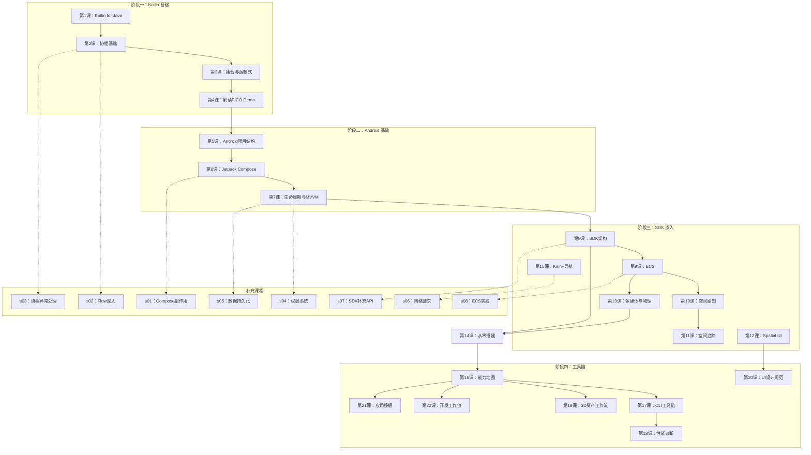

# 课程导航地图

## 学习路径图



## 先修关系

| 课程 | 先修要求 |
|------|---------|
| 第1-4课 | Java 基础 |
| 第5-7课 | 第1-4课 |
| 第8-15课 | 第5-7课 |
| 第14课 | 第8-13课 |
| 第16-22课 | 第14课 |
| 补充课程 s01-s08 | 对应基础课程 |

## 功能→课程 快速索引

| 想实现的功能 | 核心课程 |
|-------------|---------|
| 显示 3D 模型 | 第9课、第19课 |
| 空间 UI 按钮 | 第12课、第20课 |
| 手势交互（拖/旋转） | 第11课、第12课 |
| 平面检测 + Anchor | 第10课 |
| 空间音频/视频 | 第13课 |
| 物理碰撞 | 第13课 |
| 性能分析 | 第18课 |
| CLI 操作 | 第17课 |
| 应用移植 | 第21课 |
| 调试修复 | 第22课 |

## 课程文件结构

```
PICO-VR开发笔记/
├── index.md                    ← 课程主页
├── 00-course-map.md            ← 本文件（导航地图）
├── lessons/
│   ├── 0001-*.md 到 0022-*.md ← 22 课主课程
│   └── s01-*.md 到 s08-*.md   ← 8 节补充课
└── reference/
    ├── kotlin-java-cheatsheet.md
    └── pico-cli-cheatsheet.md
```