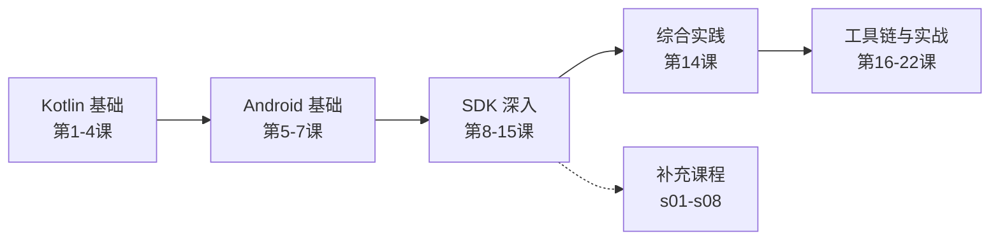

# PICO VR 开发笔记

> 基于 PICO Spatial SDK 0.13.3 · Kotlin + Jetpack Compose · 面向 PICO 空间应用开发

本课程覆盖从 Kotlin/Android 基础到 PICO SDK 深入、工具链、性能优化、应用移植等全部知识领域，共 **22 课 + 8 节补充课**。

## 课程路径

## 课程列表

### 阶段一：Kotlin 基础
| # | 课程 | 说明 |
|---|------|------|
| 01 | [[0001-kotlin-for-java-developers\|第1课：Kotlin for Java Developers]] | 空安全、扩展函数、密封类、协程基础 |
| 02 | [[0002-kotlin-coroutines\|第2课：Kotlin 协程基础]] | suspend、launch、async、Dispatchers |
| 03 | [[0003-kotlin-collections-functional\|第3课：Kotlin 集合与函数式编程]] | map/filter/reduce、Sequence、集合操作 |
| 04 | [[0004-pico-demo-code-analysis\|第4课：解读 PICO Demo 代码]] | 从 Java 视角理解 PICO Demo Kotlin 代码 |

### 阶段二：Android 开发基础
| # | 课程 | 说明 |
|---|------|------|
| 05 | [[0005-android-project-structure\|第5课：Android 项目结构]] | Gradle KTS、Manifest、资源系统 |
| 06 | [[0006-jetpack-compose-intro\|第6课：Jetpack Compose 声明式 UI]] | Compose 基础、可组合函数、状态管理 |
| 07 | [[0007-android-lifecycle-mvvm\|第7课：Android 生命周期与 MVVM]] | ViewModel、mutableStateOf、生命周期感知 |

### 阶段三：PICO Spatial SDK 深入
| # | 课程 | 说明 |
|---|------|------|
| 08 | [[0008-pico-sdk-architecture\|第8课：SDK 总体架构]] | 模块决策树、SpatialAppScope、容器选择 |
| 09 | [[0009-spatial-core-ecs\|第9课：Spatial Core & ECS]] | Entity/Component/System、Transform、碰撞 |
| 10 | [[0010-spatial-sense\|第10课：空间感知]] | 平面检测、网格、Anchor、Keyboard |
| 11 | [[0011-spatial-tracking\|第11课：空间追踪]] | 手部/眼球/面部追踪、DataProvider、控制器 |
| 12 | [[0012-spatial-ui\|第12课：Spatial UI]] | 30+ 设计组件、3D 手势、PicoTheme |
| 13 | [[0013-remaining-modules\|第13课：多媒体与物理]] | 动画/音频/视频/物理/材质/Blend Shape |
| 14 | [[0014-building-from-scratch\|第14课：从零搭建 PICO 应用]] | 项目创建、运行、CLI 工作流 |
| 15 | [[0015-koin-navigation-tools\|第15课：Koin + Navigation + 工具库]] | DI、导航、Coil |

### 阶段四：综合实践
已整合到第14课。

### 阶段五：工具链与实战
| # | 课程 | 说明 |
|---|------|------|
| 16 | [[0016-capability-map\|第16课：能力地图]] | 学会能做什么、需求→能力映射、案例 |
| 17 | [[0017-pico-cli-toolchain\|第17课：PICO CLI 工具链]] | 模拟器、设备管理、应用操作、截图 |
| 18 | [[0018-performance-diagnosis\|第18课：性能诊断与优化]] | Perfetto Trace、pico-cli perf、Foveated Rendering |
| 19 | [[0019-scene-asset-workflow\|第19课：3D 场景资产工作流]] | 模型测量、场景变换、AssetBundle |
| 20 | [[0020-spatial-ui-design-guide\|第20课：空间 UI 设计规范]] | PicoTheme、玻璃材质、手势规范 |
| 21 | [[0021-porting-android-app\|第21课：Android 应用移植]] | 13 步移植流程、Gradle 升级、容器迁移 |
| 22 | [[0022-dev-workflow-and-debugging\|第22课：开发工作流与调试]] | 构建→部署→日志→崩溃修复循环 |

### 补充课程
| # | 课程 | 说明 |
|---|------|------|
| s01 | [[s01-compose-side-effects\|补充：Compose 副作用与高级主题]] | LaunchedEffect、rememberCoroutineScope、DisposableEffect |
| s02 | [[s02-kotlin-flow-deep\|补充：Kotlin Flow 深入]] | StateFlow、SharedFlow、flowOn、catch |
| s03 | [[s03-coroutine-exception-handling\|补充：协程异常处理]] | SupervisorJob、CoroutineExceptionHandler |
| s04 | [[s04-android-permissions\|补充：Android 权限系统]] | 运行时权限、PICO 空间权限 |
| s05 | [[s05-data-persistence\|补充：数据持久化]] | Room、DataStore、文件存储 |
| s06 | [[s06-networking-retrofit\|补充：网络请求 Retrofit]] | Retrofit + OkHttp + Gson |
| s07 | [[s07-pico-sdk-supplement-api\|补充：PICO SDK 补充 API]] | 额外 SDK API 参考 |
| s08 | [[s08-ecs-in-practice\|补充：ECS 实践]] | ECS 设计模式、对象池 |

## 参考文档

- [[reference/kotlin-java-cheatsheet|Kotlin/Java 对照速查表]]
- [[reference/pico-cli-cheatsheet|PICO CLI 命令速查表]]

## 学习资源

- [PICO 开发者官网](https://developer.pico-interactive.com)
- PICO Spatial SDK 0.13.3 API 文档（本地：`pico-sdk-0.13.3-mirror/`）
- 官方 Demo 项目：welcomespace / animation / physics / spatialui 等 8 个