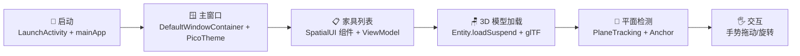
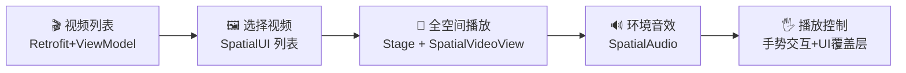
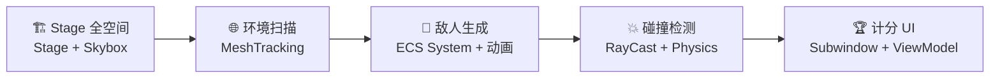

# 能力地图：PICO 空间应用开发

你已经完成了 **22 课**的系统学习，以下是完整的"能力→功能"映射。

> [!SUCCESS] 如何使用本地图
> 每当你有一个新想法，先定位到对应的"应用场景"，然后看"所需能力"列，反查课程笔记即可快速上手。

## 一、能力全景分类

### Kotlin 语言
- 读写 Kotlin 代码，理解空安全/扩展/密封类
- 使用协程进行异步/并发编程
- 使用 Flow 做响应式数据流
- 集合操作与函数式编程

### Android 基础
- Gradle KTS 构建配置 + 版本目录
- Jetpack Compose 声明式 UI
- MVVM + ViewModel + State
- 数据持久化 (Room/DataStore)
- 网络请求 (Retrofit/OkHttp)

### 空间应用架构
- `SpatialAppScope` → `mainApp` 入口
- `WindowContainer` / `Stage` 容器
- ECS 实体组件系统
- 共享空间 vs 全空间模式
- 生命周期管理

### 空间用户界面
- `PicoTheme` 主题系统
- 30+ 内置设计组件
- 3D 手势交互 (Tap/Drag/Rotate/Scale)
- 空间窗口 (Planar/Volumetric)
- 玻璃材质和 vibrant 效果
- Hover 效果和自定义

### 空间感知 & 追踪
- 平面检测 / 网格扫描
- 空间 Anchor 定位
- 手势追踪 (Hand Tracking)
- 眼球追踪 / 面部追踪
- 空间键盘
- 世界 Mesh 语义标签

### 渲染 & 交互
- 3D 模型加载 (USD/glTF)
- 骨骼动画 / 补间动画
- 空间音频 (环境音/对象音)
- 空间视频播放 (SBS 立体)
- 物理仿真 (刚体/碰撞)
- 自定义材质 (Unlit/PBR)

### 空间 UI 设计规范
- `PicoTheme` 主题配色系统
- 玻璃材质 (Material Regular/Light)
- hover 反馈最佳实践
- 空间窗口布局规范
- 手势冲突避免

### 开发 & 调试工具
- PICO CLI 命令操作
- PICO 模拟器使用
- `pico-cli perf` 性能分析
- Perfetto Trace 分析
- 3D 模型测量 (`calculate_bbox`)
- 场景变换配置 (`scene_transforms`)

## 二、需求 → 能力 映射表

当你有一个具体的功能需求时，对照此表找到需要使用的 SDK 模块和能力：

| 你想实现什么 | 需要的核心能力 | 涉及的 SDK 模块 | 参考 Demo / 课程 |
|------------|--------------|----------------|-----------------|
| 在空间中显示一个 3D 模型 | 模型加载 + Entity 场景挂载 | spatial-core | welcomespace / [[0006-jetpack-compose-intro\|第6课]] |
| 用户用射线点击一个按钮 | 空间 UI + Modifier + 手势 | spatial-ui:foundation/design | spatialui / [[0012-spatial-ui\|第12课]] |
| 用户用手拖拽旋转一个物体 | CollisionComponent + InteractableComponent + 手势检测 | spatial-core + tracking | interaction-tracking / [[0011-spatial-tracking\|第11课]] |
| 把虚拟物体放在真实桌面上 | 平面检测 + Anchor + Stage 容器 | spatial-sense | mixed-reality / [[0010-spatial-sense\|第10课]] |
| 播放一段空间环绕音效 | 空间音频 (环境音/对象音) | spatial-audio | spatialaudio / [[0013-remaining-modules\|第13课]] |
| 播放一个 3D 模型的骨骼动画 | 动画资源加载 + AnimationPlaybackController | spatial-core:animation | animation / [[0013-remaining-modules\|第13课]] |
| 两个物体碰撞反弹 | PhysicsWorldComponent + RigidBody + CollisionResponseMode | spatial-core:physics | physics / [[0013-remaining-modules\|第13课]] |
| 在空间中播放立体视频 | SpatialVideoView + 视频解码 | spatial-video | spatialvideo / [[0013-remaining-modules\|第13课]] |
| 打开一个不可见的空间模式窗口 | WindowContainer + MaterialBackground 关闭 | spatial-ui:platform | spatialui / [[0012-spatial-ui\|第12课]] |
| 应用在手柄/手部交互间切换 | TargetingMode 切换 + GestureRecognizer | spatial-tracking | interaction-tracking / [[0011-spatial-tracking\|第11课]] |
| 扫描真实环境生成网格 | MeshTracking + 语义标签 | spatial-sense | spatialmesh / [[0010-spatial-sense\|第10课]] |
| 创建沉浸式全空间体验 | Stage 容器 + Skybox/IBL + Full Space | spatial-core | welcomespace / [[0014-building-from-scratch\|第14课]] |
| 追踪用户眼球注视点 | EyeTracking + GazeData | spatial-tracking | interaction-tracking / [[0011-spatial-tracking\|第11课]] |
| 在空间中展示一个图文面板 | Subwindow + Text/Image 组件 + 3D 布局 | spatial-ui:design | spatialui / [[0012-spatial-ui\|第12课]] |
| 加载自定义 3D 场景（编辑器制作） | AssetBundle 加载 + editor-asset 模块 | spatial-core:resources | welcomespace / [[0009-spatial-core-ecs\|第9课]] |
| 分析应用卡顿丢帧原因 | pico-cli perf + Perfetto Trace | 工具链 | performance-profiling / [[0018-performance-diagnosis\|第18课]] |
| 把现有 Android App 跑在 PICO 上 | 应用移植流程 + 容器替换 + 依赖排除 | 全模块 | porting-guide / [[0021-porting-android-app\|第21课]] |

## 三、场景：完整应用案例

### 场景 1：虚拟家居展示



**涉及课程**：[[0014-building-from-scratch\|第14课(项目搭建)]] → [[0009-spatial-core-ecs\|第9课(ECS)]] → [[0010-spatial-sense\|第10课(感知)]] → [[0011-spatial-tracking\|第11课(追踪)]] → [[0012-spatial-ui\|第12课(UI)]]

### 场景 2：空间视频播放器



**涉及课程**：[[s06-networking-retrofit\|补充课(网络)]] → [[0012-spatial-ui\|第12课(UI)]] → [[0013-remaining-modules\|第13课(视频/音频)]] → [[0011-spatial-tracking\|第11课(手势)]]

### 场景 3：混合现实射击游戏



**涉及课程**：[[0009-spatial-core-ecs\|第9课(ECS)]] → [[0010-spatial-sense\|第10课(Mesh)]] → [[0011-spatial-tracking\|第11课(RayCast)]] → [[0013-remaining-modules\|第13课(物理/动画)]]

## 四、模块决策树（快速参考）

遇到新需求时，按此决策树判断该用 SDK 的哪个模块：

```text
需求开始
├── 需要显示 2D 界面？
│   ├── 平面窗口 → spatial-ui (Planar WindowContainer)
│   ├── 3D 空间面板 → spatial-ui (Volumetric WindowContainer)
│   └── 全 3D 场景 → spatial-core (Stage + ECS)
├── 需要感知真实世界？
│   ├── 检测平面/桌面 → spatial-sense (PlaneTracking)
│   ├── 扫描环境网格 → spatial-sense (MeshTracking)
│   ├── 在固定位置放物体 → spatial-sense (Anchor)
│   └── 检测键盘 → spatial-sense (Keyboard)
├── 需要追踪用户？
│   ├── 手部交互 → spatial-tracking (HandTracking + Gesture)
│   ├── 眼球注视 → spatial-tracking (EyeTracking)
│   └── 面部表情 → spatial-tracking (FaceTracking)
├── 需要媒体能力？
│   ├── 播放 3D 动画 → spatial-core (Animation)
│   ├── 播放音频 → spatial-audio
│   └── 播放视频 → spatial-video
├── 需要物理效果？
│   └── 刚体/碰撞 → spatial-core (Physics)
├── 需要机器学习？
│   └── 超分/问答 → spatial-ml
├── 需要空间定位？
│   └── 坐标/单位转换 → spatial-core (Coordinate)
└── 需要性能分析？
    └── pico-cli perf 工具链 + Perfetto
```

## 五、补充知识点索引

以下是最新补充到各课程中的知识点：

| 知识点 | 位置 | 说明 |
|-------|------|------|
| Blend Shape 混合变形动画 | [[0013-remaining-modules\|第13课 §1.3]] | 面部表情、口型同步、肌肉变形 |
| Experimental API 上架限制 | [[0022-dev-workflow-and-debugging\|第22课 §10]] | 使用实验性 API 的应用无法上架 PICO Store |
| Foveated Rendering 注视点渲染 | [[0018-performance-diagnosis\|第18课 §5.2]] | 降低边缘渲染分辨率，节省 30-50% GPU |
| 上肢可见性控制 | [[0011-spatial-tracking\|第11课 §10]] | 控制虚拟手臂的显示模式 |
| 实体克隆深入 | [[0009-spatial-core-ecs\|第9课 §2.5]] | 对象池模式、材质共享、物理组件注意 |

## 六、官方 Demo 项目能力索引

8 个官方 Demo 各自展示的核心能力：

| Demo | 核心能力 | 能学到的模式 |
|------|---------|-------------|
| `welcomespace-0.13.3` | Stage 全空间 + 模型加载 + 家具摆放 | mainApp 入口、ECS 架构、AssetBundle |
| `animation-0.13.3` | 骨骼动画 + 补间动画 + MVVM | AnimationPlaybackController、findSkinnedMeshEntity |
| `physics-0.13.3` | 物理仿真 + 刚体 + 碰撞检测 | PhysicsWorldComponent、CollisionResponseMode |
| `spatialui-0.13.3` | 全部 30+ UI 组件 + 3D 手势 | PicoTheme、手势 Modifier、窗口约束 |
| `spatialaudio-0.13.3` | 空间音频播放 | 环境音 + 对象音 + 音频事件 |
| `spatialmesh-0.13.3` | 空间网格 + 语义 + 射击游戏 | MeshTracking + RayCast 射击 |
| `spatialvideo-0.13.3` | 空间视频播放 + 字幕 | SpatialVideoView + SBS 立体 |
| `spatialml-0.13.3` | 空间机器学习 | 超分辨率 + VQA |

## 七、进阶扩展能力

### 多窗口管理
同时管理多个 WindowContainer + Augment 侧面板 + Stage 的全空间，实现复杂的空间多任务体验。
**参考**: spatialui demo

### 自定义着色器
通过 Spatial SDK 的自定义材质 API 实现特殊视觉效果，超越内置 Unlit/PBR。
**参考**: advanced-rendering demo

### 高级渲染管线
理解 spatial-runtime 的渲染管线，优化 App→SPR→Eng-Render→OpenXR 各阶段的帧时间。
**参考**: performance-profiling demo / [[0018-performance-diagnosis\|第18课]]

### 空间编辑器集成
使用 PICO Spatial Editor 制作 3D 场景，通过 editor-asset 管线导入到应用中。
**参考**: 各 demo 的 editor-asset 目录 / [[0019-scene-asset-workflow\|第19课]]

---

> [!INFO] **参考资料**
> 全部 22 课 + 8 个官方 Demo · PICO Spatial SDK 0.13.3
> 如有任何不清楚的地方，随时提问！

---
**上一课**: [[0015-koin-navigation-tools]] | **下一课**: [[0017-pico-cli-toolchain]]