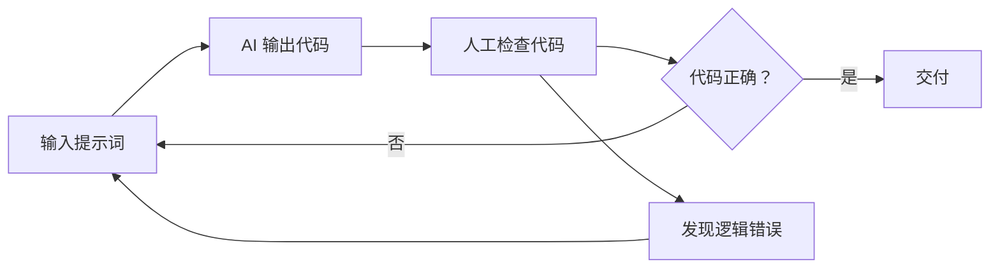
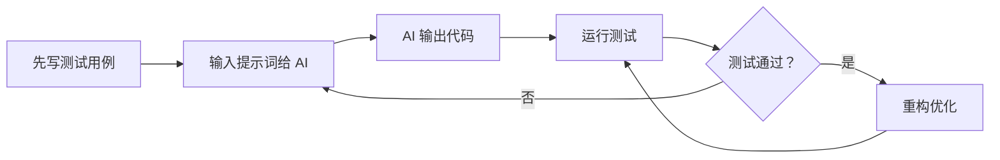

# 第01课：课程导学 — AI + TDD + 重构的单元测试实战

> 覆盖知识点：KP-001 ~ KP-005

## 1. 传统 AI 编程流程的痛点

很多开发者使用 AI 编程时，都经历过以下循环：



这个流程存在三个核心问题：

| 痛点 | 表现 | 后果 |
|------|------|------|
| **AI 幻觉** | AI 生成不存在的 API、方法或逻辑 | 编译错误或运行时异常 |
| **逻辑错误** | 代码能运行但结果不符合预期 | 隐蔽的 Bug，难以发现 |
| **代码质量差** | 命名混乱、结构耦合、缺乏边界检查 | 维护成本高，难以扩展 |

人工检查看似可靠，实则面对 AI 生成的大量代码时，人眼很难发现所有问题。**AI 编程幻觉的终结者不是更仔细的人工检查，而是测试。**

## 2. TDD + AI 新流程

本课程提出的新工作流：



核心变化在于：**先写测试，再用 AI 生成代码**。测试充当了自动验证器，每次 AI 输出后立即运行测试，通过/失败一目了然。

### 为什么这样做有效？

- 测试是**可执行的需求文档**，它精确描述了代码应该做什么
- AI 有了明确的"目标靶子"，输出更精准
- 测试失败时，反馈是**具体且可重复的**，而不是模糊的人工判断
- 无需逐行审查代码，只需看测试结果

## 3. 高效 AI 编程四要素

要将 AI 编程从"抽盲盒"变成"可控流程"，需要掌握四个要素：

```mermaid
graph TD
    subgraph ”高效 AI 编程四要素”
        A[提示词 Prompt] --> D[AI 大模型]
        B[测试用例 Test Case] --> D
        C[现有代码 Existing Code] --> D
    end
```

| 要素 | 作用 | 在本课程中的体现 |
|------|------|-----------------|
| **提示词 (Prompt)** | 向 AI 清晰描述需求 | 第8章专门讲解 TDD 提示词工程 |
| **测试用例 (Test Case)** | 规定代码的行为契约 | 贯穿全程，从第2章开始 |
| **现有代码 (Existing Code)** | 提供上下文和风格参考 | 通过重构逐步优化 |
| **AI 大模型** | 执行代码生成 | 工具，不是主角 |

**要点**：前三者由开发者掌控，AI 只是执行者。基础能力（写好测试、写好提示词、理解代码）决定了 AI 编程的最终效果。

## 4. 课程九章结构速览

本课程共 9 章 50 课，呈**递进式**结构：

| 章节 | 内容 | 目标 |
|------|------|------|
| **第1章：课程导入** | 课程导学 | 建立整体认知 |
| **第2章：初识单元测试与红绿重构** | 单元测试基础、守护进程、提炼函数、重构关系、红绿切换 | 掌握 TDD 核心循环 |
| **第3章：重构划定范围与测试分类** | 重构手法、范围划定、测试分类 | 理解重构与测试的协同 |
| **第4章：替换的艺术** | 测试替身、打桩、间谍、断言、重构技巧 | 掌握核心重构手法 |
| **第5章：Spring Boot 实战** | JUnit、Mockito、测试结构、断言深入 | Java/Spring 框架实战 |
| **第6章：测试切片** | 各层切片测试（Service/MVC/Security/JSON/Repository/E2E） | 性能优化的测试策略 |
| **第7章：测试哲学** | WWW/AAA 方法论、好测试标准、测试坏味道、CQS | 提炼可迁移的测试思想 |
| **第8章：AI + TDD** | AI 与 TDD 结合、提示词工程、低错误率代码、自验证机制 | AI 时代的编程范式 |
| **第9章：课程总结** | 回顾与展望 | 融会贯通 |

建议的学习路径见[[00-course-map|课程地图]]。

## 5. 讲师背景与理念

本课程由 Chuck 老师主讲，核心理念是：

> **"计算机最重要的就是基础，无论 AI 怎么发展，都离不开人去认识代码、理解代码。"**

这意味着：
- 工具会变，但**测试思维**不会过时
- AI 能加速编码，但**设计和验证**仍需要人的判断
- **基础决定高度**：扎实的测试和重构功底，是充分利用 AI 的前提

## 6. 参考资料

- [[reference/glossary|测试术语表]]
- [[reference/ai-tdd-prompts|AI+TDD 提示词模板]]

---

## 练习与自测

1. **回顾**：回想你过去使用 AI 编程的经历，遇到过哪些"幻觉"或逻辑错误？
2. **对比**：传统 AI 编程流程和 TDD+AI 流程的根本区别是什么？
3. **思考**：高效 AI 编程四要素中，你认为哪一个最关键？为什么？
4. **预习**：下一课 [[0002-unit-test-basics|第02课：单元测试基础]] 将从最简单的 sum 函数开始，带你亲手写出第一个单元测试。