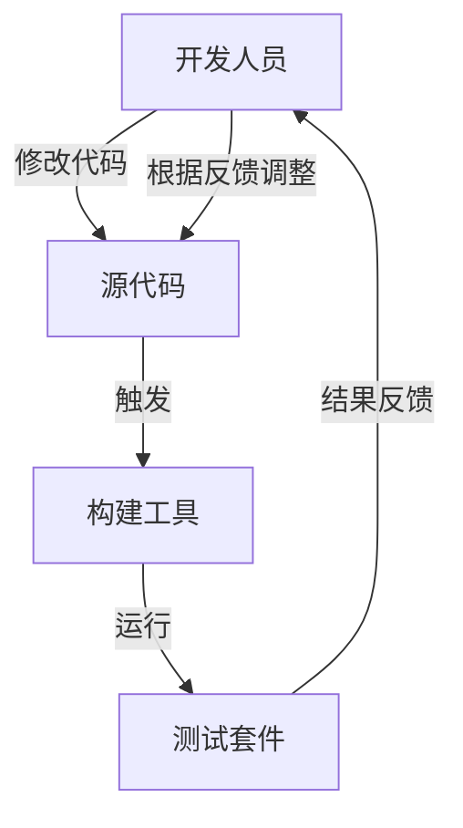

# 第03课：测试与守护进程

> 覆盖知识点：KP-013

## 1. 测试作为守护进程的概念

**守护进程 (Daemon)** 是计算机系统中在后台持续运行的进程，它不依赖用户交互，默默监控和执行特定任务。比如 Linux 的 `sshd`（SSH 守护进程）或 `crond`（定时任务守护进程）。

将测试视为守护进程，是一种**思维模式的转变**：

| 传统认知 | 守护进程认知 |
|----------|-------------|
| 测试是"额外的工作" | 测试是"持续的守护者" |
| 写完代码再补测试 | 测试和代码共存共生 |
| 偶尔运行一次 | 持续自动运行 |
| 出了问题才想起来 | 时刻守护代码正确性 |

> 把测试想象成一个**24小时不休息的守门人**。你每次修改代码，它都会自动检查——有没有把以前对的功能改坏了？有没有引入新的 Bug？它不需要你提醒，它一直在那里。

```mermaid
graph LR
    subgraph ”测试守护进程”
        A[代码变更] --> B[自动触发测试]
        B --> C{测试通过？}
        C -->|是| D[安心继续]
        C -->|否| E[立即报警]
        E --> F[定位问题]
        F --> A
    end
```

## 2. 将测试配置为持续自动运行

### 方式一：IDE 内实时运行

大多数现代 IDE（IntelliJ IDEA、Eclipse、VS Code）都支持**自动运行测试**：

**IntelliJ IDEA 配置：**
1. 右键点击测试文件夹 → `Run All Tests`
2. 点击左上角的"Rerun"按钮旁边的下拉菜单
3. 选择 `Run with Coverage` 查看测试覆盖率

### 方式二：构建工具持续运行

#### Gradle

```bash
# 运行所有测试
./gradlew test

# 持续监控文件变化自动运行（需要安装 gradle-entrant 或使用 --continuous）
./gradlew test --continuous
```

`--continuous` 参数会让 Gradle 监控源代码文件变化，一旦检测到变更就自动重新运行测试。

在 `build.gradle` 中配置测试任务：

```groovy
test {
    useJUnitPlatform()
    testLogging {
        events "passed", "skipped", "failed"
    }
    // 每次运行测试时输出详细信息
    afterSuite { desc, result ->
        if (!desc.parent) {
            println "\n测试结果: ${result.resultType}"
            println "通过: ${result.successfulTestCount}，失败: ${result.failedTestCount}"
        }
    }
}
```

#### Maven

```bash
# 运行所有测试
mvn test

# 持续模式（使用 maven-surefire-plugin）
mvn test -Dmaven.surefire.forkCount=1
```

Maven 默认会在 `verify` 生命周期阶段运行所有测试。要实现文件变化自动触发测试，可以结合 IDE 插件或使用 `mvn test` 配合文件监控工具（如 `entr`）。

### 方式三：文件系统监控 + 自动测试

```bash
# 使用 entr 工具（macOS: brew install entr）
find src -name "*.java" | entr -c ./gradlew test
```

这个命令会监控 `src` 目录下所有 Java 文件的变更，一旦有文件修改，自动清屏并运行 `./gradlew test`。

## 3. 类比：像守护进程一样持续监控代码正确性

将测试化作守护进程，意味着你建立了一个**反馈循环**：



这个循环的关键特征：

| 特征 | 说明 |
|------|------|
| **即时性** | 代码变更后立即得到反馈 |
| **自主性** | 不需要人工判断，测试自动通过/失败 |
| **客观性** | 结果基于断言，不依赖主观判断 |
| **稳定性** | 同一份代码，同样的测试，结果永远一致 |

> 这也是 [[0005-unit-test-and-refactoring|第05课]] 将要探讨的核心：为什么说"没有测试的重构是盲人摸象"？因为没有测试守护，你根本不知道修改是否破坏了什么。

## 4. 与 CI/CD 集成（扩展）

将测试守护进程的概念扩展到团队级别，就是**持续集成 (CI)**：

```yaml
# .github/workflows/test.yml (GitHub Actions 示例)
name: Test Daemon
on: [push, pull_request]
jobs:
  test:
    runs-on: ubuntu-latest
    steps:
      - uses: actions/checkout@v4
      - name: Set up JDK
        uses: actions/setup-java@v4
        with:
          java-version: '17'
      - name: Run Tests
        run: ./gradlew test
```

CI 本质上就是运行在远程服务器上的**测试守护进程**——每次提交代码，它都会自动运行所有测试并报告结果。

## 5. 其他语言的等效实践

> [!tip] 跨语言视角
> 测试作为守护进程的理念在所有编程语言中都适用。

| 语言/生态 | 持续运行工具 |
|-----------|-------------|
| **JavaScript/TypeScript** | `jest --watch` |
| **Python** | `pytest-watch` 或 `ptw` |
| **Go** | `ginkgo watch` |
| **Rust** | `cargo watch -x test` |

```bash
# Python: 持续监控并运行测试
ptw

# Node.js: Jest 的 watch 模式
npx jest --watch

# Go: 使用 Air 或 reflex 监控变化
reflex -r '\.go$' -- go test ./...
```

## 6. 参考资料

- [[reference/glossary|测试术语表]] — 查看"持续集成"相关术语
- [[0002-unit-test-basics|第02课：单元测试基础]] — 回顾单元测试的定义与价值

---

## 练习与自测

1. **配置**：在你的 Java 项目中尝试用 `./gradlew test --continuous` 或 `mvn test` 让测试持续运行。
2. **实践**：修改一个被测试覆盖的方法，观察测试守护进程如何立即"报警"。
3. **思考**：测试守护进程和 CI 流水线有什么区别和联系？它们分别在什么场景下发挥作用？
4. **预习**：下一课 [[0004-extract-function-refactoring|第04课：提炼函数（Extract Function）]] 将引入第一个重构手法，教你如何通过提炼函数改善测试代码的结构。