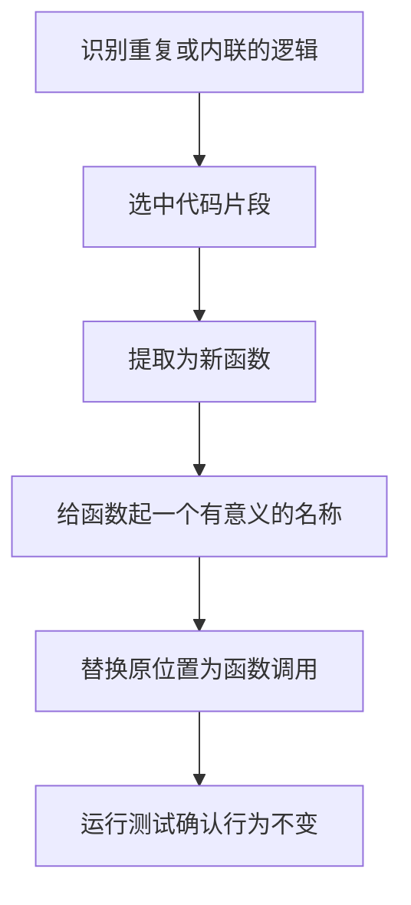
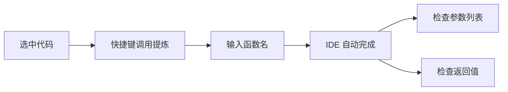

# 第04课：提炼函数（Extract Function）

> 覆盖知识点：KP-014

## 1. 什么是提炼函数

**提炼函数 (Extract Function)** 是重构中最基本也是最常用的手法。它的定义很简单：

> 将一段内联的代码逻辑提取到一个独立的、有名字的函数中。

重构前：

```java
// 主方法中包含了所有逻辑
public void processOrder(Order order) {
    // 计算折扣
    double discount = 0;
    if (order.getTotal() > 100) {
        discount = order.getTotal() * 0.1;
    } else {
        discount = order.getTotal() * 0.05;
    }
    // 应用折扣
    double finalPrice = order.getTotal() - discount;
    System.out.println("最终价格: " + finalPrice);
}
```

重构后：

```java
public void processOrder(Order order) {
    double discount = calculateDiscount(order);
    double finalPrice = applyDiscount(order.getTotal(), discount);
    System.out.println("最终价格: " + finalPrice);
}

private double calculateDiscount(Order order) {
    if (order.getTotal() > 100) {
        return order.getTotal() * 0.1;
    }
    return order.getTotal() * 0.05;
}

private double applyDiscount(double total, double discount) {
    return total - discount;
}
```

## 2. 在测试中运用提炼函数

在 [[0002-unit-test-basics|第02课]] 中，我们写了一个 `CalculatorTest`，其中的断言逻辑是内联的：

```java
// 重构前：断言逻辑内联
public void should_return_3_when_sum_1_and_2() {
    Calculator calc = new Calculator();
    int result = calc.sum(1, 2);
    if (result != 3) {
        throw new AssertionError("1 + 2 应该等于 3，期望: 3，实际: " + result);
    }
}
```

每个测试方法中重复相同的断言模式。我们可以**提炼断言函数**：

```java
// 重构后：提炼出断言函数
public void should_return_3_when_sum_1_and_2() {
    Calculator calc = new Calculator();
    int result = calc.sum(1, 2);
    assertEqual(3, result);
}

public void should_return_0_when_sum_negative_1_and_1() {
    Calculator calc = new Calculator();
    int result = calc.sum(-1, 1);
    assertEqual(0, result);
}

// 提炼出的通用断言函数
private void assertEqual(int expected, int actual) {
    if (expected != actual) {
        throw new AssertionError(
            String.format("期望: %d，实际: %d", expected, actual)
        );
    }
}
```

### 提炼函数的步骤



## 3. 提炼函数的好处

| 好处 | 说明 |
|------|------|
| **可读性提升** | 函数名解释了代码的"意图"而非"如何实现" |
| **可复用性** | 提炼出的函数可以在多处调用，避免重复 |
| **可测试性** | 小函数更容易单独测试 |
| **职责单一** | 每个函数只做一件事 |
| **降低复杂度** | 将复杂逻辑拆解为多个简单步骤 |

> 好的函数名本身就是注释。`applyDiscount(order.getTotal(), discount)` 比一大段折扣计算逻辑更容易理解。

### 函数命名准则

提炼函数时，命名至关重要。好的命名遵循以下原则：

| 原则 | 好例子 | 坏例子 |
|------|--------|--------|
| 动词开头 | `calculateDiscount()` | `discount()` |
| 描述做什么 | `sendEmailNotification()` | `email()` |
| 说明返回什么 | `getUserById()` | `user()` |
| 布尔值用 is/has | `isEligibleForDiscount()` | `checkDiscount()` |

## 4. 使用 IDE 重构工具自动完成提炼

现代 IDE 提供了自动化的重构工具，不需要手动复制粘贴。

### IntelliJ IDEA

1. 选中要提取的代码行
2. 按 `Ctrl + Alt + M` (macOS: `Cmd + Alt + M`)
3. 输入函数名
4. IDE 自动创建新函数并替换原位置

### Eclipse

1. 选中要提取的代码行
2. 右键 → Refactor → Extract Method
3. 输入函数名

### VS Code (Java)

1. 选中要提取的代码行
2. 点击灯泡图标 → Extract to method
3. 输入函数名



> **重要**：使用 IDE 重构工具时，IDE 会自动推导函数的参数和返回值。但你仍然需要手动检查：
> - 参数列表是否合理？
> - 是否需要将某些局部变量提升为参数？
> - 函数名是否准确表达了意图？

## 5. 提炼函数在重构中的定位

提炼函数是许多进阶重构手法的基础，后续课程会在此基础上展开：

| 后续课程 | 关系 |
|---------|------|
| [[0008-assemble-methods-to-class|第08课：把函数组装成类]] | 在提炼函数的基础上，将相关函数聚合为类 |
| [[0023-express-intent-with-functions|第23课：用函数进行表达]] | 深入探讨如何通过函数命名表达意图 |

## 6. 其他语言的等效写法

> [!tip] 跨语言视角
> 提炼函数是所有编程语言通用的重构手法。

**Python 等效：**

```python
# 重构前
def process_order(order):
    if order.total > 100:
        discount = order.total * 0.1
    else:
        discount = order.total * 0.05
    final_price = order.total - discount
    print(f"最终价格: {final_price}")

# 重构后
def process_order(order):
    discount = calculate_discount(order)
    final_price = apply_discount(order.total, discount)
    print(f"最终价格: {final_price}")

def calculate_discount(order):
    return order.total * 0.1 if order.total > 100 else order.total * 0.05

def apply_discount(total, discount):
    return total - discount
```

**JavaScript 等效：**

```javascript
// 重构后
function processOrder(order) {
    const discount = calculateDiscount(order);
    const finalPrice = applyDiscount(order.total, discount);
    console.log(`最终价格: ${finalPrice}`);
}

const calculateDiscount = (order) =>
    order.total > 100 ? order.total * 0.1 : order.total * 0.05;

const applyDiscount = (total, discount) => total - discount;
```

## 7. 参考资料

- [[reference/cheatsheet|重构手法速查表]] — 查看提炼函数及其他常用重构手法
- [[reference/refactoring-catalog|重构手法目录]] — 完整重构手法列表

---

## 练习与自测

1. **动手做**：回到 [[0002-unit-test-basics|第02课]] 的 `CalculatorTest`，尝试用 IDE 的提炼函数功能，把创建 `Calculator` 对象的过程提炼成一个单独的方法（如 `newCalculator()`）。
2. **识别**：在你自己的项目中，找一段超过 10 行的函数，看是否能拆成 2-3 个小函数。
3. **思考**：提炼函数时，什么情况下应该保留参数？什么情况下应该把变量提取为类的字段？
4. **预习**：下一课 [[0005-unit-test-and-refactoring|第05课：单元测试与重构的关系]] 将深入探讨为什么单元测试是重构的安全网，以及为什么没有测试的重构是"盲人摸象"。