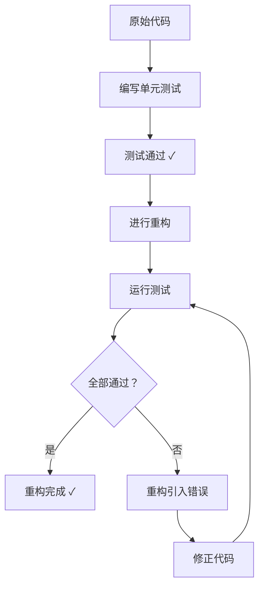
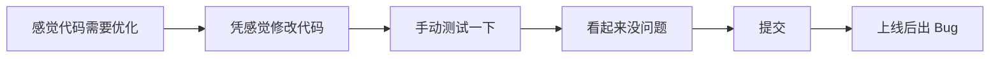
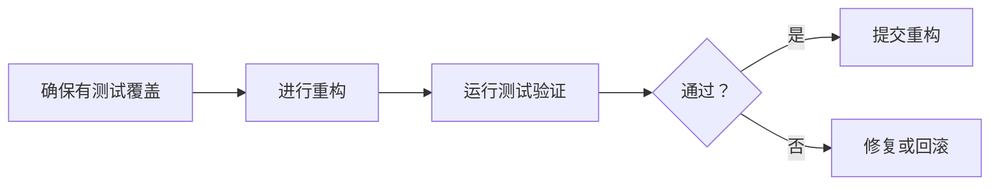

# 第05课：单元测试与重构的关系

> 覆盖知识点：KP-015

## 1. 单元测试是重构的安全网

**重构 (Refactoring)** 的定义是：**在不改变代码外部行为的前提下，改善代码内部结构**。

这个定义中最关键的一句话是——"**不改变外部行为**"。但问题来了：你怎么知道重构之后行为没有变？

答案就是：**单元测试**。



> 没有测试的重构就像走钢丝没有安全网——你可能每一步都很小心，但一旦失足，后果不堪设想。

## 2. 没有测试的重构 = 盲人摸象

很多开发者"重构"的方式是这样的：



这种方式的根本问题是**缺乏可重复的验证机制**：

| 问题 | 说明 |
|------|------|
| **主观判断** | "看起来没问题"不等于"真的没问题" |
| **覆盖不全** | 手动测试只测了几个 happy path |
| **不可重复** | 下次修改时不会再测同样的场景 |
| **累积风险** | 多次重构累积的微小错误最终爆发 |

### 一个具体例子

假设我们有一个 `UserService`：

```java
public class UserService {
    private final UserRepository userRepository;

    public UserService(UserRepository userRepository) {
        this.userRepository = userRepository;
    }

    // 原始实现：查找用户并验证状态
    public User findActiveUser(Long id) {
        User user = userRepository.findById(id);
        if (user == null) {
            throw new UserNotFoundException("User not found: " + id);
        }
        if (user.getStatus() != UserStatus.ACTIVE) {
            throw new UserNotActiveException("User is not active: " + id);
        }
        return user;
    }
}
```

**有测试的重构：**

```java
public class UserServiceTest {

    public void should_return_user_when_user_exists_and_active() {
        UserRepository repo = mock(UserRepository.class);
        when(repo.findById(1L)).thenReturn(new User(1L, "Alice", UserStatus.ACTIVE));
        UserService service = new UserService(repo);

        User result = service.findActiveUser(1L);

        assertEquals("Alice", result.getName());
    }

    public void should_throw_exception_when_user_not_found() {
        UserRepository repo = mock(UserRepository.class);
        when(repo.findById(1L)).thenReturn(null);
        UserService service = new UserService(repo);

        assertThrows(UserNotFoundException.class,
            () -> service.findActiveUser(1L));
    }

    public void should_throw_exception_when_user_not_active() {
        UserRepository repo = mock(UserRepository.class);
        when(repo.findById(1L)).thenReturn(new User(1L, "Bob", UserStatus.INACTIVE));
        UserService service = new UserService(repo);

        assertThrows(UserNotActiveException.class,
            () -> service.findActiveUser(1L));
    }
}
```

有了这三组测试覆盖，无论你怎么重构 `findActiveUser` 的内部实现，只要测试全部通过，就可以确信外部行为没有变化。

## 3. 先有测试，再做重构

这是一个重要的**顺序原则**：



### 重构的工作流程

正确的重构步骤应该是：

1. **确保测试存在** — 如果没有测试覆盖当前代码，先补测试
2. **确认测试通过** — 确保当前状态是"绿色"
3. **执行重构** — 应用某个重构手法（如 [[0004-extract-function-refactoring|提炼函数]]）
4. **运行测试** — 确认所有测试仍然通过
5. **提交** — 如果通过则提交，否则修复或回滚

> 每次应用一个重构手法后立即运行测试。不要一次应用多个重构手法而不跑测试——如果失败了，你不知道是哪个步骤引入的问题。

## 4. 重构改善代码结构，测试保证行为不变

测试和重构的目标不同，但相辅相成：

| 维度 | 单元测试 | 重构 |
|------|---------|------|
| **关注点** | 行为正确性 | 代码结构 |
| **衡量标准** | 通过/失败 | 可读性/可维护性 |
| **变化频率** | 行为改变时变化 | 行为不变时也可变化 |
| **失败含义** | 行为被破坏 | 引入错误 |
| **产出** | 可信赖的验证网 | 整洁的代码结构 |

两者的关系可以用一句话概括：

> **重构让你敢于修改代码，测试让你敢于重构。**

```mermaid
graph TD
    subgraph ”正向循环”
        A[有测试] --> B[敢于重构]
        B --> C[代码结构更好]
        C --> D[更容易加新功能]
        D --> E[更容易加测试]
        E --> A
    end
```

## 5. 什么时候需要先补测试？

以下场景提示你"当前代码没有足够的测试覆盖，需要先补测试再重构"：

- [ ] 代码片段没有对应的测试类
- [ ] 测试只覆盖了"主流程"，没有覆盖边界和异常
- [ ] 测试是手动进行的（没有自动化）
- [ ] 对这段代码的行为理解不够清晰（正好通过写测试来理清）

> **写测试的过程本身就是理解代码的过程。** 如果你发现很难给一段代码写测试，这往往意味着代码设计有问题——这本身就是重构的信号。

## 6. 其他语言的等效视角

> [!tip] 跨语言视角
> 测试与重构的关系是所有编程语言和范式共通的。

**Python：** `pytest` + `refactoring` 的搭配与 Java 完全一致——先写 pytest 用例覆盖关键路径，再应用重构手法。

**JavaScript/TypeScript：** `vitest` 或 `jest` 作为测试框架，加上 `eslint` 等工具辅助识别可重构的代码。

**Go：** 内置的 `testing` 包提供了基准测试和表驱动测试（Table-Driven Tests），非常适合在重构时提供全面覆盖。

## 7. 参考资料

- [[reference/glossary|测试术语表]] — 查看"重构"和"回归测试"等术语
- [[reference/refactoring-catalog|重构手法目录]] — 浏览所有可应用的重构手法
- [[0004-extract-function-refactoring|第04课：提炼函数]] — 回顾第一个重构手法

---

## 练习与自测

1. **思考**：如果你的项目没有单元测试，你如何进行重构？风险在哪里？
2. **实践**：找一个没有测试覆盖的遗留代码片段，先给它补上测试，然后应用至少一个重构手法（如提炼函数）。
3. **分析**：重构的定义是"不改变外部行为"。请解释：修复 Bug 是重构吗？添加新功能是重构吗？
4. **预习**：下一课 [[0006-red-green-refactoring|第06课：红绿切换（Red-Green-Refactoring）]] 将引入 TDD 的核心循环，通过红绿切换驱动代码优化。