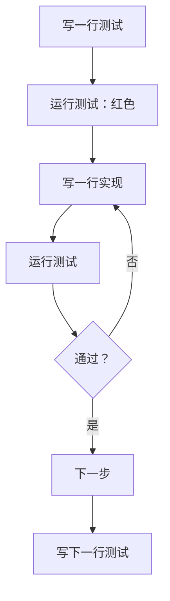

# 第06课：红绿切换（Red-Green-Refactoring）

> 覆盖知识点：KP-016 ~ KP-019

## 1. 红绿切换三步骤

**红绿切换 (Red-Green-Refactoring)** 是测试驱动开发（TDD）的核心循环，包含三个步骤：

```mermaid
graph TD
    R[🔴 RED<br/>编写一个失败的测试] --> G[🟢 GREEN<br/>用最简代码让测试通过]
    G --> F[🔵 REFACTOR<br/>重构优化代码结构]
    F --> R

    R -.->|测试描述期望行为| R1[”assertEqual(3, sum(1,2))”]
    G -.->|最简实现| G1[”return a + b”]
    F -.->|优化结构| F1[”提取方法、重命名等”]
```

| 步骤 | 颜色 | 做什么 | 目标 |
|------|------|--------|------|
| **Red** | 红色 | 先写一个测试，此时代码还不存在或不够，测试会**失败** | 明确你要什么 |
| **Green** | 绿色 | 用**最简代码**让测试通过，不追求完美 | 让代码工作 |
| **Refactor** | 蓝色/重构 | 在测试通过的前提下，优化代码结构 | 让代码更好 |

> **核心原则**：红色阶段只写测试，不写实现代码。绿色阶段只写实现代码让测试通过，不优化。重构阶段只改善结构，不改行为。

## 2. 完整的 case1/case2/case3 示例演示

让我们通过一个完整的例子演示红绿切换。任务：实现一个 `FizzBuzz` 函数。

- 输入能被 3 整除 → 输出 "Fizz"
- 输入能被 5 整除 → 输出 "Buzz"
- 输入能同时被 3 和 5 整除 → 输出 "FizzBuzz"
- 其他情况 → 输出数字本身

### 第一轮：Case 1 — 输入 1 返回 "1"

**Red**：先写测试，此时 `FizzBuzz` 类还不存在，测试会**编译失败**（编译红色）。

```java
public class FizzBuzzTest {
    public void should_return_1_when_input_1() {
        FizzBuzz fizzBuzz = new FizzBuzz();
        String result = fizzBuzz.say(1);
        assertEqual("1", result);
    }
}
```

> 编译红色 vs 逻辑红色：编译红色是代码根本不能编译（类不存在、方法不存在）。逻辑红色是代码能编译但断言失败。

**Green**：写最简实现让测试通过。

```java
public class FizzBuzz {
    public String say(int input) {
        return "1";
    }
}
```

> 注意：这里直接返回 `"1"` 显然是不完整的，但绿色阶段的目标是**让当前测试通过**，而不是写完所有逻辑。

**Refactor**：当前代码太简单，无需重构。

### 第二轮：Case 2 — 输入 2 返回 "2"

**Red**：新增测试 case。

```java
public void should_return_2_when_input_2() {
    FizzBuzz fizzBuzz = new FizzBuzz();
    String result = fizzBuzz.say(2);
    assertEqual("2", result);
}
```

测试会失败（逻辑红色），因为当前实现 `return "1"` 对输入 2 返回了 "1"。

**Green**：用更通用的实现替换硬编码。

```java
public String say(int input) {
    return String.valueOf(input);
}
```

现在两个测试都通过了。

**Refactor**：可以检查命名和结构。暂时 OK。

### 第三轮：Case 3 — 输入 3 返回 "Fizz"

**Red**：新增测试 case。

```java
public void should_return_Fizz_when_input_3() {
    FizzBuzz fizzBuzz = new FizzBuzz();
    String result = fizzBuzz.say(3);
    assertEqual("Fizz", result);
}
```

测试会失败，因为 `String.valueOf(3)` 返回 "3" 而不是 "Fizz"。

**Green**：加上对 3 的特殊处理。

```java
public String say(int input) {
    if (input % 3 == 0) {
        return "Fizz";
    }
    return String.valueOf(input);
}
```

所有测试通过。

**Refactor**：暂无必要。

### 第四轮：Case 4 — 输入 5 返回 "Buzz"

```java
// Red: 新增测试
public void should_return_Buzz_when_input_5() {
    FizzBuzz fizzBuzz = new FizzBuzz();
    String result = fizzBuzz.say(5);
    assertEqual("Buzz", result);
}

// Green: 最简实现
public String say(int input) {
    if (input % 3 == 0) return "Fizz";
    if (input % 5 == 0) return "Buzz";
    return String.valueOf(input);
}
```

### 第五轮：Case 5 — 输入 15 返回 "FizzBuzz"

```java
// Red: 新增测试
public void should_return_FizzBuzz_when_input_15() {
    FizzBuzz fizzBuzz = new FizzBuzz();
    String result = fizzBuzz.say(15);
    assertEqual("FizzBuzz", result);
}
```

测试会失败，因为 `15 % 3 == 0` 直接返回了 "Fizz"。

**Green**：

```java
public String say(int input) {
    if (input % 15 == 0) return "FizzBuzz";
    if (input % 3 == 0) return "Fizz";
    if (input % 5 == 0) return "Buzz";
    return String.valueOf(input);
}
```

**Refactor**：这里有一个"坏味道"——`15` 是 `3 * 5`，但写成了硬编码。更好的表达方式是：

```java
public String say(int input) {
    if (input % 3 == 0 && input % 5 == 0) return "FizzBuzz";
    if (input % 3 == 0) return "Fizz";
    if (input % 5 == 0) return "Buzz";
    return String.valueOf(input);
}
```

重构后，运行所有 5 个测试确保全部通过。

## 3. 小步提交：每改一行代码就运行一次测试

**小步提交 (Small Steps)** 是红绿切换中的一个关键实践：

> 每次只修改少量代码（甚至只有一行），然后立即运行测试。



### 小步提交的好处

| 好处 | 说明 |
|------|------|
| **快速定位错误** | 如果测试失败，你知道问题出在刚改的几行代码中 |
| **降低风险** | 每次变化都很小，回滚成本低 |
| **保持节奏** | 红灯 → 绿灯 → 重构，像呼吸一样自然 |
| **减少调试时间** | 小步骤意味着几乎不需要"调试" |

> **对比**：传统开发方式写 50 行代码然后运行，失败了不知道哪里出问题——这被称为"大爆炸式集成"。TDD 的小步提交避免了这种问题。

## 4. 编译红色 vs 逻辑红色

在红色阶段，有两种不同类型的"红色"：

| 类型 | 含义 | 例子 | 解决方法 |
|------|------|------|----------|
| **编译红色** | 代码不能通过编译 | 引用了不存在的类或方法 | 创建类/添加方法签名 |
| **逻辑红色** | 代码能编译但断言失败 | 返回了错误的值 | 修改实现逻辑 |

### 示例对比

**编译红色：**

```java
// FizzBuzz 类还不存在
public void should_return_1_when_input_1() {
    FizzBuzz fizzBuzz = new FizzBuzz(); // 编译错误：FizzBuzz 不存在
    String result = fizzBuzz.say(1);    // 编译错误：方法不存在
}
```

解决方式：创建类和方法签名，方法体可以返回空值。

**逻辑红色：**

```java
// FizzBuzz 类和方法存在，但返回了错误值
public void should_return_Fizz_when_input_3() {
    FizzBuzz fizzBuzz = new FizzBuzz();
    String result = fizzBuzz.say(3);
    assertEqual("Fizz", result);
    // 运行时失败：say(3) 返回 "3" 而不是 "Fizz"
}
```

解决方式：修改 `say` 方法的实现逻辑。

> **为什么区分两者很重要？** 编译红色意味着你需要建立代码的"骨架"（类、方法签名）。逻辑红色意味着骨架已经有了，现在要填充"血肉"（具体实现逻辑）。区分它们有助于你理解当前处在开发的哪个阶段。

## 5. 通过红绿切换驱动代码优化

红绿切换不仅是一个测试方法，更是一种**设计方法学**。它通过"先写测试"的方式驱动你思考：

### 测试引导设计

```mermaid
graph TD
    subgraph ”TDD 设计过程”
        A[思考：我想要什么行为？] --> B[写测试描述这个行为]
        B --> C[测试强迫你思考接口设计]
        C --> D[写最简实现]
        D --> E[重构优化内部结构]
        E --> A
    end
```

### 设计启示

| TDD 步骤 | 设计层面的收获 |
|----------|---------------|
| 写测试时 | 从**使用者**的视角思考 API 设计 |
| 测试命名时 | 强制你明确每个方法的行为契约 |
| 测试失败时 | 告诉你当前实现还不够 |
| 重构时 | 在测试保护下大胆优化 |

> 很多优秀的设计（如依赖注入、接口隔离）都是在 TDD 过程中自然浮现的——不是因为设计者预先想好了，而是因为"这样写测试更方便"。

## 6. 完整 FizzBuzz 测试类一览

```java
public class FizzBuzzTest {

    public static void main(String[] args) {
        FizzBuzzTest test = new FizzBuzzTest();
        test.should_return_1_when_input_1();
        test.should_return_2_when_input_2();
        test.should_return_Fizz_when_input_3();
        test.should_return_Buzz_when_input_5();
        test.should_return_FizzBuzz_when_input_15();
        test.should_return_Fizz_when_input_6();
        test.should_return_Buzz_when_input_10();
        System.out.println("所有 FizzBuzz 测试通过！");
    }

    FizzBuzz fizzBuzz = new FizzBuzz();

    public void should_return_1_when_input_1() {
        assertEqual("1", fizzBuzz.say(1));
    }

    public void should_return_2_when_input_2() {
        assertEqual("2", fizzBuzz.say(2));
    }

    public void should_return_Fizz_when_input_3() {
        assertEqual("Fizz", fizzBuzz.say(3));
    }

    public void should_return_Buzz_when_input_5() {
        assertEqual("Buzz", fizzBuzz.say(5));
    }

    public void should_return_FizzBuzz_when_input_15() {
        assertEqual("FizzBuzz", fizzBuzz.say(15));
    }

    public void should_return_Fizz_when_input_6() {
        assertEqual("Fizz", fizzBuzz.say(6));
    }

    public void should_return_Buzz_when_input_10() {
        assertEqual("Buzz", fizzBuzz.say(10));
    }

    private void assertEqual(String expected, String actual) {
        if (!expected.equals(actual)) {
            throw new AssertionError(
                String.format("期望: %s，实际: %s", expected, actual)
            );
        }
    }
}
```

## 7. 其他语言的红绿切换

> [!tip] 跨语言视角
> 红绿切换的核心是**工作流**，跟语言无关。任何语言都能应用这个循环。

**Python 等效（使用 pytest）：**

```python
# test_fizzbuzz.py
class TestFizzBuzz:
    def test_should_return_1_when_input_1(self):
        assert FizzBuzz().say(1) == "1"

    def test_should_return_Fizz_when_input_3(self):
        assert FizzBuzz().say(3) == "Fizz"

    def test_should_return_FizzBuzz_when_input_15(self):
        assert FizzBuzz().say(15) == "FizzBuzz"
```

**JavaScript 等效（使用 Vitest）：**

```javascript
// fizzbuzz.test.js
import { describe, it, expect } from 'vitest';

describe('FizzBuzz', () => {
    it('should return "1" when input 1', () => {
        expect(say(1)).toBe("1");
    });

    it('should return "Fizz" when input 3', () => {
        expect(say(3)).toBe("Fizz");
    });

    it('should return "FizzBuzz" when input 15', () => {
        expect(say(15)).toBe("FizzBuzz");
    });
});
```

**Go 等效（表驱动测试）：**

```go
func TestSay(t *testing.T) {
    tests := []struct {
        input    int
        expected string
    }{
        {1, "1"},
        {3, "Fizz"},
        {5, "Buzz"},
        {15, "FizzBuzz"},
    }

    for _, tt := range tests {
        result := Say(tt.input)
        if result != tt.expected {
            t.Errorf("Say(%d) = %s; want %s", tt.input, result, tt.expected)
        }
    }
}
```

## 8. 参考资料

- [[reference/glossary|测试术语表]] — 查看"TDD"、"红绿重构"等术语
- [[reference/cheatsheet|重构手法速查表]] — 查看红绿重构流程速查
- [[0005-unit-test-and-refactoring|第05课：单元测试与重构的关系]] — 回顾为什么测试是重构的安全网
- [[0040-test-driven-development|第40课：测试先行（TDD）]] — 深入探讨 TDD 方法论

---

## 练习与自测

1. **动手做**：按照红绿切换的步骤，完整实现一个 `FizzBuzz` 类，从 case1 开始逐步推进到所有 case。
2. **挑战**：尝试用 TDD（红绿切换）实现一个 `isLeapYear(int year)` 函数，判断闰年。规则：能被 400 整除，或能被 4 整除但不能被 100 整除。从 case1（2000 年）开始。
3. **区分**：指出以下场景是"编译红色"还是"逻辑红色"：a) 引用了一个尚未创建的类；b) 方法返回了错误的计算结果；c) 方法签名缺少参数。
4. **下节预告**：学完红绿切换后，你将进入第 3 章，学习 [[0007-refactoring-scope|第07课：运用重构来划定范围]]——如何利用重构手法应对新增业务需求，划定修改范围。