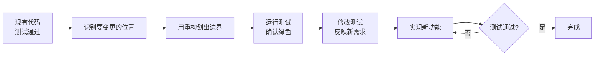

# 运用重构来划定范围

> 覆盖知识点：KP-030 ~ KP-032

在真实的业务开发中，我们极少从零开始写代码。绝大多数场景是在**已有代码基础**上新增功能。如何在不破坏现有功能的前提下安全地引入新逻辑？答案就是——**用重构来划定范围**。

## 场景：新增快递费功能

假设我们正在开发一个电商订单系统，已经有一个 `OrderService` 负责计算订单总价。现有代码如下：

```java
public class OrderService {
    public double calculateTotal(Order order) {
        double subtotal = order.getItems().stream()
            .mapToDouble(item -> item.getPrice() * item.getQuantity())
            .sum();
        return subtotal;
    }
}
```

现有的测试：

```java
class OrderServiceTest {
    @Test
    void should_calculate_subtotal_for_multiple_items() {
        OrderService service = new OrderService();
        Order order = new Order();
        order.addItem(new Item("book", 50.0, 2));
        order.addItem(new Item("pen", 10.0, 3));
        
        double total = service.calculateTotal(order);
        
        assertEquals(130.0, total, 0.001);
    }
}
```

现在接到新需求：**需要增加快递费 20 元**。

## 第一步：还原旧代码，保留旧测试

在新增功能前，一个关键动作是：**把旧代码还原到一种"干净"的状态**，确保所有旧测试已经通过。

```java
// 当前状态：测试通过，代码结构清晰
// calculateTotal 已经通过测试验证
```

> [!warning] 关键原则
> 新增功能前，先确保所有现有测试是**绿色**的。任何红色的测试都要先排查，再开始新功能开发。

## 第二步：划定变更范围

通过重构来"划出"将要变更的区域：

```java
public class OrderService {
    public double calculateTotal(Order order) {
        double subtotal = order.getItems().stream()
            .mapToDouble(item -> item.getPrice() * item.getQuantity())
            .sum();
        double shippingFee = calculateShippingFee();  // 新增：通过重构划出变更点
        return subtotal + shippingFee;
    }
    
    private double calculateShippingFee() {
        return 20.0;  // 暂时硬编码
    }
}
```

这里的关键洞察是：我们**没有一步到位**去实现完整的快递费逻辑，而是先用一个简单的 `calculateShippingFee()` 方法划出变化的位置，然后让现有测试保持通过。

## 第三步：小步运行测试

每次修改后立即运行测试：

| 步骤 | 操作 | 测试状态 |
|------|------|----------|
| 1 | 定义 `calculateShippingFee()` 返回 20.0 | 绿色 |
| 2 | 修改 `calculateTotal()` 调用新方法 | 绿色（需要修改断言期望值） |
| 3 | 更新测试断言，包含快递费 | 红色 → 绿色 |

> [!tip] 测试即安全网
> 每修改一行代码就运行一次测试，这样如果某步改错了，能立刻知道是哪里出的问题。这就是测试作为"安全网"的价值。

## 第四步：修改测试，驱动新功能

我们需要更新测试，让它反映新需求——包含快递费：

```java
class OrderServiceTest {
    @Test
    void should_calculate_total_including_shipping_fee() {
        OrderService service = new OrderService();
        Order order = new Order();
        order.addItem(new Item("book", 50.0, 2));
        order.addItem(new Item("pen", 10.0, 3));
        
        double total = service.calculateTotal(order);
        
        // 原来: 130.0，现在加上快递费 20.0 = 150.0
        assertEquals(150.0, total, 0.001);
    }
}
```

## 重构划定范围的本质

这个过程实际上在做三件事：

1. **识别变化点**：通过阅读现有代码，找到新功能需要插入的位置
2. **用重构隔离变化**：先用最轻量的方式（如提取方法）划出边界
3. **保持测试绿色**：每一步都确保不破坏现有功能



## 和未写测试时的对比

如果没有测试作为安全网，新增功能时的流程往往是：

1. 读代码 → 猜测修改位置 → 修改 → 手动验证 → 出 Bug → 回退 → 重改

有了测试，流程变成：

1. 读代码 + 读测试 → 确定修改位置 → 重构划边界 → 运行测试验证 → 放心修改

> [!quote]
> "重构不是乱改代码，而是在测试的保护下，有序地改善代码结构。" — Martin Fowler

---

## 总结

- **还原旧代码**：确保所有测试在绿色状态开始新功能
- **划定范围**：用提取方法等重构手法标出变更边界
- **小步运行**：每步修改后立即执行测试
- **测试驱动**：先更新测试反映新需求，再实现功能

> [!note] 其他语言的等效实践
> - **Python**：同样使用 `unittest` 或 `pytest` 作为安全网，先通过重构提取方法划定变更范围，再修改测试用例
> - **Go**：使用 `go test`，通过提取函数/方法来划定变更范围
> - **JavaScript/TypeScript**：使用 Jest 或 Vitest，通过提取函数来划定变更范围
> - **本质**：无论语言，核心思想都是**先用重构划定边界，再在测试保护下修改**

---

> 重构划定范围是"安全修改"的基础技能。在[[0008-assemble-methods-to-class|第08课]]中，我们将学习如何把散落的函数组装成类，进一步提升代码的组织性。在掌握了范围划定之后，可以继续学习[[0012-refactoring-methodology|第12课：重构的方法论]]来建立系统的重构知识体系。