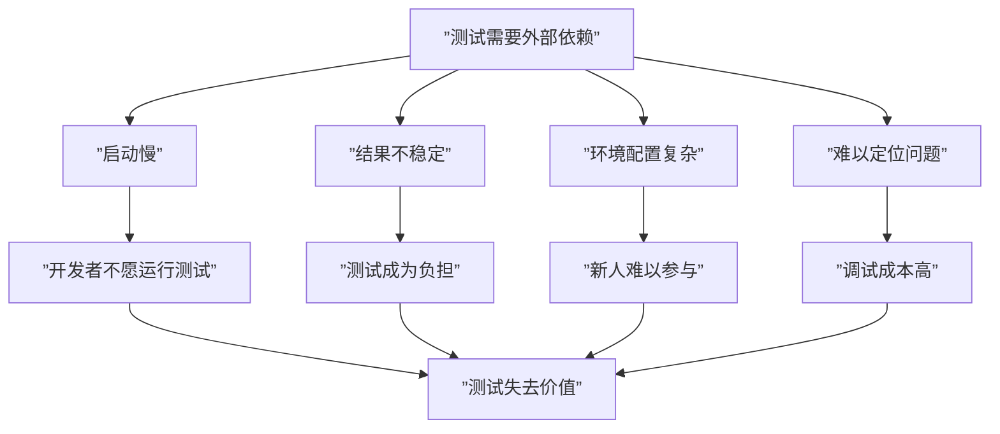

# 单元测试的范围

> 覆盖知识点：KP-035

"单元测试"（Unit Test）这个术语大家都不陌生。但到底什么是"单元"？一个单元测试应该测多大的范围？这些问题如果理解不透彻，写的测试就会要么"大而不当"，要么"细碎无用"。

## 什么是"单元"？

在单元测试的语境下，**一个"单元"通常指的是一个方法（Method）或一个函数（Function）**。

```java
// 这是一个"单元"——一个方法
public double calculateShippingFee(Order order, ShippingType type) {
    // ...
}
```

但这并不意味着每个方法都要有对应的测试。真正的判断标准是：

> **一个单元测试应该只测试"单一行为"，而不是一堆行为的组合。**

```mermaid
flowchart LR
    subgraph ”单元测试的边界”
        A[”测试方法A”] --> B[”被测试方法”]
        C[”测试方法B”] --> B
    end
    
    subgraph ”外部环境（不参与）”
        D[”数据库”]
        E[”网络服务”]
        F[”文件系统”]
    end
    
    B -.->|不依赖| D
    B -.->|不依赖| E
    B -.->|不依赖| F
```

## 单元测试的核心特征

| 特征 | 说明 | 反例 |
|------|------|------|
| **单一性** | 只测一个方法/函数的行为 | 一个测试里同时调用 Service、访问数据库、检查返回值 |
| **隔离性** | 不依赖外部环境（DB/网络/文件系统） | 测试需要启动数据库才能运行 |
| **速度** | 毫秒级执行 | 测试执行需要几十秒 |
| **确定性** | 每次运行结果相同 | 测试依赖当前时间或随机数 |
| **可重复** | 任意顺序运行结果一致 | 测试之间共享了可变状态 |

## 正确示例：独立的单元测试

```java
class ShippingFeeCalculatorTest {
    private ShippingFeeCalculator calculator = new ShippingFeeCalculator();
    
    @Test
    void should_calculate_normal_shipping_fee() {
        // Arrange
        Order order = new Order();
        order.setShippingType(ShippingType.NORMAL);
        
        // Act
        double fee = calculator.calculate(order, ShippingType.NORMAL);
        
        // Assert
        assertEquals(20.0, fee, 0.001);
    }
    
    @Test
    void should_calculate_express_shipping_fee() {
        // Arrange
        Order order = new Order();
        order.addItem(new Item("book", 100.0, 1));
        
        // Act
        double fee = calculator.calculate(order, ShippingType.EXPRESS);
        
        // Assert
        assertEquals(10.0, fee, 0.001);
    }
}
```

这个测试的**范围精确**——它只测 `ShippingFeeCalculator.calculate()` 这一个方法，不涉及数据库、不涉及网络、不涉及文件系统。

## 反例：越界的"单元测试"

下面这个测试犯了典型的"范围过大"的错误：

```java
// 错误的单元测试——范围过大
@Test
void should_process_order() {
    // 直接启动了 Spring 容器
    SpringApplication.run(Application.class);
    
    // 调用了真实的数据库
    Order savedOrder = orderRepository.save(new Order(/*...*/));
    
    // 调用了一个会触发完整业务流程的方法
    orderService.processOrder(savedOrder.getId());
    
    // 检查数据库状态
    Order result = orderRepository.findById(savedOrder.getId()).get();
    assertEquals("PROCESSED", result.getStatus());
}
```

这个问题在哪？

1. **启动了完整的应用上下文** —— 慢
2. **依赖了真实数据库** —— 不可控
3. **测了太多逻辑的组合** —— 一旦失败，不知道是哪个环节出了问题
4. **没有隔离性** —— 数据库状态会影响测试结果

## 如何判断单元测试的范围是否合适

```
┌─────────────────────────────────────┐
│  判断一个测试是否是单元测试：          │
│                                     │
│  1. 它只用到了被测试类自身的方法吗？    │
│     是 → 可能是单元测试               │
│     否 → 需要验证是否越界             │
│                                     │
│  2. 它需要启动数据库/Web服务器吗？     │
│     是 → 不是单元测试                 │
│     否 → 可能是单元测试               │
│                                     │
│  3. 它可以在毫秒内执行完吗？           │
│     是 → 可能是单元测试               │
│     否 → 不是单元测试                 │
└─────────────────────────────────────┘
```

> [!warning] 常见误区
> 很多人认为"测试框架能运行并且通过了"就是好的单元测试。但**如果每个测试都需要几十秒才能跑完，开发者根本不会频繁运行它们**，测试的价值就大打折扣了。

## 为什么单元测试要隔离外部依赖？



隔离外部依赖的方法（后续课程会详细讲解）：

| 手法 | 课程 | 说明 |
|------|------|------|
| 测试替身（Test Double） | [[0016-test-double|第16课]] | 用假对象替代真实依赖 |
| 打桩（Stub） | [[0017-stub-method|第17课]] | 让替身返回固定值 |
| 间谍（Spy） | [[0018-test-spy|第18课]] | 记录调用信息用于断言 |

## 单元测试的范围是"策略选择"

不同团队、不同项目对"单元"的定义可能略有差异，但有一条原则是通用的：

> **单元测试的范围 = 你能在几毫秒内独立验证的最小行为单元。**

- 如果被测方法调用了其他方法，但那些方法也是**同一个类内的私有方法** —— 可以视为一个单元
- 如果被测方法调用了**外部服务或数据库** —— 需要用替身隔离

> [!note] 其他语言的等效实践
> - **Python**：使用 `unittest.mock` 提供的 `patch` 和 `Mock` 来隔离外部依赖，确保测试只测单一函数
> - **Go**：通过接口（interface）定义依赖边界，测试时传入 mock 实现，保证测试粒度为一个函数/方法
> - **JavaScript**：使用 Jest 的 `jest.mock()` 或 Vitest 的 `vi.mock()` 来模拟模块依赖
> - **本质**：无论语言，单元测试的核心都是**隔离 + 单一 + 快速**

---

> 理解单元测试的范围是测试分类的起点。在[[0011-integration-test-scope|第11课]]中，我们将对比集成测试的范围——它正好站在单元测试的对立面，测试多个单元的协作。最后，[[0013-test-classification|第13课：测试的分类]]将用测试金字塔帮助你建立全局视角。