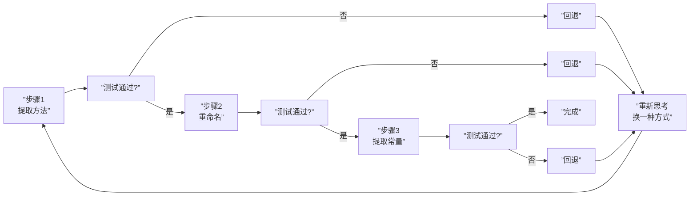

# 重构的方法论

> 覆盖知识点：KP-037

经过前面几课的重构实战，我们已经接触了三种核心的重构手法。现在是时候把它们放到一起，提炼出一套**系统的方法论**了。

## 三种核心重构手法回顾

```mermaid
flowchart TD
    subgraph ”第2章：基础手法”
        A[”Extract Function<br/>提炼函数”]
    end
    
    subgraph ”第3章：进阶手法”
        B[”Assemble to Class<br/>组装成类”]
        C[”Replace Query<br/>for Variable<br/>查询替代变量”]
    end
    
    A --> B
    A --> C
    B --> D[”更清晰的代码结构”]
    C --> D
```

### 手法一：提炼函数（Extract Function）

将一段有明确目的的代码块提取为独立的函数，并用有意义的名称命名。

```java
// 重构前
public double calculateTotal(Order order) {
    double subtotal = 0;
    for (Item item : order.getItems()) {
        subtotal += item.getPrice() * item.getQuantity();
    }
    double shipping = 20.0;
    return subtotal + shipping;
}

// 重构后
public double calculateTotal(Order order) {
    return calculateSubtotal(order) + calculateShipping(order);
}

private double calculateSubtotal(Order order) {
    return order.getItems().stream()
        .mapToDouble(item -> item.getPrice() * item.getQuantity())
        .sum();
}

private double calculateShipping(Order order) {
    return 20.0;
}
```

### 手法二：组装成类（Assemble to Class）

将散落但行为相似的函数归集到一个类中，从面向过程走向面向对象。

```java
// 重构前：三个独立函数
double case1(Order order) { return 20.0; }
double case2(Order order) { /* 加急费计算 */ }
double case3(Order order) { /* 国际费计算 */ }

// 重构后：一个类
public class ShippingFeeCalculator {
    public double calculate(Order order, ShippingType type) {
        // 统一入口
    }
    private double normalFee(Order order) { return 20.0; }
    private double expressFee(Order order) { /* ... */ }
    private double internationalFee(Order order) { /* ... */ }
}
```

### 手法三：用查询替代变量（Replace Query for Variable）

将硬编码的字面量（魔法数字/字符串）替换为有意义的查询方法。

```java
// 重构前
return 20.0;  // 20.0 是什么？

// 重构后
return normalShippingFee();  // 语义清晰
```

## 三种手法的对比

| 维度 | 提炼函数 | 组装成类 | 查询替代变量 |
|------|----------|----------|-------------|
| **解决的问题** | 方法过长/职责不单一 | 函数散落/缺少组织 | 魔法数字/意图不明确 |
| **重构粒度** | 函数级别 | 类级别 | 表达式级别 |
| **核心动作** | 提取 + 命名 | 归集 + 封装 | 替换 + 抽象 |
| **对测试的影响** | 测试无变化 | 测试需重新组织 | 测试更语义化 |
| **适用阶段** | 任何时候 | 发现重复模式时 | 代码出现魔法值时 |
| **后续演进** | 可进一步组装成类 | 可演化为策略模式 | 可演化为配置查询 |

## 重构的节奏：小步快跑

重构最重要的心法不是"知道怎么做"，而是**知道什么时候停，什么时候走**。

```
每一步的节奏：

1. 识别坏味道          ← 观察（Observe）
     ↓
2. 应用重构手法         ← 操作（Act）
     ↓
3. 运行测试             ← 验证（Verify）
     ↓
4. 测试通过？           ← 决策（Decide）
    ├── 是 → 继续下一步
    └── 否 → 撤销上一步操作，重新思考
```

> [!quote]
> "重构的黄金法则是：**每一步都小到可以随时回退**。" —— 本课程讲师



## 重构与测试的关系

```mermaid
flowchart TD
    subgraph ”重构三要素”
        A[”识别坏味道”]
        B[”应用重构手法”]
        C[”运行测试验证”]
    end
    
    A --> B --> C
    
    C -->|”绿色”| A
    C -->|”红色”| D[”撤销回退”]
    D --> B
```

重构和测试形成了一种**共生关系**：

| 要素 | 角色 | 类比 |
|------|------|------|
| **测试** | 安全网 | 高空作业的安全绳 |
| **坏味道** | 信号 | 仪表盘上的警示灯 |
| **重构手法** | 工具 | 螺丝刀/扳手 |
| **小步提交** | 节奏 | 登山时的步伐 |

> [!tip] 重构的"三步走"口诀
> **一看二改三验证**：
> - 一看：发现代码坏味道
> - 二改：应用重构手法
> - 三验证：运行测试确认不破坏功能

## 什么时候不该重构？

重构虽然好，但不是万能的。以下情况应该暂缓重构：

1. **没有测试保护** —— 重构的先决条件是存在测试
2. **代码马上要重写** —— 既然要重写，不如直接写更好的版本
3. **截止日期前** —— 交付功能优先，重构可以延后
4. **不理解的代码** —— 先理解再重构，否则可能引入隐式 Bug

> [!warning] 重构的禁忌
> 永远不要在**没有测试的情况下重构生产代码**。没有安全网的"重构"不叫重构，叫"重写"。

## 构建重构的"工具箱"

随着课程的推进，我们将不断往重构工具箱中添加新工具：

| 课次 | 重构手法 | 类型 |
|------|----------|------|
| [[0004-extract-function-refactoring|第04课]] | 提炼函数 | 基础 |
| [[0007-refactoring-scope|第07课]] | 用重构划定范围 | 策略 |
| [[0008-assemble-methods-to-class|第08课]] | 组装成类 | 组织 |
| [[0009-replace-query-for-variable|第09课]] | 查询替代变量 | 表达式 |
| [[0019-assertion-over-if|第19课]] | 用断言替代 if-else | 条件 |
| [[0020-remove-primitive-obsession|第20课]] | 去除原始类型偏执 | 类型 |
| [[0021-replace-parameter-with-query|第21课]] | 用查询替代参数 | 参数 |
| [[0022-replace-loop-with-pipeline|第22课]] | 用管道替代循环 | 迭代 |
| [[0023-express-intent-with-functions|第23课]] | 用函数表达意图 | 命名 |
| [[0024-replace-conditional-with-polymorphism|第24课]] | 多态取代条件 | 条件 |

> [!note] 其他语言的等效实践
> - **Python**：Python 的函数是一等公民，提炼函数非常自然；通过类（class）和 `@staticmethod` 组织相关函数；`@property` 装饰器天然支持"查询替代变量"
> - **Go**：Go 的包（package）机制可以替代类来组织函数；接口（interface）支持查询方法的抽象；但 Go 没有类继承，组装成类更常用组合（composition）
> - **JavaScript**：模块（ES Module）可以归集相关函数；class 语法支持面向对象风格；使用函数或 getter 替代硬编码值
> - **本质**：这套方法论**跨语言通用**，区别仅在于各语言的语法载体不同

---

> 重构方法论是本课程的"心法"核心。从[[0013-test-classification|第13课：测试的分类]]开始，我们将进入测试分类的全局视角——只有理解了不同类型测试的定位，才能知道在重构时该依赖哪些测试作为安全网。完整的重构手法可参考 [[reference/cheatsheet|重构手法速查表]]。