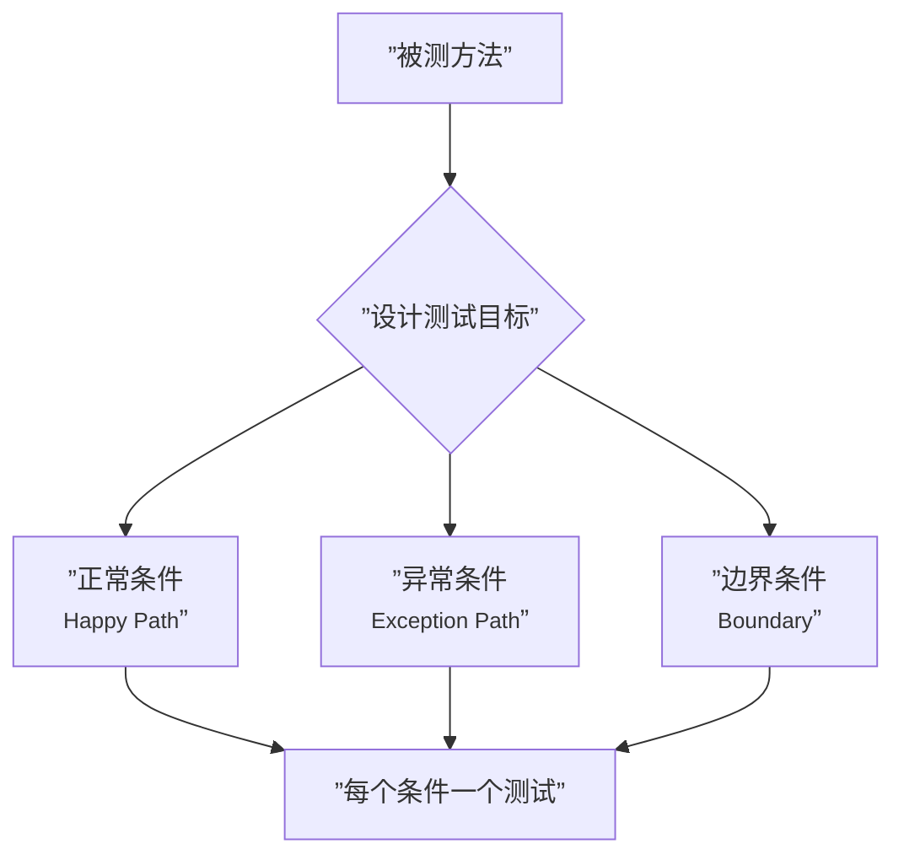

# 第15课：明确测试目标

## 问题：你在测什么？

当你看一个测试时，第一个问题应该是：**这个测试到底在测什么？**

如果看完测试名称和代码还要猜半天，说明测试目标不够明确。一个测试应当只有一个明确的关注点，而非什么都测一点。



---

## 好的测试名称说明测试目标

测试名称就是测试的"标题"，它应当让人一看就知道：

1. 什么条件（When）
2. 期望什么行为（Want）

### 命名模式：WWW

> [!tip] WWW 命名法
> **W**hat — **W**hen — **W**ant
> （测什么 — 什么条件下 — 期望什么结果）

我们将在 [[0036-www-naming|第36课]] 详细展开 WWW 方法论，这里先看几个例子：

| 不好的命名 | 好的命名 |
|-----------|---------|
| `test1()` | `should_add_express_fee_when_total_less_than_100()` |
| `testPrice()` | `should_return_same_price_when_total_greater_than_150()` |
| `testCalculate()` | `should_throw_exception_when_total_is_negative()` |

---

## 三种测试目标

每个被测方法通常需要三类测试目标：

### 1. 正常条件（Happy Path）

覆盖主要的业务流程，即输入有效值，期待正确输出。

```java
@Test
void should_add_full_express_fee_when_total_less_than_100() {
    PriceCalculator calculator = new PriceCalculator();
    int result = calculator.calculate(50);
    assertThat(result).isEqualTo(70);  // 50 + 20（快递费）
}
```

### 2. 异常条件（Exception Path）

覆盖错误输入或异常情况，期待合理的错误处理。

```java
@Test
void should_throw_exception_when_total_is_negative() {
    PriceCalculator calculator = new PriceCalculator();
    assertThrows(IllegalArgumentException.class, () -> {
        calculator.calculate(-1);
    });
}
```

### 3. 边界条件（Boundary）

覆盖临界值，如最小值、最大值、等于阈值等情况。这也是最容易出现 Bug 的地方。

```java
@Test
void should_not_add_express_fee_when_total_equals_100() {
    PriceCalculator calculator = new PriceCalculator();
    int result = calculator.calculate(100);
    // total == 100 时，不收快递费
    assertThat(result).isEqualTo(100);
}

@Test
void should_add_half_express_fee_when_total_equals_101() {
    PriceCalculator calculator = new PriceCalculator();
    int result = calculator.calculate(101);
    // total == 101 时，在 100~150 区间内，收一半快递费
    assertThat(result).isEqualTo(111);  // 101 + 10
}
```

---

## 测试目标分析表

以 `PriceCalculator.calculate()` 方法为例：

| 测试目标 | 条件 | 输入 | 预期输出 | 类型 |
|---------|------|------|---------|------|
| 小于 30，收全额快递费 + 手续费 | total < 30 | 20 | 20 + 20 + 5 = 45 | 正常+边界 |
| 30 ~ 100，收全额快递费 | 30 <= total < 100 | 50 | 50 + 20 = 70 | 正常 |
| 100 分界，不收快递费 | total == 100 | 100 | 100 | 边界 |
| 100 ~ 150，收一半快递费 | 100 < total < 150 | 110 | 110 + 10 = 120 | 正常 |
| 150 ~ 200，收保险费 | 150 < total < 200 | 170 | 170 + 5 = 175 | 正常 |
| 大于 200，不收额外费用 | total >= 200 | 200 | 200 | 边界 |
| 负数输入 | total < 0 | -1 | 抛出异常 | 异常 |

---

## 明确测试目标的好处

1. **故障定位快**：测试失败了，从名称就能知道是哪个条件出了问题
2. **测试即文档**：别人看测试就能理解业务规则
3. **避免过度测试**：每个测试只聚焦一个目标，不会在同一个测试里堆砌多个断言
4. **易于维护**：当业务规则变化时，能找到对应的测试进行修改

> [!danger] 常见反模式
> 一个测试方法里同时测多个条件，例如：
> ```java
> @Test
> void test_all() {
>     assertThat(calc.calculate(50)).isEqualTo(70);
>     assertThat(calc.calculate(110)).isEqualTo(120);
>     assertThat(calc.calculate(170)).isEqualTo(175);
> }
> ```
> 这样做一旦失败，你无法立刻知道是哪个条件出了问题。**一个测试只测一个目标。**

---

## 与其他语言的类比

> [!note] Python（pytest）等效写法
> ```python
> def test_should_add_full_express_fee_when_total_less_than_100():
>     assert PriceCalculator().calculate(50) == 70
>
> def test_should_raise_error_when_total_is_negative():
>     with pytest.raises(ValueError):
>         PriceCalculator().calculate(-1)
> ```

> [!note] JavaScript（Jest）等效写法
> ```javascript
> test('should add full express fee when total less than 100', () => {
>   expect(new PriceCalculator().calculate(50)).toBe(70);
> });
> ```

---

## 本课小结

- 每个测试必须有一个 **明确的测试目标**
- 好的测试名称 = 良好的测试文档
- 按 **正常条件、异常条件、边界条件** 三类设计测试目标
- **一个测试只测一个目标**，不要堆砌

---

## 练习

为你接下来的 `PriceCalculator` 扩展（比如引入快递服务依赖）编写测试目标清单，列出每种条件对应的输入和预期输出。

---

## 参考

- [[reference/glossary|测试术语表]]
- [[0036-www-naming|第36课：WWW 命名方法论]]
- [[0014-test-first-introduction|第14课：重构与测试先行]]