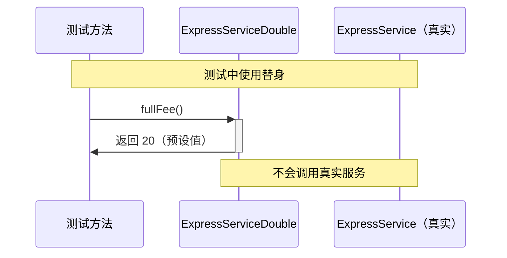

# 第16课：认识测试替身（Test Double）

## 为什么需要测试替身

随着业务逻辑变复杂，`PriceCalculator` 开始依赖外部服务：

```java
public class PriceCalculator {
    private ExpressService expressService;  // 快递服务依赖
    private InsureService insureService;    // 保险服务依赖

    public int calculate(int total) {
        if (total < 30) {
            return total + expressService.fullFee() + handFee();
        }
        if (total < 100) {
            return total + expressService.fullFee();
        }
        if (total > 100 && total < 150) {
            return total + expressService.halfFee();
        }
        if (total > 150 && total < 200) {
            return total + insureService.fee();
        }
        return total;
    }
}
```

现在 `calculate()` 不再是纯函数——它调用了 `expressService` 和 `insureService` 的方法。如果我们在测试时使用真实的 `ExpressService`，那就变成了[[0011-integration-test-scope|集成测试]]，而非[[0010-test-scope-unit|单元测试]]。

我们需要一种方式**隔离这些依赖**，让测试只关注 `calculate()` 本身的逻辑。

---

## 什么是测试替身

> 测试替身（Test Double）是指用一个"替身对象"替代被测对象所依赖的真实对象，以便隔离依赖进行测试。

这个术语来自于**魔术行业**——就像电影拍摄中用替身演员替代真人完成危险动作一样，我们在测试中也用"替身"替代真实的服务。

```mermaid
flowchart LR
    subgraph ”真实环境”
        A[”被测类”] --> B[”真实依赖<br/><small>ExpressService</small>”]
    end
    subgraph ”测试环境”
        C[”被测类”] --> D[”测试替身<br/><small>ExpressServiceDouble</small>”]
    end
```

---

## 通过继承创建测试替身

在 Java 中，创建测试替身最基础的方式就是**继承**。

### 步骤 1：确定需要隔离的依赖

`calculate()` 依赖 `expressService.fullFee()` 和 `expressService.halfFee()`。我们要隔离 `ExpressService`。

### 步骤 2：创建替身类

```java
/**
 * ExpressService 的测试替身。
 * 通过继承原始类，重写需要隔离的方法，返回预设值。
 */
public class ExpressServiceDouble extends ExpressService {

    private final int fullFee;
    private final int halfFee;

    public ExpressServiceDouble(int fullFee, int halfFee) {
        this.fullFee = fullFee;
        this.halfFee = halfFee;
    }

    @Override
    public int fullFee() {
        return this.fullFee;  // 返回预设值，而非真实查询
    }

    @Override
    public int halfFee() {
        return this.halfFee;  // 返回预设值，而非真实查询
    }
}
```

### 步骤 3：利用多态替换依赖

Java 的多态允许子类对象赋值给父类类型。在测试中，我们用替身替换真实对象：

```java
class PriceCalculatorUnitTest {

    @Test
    void should_add_full_express_fee_when_total_less_than_100() {
        // 创建替身，预设快递费为 20 元
        ExpressServiceDouble doubleService = new ExpressServiceDouble(20, 10);

        // 将替身注入被测对象（利用多态）
        PriceCalculator calculator = new PriceCalculator();
        calculator.setExpressService(doubleService);

        // 执行测试
        int result = calculator.calculate(85);

        // 验证结果
        assertThat(result).isEqualTo(105);  // 85 + 20
    }
}
```

---

## 替身的工作原理



`PriceCalculator.calculate()` 调用 `expressService.fullFee()` 时，实际调用的是 `ExpressServiceDouble.fullFee()`，它直接返回预设值 `20`，不涉及真实服务的网络调用或数据库查询。

> [!tip] 核心机制
> - **继承**：让替身类继承真实类
> - **重写**：覆盖需要隔离的方法
> - **多态**：用子类实例替换父类引用

---

## 测试替身 vs 桩 vs 模拟对象

在学习替身时，很容易混淆几个相关概念。这里先做一个初步区分，后续课程会深入：

| 概念 | 英文 | 作用 | 本课涉及的 |
|------|------|------|-----------|
| **测试替身** | Test Double | 替代真实对象的统称 | 是 |
| **桩** | Stub | 替身的行为——返回预设结果 | 下一课 |
| **测试间谍** | Spy | 记录调用信息的替身 | 第18课 |
| **模拟对象** | Mock | Stub + Spy 的结合体 | 第26课 |

---

## 与其他语言的类比

> [!note] Python 等效写法
> ```python
> class ExpressServiceDouble(ExpressService):
>     def __init__(self, full_fee, half_fee):
>         self._full_fee = full_fee
>         self._half_fee = half_fee
>
>     def full_fee(self):
>         return self._full_fee
>
>     def half_fee(self):
>         return self._half_fee
> ```

> [!note] Go 等效写法（接口方式）
> ```go
> type ExpressServiceDouble struct {
>     fullFee int
>     halfFee int
> }
>
> func (d *ExpressServiceDouble) FullFee() int { return d.fullFee }
> func (d *ExpressServiceDouble) HalfFee() int { return d.halfFee }
> ```

---

## 本课小结

- **测试替身** 是测试中用来替代真实依赖的对象
- 通过**继承 + 重写 + 多态**可以手动创建替身
- 替身帮助我们**隔离外部依赖**，使单元测试名副其实
- 替身和桩是不同的概念：替身是对象替代，桩是行为替代（[[0017-stub-method|下一课]]详解）

---

## 练习

如果 `PriceCalculator` 还依赖一个 `DiscountService`（折扣服务），请尝试为其创建一个测试替身类，并写出对应的单元测试。

---

## 参考

- [[reference/test-doubles|测试替身参考]]
- [[0017-stub-method|第17课：测试打桩（Stub Method）]]
- [[0018-test-spy|第18课：使用测试间谍（Spy）]]
- [[0010-test-scope-unit|第10课：单元测试的范围]]
- [[0011-integration-test-scope|第11课：集成测试的范围]]