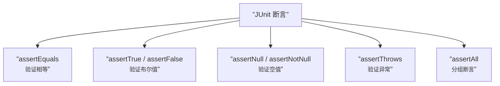

# 第19课：用断言替代 if-else

## 问题：新手写法

在之前的课程中，我们可能见过这样的测试写法：

```java
@Test
void test_calculate() {
    PriceCalculator calculator = new PriceCalculator();
    int result = calculator.calculate(85);

    // 使用 if-else 做验证
    if (result == 105) {
        System.out.println("测试通过");
    } else {
        System.out.println("测试失败，结果是：" + result);
    }
}
```

这种写法有什么问题？

1. **需要人工阅读控制台输出**——测试不会自动告诉你是否通过
2. **多个条件串联时排查困难**——看下一节
3. **无法集成到构建流程**——不会被 CI/CD 识别

---

## 多个 if-else 串联的噩梦

更糟糕的情况是，多个测试被串联成一个「大测试」：

```java
@Test
void test_all() {
    PriceCalculator calculator = new PriceCalculator();
    calculator.setExpressService(new ExpressServiceDouble(20, 10));

    boolean allPassed = true;

    // case 1
    int r1 = calculator.calculate(25);
    if (r1 != 50) {
        System.out.println("case 1 失败: " + r1);
        allPassed = false;
    }

    // case 2
    int r2 = calculator.calculate(85);
    if (r2 != 105) {
        System.out.println("case 2 失败: " + r2);
        allPassed = false;
    }

    // case 3
    int r3 = calculator.calculate(110);
    if (r3 != 120) {
        System.out.println("case 3 失败: " + r3);
        allPassed = false;
    }

    assertThat(allPassed).isTrue();
}
```

**问题所在**：如果某个 case 失败了，你只能知道"有一个失败了"，但需要去翻控制台日志才能定位具体是哪个。

---

## 断言：自我验证方案

**断言（Assertion）** 是测试框架内置的验证机制，它能自动判断条件并报告失败信息：

```java
import static org.junit.jupiter.api.Assertions.*;

@Test
void should_add_full_express_fee_when_total_less_than_100() {
    PriceCalculator calculator = new PriceCalculator();
    calculator.setExpressService(new ExpressServiceDouble(20, 10));

    int result = calculator.calculate(85);

    // 断言：如果失败，自动抛出异常并显示预期值和实际值
    assertEquals(105, result);
}
```

| 特性 | if-else 验证 | 断言验证 |
|------|-------------|---------|
| **自动报告失败** | 否（需手动打印） | 是 |
| **失败即停** | 否（继续执行） | 是 |
| **显示预期 vs 实际** | 否 | 是 |
| **集成到 CI/CD** | 否 | 是 |
| **定位问题位置** | 需翻日志 | 直接指向行号 |

---

## 常见断言方法



### assertEquals

验证两个值相等。如果失败，显示预期值和实际值：

```java
assertEquals(105, result);
// 失败时显示：
// Expected: 105
// Actual  : 100
```

### assertTrue / assertFalse

验证布尔条件：

```java
assertTrue(result > 0);
assertFalse(result < 0);
```

### assertThrows

验证是否抛出了预期的异常：

```java
assertThrows(IllegalArgumentException.class, () -> {
    calculator.calculate(-1);
});
```

### assertAll

将多个断言分组，即使前面的失败了，后面的也会继续执行：

```java
assertAll("price calculator",
    () -> assertEquals(50, calculator.calculate(25)),
    () -> assertEquals(105, calculator.calculate(85)),
    () -> assertEquals(120, calculator.calculate(110))
);
```

---

## 使用断言的重构示例

### 重构前（if-else 风格）

```java
@Test
void test_calculate() {
    PriceCalculator calculator = new PriceCalculator();
    calculator.setExpressService(new ExpressServiceDouble(20, 10));

    boolean passed = true;

    // case 1
    int r1 = calculator.calculate(25);
    if (r1 != 50) {
        System.out.println("case 1 预期 50，实际 " + r1);
        passed = false;
    }

    // case 2
    int r2 = calculator.calculate(85);
    if (r2 != 105) {
        System.out.println("case 2 预期 105，实际 " + r2);
        passed = false;
    }

    // 最终判断
    if (!passed) {
        fail("测试未全部通过，请查看控制台日志");
    }
}
```

### 重构后（断言风格）

```java
@Test
void should_calculate_price_correctly_for_all_ranges() {
    PriceCalculator calculator = new PriceCalculator();
    calculator.setExpressService(new ExpressServiceDouble(20, 10));

    assertAll("price calculator",
        () -> assertEquals(50, calculator.calculate(25),  "小于30"),
        () -> assertEquals(105, calculator.calculate(85), "30~100"),
        () -> assertEquals(120, calculator.calculate(110),"100~150"),
        () -> assertEquals(175, calculator.calculate(170),"150~200"),
        () -> assertEquals(200, calculator.calculate(200), "等于200")
    );
}
```

> [!tip] 断言的第三个参数
> `assertEquals(expected, actual, message)` 的第三个参数是**失败时的描述信息**，可以帮助定位是哪个断言失败了。

---

## 断言的自我验证特性

测试框架中的断言具备 **自我验证（Self-Verification）** 能力：

```
┌─────────────────────────────────┐
│        测试框架                  │
│                                 │
│  assertEquals(105, result);     │
│                                 │
│  如果 result != 105:            │
│    └─ 抛出 AssertionError       │
│       └─ 显示行号               │
│       └─ 显示预期 vs 实际       │
│       └─ 停止当前测试           │
│                                 │
│  如果 result == 105:            │
│    └─ 静默通过（无输出）        │
│                                 │
└─────────────────────────────────┘
```

这意味着：

1. **通过时静默**：没有噪音输出
2. **失败时有信息**：清晰报告问题所在
3. **可集成**：构建工具（Maven/Gradle）会自动收集测试结果
4. **可报告**：生成 HTML 测试报告（如 `build/reports/tests`）

---

## assertion 与 if-else 的思维差异

> 使用 if-else 做验证，本质上是在**手工模拟断言**——但做得不如断言好。

| 维度 | if-else | 断言 |
|------|---------|------|
| **设计哲学** | 程序逻辑控制 | 测试验证 |
| **失败处理** | 需要自己写 | 框架自动处理 |
| **信息丰富度** | 取决于你写了多少日志 | 内置：值、行号、堆栈 |
| **代码简洁度** | 冗长 | 一行搞定 |
| **阅读目的** | 理解逻辑 | 验证假设 |

---

## 与其他语言的类比

> [!note] Python（pytest）等效写法
> ```python
> def test_calculate():
>     calculator = PriceCalculator()
>     calculator.express_service = ExpressServiceDouble(20, 10)
>     result = calculator.calculate(85)
>
>     assert result == 105  # 断言失败会自动报告
>     # 或使用 pytest 的 assert 增强
> ```

> [!note] JavaScript（Jest）等效写法
> ```javascript
> test('should add full express fee', () => {
>   const calculator = new PriceCalculator();
>   calculator.setExpressService(new ExpressServiceDouble(20, 10));
>
>   expect(calculator.calculate(85)).toBe(105);
> });
> ```

> [!note] Go（testing 包）等效写法
> ```go
> func TestCalculate(t *testing.T) {
>     calculator := NewPriceCalculator()
>     calculator.SetExpressService(&ExpressServiceDouble{FullFee: 20, HalfFee: 10})
>
>     result := calculator.Calculate(85)
>     assert.Equal(t, 105, result)  // 第三方 assert 包
> }
> ```

---

## 本课小结

- **断言优于 if-else**：自我验证、自动报告、失败即停
- **常用断言**：assertEquals, assertTrue/False, assertThrows, assertAll
- **assertAll** 允许分组断言，且不会因一个失败就停止所有
- 断言是测试的**自我验证核心**
- 断言风格使测试代码更简洁、更具可读性

---

## 练习

将你之前手写的 if-else 风格的测试全部改写为断言风格。对比两种写法的代码量和可读性差异。

---

## 参考

- [[reference/glossary|测试术语表]]
- [[0028-assertions-in-depth|第28课：深入断言]]
- [[0037-aaa-pattern|第37课：AAA 方法论]]
- [[0014-test-first-introduction|第14课：重构与测试先行]]