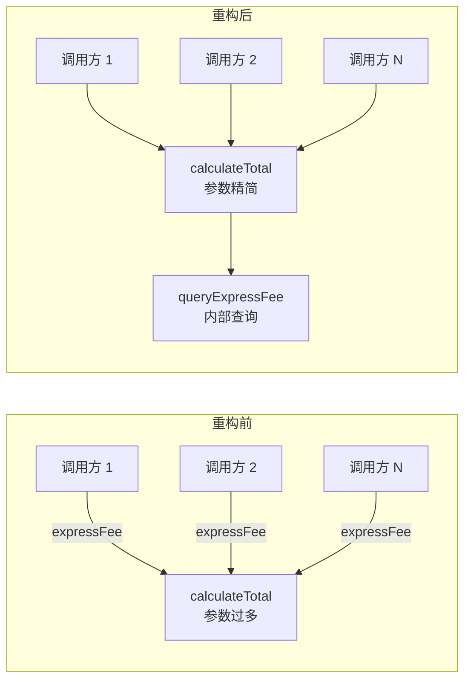

# 第21课：用查询替代函数参数

覆盖知识点：KP-060 ~ KP-061

## 问题：多余的参数

在编写方法时，有时会将**能从其他地方查询到的值**也作为参数传递进来。这不仅增加了调用方的负担，还容易导致重复计算和参数不一致。

```java
// ❌ 调用方每次都要传递 expressFee
public double calculateTotal(double amount, double discount, double expressFee) {
    return amount - discount + expressFee;
}

// 调用时
double total = calculateTotal(100.0, 10.0, getTodayExpressFee());
double total2 = calculateTotal(200.0, 20.0, getTodayExpressFee()); // 重复调用
```

> [!question] 为什么这是个问题？
> - **调用方负担**：调用方必须知道并传递 expressFee，即使它可以从别处获取
> - **重复计算**：每个调用点都要查询 expressFee
> - **参数不一致风险**：不同的调用方可能传入不同来源的运费，导致结果不一致
> - **测试冗余**：测试中需要为 expressFee 准备参数，即使该参数与测试核心逻辑无关

## 重构手法：用查询替代参数

核心思想：**如果方法内部可以通过查询获得某个参数的值，就不要让调用方传递它**。

### 步骤

1. 识别可以从方法内部获得的值
2. 在方法内部添加查询逻辑
3. 移除对应的参数
4. 更新所有调用方

### 重构前

```java
public class OrderService {
    private final ExpressConfigService expressConfigService;

    public OrderService(ExpressConfigService expressConfigService) {
        this.expressConfigService = expressConfigService;
    }

    // discount 和 expressFee 都来自参数
    public double calculateTotal(double amount, double discount, double expressFee) {
        return amount - discount + expressFee;
    }
}
```

### 重构后

```java
public class OrderService {
    private final ExpressConfigService expressConfigService;

    public OrderService(ExpressConfigService expressConfigService) {
        this.expressConfigService = expressConfigService;
    }

    // expressFee 不再由调用方传递，而是方法内部查询
    public double calculateTotal(double amount, double discount) {
        double expressFee = queryExpressFee();
        return amount - discount + expressFee;
    }

    private double queryExpressFee() {
        return expressConfigService.getTodayExpressFee();
    }
}
```

```java
// 调用方简化了
service.calculateTotal(100.0, 10.0);
service.calculateTotal(200.0, 20.0);
// 不再需要每次都传 expressFee 了！
```

> [!tip] 消除重复计算逻辑
> 重构前，每个调用方都需要查询 expressFee 并传递。重构后，查询逻辑集中在 `queryExpressFee()` 方法中，消除了重复。当运费计算规则变化时，只需修改这一个地方。

## 更复杂的例子

当一个方法有多个参数可以推导时，逐个应用此手法：

```java
// ❌ 重构前：三个参数都在传递
public Invoice createInvoice(String userId, String userLevel, double amount, double taxRate) {
    // ...
}

// ✅ 重构后：userLevel 和 taxRate 从内部查询
public Invoice createInvoice(String userId, double amount) {
    String userLevel = queryUserLevel(userId);
    double taxRate = queryTaxRate(userId);
    // ...
}

private String queryUserLevel(String userId) {
    return userRepository.findLevelByUserId(userId);
}

private double queryTaxRate(String userId) {
    return taxConfigService.getTaxRate(userId);
}
```

## 代码对比



| 维度 | 重构前 | 重构后 |
|------|--------|--------|
| 参数数量 | 3 个 | 2 个 |
| 调用方负担 | 每次传递 | 无需关心 |
| 查询逻辑 | 分散在各调用方 | 集中在一处 |
| 变更影响 | 所有调用方需修改 | 仅改内部方法 |

## 注意事项

> [!warning] 何时不应该使用此手法？
> - **方法需要纯函数行为**：如果方法需要保持引用透明（相同的输入永远产生相同的输出），那么通过查询获取参数会破坏这种纯粹性
> - **查询操作有副作用**：如果查询过程涉及网络调用或 IO，应保持参数传递，让调用方控制
> - **参数值不由被调用方决定**：如果参数值来自用户输入或外部系统，应保持为参数

## 与其他重构手法的关系

- **[[0020-remove-primitive-obsession|第20课：去除原始类型偏执]]** 用枚举封装业务概念 —— 二者结合使用，可以同时精简参数类型和参数数量
- **[[0019-assertion-over-if|第19课：用断言替代 if-else]]** 减少条件分支 —— 消除参数的同时也消除了对参数的检查分支

## 其他语言中的等效做法

> [!note] Python
> Python 中可以通过默认参数或内部调用来实现：
> ```python
> class OrderService:
>     def __init__(self, express_service):
>         self._express_service = express_service
>
>     def calculate_total(self, amount, discount):
>         express_fee = self._query_express_fee()
>         return amount - discount + express_fee
>
>     def _query_express_fee(self):
>         return self._express_service.get_today_fee()
> ```

> [!note] Go
> Go 通过结构体方法实现：
> ```go
> type OrderService struct {
>     expressService ExpressConfigService
> }
>
> func (s *OrderService) CalculateTotal(amount, discount float64) float64 {
>     expressFee := s.queryExpressFee()
>     return amount - discount + expressFee
> }
> ```

---

## 自测题

1. 用查询替代参数的主要好处是什么？
   A. 减少参数数量，简化调用方  
   B. 提高代码运行速度  
   C. 让方法变得更长  
   D. 增加方法的职责

2. 以下哪种情况不适合使用此手法？
   A. 参数值可以从数据库查询获得  
   B. 参数值来自配置文件  
   C. 参数值由用户直接输入  
   D. 参数值可以通过调用另一个服务方法获得

> **下一课预告**：[[0022-replace-loop-with-pipeline|第22课：用管道替代循环]] —— 用 Stream API 的函数式管道替代传统的 for 循环。