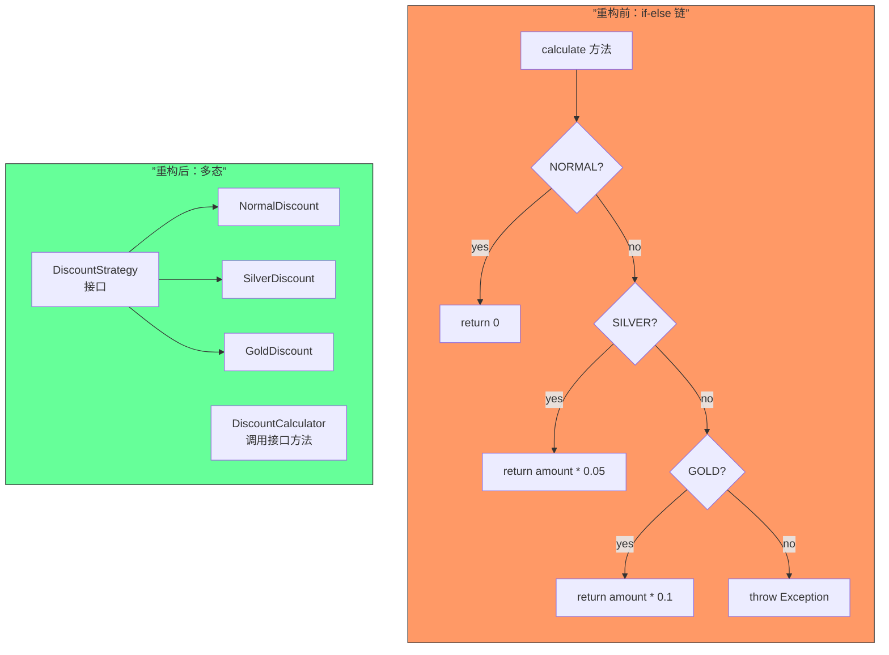
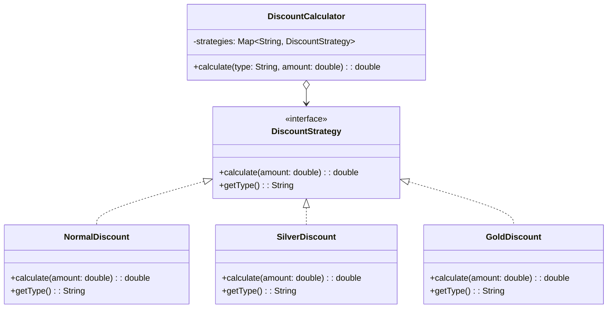

# 第24课：用多态取代条件

覆盖知识点：KP-066 ~ KP-067

## 问题：不断增长的条件分支

随着业务发展，if-else 或 switch-case 分支会不断增长。每增加一个新的条件分支，就需要修改已有的条件判断代码，违反了**开闭原则（Open-Closed Principle）**——对扩展开放，对修改关闭。

```java
// ❌ 随着会员类型增加，这个方法越来越臃肿
public double calculateDiscount(User user, double amount) {
    switch (user.getLevel()) {
        case "GOLD":
            return amount * 0.1;
        case "SILVER":
            return amount * 0.05;
        case "PLATINUM":
            return amount * 0.15;
        case "DIAMOND":
            return amount * 0.2;
        default:
            return 0;
    }
}
```

> [!question] 条件分支的问题
> - **违反开闭原则**：新增分支需要修改已有代码
> - **代码膨胀**：条件分支越多，方法越长
> - **职责混杂**：一个方法承担了所有类型的处理逻辑
> - **测试爆炸**：需要为每个分支编写测试，且分支间可能互相影响

## 重构：用多态替代条件

**多态（Polymorphism）** 是面向对象的核心特性之一：不同类型的对象对同一消息做出不同的响应。当条件分支的判断依据是对象的"类型"时，多态是天然的替代方案。

### 步骤

1. 识别条件分支的判断依据（如会员等级、支付方式、通知渠道）
2. 为每个分支创建一个类，实现共同的接口或抽象类
3. 将每个分支的逻辑移入对应的类中
4. 在调用方使用接口引用，由运行时决定具体行为

### 重构前：if-else 条件

```java
public class DiscountCalculator {
    public double calculate(String memberType, double amount) {
        if ("NORMAL".equals(memberType)) {
            return 0;
        } else if ("SILVER".equals(memberType)) {
            return amount * 0.05;
        } else if ("GOLD".equals(memberType)) {
            return amount * 0.1;
        } else {
            throw new IllegalArgumentException("Unknown type: " + memberType);
        }
    }
}
```

### 重构后：多态实现

```java
// 1. 策略接口
public interface DiscountStrategy {
    double calculate(double amount);
    String getType();
}

// 2. 具体策略实现
public class NormalDiscount implements DiscountStrategy {
    @Override
    public double calculate(double amount) {
        return 0;
    }

    @Override
    public String getType() {
        return "NORMAL";
    }
}

public class SilverDiscount implements DiscountStrategy {
    @Override
    public double calculate(double amount) {
        return amount * 0.05;
    }

    @Override
    public String getType() {
        return "SILVER";
    }
}

public class GoldDiscount implements DiscountStrategy {
    @Override
    public double calculate(double amount) {
        return amount * 0.1;
    }

    @Override
    public String getType() {
        return "GOLD";
    }
}

// 3. 策略上下文
public class DiscountCalculator {
    private final Map<String, DiscountStrategy> strategies;

    public DiscountCalculator(List<DiscountStrategy> strategyList) {
        this.strategies = strategyList.stream()
            .collect(Collectors.toMap(DiscountStrategy::getType, Function.identity()));
    }

    public double calculate(String memberType, double amount) {
        DiscountStrategy strategy = strategies.get(memberType);
        if (strategy == null) {
            throw new IllegalArgumentException("Unknown type: " + memberType);
        }
        return strategy.calculate(amount);
    }
}
```

> [!tip] 核心变化
> - **开闭原则**：新增会员等级只需新增一个 `DiscountStrategy` 实现类，无需修改已有代码
> - **单一职责**：每个策略类只负责一种折扣计算
> - **可测试性**：每个策略类都可以独立测试
> - **可组合性**：策略可以动态组合、替换

## 代码对比



| 维度 | if-else 条件 | 多态策略 |
|------|-------------|---------|
| 扩展方式 | 修改已有代码 | 新增实现类 |
| 开闭原则 | 违反 | 符合 |
| 单一职责 | 违反（一个方法处理所有） | 符合（每类一个类） |
| 可测试性 | 整体测试，分支耦合 | 独立测试每个策略 |
| 代码结构 | 线性增长 | 按类组织 |

## 策略模式与多态

此手法实际上就是**策略模式（Strategy Pattern）** 的直接应用。策略模式定义了一系列算法，将每个算法封装起来，并使它们可以互相替换。



> [!note] 与枚举方案的关系
> 在 [[0020-remove-primitive-obsession|第20课：去除原始类型偏执]] 中，我们用枚举封装了固定数量的会员等级。枚举适合**有限且稳定**的集合，而多态策略适合**开放且易变**的集合。当业务规则本身差异很大且需要独立变化时，多态是更合适的选择。

## 更多应用场景

### 场景 1：通知渠道

```java
// ❌ if-else
public void sendNotification(User user, String channel, String message) {
    if ("EMAIL".equals(channel)) {
        emailService.send(user.getEmail(), message);
    } else if ("SMS".equals(channel)) {
        smsService.send(user.getPhone(), message);
    } else if ("APP".equals(channel)) {
        pushService.send(user.getDeviceToken(), message);
    }
}

// ✅ 多态
public interface NotificationChannel {
    void send(User user, String message);
    String getType();
}
// EmailChannel, SmsChannel, AppChannel 分别实现...
```

### 场景 2：支付方式

```java
// ❌ switch-case
public PaymentResult processPayment(Order order, String method) {
    switch (method) {
        case "CREDIT_CARD": return processCreditCard(order);
        case "ALIPAY": return processAlipay(order);
        case "WECHAT": return processWechat(order);
        default: throw new UnsupportedPaymentException(method);
    }
}

// ✅ 多态
public interface PaymentMethod {
    PaymentResult pay(Order order);
    String getType();
}
// CreditCardPayment, AlipayPayment, WechatPayment 分别实现...
```

### 场景 3：测试中的应用

多态替代条件在测试中也有重要应用。当测试需要不同的测试替身行为时，多态让测试代码更简洁：

```java
// 测试中的多态策略
public interface PricingStrategy {
    double getPrice();
}

// 测试中使用
public class FixedPriceStub implements PricingStrategy {
    private final double price;

    public FixedPriceStub(double price) {
        this.price = price;
    }

    @Override
    public double getPrice() {
        return price;
    }
}
```

> [!tip] 测试替身与多态
> [[0017-stub-method|第17课：测试打桩]] 中提到的测试替身本质上也利用了多态 —— 测试替身实现了与真实对象相同的接口，在测试中替代真实对象。

## 注意事项

> [!warning] 何时不应使用多态替代条件？
> - **分支数量很少且稳定**（如只有 2-3 个分支且几乎不会变化）：if-else 更直接
> - **条件判断依据不是类型**：如果条件判断的是数值范围（`amount > 100`）、布尔组合等，多态不适合
> - **分支逻辑非常简单**：如只是一个返回值不同，用枚举或常量映射更简洁
> - **性能极端敏感**：虚函数调用有极小开销（通常可忽略不计）

> [!tip] 渐进式重构
> 不要一开始就设计复杂的策略层次。重构的正确节奏是：
> 1. 先用 if-else 写出可工作的代码
> 2. 当分支增长到第 3-4 个时，考虑抽取为多态
> 3. 每次只抽取一个分支，保持测试通过

## 与其他重构手法的关系

- **[[0020-remove-primitive-obsession|第20课：去除原始类型偏执]]**：用枚举封装有限且固定的业务概念，而多态处理开放且易变的业务行为
- **[[0023-express-intent-with-functions|第23课：用函数进行表达]]**：抽取条件为命名函数是第一步，当条件进一步复杂化时再用多态
- **[[0016-test-double|第16课：认识测试替身]]**：测试替身也是多态的应用 —— 接口定义了契约，真实对象和测试替身各自实现

## 其他语言中的等效做法

> [!note] Python
> Python 通过鸭子类型实现多态：
> ```python
> class DiscountStrategy:
>     def calculate(self, amount):
>         raise NotImplementedError
>
> class GoldDiscount(DiscountStrategy):
>     def calculate(self, amount):
>         return amount * 0.1
>
> class DiscountCalculator:
>     def __init__(self):
>         self._strategies = {
>             "GOLD": GoldDiscount(),
>             "SILVER": SilverDiscount(),
>         }
>     def calculate(self, member_type, amount):
>         strategy = self._strategies.get(member_type)
>         if not strategy:
>             raise ValueError(f"Unknown type: {member_type}")
>         return strategy.calculate(amount)
> ```

> [!note] TypeScript
> ```typescript
> interface DiscountStrategy {
>   calculate(amount: number): number;
> }
>
> class GoldDiscount implements DiscountStrategy {
>   calculate(amount: number): number {
>     return amount * 0.1;
>   }
> }
> ```

---

## 自测题

1. 用多态取代条件主要解决了什么问题？
   A. 代码运行速度慢  
   B. 条件分支违反开闭原则，新增分支需修改已有代码  
   C. 代码行数太少  
   D. 方法返回值不明确

2. 以下哪种情况最适合用多态替代条件？
   A. `if (score > 90) grade = 'A'`  
   B. 根据会员类型（固定 3 种）计算不同折扣  
   C. 根据支付方式（不断新增）处理支付逻辑  
   D. `if (x > 0) return x`

3. 此手法与哪种设计模式直接对应？
   A. 单例模式  
   B. 工厂模式  
   C. 策略模式  
   D. 观察者模式

> **这一章到此结束**。下一章将进入 [[0025-junit-runtime|第25课：认识 JUnit 运行时]]，开始 Spring Boot 单元测试实战。