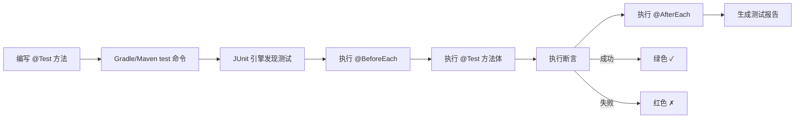

# 第25课：认识 JUnit 运行时

> **覆盖知识点：KP-100 ~ KP-104**

## 什么是 JUnit 运行时

JUnit 是 Java 生态中最主流的单元测试运行时（Runtime）。所谓"运行时"，是指 JUnit 提供了一个**轻量级的执行环境**，专门负责：

- 发现带有 `@Test` 注解的方法
- 为每个测试方法创建独立的实例
- 执行测试并收集结果
- 生成测试报告

```mermaid
flowchart LR
    subgraph ”JUnit Runtime”
        direction TB
        J[JUnit Engine]
        T1[Test Method 1]
        T2[Test Method 2]
        T3[Test Method N]
        J --> T1 & T2 & T3
    end

    subgraph ”加载的库”
        M[Mockito]
        JU[JUnit]
    end

    subgraph ”不加载的内容”
        DB[(Database)]
        WEB[Web Container]
        Ioc[IoC 容器]
    end

    JUnit Runtime --> M
    JUnit Runtime --> JU
    JUnit Runtime -.->|不加载| DB
    JUnit Runtime -.->|不加载| WEB
    JUnit Runtime -.->|不加载| Ioc
```

> [!tip] 轻量化是关键
> JUnit 运行时**只加载测试相关的库**（如 JUnit 本身、Mockito），不会启动 Web 容器、数据库连接或 IoC 容器。这使得单元测试的执行速度极快——通常只需几毫秒到几百毫秒。

## JUnit 运行时 vs Spring Boot 运行时

| 维度 | JUnit 运行时 | Spring Boot 运行时 |
|------|-------------|-------------------|
| 启动速度 | 毫秒级 | 秒级到分钟级 |
| 加载范围 | 仅测试库 | 整个应用上下文 |
| 依赖注入 | 无 | 完整的 DI 容器 |
| Web 容器 | 不启动 | 内嵌 Tomcat/Jetty |
| 数据库 | 无连接 | 完整数据源 |
| 适用场景 | 纯单元测试 | 集成测试 / E2E 测试 |

```mermaid
flowchart TD
    subgraph ”错误做法”
        A[每个测试都启动 Spring Boot] --> B[测试慢 → 不想跑 → 测试被废弃]
    end

    subgraph ”正确做法”
        C[JUnit 运行时跑纯单元测试] --> D[毫秒级反馈]
        D --> E[频繁运行 → 即时发现问题]
    end
```

> [!warning] 性能陷阱
> 不要在单元测试中随意引入 `@SpringBootTest`。启动整个 Spring 上下文会使测试变慢 100~1000 倍，导致开发者不愿意频繁运行测试，最终使测试失去"守护进程"的价值。

## @Test 注解的本质

`@Test` 注解是 JUnit 的核心入口标记。它告诉 JUnit 引擎："这个方法是一个测试方法"。

```java
import org.junit.jupiter.api.Test;
import static org.junit.jupiter.api.Assertions.*;

class CalculatorTest {

    @Test
    void shouldReturnSumWhenAddingTwoNumbers() {
        // Given
        Calculator calculator = new Calculator();

        // When
        int result = calculator.add(3, 5);

        // Then
        assertEquals(8, result);
    }
}
```

`@Test` 注解的关键特性：

- **无需继承或实现接口**——JUnit 5 中使用 `@Test` 是纯粹的自上而下标记
- **每个测试方法独立运行**——JUnit 会为每个 `@Test` 方法创建新的测试类实例，避免状态污染
- **方法名无约束**——你可以用任何方法名，推荐使用表达意图的名字（如 `shouldReturnSumWhenAddingTwoNumbers`）

## 运行测试

### Gradle

```bash
# 运行所有测试
./gradlew test

# 运行特定测试类
./gradlew test --tests "*CalculatorTest"

# 运行特定方法
./gradlew test --tests "*CalculatorTest.shouldReturnSumWhenAddingTwoNumbers"
```

### Maven

```bash
# 运行所有测试
mvn test

# 运行特定测试类
mvn test -Dtest=CalculatorTest

# 运行特定方法
mvn test -Dtest=CalculatorTest#shouldReturnSumWhenAddingTwoNumbers
```

## 测试报告

运行测试后，Gradle 和 Maven 都会生成 HTML 格式的测试报告：

| 构建工具 | 报告路径 |
|----------|----------|
| Gradle | `build/reports/tests/index.html` |
| Maven | `target/surefire-reports/*.xml` + `target/site/index.html` |

报告内容包含：

- **测试结果概览**：通过 / 失败 / 跳过的数量
- **失败详情**：断言失败的堆栈跟踪
- **执行时间**：每个测试的运行时长

> [!tip] 报告的价值
> 测试报告不仅用于 CI/CD 流水线，日常开发中也可以通过报告快速定位失败的测试，了解测试覆盖情况。养成"跑完测试看报告"的习惯。

## JUnit 的生命周期方法

除了 `@Test`，JUnit 5 还提供了一些生命周期钩子：

| 注解 | 执行时机 | 用途 |
|------|----------|------|
| `@BeforeEach` | 每个 `@Test` 方法之前 | 初始化测试数据、创建 Mock |
| `@AfterEach` | 每个 `@Test` 方法之后 | 清理资源、重置状态 |
| `@BeforeAll` | 所有测试之前（静态方法） | 建立数据库连接、加载全局配置 |
| `@AfterAll` | 所有测试之后（静态方法） | 关闭资源 |

```java
import org.junit.jupiter.api.*;

class UserServiceTest {

    private UserService userService;

    @BeforeEach
    void setUp() {
        userService = new UserService();
        System.out.println("每个测试前执行：初始化 UserService");
    }

    @AfterEach
    void tearDown() {
        System.out.println("每个测试后执行：清理资源");
    }

    @Test
    void shouldCreateUser() {
        // 测试创建用户
    }

    @Test
    void shouldDeleteUser() {
        // 测试删除用户
    }
}
```

> [!note] 方法可见性
> JUnit 5 中 `@Test`、`@BeforeEach`、`@AfterEach` 等方法可以是 `package-private`（默认可见性），不必是 `public`。这减少了无关的修饰符噪音。

## 总结

- JUnit 是单元测试的**运行时环境**，轻量、快速
- 与 Spring Boot 运行时不同，JUnit 只加载测试相关库，不启动应用容器
- `@Test` 注解标记测试方法，JUnit 引擎负责发现和执行
- Gradle/Maven 通过 `test` 命令运行测试并生成 HTML 报告
- 利用 `@BeforeEach` / `@AfterEach` 等生命周期钩子管理测试前后逻辑



---

> "JUnit 运行时是单元测试的基石——理解它，才能真正理解测试的执行过程。" — Chuck 老师

[[0026-mockito-basics|下一课：Mock 与单元测试的方法论]] | [[reference/glossary|测试术语表]] | [[0028-assertions-in-depth|深入断言]]