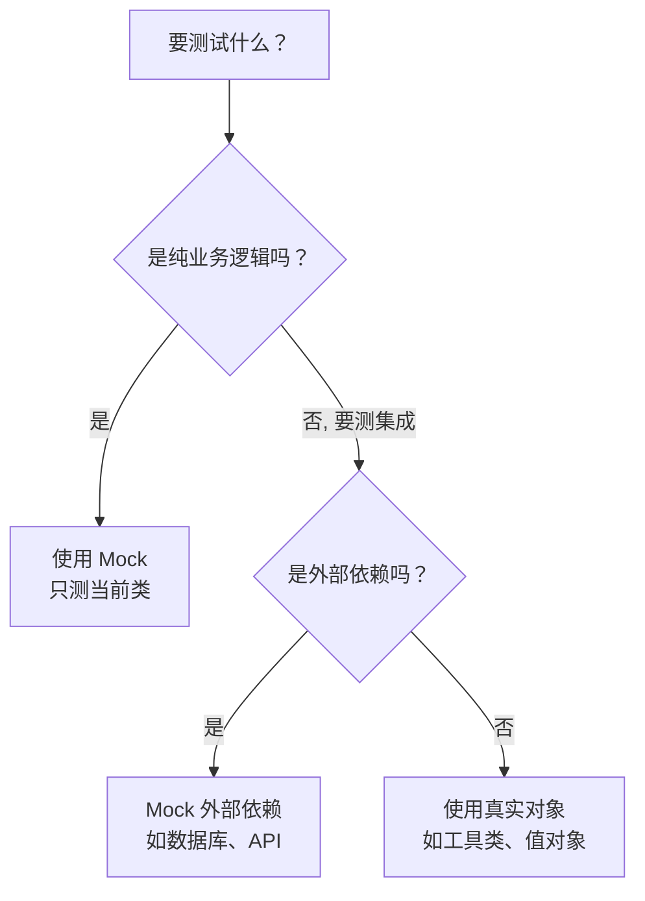

# 第26课：Mock 与单元测试的方法论

> **覆盖知识点：KP-105 ~ KP-106**

## 什么是 Mock

Mock（模拟对象）是测试替身（Test Double）的一种。它允许我们在测试中**替换掉真实的依赖对象**，从而让测试只关注被测单元本身的行为，而不是依赖的实现细节。

```mermaid
flowchart TD
    subgraph ”真实环境”
        A[被测类] --> B[真实依赖]
        B --> C[数据库]
        B --> D[外部 API]
        B --> E[文件系统]
    end

    subgraph ”测试环境”
        F[被测类] --> G[Mock 对象]
        G -.->|打桩返回| H[预设结果]
    end

    A -.->|耦合紧| C & D & E
    F -.->|解耦| G
```

### Mockito 核心注解

```java
import org.mockito.Mock;
import org.mockito.InjectMocks;
import org.junit.jupiter.api.Test;
import org.junit.jupiter.api.extension.ExtendWith;
import org.mockito.junit.jupiter.MockitoExtension;

import static org.mockito.Mockito.*;
import static org.junit.jupiter.api.Assertions.*;

@ExtendWith(MockitoExtension.class)
class SignInServiceTest {

    @Mock
    private UserRepository userRepository;       // 创建 Mock 对象

    @InjectMocks
    private SignInService signInService;         // 自动注入 Mock 到被测对象

    // ...
}
```

| 注解 | 作用 | 说明 |
|------|------|------|
| `@Mock` | 创建 Mock 对象 | 替代真实依赖，控制其行为 |
| `@InjectMocks` | 注入 Mock 到目标 | 自动将 `@Mock` 对象注入到被测类的字段/构造器 |
| `@ExtendWith(MockitoExtension.class)` | 启用 Mockito 扩展 | 让 JUnit 5 理解 Mockito 注解 |

> [!tip] 构造器注入优先
> `@InjectMocks` 会按**构造器注入 > Setter 注入 > 字段注入**的顺序尝试注入。建议被测类使用构造器注入，这样不仅便于测试，也是良好的设计实践。

## Mock 与 Stub 的关系

Mock 和 Stub 是两个紧密相关但不同层次的概念：

```mermaid
flowchart LR
    subgraph ”测试替身”
        D[Test Double]
        D --> A[Mock：模拟对象的替代品]
        D --> B[Stub：预设返回值的方法]
        D --> C[Spy：部分模拟真实对象]
    end

    A -->|”用 when().thenReturn() 控制”| B
    B -->|”打桩 = 为 Mock 的某个方法设定行为”| B
```

| 概念 | 定义 | Mockito 中的实现 |
|------|------|-----------------|
| **Mock** | 一个对象的**替代品**，不是真实实例 | `@Mock UserRepository repo` |
| **Stub（打桩）** | 为 Mock 的某个方法**预设返回值** | `when(repo.findById(1)).thenReturn(user)` |

> [!important] 核心区别
> Mock 是**谁**（对象替身），Stub 是**做什么**（行为预设）。在 Mockito 中，当我们说"打桩"，就是在为 Mock 对象配置 `when().thenReturn()`。

```java
@ExtendWith(MockitoExtension.class)
class SignInServiceTest {

    @Mock
    private UserRepository userRepository;

    @InjectMocks
    private SignInService signInService;

    @Test
    void shouldReturnUserWhenCredentialsAreValid() {
        // Given - 准备测试数据和 Mock 行为（打桩）
        String email = "user@example.com";
        String password = "correct-password";
        User mockUser = new User(email, password);
        when(userRepository.findByEmail(email)).thenReturn(mockUser);

        // When - 执行被测方法
        User result = signInService.signIn(email, password);

        // Then - 验证结果
        assertNotNull(result);
        assertEquals(email, result.getEmail());

        // 验证交互：findByEmail 被调用了一次
        verify(userRepository, times(1)).findByEmail(email);
    }

    @Test
    void shouldReturnNullWhenPasswordIsIncorrect() {
        // Given
        String email = "user@example.com";
        String wrongPassword = "wrong-password";
        User storedUser = new User(email, "correct-password");
        when(userRepository.findByEmail(email)).thenReturn(storedUser);

        // When
        User result = signInService.signIn(email, wrongPassword);

        // Then
        assertNull(result);
    }

    @Test
    void shouldReturnNullWhenUserNotFound() {
        // Given
        when(userRepository.findByEmail("unknown@example.com")).thenReturn(null);

        // When
        User result = signInService.signIn("unknown@example.com", "any");

        // Then
        assertNull(result);
    }
}
```

## SignInService 的实现参考

```java
public class SignInService {

    private final UserRepository userRepository;

    public SignInService(UserRepository userRepository) {
        this.userRepository = userRepository;
    }

    public User signIn(String email, String password) {
        User user = userRepository.findByEmail(email);
        if (user != null && user.getPassword().equals(password)) {
            return user;
        }
        return null;
    }
}
```

## Spring Boot 中 Mock 还是真实调用？

这是一个需要权衡的问题，核心原则是**根据测试类型和目标来决定**：



### 选择指南

| 场景 | 推荐方式 | 原因 |
|------|----------|------|
| **Service 层业务逻辑** | Mock Repository | 只验证业务规则，不关心数据存取 |
| **Controller 层** | Mock Service | 只验证 HTTP 请求/响应映射 |
| **工具类 / Utils** | 真实对象 | 没有外部依赖，用真的即可 |
| **Repository 层** | @DataJpaTest（真实） | 验证 SQL 映射的正确性 |
| **第三方 API 调用** | Mock | 避免网络调用，保证测试稳定性 |
| **纯 POJO / VO** | 真实对象 | 没有逻辑需要 Mock |

> [!warning] 过度 Mock 的坏味道
> 如果测试中 Mock 对象太多（超过 3~5 个），很可能说明被测类的**职责过多**，需要重构。这也是测试倒逼设计改进的典型例子。

## Mockito 常用方法速查

| 方法 | 用途 |
|------|------|
| `when(x.method()).thenReturn(value)` | 打桩：返回固定值 |
| `when(x.method()).thenThrow(exception)` | 打桩：抛出异常 |
| `when(x.method()).thenAnswer(invocation)` | 打桩：动态计算返回值 |
| `verify(x).method()` | 验证方法被调用 |
| `verify(x, times(n)).method()` | 验证调用次数 |
| `verify(x, never()).method()` | 验证从未调用 |
| `any()`, `anyString()`, `anyInt()` | 参数匹配器 |
| `@Captor ArgumentCaptor` | 捕获方法参数 |

```java
// 动态返回值示例
when(userRepository.findByEmail(anyString())).thenAnswer(invocation -> {
    String email = invocation.getArgument(0);
    return new User(email, "password");
});
```

> [!note] Mockito 的思想可迁移
> 虽然示例使用 Java + Mockito，但 Mock 的思想在所有编程语言中都适用：
> - Python：`unittest.mock`
> - JavaScript：`jest.mock()` / `sinon.stub()`
> - Go：`gomock`
> - C#：`Moq`
>
> 核心都是：**创建替身 → 预设行为 → 验证交互**。

## 总结

- **Mock** 是对象的替代品，**Stub** 是方法的行为预设
- `@Mock` 创建 Mock 对象，`@InjectMocks` 注入到被测对象
- `when().thenReturn()` 是 Mockito 打桩的标准形式
- `verify()` 验证 Mock 对象的交互是否按预期发生
- Mock 的选择原则：根据测试目标决定，避免过度 Mock

---

> "Mock 不是目的，解耦才是。用 Mock 让测试聚焦在被测单元本身。" — Chuck 老师

[[0025-junit-runtime|上一课：认识 JUnit 运行时]] | [[0027-spring-boot-test-structure|下一课：Spring Boot 中的测试结构]] | [[reference/glossary|测试术语表]]