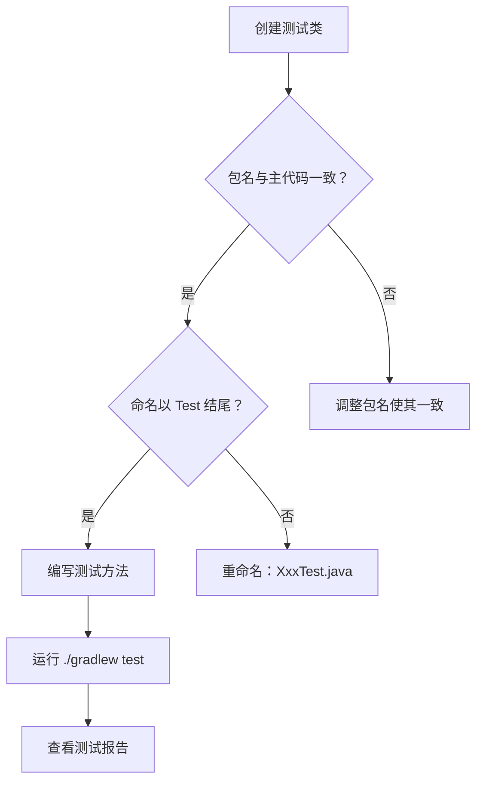

# 第27课：Spring Boot 中的测试结构

> **覆盖知识点：KP-107**

## Maven/Gradle 的测试目录约定

Spring Boot 项目（无论是 Maven 还是 Gradle）遵循约定优于配置（Convention over Configuration）的原则，测试代码有固定的目录结构。

```mermaid
flowchart LR
    subgraph ”项目根目录”
        SRC[src/]
    end

    subgraph ”main — 生产代码”
        MJ[mai<br>n/]
        MJJ[java/]
        MJR[resources/]
    end

    subgraph ”test — 测试代码”
        TJ[test/]
        TJJ[java/]
        TJR[test/resources/]
    end

    SRC --> MJ & TJ
    MJ --> MJJ & MJR
    TJ --> TJJ & TJR
```

| 目录 | 用途 | 说明 |
|------|------|------|
| `src/main/java/` | 生产代码 | 实际业务逻辑 |
| `src/main/resources/` | 生产资源 | 配置文件、静态资源 |
| `src/test/java/` | 测试代码 | 所有单元测试和集成测试 |
| `src/test/resources/` | 测试资源 | 测试专用的配置文件 |

> [!note] 同一套包名
> `src/test/java` 下的包名结构与 `src/main/java` 完全一致。例如：
> - 生产代码：`src/main/java/com/example/service/UserService.java`
> - 测试代码：`src/test/java/com/example/service/UserServiceTest.java`

## 完整的目录结构示例

```
my-spring-boot-app/
├── build.gradle                          # Gradle 构建文件 (或 pom.xml)
├── src/
│   ├── main/
│   │   ├── java/
│   │   │   └── com/
│   │   │       └── example/
│   │   │           ├── MyApplication.java
│   │   │           ├── controller/
│   │   │           │   ├── UserController.java
│   │   │           │   └── AuthController.java
│   │   │           ├── service/
│   │   │           │   ├── UserService.java
│   │   │           │   └── SignInService.java
│   │   │           ├── repository/
│   │   │           │   └── UserRepository.java
│   │   │           ├── model/
│   │   │           │   ├── User.java
│   │   │           │   └── Role.java
│   │   │           └── config/
│   │   │               └── SecurityConfig.java
│   │   └── resources/
│   │       ├── application.yml
│   │       └── application-dev.yml
│   └── test/
│       ├── java/
│       │   └── com/
│       │       └── example/
│       │           ├── MyApplicationTests.java        # 应用启动测试
│       │           ├── controller/
│       │           │   ├── UserControllerTest.java
│       │           │   └── AuthControllerTest.java
│       │           ├── service/
│       │           │   ├── UserServiceTest.java
│       │           │   └── SignInServiceTest.java
│       │           ├── repository/
│       │           │   └── UserRepositoryTest.java
│       │           └── model/
│       │               └── UserTest.java
│       └── resources/
│           └── application-test.yml                   # 测试专用配置
```

> [!tip] 测试资源文件
> `src/test/resources/application-test.yml` 可以覆盖生产环境的配置。例如使用 H2 内存数据库代替真实数据库，或者使用不同的日志级别。测试类通过 `@ActiveProfiles("test")` 激活。

## 测试类的命名规范

### 标准命名方式

| 命名风格 | 示例 | 说明 |
|----------|------|------|
| `{Class}Test` | `UserServiceTest` | 最常用，明确对应关系 |
| `{Class}Tests` | `UserServiceTests` | 少数项目用复数 |
| `{Class}IT` | `UserRepositoryIT` | 用于集成测试（Integration Test） |
| `{Class}Spec` | `UserServiceSpec` | 受 BDD 风格影响 |

> [!important] Maven Surefire 插件的约定
> Maven Surefire 插件默认会查找以下模式的测试类：
> - `**/Test*.java`
> - `**/*Test.java`
> - `**/*Tests.java`
> - `**/*TestCase.java`
>
> 而集成测试通常使用 `**/IT*.java` 或 `**/*IT.java`，由 Failsafe 插件处理。

### 方法命名规范

测试方法的命名应该清晰表达测试意图：

```java
// WWW 命名法：What - When - Want（期望）
@Test
void shouldReturnUserWhenCredentialsAreValid() { }

@Test
void shouldThrowExceptionWhenUserNotFound() { }

// 另一种常见风格
@Test
void testSignInWithValidCredentials() { }

// 中文命名（团队约定）
@Test
void 当用户名密码正确时_应返回用户信息() { }
```

> [!tip] Java 方法名可以包含中文
> JUnit 5 完全支持中文方法名。如果你的团队中英文水平参差不齐，使用中文方法名反而能提高测试的可读性。

## 测试类的结构

```java
package com.example.service;

import org.junit.jupiter.api.Test;
import org.springframework.beans.factory.annotation.Autowired;
import org.springframework.boot.test.context.SpringBootTest;
// ...

/**
 * UserService 的单元测试
 *
 * 遵循 AAA 模式：Arrange - Action - Assert
 */
@SpringBootTest
class UserServiceTest {

    @Autowired
    private UserService userService;

    @Test
    void shouldCreateUserWhenDataIsValid() {
        // Arrange - 准备测试数据
        CreateUserRequest request = new CreateUserRequest("test@example.com", "password123");

        // Action - 执行被测方法
        User result = userService.createUser(request);

        // Assert - 验证结果
        assertNotNull(result);
        assertEquals("test@example.com", result.getEmail());
    }

    @Test
    void shouldThrowExceptionWhenEmailAlreadyExists() {
        // Arrange
        CreateUserRequest request = new CreateUserRequest("existing@example.com", "password123");

        // Action & Assert
        assertThrows(DuplicateEmailException.class,
            () -> userService.createUser(request));
    }
}
```

## Gradle vs Maven 测试配置

| 构建工具 | 测试任务 | 配置位置 |
|----------|----------|----------|
| **Gradle** | `./gradlew test` | `build.gradle` 的 `dependencies` 块 |
| **Maven** | `mvn test` | `pom.xml` 的 `<dependencies>` 块 |

### Gradle 依赖配置示例

```groovy
dependencies {
    // 生产依赖
    implementation 'org.springframework.boot:spring-boot-starter-web'
    implementation 'org.springframework.boot:spring-boot-starter-data-jpa'

    // 测试依赖
    testImplementation 'org.springframework.boot:spring-boot-starter-test'
    testImplementation 'org.junit.jupiter:junit-jupiter:5.10.0'
    testImplementation 'org.mockito:mockito-core:5.7.0'
    testImplementation 'org.mockito:mockito-junit-jupiter:5.7.0'
}

test {
    useJUnitPlatform()    // 使用 JUnit 5 平台
    testLogging {
        events "passed", "skipped", "failed"
    }
}
```

> [!note] spring-boot-starter-test
> Spring Boot 的 `spring-boot-starter-test` 已经包含了 JUnit、Mockito、AssertJ、Hamcrest 等常用测试库，无需逐一引入。

## 常见问题

### Q1: 测试类和生产类在同一个包下但不是同一个目录？

**是**。`src/main/java` 和 `src/test/java` 是两个不同的源码根目录，但它们的包名是对应的。测试类可以访问生产类的 `package-private` 成员（因为包名相同！）。

### Q2: 测试资源如何覆盖生产配置？

在 `src/test/resources/` 下创建同名配置文件即可。测试运行时，测试资源会覆盖生产资源。

### Q3: 如何跳过某些测试？

```java
import org.junit.jupiter.api.Disabled;

@Disabled("暂未实现，后续补充")
@Test
void shouldSendEmailNotification() {
    // 这个测试会被跳过，不执行
}
```

## 总结

- Spring Boot 项目使用 `src/test/java` 和 `src/test/resources` 存放测试代码和资源
- 测试代码的包名与生产代码完全一致，确保访问权限一致
- 测试类推荐命名为 `{被测类名}Test.java`
- 测试方法遵循 WWW 命名法或团队约定的风格
- Gradle 和 Maven 都有清晰的测试目录和命令约定



---

> "结构决定行为——良好的测试结构是可持续测试的基石。" — Chuck 老师

[[0026-mockito-basics|上一课：Mock 与单元测试的方法论]] | [[0028-assertions-in-depth|下一课：深入断言]] | [[reference/glossary|测试术语表]]