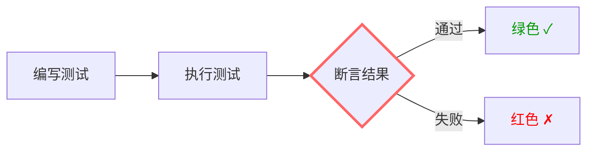
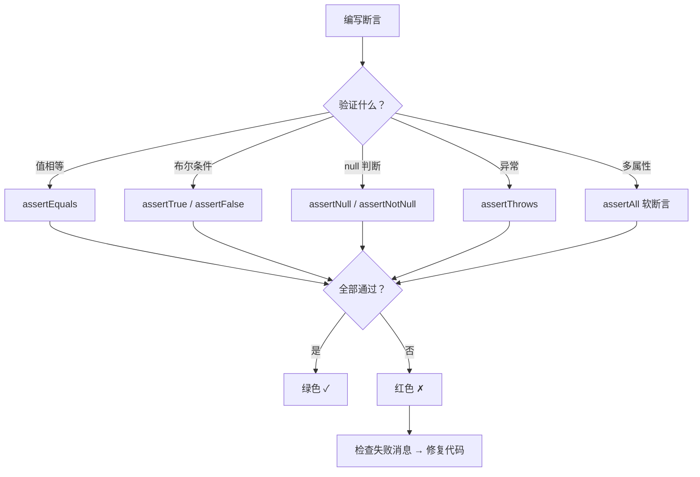

# 第28课：深入断言

> **覆盖知识点：KP-108 ~ KP-109**

## 断言是测试的"自我验证"核心



测试之所以被称为"自我验证"，是因为测试代码中包含**断言**——它决定了测试程序自身能够判断被测代码是否正确，而无需人工检视输出。

> [!important] 没有断言的测试不是测试
> 如果一个测试方法执行结束后没有断言，它只是在"运行代码"而不是在"验证行为"。这种测试即使全部通过，也无法保证任何功能的正确性。

```java
// 没有断言的测试——毫无意义
@Test
void uselessTest() {
    Calculator calc = new Calculator();
    calc.add(3, 5);  // 只是运行了代码，没有验证任何东西
}

// 有断言的测试——自我验证
@Test
void meaningfulTest() {
    Calculator calc = new Calculator();
    int result = calc.add(3, 5);
    assertEquals(8, result);  // 程序自己判断结果是否正确
}
```

## JUnit 5 断言 API 详解

| 断言方法 | 用途 | 示例 |
|----------|------|------|
| `assertEquals(expected, actual)` | 验证两个值相等 | `assertEquals(4, 2 + 2)` |
| `assertNotEquals(unexpected, actual)` | 验证两个值不相等 | `assertNotEquals(5, 2 + 2)` |
| `assertTrue(condition)` | 验证条件为真 | `assertTrue(result > 0)` |
| `assertFalse(condition)` | 验证条件为假 | `assertFalse(list.isEmpty())` |
| `assertNull(object)` | 验证对象为 null | `assertNull(user)` |
| `assertNotNull(object)` | 验证对象不为 null | `assertNotNull(result)` |
| `assertThrows(type, executable)` | 验证抛出异常 | `assertThrows(IllegalArgumentException.class, () -> {...})` |
| `assertDoesNotThrow(executable)` | 验证不抛出异常 | `assertDoesNotThrow(() -> service.save(data))` |
| `assertAll(executables...)` | 软断言：全部执行 | `assertAll("user", () -> assertEquals(...), () -> assertTrue(...))` |
| `assertArrayEquals(expected, actual)` | 验证数组相等 | `assertArrayEquals(new int[]{1,2}, new int[]{1,2})` |
| `assertIterableEquals(expected, actual)` | 验证 Iterable 相等 | `assertIterableEquals(list1, list2)` |
| `fail(message)` | 直接失败 | `fail("不应到达此处")` |

### assertEquals 详解

`assertEquals` 是最常用的断言方法，注意**参数顺序**：

```java
assertEquals(expected, actual);           // 基本形式
assertEquals(expected, actual, message);  // 带失败消息
assertEquals(expected, actual, supplier); // 延迟计算消息

// ✅ 推荐用法
assertEquals(8, calculator.add(3, 5));
// ❌ 不推荐（顺序颠倒了，IDE 报告可能令人困惑）
assertEquals(calculator.add(3, 5), 8);
```

> [!warning] 参数顺序：expected 在前，actual 在后
> 虽然 JUnit 5 中两个参数的顺序不影响执行结果，但会影响失败时的报告消息：
> ```
> Expected :8
> Actual   :10
> ```
> 如果放反，你会看到 `Expected:10, Actual:8`，容易混淆。

### assertTrue / assertFalse 详解

```java
@Test
void shouldValidateUserStatus() {
    User activeUser = new User("active", UserStatus.ACTIVE);
    User inactiveUser = new User("inactive", UserStatus.INACTIVE);

    assertTrue(activeUser.isActive());
    assertFalse(inactiveUser.isActive());

    // 带错误消息
    assertTrue(activeUser.isActive(), "活跃用户的 isActive() 应返回 true");
}
```

### assertThrows 详解

`assertThrows` 是 JUnit 5 中验证异常的标准方式：

```java
@Test
void shouldThrowExceptionWhenEmailIsInvalid() {
    // 验证抛出了指定的异常类型
    IllegalArgumentException exception = assertThrows(
        IllegalArgumentException.class,
        () -> userService.createUser(new CreateUserRequest("invalid-email"))
    );

    // 还可以进一步验证异常消息
    assertEquals("邮箱格式不正确", exception.getMessage());
}

@Test
void shouldNotThrowExceptionWhenEmailIsValid() {
    // 验证不会抛出异常
    assertDoesNotThrow(
        () -> userService.createUser(new CreateUserRequest("valid@example.com"))
    );
}
```

## 软断言（assertAll） vs 硬断言

| 特性 | 硬断言 | 软断言（assertAll） |
|------|--------|-------------------|
| 遇到失败时 | 立即停止，后续断言不执行 | 继续执行所有断言 |
| 报告结果 | 只报告第一个失败 | 报告所有失败 |
| 适用场景 | 后续步骤依赖前面的结果 | 验证对象的多个独立属性 |

### 硬断言的行为

```java
@Test
void hardAssertionExample() {
    User user = userService.findById(1L);

    assertEquals("Alice", user.getName());        // 如果这里失败
    assertEquals("alice@example.com", user.getEmail());  // 这行不会执行
    assertTrue(user.isActive());                  // 这行也不会执行
}
```

**结果**：只报告 `name` 不匹配，修复后才能看到 `email` 和 `isActive` 的问题。

### 软断言的行为

```java
@Test
void softAssertionWithAssertAll() {
    User user = userService.findById(1L);

    assertAll("User 属性验证",
        () -> assertEquals("Alice", user.getName()),
        () -> assertEquals("alice@example.com", user.getEmail()),
        () -> assertTrue(user.isActive())
    );
}
```

**结果**：一次性报告所有失败：

```
User 属性验证 (3 failures)
  expected: "Alice" but was: "Bob"
  expected: "alice@example.com" but was: "bob@example.com"
  expected: true but was: false
```

> [!tip] 何时使用 assertAll
> 使用 `assertAll` 的场景：
> 1. **验证 DTO/VO 的多个字段**——字段之间无依赖关系
> 2. **验证查询结果**——一次性了解所有问题
> 3. **调试阶段**——快速了解被测对象的所有问题
>
> 不适合 `assertAll` 的场景：
> 1. **前置条件必须成立才能继续**——应先硬断言前置条件
> 2. **验证集合大小后再验证元素**——`assertThat(list).hasSize(3)` 应在遍历前断言

### 组合使用

```java
@Test
void combinedAssertions() {
    // 硬断言：前置条件
    List<User> users = userService.findAll();
    assertNotNull(users);
    assertEquals(3, users.size());

    // 软断言：验证每个用户的属性
    User firstUser = users.get(0);
    assertAll("第一个用户",
        () -> assertEquals("Alice", firstUser.getName()),
        () -> assertTrue(firstUser.isActive())
    );
}
```

## AssertJ：更流畅的断言

除了 JUnit 内置断言，AssertJ 也是一个流行的断言库，提供更流畅的链式调用：

```java
import static org.assertj.core.api.Assertions.*;

@Test
void assertJExample() {
    User user = userService.findById(1L);

    // AssertJ 链式断言
    assertThat(user)
        .isNotNull()
        .hasFieldOrPropertyWithValue("name", "Alice")
        .extracting(User::getEmail)
        .endsWith("@example.com");

    // 集合断言
    assertThat(userService.findAll())
        .hasSize(3)
        .extracting(User::getName)
        .contains("Alice", "Bob", "Charlie");

    // 异常断言
    assertThatThrownBy(() -> userService.findById(-1))
        .isInstanceOf(IllegalArgumentException.class)
        .hasMessageContaining("无效的用户 ID");
}
```

> [!note] AssertJ vs JUnit 断言
> - JUnit 断言更简洁，适合简单验证
> - AssertJ 更强大，适合复杂的链式验证
> - 两者可以混用，不存在兼容问题
> - `spring-boot-starter-test` 已经包含了 AssertJ

## 断言的常见反模式

### 反模式 1：断言无意义的值

```java
// ❌ 没有覆盖真实的边界情况
assertEquals(2, 1 + 1);

// ✅ 测试真实的业务逻辑
assertEquals(100.0, cart.calculateTotal(priceBeforeTax, taxRate));
```

### 反模式 2：只测快乐路径

```java
// ❌ 只测正常情况
@Test
void shouldReturnUser() {
    assertNotNull(userService.findById(1));
}

// ✅ 覆盖异常情况
@Test
void shouldReturnNullWhenUserNotFound() {
    assertNull(userService.findById(99999));
}

@Test
void shouldThrowExceptionWhenIdIsNegative() {
    assertThrows(IllegalArgumentException.class,
        () -> userService.findById(-1));
}
```

### 反模式 3：断言太宽松

```java
// ❌ 太宽松，几乎总能通过
assertNotNull(result);

// ✅ 精确验证关键属性
assertEquals("Alice", result.getName());
assertEquals(100.0, result.getTotal());
```

## 断言的最佳实践

```java
@Test
void shouldCreateOrderSuccessfully() {
    // Given
    CreateOrderRequest request = new CreateOrderRequest(
        "user-1",
        List.of(new OrderItem("product-1", 2)),
        "SHIPPING_ADDRESS_123"
    );

    // When
    Order order = orderService.createOrder(request);

    // Then
    assertAll("验证创建的订单",
        () -> assertNotNull(order, "订单不应为 null"),
        () -> assertNotNull(order.getId(), "订单 ID 不应为 null"),
        () -> assertEquals("user-1", order.getUserId()),
        () -> assertEquals(1, order.getItems().size()),
        () -> assertEquals(OrderStatus.PENDING, order.getStatus()),
        () -> assertNotNull(order.getCreatedAt(), "创建时间不应为 null")
    );
}
```

## 总结

- **断言是测试的自我验证机制**——没有断言的测试不是测试
- JUnit 5 提供了 `assertEquals`、`assertTrue`、`assertThrows`、`assertAll` 等丰富断言 API
- **硬断言**立即停止，**软断言**（`assertAll`）收集所有失败后统一报告
- `assertEquals` 的参数顺序：expected 在前，actual 在后
- 好的断言应该是**明确的、精确的、覆盖边界条件的**



---

> "断言是测试的灵魂——没有断言，测试只是披着测试外衣的代码运行。" — Chuck 老师

[[0027-spring-boot-test-structure|上一课：Spring Boot 中的测试结构]] | [[0029-test-slicing-overview|下一课：单元测试的切片]] | [[reference/glossary|测试术语表]] | [[0030-service-test|第30课：Service 层测试]]