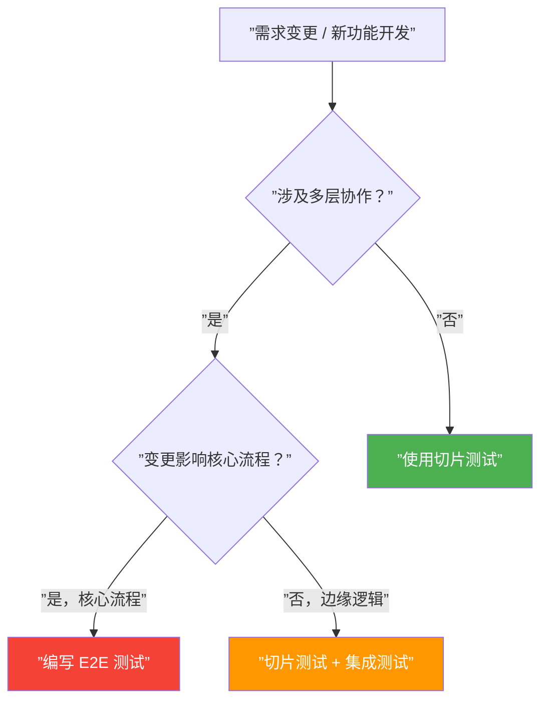

# 第35课：E2E 端到端接口测试

> E2E 测试是最接近生产环境的测试方式，它启动完整的 Spring Boot 应用，**不 Mock 任何层**，真实调用 Controller → Service → Repository → Database。这是验证系统整体行为的最可靠手段，也是成本最高的测试方式。

---

## @SpringBootTest 启动完整环境

**KP-139 | @SpringBootTest 的完整环境启动**

`@SpringBootTest` 会启动完整的 ApplicationContext，加载所有自动配置、所有 Bean、完整 Web 容器。

```java
@SpringBootTest(webEnvironment = WebEnvironment.RANDOM_PORT)
class SignInE2ETest {

    @Autowired
    private WebTestClient webTestClient;

    // ...
}
```

| `webEnvironment` | 说明 |
|-----------------|------|
| `RANDOM_PORT` | 启动嵌入式容器，随机端口（推荐） |
| `DEFINED_PORT` | 使用配置的端口 |
| `MOCK` | 不启动容器，使用 MockMvc（不是真正的 E2E） |
| `NONE` | 不启动 Web 环境 |

---

## E2E 测试不能使用 Mock

**KP-140 | E2E 测试不能使用 Mock**

E2E 测试的核心理念是：**不 Mock 任何层**。所有调用都必须真实地经过整个调用链。

```mermaid
graph LR
    subgraph ”E2E 测试调用链”
        A[”WebTestClient<br/>（真实 HTTP 请求）”] --> B[”Controller<br/>（真实）”]
        B --> C[”Service<br/>（真实）”]
        C --> D[”Repository<br/>（真实）”]
        D --> E[”Database<br/>（真实 或 TestContainers）”]
    end

    subgraph ”切片测试调用链（对比）”
        F[”MockMvc<br/>（模拟 HTTP）”] --> G[”Controller<br/>（真实）”]
        G --> H[”Service<br/>（@MockBean）”]
    end

    style E fill:#4CAF50,color:#fff
    style D fill:#4CAF50,color:#fff
    style C fill:#4CAF50,color:#fff
    style B fill:#4CAF50,color:#fff
    style A fill:#4CAF50,color:#fff
    style H fill:#FF9800,color:#fff
    style G fill:#FF9800,color:#fff
    style F fill:#FF9800,color:#fff
```

> [!warning] E2E 测试中绝对不能使用 `@MockBean` 或 `@Mock`。一旦 Mock 了某个层，就不再是"端到端"测试了。

---

## WebTestClient 使用

**KP-142 | WebTestClient 的使用**

`WebTestClient` 是 Spring WebFlux 提供的 HTTP 客户端，在测试中它既可以配合 MockMvc 使用，也可以发送真实的 HTTP 请求。在 `@SpringBootTest(webEnvironment = RANDOM_PORT)` 模式下，它发送的是真实 HTTP 请求。

```java
@SpringBootTest(webEnvironment = WebEnvironment.RANDOM_PORT)
class SignInE2ETest {

    @Autowired
    private WebTestClient webTestClient;

    @Test
    void should_signin_successfully() {
        // given
        var request = new SignInRequest("admin", "password");

        // when & then
        webTestClient.post()
            .uri("/api/signin")
            .contentType(MediaType.APPLICATION_JSON)
            .bodyValue(request)
            .exchange()
            .expectStatus().isOk()
            .expectBody()
            .jsonPath("$.token").isNotEmpty()
            .jsonPath("$.username").isEqualTo("admin");
    }

    @Test
    void should_return_401_when_invalid_password() {
        // given
        var request = new SignInRequest("admin", "wrong-password");

        // when & then
        webTestClient.post()
            .uri("/api/signin")
            .contentType(MediaType.APPLICATION_JSON)
            .bodyValue(request)
            .exchange()
            .expectStatus().isUnauthorized();
    }
}
```

### WebTestClient 与 MockMvc 的对比

| 特性 | MockMvc | WebTestClient |
|------|---------|---------------|
| HTTP 请求 | 模拟（DispatcherServlet 层面） | 真实（经过网络栈） |
| Web 容器 | 不启动 | 启动 |
| 适用场景 | `@WebMvcTest` | `@SpringBootTest` |
| 响应验证 | `andExpect()` | `expectStatus()` / `expectBody()` |

---

## @AfterEach 清理测试数据

**KP-141 | E2E 测试的数据清理（@AfterEach）**

E2E 测试操作的是真实数据库，每次测试后必须清理数据，否则会污染后续测试。

```java
@SpringBootTest(webEnvironment = WebEnvironment.RANDOM_PORT)
class SignInE2ETest {

    @Autowired
    private WebTestClient webTestClient;

    @Autowired
    private UserRepository userRepository;

    @AfterEach
    void cleanUp() {
        userRepository.deleteAll();
    }

    @Test
    void should_signin_successfully() {
        // ...
    }

    @Test
    void should_signin_and_signout() {
        // ...
    }
}
```

> [!tip] 虽然切片测试（如 `@DataJpaTest`）会自动回滚事务，但 E2E 测试中 `@SpringBootTest` **不会自动回滚**。你必须手动清理数据。

---

## 组合接口调用

**KP-143 | E2E 测试组合接口调用（如先登录再登出）**

E2E 测试的一个重要价值是验证**多个接口组合**的场景：

```java
@SpringBootTest(webEnvironment = WebEnvironment.RANDOM_PORT)
class SignFlowE2ETest {

    @Autowired
    private WebTestClient webTestClient;

    @Autowired
    private UserRepository userRepository;

    @AfterEach
    void cleanUp() {
        userRepository.deleteAll();
    }

    @Test
    void should_signin_then_signout() {
        // Step 1: 先注册用户（如果需要）
        var signUpRequest = new SignUpRequest("alice", "password123");
        webTestClient.post()
            .uri("/api/signup")
            .contentType(MediaType.APPLICATION_JSON)
            .bodyValue(signUpRequest)
            .exchange()
            .expectStatus().isCreated();

        // Step 2: 登录获取 token
        var signInRequest = new SignInRequest("alice", "password123");
        var result = webTestClient.post()
            .uri("/api/signin")
            .contentType(MediaType.APPLICATION_JSON)
            .bodyValue(signInRequest)
            .exchange()
            .expectStatus().isOk()
            .expectBody()
            .jsonPath("$.token").isNotEmpty()
            .returnResult();

        var token = result.getResponseBody();  // 使用 token

        // Step 3: 登出（携带 token）
        webTestClient.post()
            .uri("/api/signout")
            .header(HttpHeaders.AUTHORIZATION, "Bearer " + token)
            .exchange()
            .expectStatus().isOk();
    }
}
```

---

## @SpringBootTest 的三种成本

**KP-144 | @SpringBootTest 的三种成本：启动慢、配置高、数据清理**

| 成本维度 | 说明 | 影响 |
|---------|------|------|
| **启动慢** | 需要加载所有 Bean、所有自动配置、启动嵌入式 Web 容器 | 一次启动 10~30 秒 |
| **配置高** | 需要完整的数据库连接、消息队列、外部服务等 | 环境配置复杂 |
| **数据清理** | 每个测试修改的真实数据必须手动清理 | 代码复杂度增加 |

### 什么时候应该用 E2E 测试？



**推荐使用 E2E 的场景**：

- **核心业务流程**（如用户注册 → 登录 → 下单 → 支付）
- **跨层协作逻辑**（Controller 调用 Service 调用 Repository 的完整链路）
- **数据一致性验证**（事务、回滚、约束等数据库行为）
- **部署前的冒烟测试**（验证所有组件正确集成）

**不推荐使用 E2E 的场景**：

- 单层逻辑变更（Service 新增一个方法 → 用 [[0030-service-test|Service 测试]]）
- JSON 格式变更（用 [[0033-json-test|@JsonTest]]）
- 数据库查询优化（用 [[0034-repository-test|@DataJpaTest]]）

---

## 测试策略总结

| 测试类型 | 注解 | 启动速度 | Mock？ | 适用场景 |
|---------|------|---------|--------|---------|
| 纯单元测试 | 无（JUnit + Mockito） | 毫秒级 | Mock 所有依赖 | Service 业务逻辑 |
| MVC 切片 | `@WebMvcTest` | 秒级 | Mock Service 层 | Controller 端点映射 |
| Security 切片 | `@WebMvcTest` + `@WithMockUser` | 秒级 | Mock 认证 + Service | Web 功能测试 |
| JSON 切片 | `@JsonTest` | 秒级 | 不 Mock | 序列化/反序列化 |
| Repository 切片 | `@DataJpaTest` | 秒级 | 不 Mock | 数据库访问 |
| E2E | `@SpringBootTest` | 十秒级 | 不 Mock | 核心业务流程 |

---

## 前情回顾

- [[0034-repository-test|第34课：Repository 数据仓储层测试]] —— Repository 层切片
- [[0033-json-test|第33课：JSON 序列化测试]] —— JSON 层切片
- [[0032-security-test|第32课：Security 身份认证测试]] —— Security 层切片
- [[0031-mvctest|第31课：MVC 控制器层测试]] —— Controller 层切片
- [[0030-service-test|第30课：Service 层测试]] —— Service 层切片
- [[0029-test-slicing-overview|第29课：测试切片概念]] —— 切片测试总览
- [[reference/spring-boot-test-slices|Spring Boot 测试切片参考]] —— 所有切片注解速查

## 下一步

- [[0036-www-naming|第36课：WWW 命名方法论]] —— 进入测试哲学章节