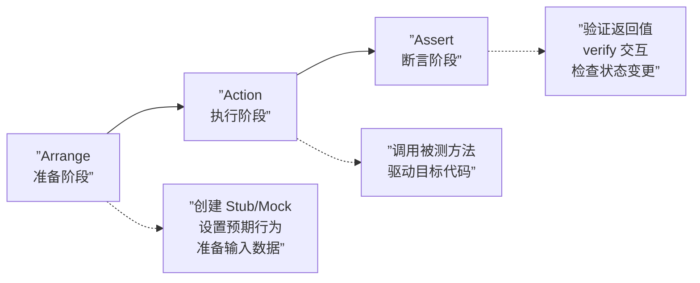

# 第37课：AAA 方法论

## 概述

AAA（Arrange-Action-Assert）是单元测试中最基础也最重要的**结构化模式**。它将测试方法体划分为三个清晰的阶段，让测试代码像故事一样有头有尾。

---

## AAA 三阶段



### 每个阶段的职责

| 阶段 | 英文 | 职责 | 典型操作 |
|------|------|------|----------|
| **准备** | Arrange | 搭建测试场景 | `new` 对象、`mock()` 创建替身、`when(...).thenReturn(...)` 设置预期 |
| **执行** | Action | 驱动被测代码 | 调用目标方法、传入参数、捕获返回值 |
| **断言** | Assert | 验证行为正确性 | `assertEquals`、`verify()`、`assertThrows`、`andExpect` |

---

## 完整示例

```java
@Test
void calculatePrice_givenTotal90_willAddExpressFee20() {
    // ========== Arrange — 准备阶段 ==========
    var calculator = new PriceCalculator();
    var expressServiceMock = mock(ExpressService.class);
    when(expressServiceMock.getTodayPrice()).thenReturn(20);
    calculator.setExpressService(expressServiceMock);

    // ========== Action — 执行阶段 ==========
    var result = calculator.calculatePrice(70, 20);  // total = 90

    // ========== Assert — 断言阶段 ==========
    assertEquals(110, result);          // 验证返回值
    verify(expressServiceMock).getTodayPrice();  // 验证交互
}
```

---

## 反例：缺少 AAA 结构

```java
// ❌ 坏味道：三个阶段混在一起
@Test
void test() {
    var calc = new PriceCalculator();     // Arrange
    var result = calc.calculatePrice(70, 20);  // Action
    when(expressService.getTodayPrice()).thenReturn(20); // Arrange 放在了 Action 后面！
    assertEquals(result, 110);            // Assert 参数顺序错误(expected, actual)
}
```

> **问题：** 准备代码放在执行之后，测试逻辑混乱，不易阅读。

---

## AAA 的灵活运用：异常场景

```java
@Test
void signIn_givenInvalidPassword_willThrowException() {
    // Arrange
    var authService = new AuthService();
    var userRepoMock = mock(UserRepository.class);
    when(userRepoMock.findByUsername("test")).thenReturn(null);
    authService.setUserRepository(userRepoMock);

    // Action & Assert（结合）
    assertThrows(UsernameNotFoundException.class, () -> {
        authService.signIn("test", "wrongPassword");
    });
}
```

> `assertThrows` 同时完成了 Action（触发 Lambda）和 Assert（验证异常类型），这种合并是允许的常见写法。

---

## 多阶段 Arrange（复杂场景）

当测试场景较复杂时，Arrange 可进一步细分：

```java
@Test
void createOrder_givenValidItems_willCalculateTotalAndSave() {
    // Arrange — 基础对象
    var orderService = new OrderService();
    var priceCalculator = mock(PriceCalculator.class);
    var orderRepo = mock(OrderRepository.class);
    orderService.setPriceCalculator(priceCalculator);
    orderService.setOrderRepository(orderRepo);

    // Arrange — Mocks 行为
    when(priceCalculator.calculate(anyList())).thenReturn(new BigDecimal("299.00"));
    when(orderRepo.save(any(Order.class))).thenAnswer(invocation -> invocation.getArgument(0));

    // Action
    var order = orderService.createOrder(List.of(
        new OrderItem("SKU001", 2, new BigDecimal("99.50"))
    ));

    // Assert
    assertEquals(new BigDecimal("299.00"), order.getTotalAmount());
    verify(orderRepo).save(order);
}
```

---

## AAA 与 WWW 的对应关系

| [[0036-www-naming|WWW 命名]] | AAA 阶段 | 说明 |
|------------------------------|----------|------|
| What（方法名）| Arrange | 明确被测对象，指导 Arrange 准备什么 |
| When（场景）  | Action   | 场景条件决定 Action 的输入参数 |
| Want（期望）  | Assert   | 期望结果即 Assert 的验证目标 |

> 详见 [[reference/aaa-www-pattern|AAA 与 WWW 模式参考]]

---

## 其他语言的实践迁移

> [!NOTE] 语言迁移：AAA 模式与语言无关
> **Python：**
> ```python
> def test_sign_in_with_valid_info_should_return_user_id():
>     # Arrange
>     auth_service = AuthService()
>     user_repo = MagicMock()
>     user_repo.find_by_username.return_value = User(id=1)
>     auth_service.user_repository = user_repo
>     
>     # Action
>     result = auth_service.sign_in("test", "pass")
>     
>     # Assert
>     assert result == 1
> ```
>
> **JavaScript / TypeScript：**
> ```typescript
> it('signIn_givenValidInfo_willReturnUserId', () => {
>   // Arrange
>   const authService = new AuthService();
>   const userRepo = jest.mocked<UserRepository>(mock(UserRepository));
>   userRepo.findByUsername.mockReturnValue({ id: 1 });
>   authService.userRepository = userRepo;
>   
>   // Action
>   const result = authService.signIn('test', 'pass');
>   
>   // Assert
>   expect(result).toBe(1);
> });
> ```

---

## 静态收束

AAA 模式是测试代码的"三段论"——准备、执行、断言。它不是强制性的语法规则，而是一种**思维框架**：先想清楚需要什么准备，再执行被测代码，最后验证结果。坚持下去，你的测试代码将像优秀的业务代码一样整洁、可读、可维护。