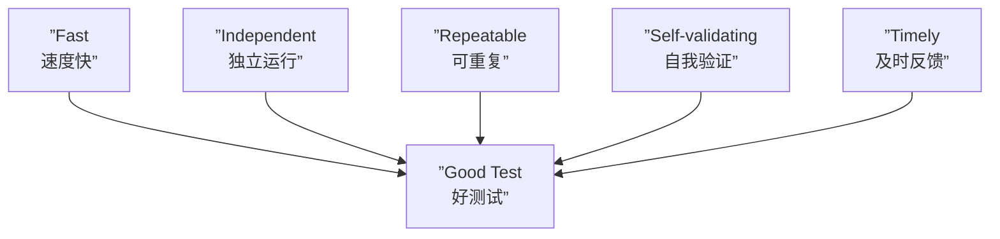

# 第38课：什么是最好的测试

## 概述

什么样的测试才算"好测试"？这是一个值得反复追问的问题。本课从五个核心维度定义好测试的标准，并探讨测试与设计、文档之间的深层关系。

---

## 好测试的五个标准

### F.I.R.S.T 原则



### 逐条详解

| 标准 | 含义 | 反例 | 最佳实践 |
|------|------|------|----------|
| **Fast 速度快** | 毫秒级完成 | 测试中连接真实数据库 | 使用 H2 内存库或 Mock |
| **Independent 独立** | 可任意顺序单独运行 | 测试 A 依赖测试 B 创建的数据 | 每个测试独立准备数据 |
| **Repeatable 可重复** | 任意环境结果一致 | 依赖系统时间/随机数 | Mock 时间、固定种子 |
| **Self-validating 自我验证** | 自动判断通过/失败 | 需要人工查看日志 | 使用断言而非打印 |
| **Timely 及时反馈** | 失败时迅速定位 | 运行 30 分钟后才报错 | 切分细粒度测试 |

---

## 明确的失败信息

好测试的断言失败时，应该立即告诉你是**期望值 vs 实际值**的哪里不匹配。

```java
// ❌ 不好的断言：失败信息不明确
assertTrue(result == 110);

// ✅ 好的断言：显示 expected vs actual
assertEquals(110, result);
// 失败时输出：expected: 110 but was: 105

// ✅ 更好的断言：自定义描述信息
assertEquals("计算折扣后总价应正确", 110, result);
```

---

## 好的测试 = 好的设计

这是一个非常重要的观点：**如果代码很难测试，说明设计有问题。**

```mermaid
graph LR
    subgraph ”难以测试的代码”
        A1[”全局变量引用”]
        A2[”硬编码依赖”]
        A3[”构造函数中 new 对象”]
        A4[”静态方法调用”]
    end

    subgraph ”容易测试的代码”
        B1[”依赖注入”]
        B2[”接口抽象”]
        B3[”纯函数”]
        B4[”单一职责”]
    end

    A1 -->|”重构”| B1
    A2 -->|”重构”| B2
    A3 -->|”重构”| B3
    A4 -->|”重构”| B4
```

```java
// ❌ 难以测试：构造函数中 new 对象
public class OrderService {
    private PriceCalculator calculator = new PriceCalculator(); // 无法替换

    public BigDecimal calculateTotal(List<Item> items) {
        return calculator.calculate(items);
    }
}

// ✅ 容易测试：构造函数注入
public class OrderService {
    private final PriceCalculator calculator;

    public OrderService(PriceCalculator calculator) { // 可注入 Mock
        this.calculator = calculator;
    }

    public BigDecimal calculateTotal(List<Item> items) {
        return calculator.calculate(items);
    }
}
```

---

## 测试即设计文档

测试用例是**可执行的文档**——它比任何 Word 文档都更真实、更及时、更精确。

```java
/**
 * 业务文档这样说：
 * "如果用户登录信息合法，返回用户 ID。"
 */
@Test
void signIn_givenValidSignInfo_willReturnUserId() {
    // 测试代码精确地描述了这一行为
    var result = authService.signIn("validUser", "correctPass");
    assertNotNull(result);
}
```

> 测试名称本身就是文档的标题，测试体就是文档的正文。当需求变化时，测试代码的变化比文档更快。

---

## 测试覆盖率 vs 测试质量

### 误解："100% 覆盖率 = 好测试"

```java
// 覆盖率 100%，但毫无意义
@Test
void testGetterAndSetter() {
    var user = new User();
    user.setName("test");
    assertEquals("test", user.getName());
    // 这种测试只覆盖了 Getter/Setter，没有覆盖任何业务逻辑
}
```

### 正确的理解

| 指标 | 意义 | 局限性 |
|------|------|--------|
| 行覆盖率 | 代码被执行到 | 不代表逻辑被验证 |
| 分支覆盖率 | 每个分支被执行 | 不代表边界条件被覆盖 |
| 变异测试 | 改动代码后测试是否失败 | 更真实但成本高 |

> **高质量测试 > 高覆盖率**。优先覆盖核心业务逻辑和关键边界条件，而非追逐覆盖率数字。

---

## 好测试的检查清单

在进行 Code Review 或自检时，可以用以下清单衡量测试质量：

- [ ] 测试名称是否清晰表达了 What/When/Want？
- [ ] 测试是否遵循 AAA 结构？
- [ ] 测试是否独立于其他测试运行？
- [ ] 测试是否不依赖外部环境（数据库/网络）？
- [ ] 断言失败时是否能快速定位问题？
- [ ] 测试是否覆盖了核心业务逻辑而非 Getter/Setter？
- [ ] 测试代码中是否有重复逻辑可以抽取？

---

> [!NOTE] 语言迁移
> **好测试的标准是跨语言的。** Python 的 `pytest` 测试同样遵守 F.I.R.S.T 原则，JavaScript 的 `Jest` 测试也同样追求独立性和自我验证。无论使用什么语言和框架，这五个标准都是普适的。

---

## 静态收束

最好的测试并不一定是最复杂的测试。它速度快、独立运行、自我验证、有明确的失败信息，并且**驱动着更优雅的代码设计**。把测试当作"第一等的设计文档"来对待，你的代码质量和可维护性将提升一个台阶。