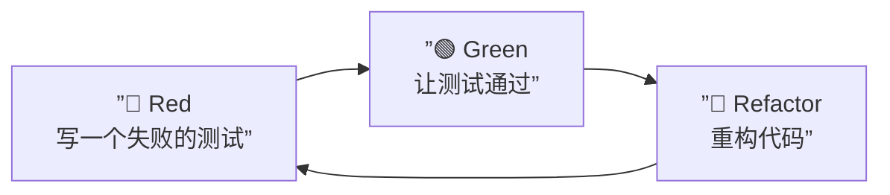
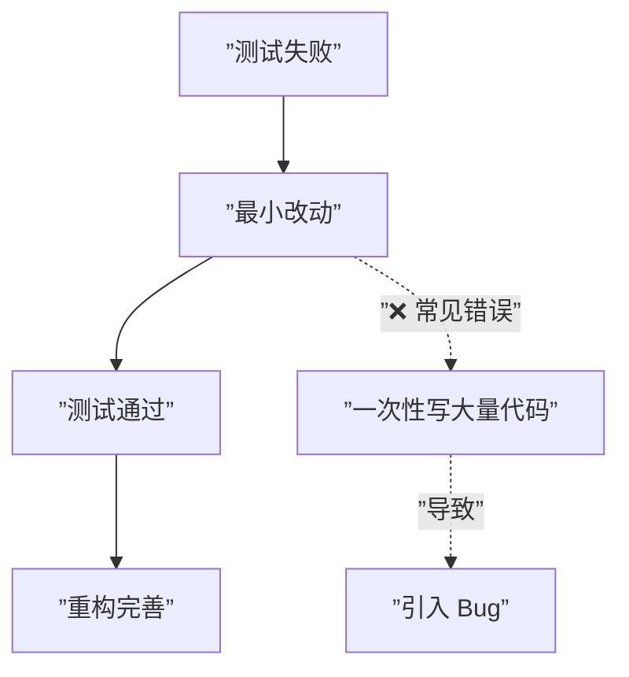

# 第40课：测试先行（Test-Driven Development）

## 概述

测试驱动开发（TDD）是一种**先写测试、再写实现**的开发方法论。它彻底颠覆了传统的"先编码后测试"的习惯，让测试成为驱动代码设计的核心力量。

---

## TDD 的核心流程：红 → 绿 → 重构



### 三步详解

| 阶段 | 状态 | 做什么 | 标准 |
|------|------|--------|------|
| **Red** | 测试失败（红）| 先写一个测试，它必然失败 | 测试因"没有实现代码"而失败 |
| **Green** | 测试通过（绿）| 用最简代码让测试通过 | 不要追求完美，只求通过 |
| **Refactor** | 重构（蓝）| 优化代码结构 | 保持测试通过的前提下改进设计 |

---

## TDD 实战演示

### 需求：实现一个判断是否成年的方法

### Step 1: Red — 先写测试

```java
public class AgeUtilTest {

    @Test
    void isAdult_givenAge18_willReturnTrue() {
        // 此时 AgeUtil 类还不存在，编译就失败
        var result = AgeUtil.isAdult(18);
        assertTrue(result);
    }
}
```

> 测试编译不通过——这是预期的 Red 状态。

### Step 2: Green — 最小实现让测试通过

```java
// 最简实现：硬编码都可以
public class AgeUtil {
    public static boolean isAdult(int age) {
        return true; // 先让测试通过
    }
}
```

### Step 3: Red — 再写第二个测试

```java
@Test
void isAdult_givenAge17_willReturnFalse() {
    assertFalse(AgeUtil.isAdult(17));
}
```

### Step 4: Green — 改进实现

```java
public class AgeUtil {
    public static boolean isAdult(int age) {
        return age >= 18; // 真正的逻辑
    }
}
```

### Step 5: Refactor — 重构

```java
// 可以抽取魔法数字
public class AgeUtil {
    private static final int ADULT_AGE_THRESHOLD = 18;

    public static boolean isAdult(int age) {
        return age >= ADULT_AGE_THRESHOLD;
    }
}
```

---

## TDD vs 传统开发流程

```mermaid
graph TB
    subgraph ”传统流程”
        T1[”编写业务代码”] --> T2[”手动测试”]
        T2 --> T3[”补写测试”]
        T3 --> T4[”修复 Bug”]
        T4 --> T2
    end

    subgraph ”TDD 流程”
        D1[”写测试<br/>Red 🔴”] --> D2[”写实现<br/>Green 🟢”]
        D2 --> D3[”重构<br/>Refactor 🔵”]
        D3 --> D1
    end
```

### 对比分析

| 维度 | 传统开发 | TDD |
|------|----------|-----|
| 测试时机 | 编码完成后 | 编码之前 |
| 设计驱动 | 架构文档驱动 | 测试驱动 |
| 安全网 | 后期手动测试 | 自动化测试持续守护 |
| 反馈周期 | 长（天/小时） | 短（分钟/秒） |
| 代码质量 | 可能过度设计 | 刚好满足需求 |
| 重构意愿 | 低（怕改坏） | 高（有安全网） |

---

## TDD 的小步迭代原则

TDD 的核心技巧是**小步快跑**：

```java
// 步骤 1: 写测试 — 返回 true
@Test
void isValidEmail_givenSimpleEmail_willReturnTrue() {
    assertTrue(Validator.isValidEmail("a@b.com"));
}

// 步骤 1 实现
public class Validator {
    public static boolean isValidEmail(String email) {
        return true;
    }
}

// 步骤 2: 写新测试 — 没有 @ 符号
@Test
void isValidEmail_givenEmailWithoutAt_willReturnFalse() {
    assertFalse(Validator.isValidEmail("abc"));
}

// 步骤 2 实现
public static boolean isValidEmail(String email) {
    return email.contains("@");
}

// 步骤 3: 写新测试 — 没有域名
@Test
void isValidEmail_givenEmailWithoutDomain_willReturnFalse() {
    assertFalse(Validator.isValidEmail("a@"));
}

// 步骤 3 实现
public static boolean isValidEmail(String email) {
    return email.contains("@") && !email.endsWith("@");
}
```

> **原则：** 每一步只增加一个新约束，每步只改几行代码。

---

## 从失败到通过的最小改动

这是 TDD 中最重要的自律——**求通过，不求完美**：



```java
// 当测试要求 isAdult(18) 返回 true 时：
// ❌ 过度实现：一次性写复杂逻辑
public static boolean isAdult(int age) {
    return age >= 18 && age <= 150; // 边界条件太多，容易出错
}

// ✅ 最小实现：先通过
public static boolean isAdult(int age) {
    return true; // 测试通过后，下一个测试会驱动更完善的逻辑
}
```

---

## TDD 的收益曲线

| 项目阶段 | 传统开发信心 | TDD 开发信心 | 说明 |
|----------|-------------|-------------|------|
| 开发初期 | 高（代码都是新的） | 中（测试花费时间） | TDD 前期速度看似更慢 |
| 开发中期 | 中（开始发现 Bug） | 高（测试持续守护） | TDD 的测试网络开始生效 |
| 重构/维护期 | 低（不敢改代码） | 高（大胆重构） | TDD 的安全网价值最大化 |

---

> [!NOTE] 语言迁移
> **TDD 的核心不在于工具，而在于节奏和习惯。** Python 开发者可在 `pytest` 中实践红绿重构，JS/TS 开发者可用 `Jest` 或 `Vitest`。红绿重构的节奏在任何语言中都是一致的——先写测试，再写实现，小步迭代。

---

## 静态收束

TDD 看似增加了测试的编写时间，但它从根本上改变了开发的安全感。红 → 绿 → 重构的循环，不仅是代码的迭代，也是信心的积累。初学者常犯的错误是"跳过 Red 直接写实现"，这会失去 TDD 最核心的价值——让测试真正驱动设计。