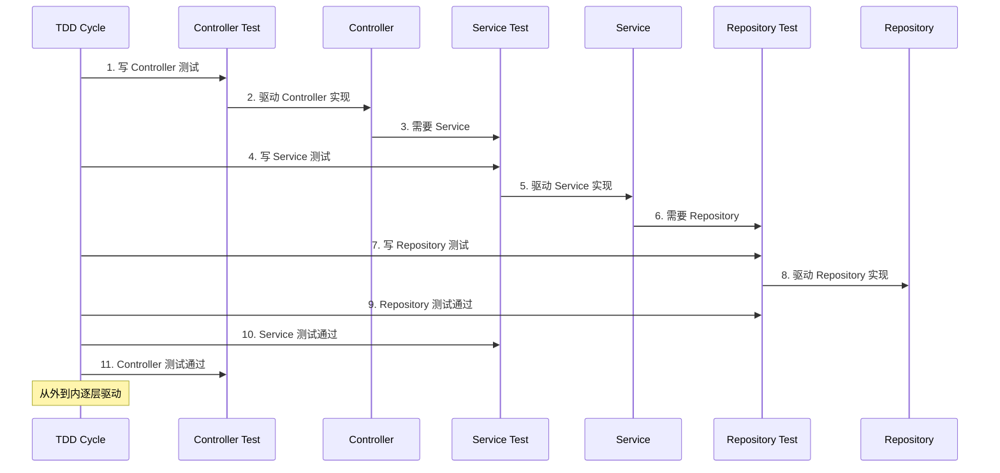

# 第41课：TDD 按层推进

## 概述

在 Spring Boot 的三层架构（Controller → Service → Repository）中，TDD 的推进策略是从**外层向内层**、从**行为到数据**。先定义接口期望，再实现业务逻辑，最后验证数据访问。

---

## 三层架构中的 TDD 推进顺序

```mermaid
graph TB
    subgraph ”推进方向”
        DIR[”外层 → 内层”]
    end

    C[”1️⃣ Controller Test<br/>Web 层行为”] --> S[”2️⃣ Service Test<br/>业务逻辑”]
    S --> R[”3️⃣ Repository Test<br/>数据访问”]

    C -.->|”关注”| C1[”HTTP 状态码<br/>请求/响应结构<br/>参数校验”]
    S -.->|”关注”| S1[”业务规则<br/>异常处理<br/>事务管理”]
    R -.->|”关注”| R1[”SQL 正确性<br/>数据映射<br/>持久化行为”]
```

### 为什么从外到内？

1. **Controller 定义了接口契约**——先确定"外界怎么调用我们"
2. **Service 实现业务逻辑**——根据接口契约实现背后的规则
3. **Repository 提供数据支撑**——最后决定数据怎么存取

---

## 第1步：Controller Test（定义接口契约）

### 先写测试

```java
@WebMvcTest(UserController.class)
class UserControllerTest {

    @Autowired
    private MockMvc mockMvc;

    @MockBean
    private UserService userService;

    @Test
    void getUserById_givenValidId_willReturn200WithUser() throws Exception {
        // Arrange
        var mockUser = new User(1L, "test", "test@example.com");
        when(userService.findById(1L)).thenReturn(mockUser);

        // Action & Assert
        mockMvc.perform(get("/api/users/1"))
                .andExpect(status().isOk())
                .andExpect(jsonPath("$.id").value(1))
                .andExpect(jsonPath("$.name").value("test"));
    }

    @Test
    void getUserById_givenNonExistentId_willReturn404() throws Exception {
        when(userService.findById(99L)).thenThrow(new UserNotFoundException());

        mockMvc.perform(get("/api/users/99"))
                .andExpect(status().isNotFound());
    }
}
```

### 再写 Controller

```java
@RestController
@RequestMapping("/api/users")
public class UserController {

    private final UserService userService;

    public UserController(UserService userService) {
        this.userService = userService;
    }

    @GetMapping("/{id}")
    public ResponseEntity<User> getUserById(@PathVariable Long id) {
        try {
            var user = userService.findById(id);
            return ResponseEntity.ok(user);
        } catch (UserNotFoundException e) {
            return ResponseEntity.notFound().build();
        }
    }
}
```

---

## 第2步：Service Test（实现业务逻辑）

### 先写测试

```java
@ExtendWith(MockitoExtension.class)
class UserServiceTest {

    @Mock
    private UserRepository userRepository;

    @InjectMocks
    private UserService userService;

    @Test
    void findById_givenExistingUser_willReturnUser() {
        // Arrange
        var mockUser = new User(1L, "test", "test@example.com");
        when(userRepository.findById(1L)).thenReturn(Optional.of(mockUser));

        // Action
        var result = userService.findById(1L);

        // Assert
        assertEquals("test", result.getName());
        verify(userRepository).findById(1L);
    }

    @Test
    void findById_givenNonExistentUser_willThrowException() {
        when(userRepository.findById(99L)).thenReturn(Optional.empty());

        assertThrows(UserNotFoundException.class,
                () -> userService.findById(99L));
    }
}
```

### 再写 Service

```java
@Service
public class UserService {

    private final UserRepository userRepository;

    public UserService(UserRepository userRepository) {
        this.userRepository = userRepository;
    }

    public User findById(Long id) {
        return userRepository.findById(id)
                .orElseThrow(() -> new UserNotFoundException("User not found: " + id));
    }
}
```

---

## 第3步：Repository Test（验证数据访问）

### 先写测试

```java
@DataJpaTest
class UserRepositoryTest {

    @Autowired
    private UserRepository userRepository;

    @Autowired
    private TestEntityManager entityManager;

    @Test
    void findByEmail_whenUserExists_willReturnUser() {
        // Arrange
        entityManager.persist(new User("test", "test@example.com"));

        // Action
        var result = userRepository.findByEmail("test@example.com");

        // Assert
        assertTrue(result.isPresent());
        assertEquals("test", result.get().getName());
    }

    @Test
    void findByEmail_whenUserNotExists_willReturnEmpty() {
        var result = userRepository.findByEmail("nonexist@example.com");

        assertTrue(result.isEmpty());
    }
}
```

### 再写 Repository

```java
public interface UserRepository extends JpaRepository<User, Long> {

    Optional<User> findByEmail(String email);
}
```

---

## 各层测试关注点对比

| 层面 | 测试类型 | 关注点 | 不关注 | 典型工具 |
|------|----------|--------|--------|----------|
| **Controller** | `@WebMvcTest` | HTTP 状态码、JSON 结构、参数校验 | Service 实现逻辑 | MockMvc |
| **Service** | `@ExtendWith(MockitoExtension.class)` | 业务规则、异常处理、协作对象交互 | HTTP 细节、数据库 | Mockito |
| **Repository** | `@DataJpaTest` | SQL 正确性、数据映射、持久化行为 | 业务逻辑 | TestEntityManager |

---

## 集成测试验证跨层时序问题

当三层都按 TDD 推进完成后，需要**集成测试**验证跨层协调是否正常：

```java
@SpringBootTest(webEnvironment = WebEnvironment.RANDOM_PORT)
class UserIntegrationTest {

    @Autowired
    private TestRestTemplate restTemplate;

    @Test
    void getUserById_givenExistingUserInDB_willReturn200() {
        // 真实数据写入数据库，真实走三层
        var response = restTemplate.getForEntity("/api/users/1", User.class);

        assertThat(response.getStatusCode()).isEqualTo(HttpStatus.OK);
        assertThat(response.getBody().getName()).isNotNull();
    }
}
```

---

## 按层推进的时序图



---

> [!NOTE] 语言迁移
> **按层推进不仅是 Spring Boot 的专利。** 在 Python Django/Flask 和 Node.js Express/NestJS 等框架中，同样适用"从路由到业务逻辑再到数据访问"的外到内推进策略。核心思想始终是：先定义接口契约，再实现业务逻辑，最后确定数据存储。

---

## 静态收束

TDD 按层推进的核心思想是**从行为到数据**——先通过测试定义每一层的对外行为，再逐层实现。这种方法确保了每一层都有清晰的接口边界，不会出现层与层之间的耦合混乱。每一层的测试就像一份可执行的契约文档，确保代码的各层职责清晰、界限分明。