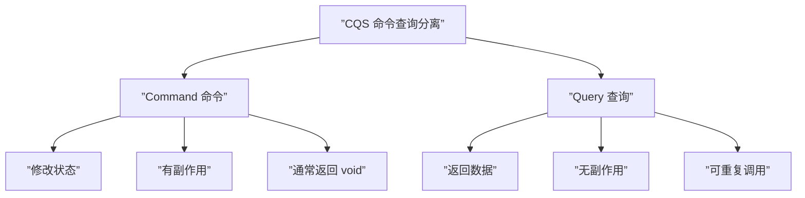

# 第42课：CQS 方法论（命令查询分离）

## 概述

CQS（Command-Query Separation，命令查询分离）是由 Bertrand Meyer 提出的设计原则：**每个方法要么是命令（修改状态），要么是查询（返回数据），但不能兼而有之。**

---

## 核心定义



| 类型 | 英文 | 行为 | 副作用 | 返回值 |
|------|------|------|--------|--------|
| **命令** | Command / Modifier | 修改系统状态 | 有副作用 | 通常 `void` |
| **查询** | Query | 读取数据 | 无副作用 | 返回数据 |

---

## 违反 CQS 的反例

### 问题：一个方法又查又删

```java
// ❌ 违反 CQS：closeUserBind 同时做了两件事
public class UserService {

    public void closeUserBind(String username) {
        // 查询：读取用户信息
        var user = userRepository.findByUsername(username);
        if (user == null) {
            throw new UserNotFoundException(username);
        }

        // ... 一些业务操作 ...

        // 命令：删除用户
        userRepository.deleteById(user.getId());
    }
}
```

### 时序问题

```java
// 更严重的时序问题：先查再删
public void closeUserBind(String username) {
    var user = userRepository.findByUsername(username);
    // ❌ 此时可能有其他线程删除了 user
    // 但下面的操作还假设 user 仍然存在
    auditService.log("Closing user: " + user.getId());
    userRepository.deleteById(user.getId());
}
```

---

## CQS 解决方案

### 重构：查询与命令分离

```mermaid
graph LR
    subgraph ”CQS 分离前（违反原则）”
        BEFORE[”closeUserBind(username)<br/>🔍 查用户 + 🗑️ 删用户”]
    end

    subgraph ”CQS 分离后（符合原则）”
        QUERY[”findByUsername(username)<br/>🔍 纯查询 → 返回 User”]
        COMMAND[”deleteUser(userId)<br/>🗑️ 纯命令 → 删除”]
    end

    BEFORE --> QUERY
    BEFORE --> COMMAND
```

```java
// ✅ 遵循 CQS：查询与命令分离
public class UserQueryService {
    // 查询：纯读取，无副作用
    public User findByUsername(String username) {
        return userRepository.findByUsername(username);
    }
}

public class UserCommandService {
    // 命令：执行删除，有副作用
    public void deleteUser(Long userId) {
        if (!userRepository.existsById(userId)) {
            throw new UserNotFoundException(userId);
        }
        userRepository.deleteById(userId);
    }
}
```

### 在 Controller 中组合

```java
@RestController
@RequestMapping("/api/users")
public class UserController {

    private final UserQueryService userQueryService;
    private final UserCommandService userCommandService;

    public UserController(UserQueryService userQueryService,
                          UserCommandService userCommandService) {
        this.userQueryService = userQueryService;
        this.userCommandService = userCommandService;
    }

    @PostMapping("/closeBind")
    public void closeBind(@RequestParam String username) {
        // Controller 编排：先查后删
        var user = userQueryService.findByUsername(username);
        userCommandService.deleteUser(user.getId());
    }
}
```

---

## CQS 驱动架构平衡：避免"干巴巴的 Controller"

### 问题：干巴巴的 Controller

```java
// ❌ "干巴巴的 Controller"：Controller 只有一行转发
@PostMapping("/closeBind")
public void closeBind(@RequestParam String username) {
    userService.closeUserBind(username); // 所有逻辑下沉到 Service
}
```

这种 Controller 称为"干巴巴的 Controller"（Anemic Controller），它不包含任何业务编排逻辑，只是一个薄薄的代理。这通常是**违反 CQS 的信号**——Service 层同时做了查询和命令的事情。

### CQS 改进后

```java
// ✅ Controller 有了自己的行为逻辑
@PostMapping("/closeBind")
public void closeBind(@RequestParam String username) {
    var user = userQueryService.findByUsername(username);  // Controller 做查询
    userCommandService.deleteUser(user.getId());            // Controller 做命令
}
```

### CQS 分离前后的架构对比

```mermaid
graph TB
    subgraph ”CQS 分离前”
        C1[”Controller”] --> S1[”UserService<br/>（查询+命令混合）”]
        S1 --> R1[”UserRepository”]
    end

    subgraph ”CQS 分离后”
        C2[”Controller<br/>（编排查询+命令）”] --> QS[”UserQueryService<br/>（纯查询）”]
        C2 --> CS[”UserCommandService<br/>（纯命令）”]
        QS --> R2[”UserRepository”]
        CS --> R2
    end
```

---

## CQS 与单元测试

CQS 让测试边界更清晰：

```java
// 查询测试：只验证返回值
@Test
void findByUsername_whenUserExists_willReturnUser() {
    var user = userQueryService.findByUsername("test");

    assertNotNull(user);
    assertEquals("test", user.getUsername());
}

// 命令测试：只验证副作用
@Test
void deleteUser_whenUserExists_willRemoveFromDB() {
    userCommandService.deleteUser(1L);

    verify(userRepository).deleteById(1L);
}

@Test
void deleteUser_whenUserNotExists_willThrowException() {
    when(userRepository.existsById(99L)).thenReturn(false);

    assertThrows(UserNotFoundException.class,
            () -> userCommandService.deleteUser(99L));
}
```

---

## CQS 在微服务层面的扩展

CQS 原则可以从**方法级别**扩展到**服务级别**：

| 级别 | 命令 | 查询 |
|------|------|------|
| 方法级 | `deleteUser(id)` | `findByUsername(name)` |
| 类级 | `UserCommandService` | `UserQueryService` |
| 服务级 | 订单写入服务 | 订单查询服务 |

> 在微服务架构中，CQS 可演化为 CQRS（Command Query Responsibility Segregation），即完全的读写分离架构。

---

## CQS 的边界：何时可以适度打破

CQS 是原则而非绝对铁律。以下情况可以适度打破：

```java
// 合理的例外：返回 ID 的创建方法
// 虽然修改了状态（命令），但返回了新创建记录的 ID（查询）
public Long createUser(String username, String email) {
    var user = new User(username, email);
    userRepository.save(user);
    return user.getId(); // 返回生成的 ID
}
```

> **原则：** 可以打破，但要意识到你在打破，并且有充分的理由。

---

> [!NOTE] 语言迁移
> **CQS 是普适的设计原则。** Python 开发者可以将 Service 拆分为 `UserQueryService` / `UserCommandService`；JavaScript 开发者可以在 NestJS 中实现独立的 Query/Command Handler。CQS 的核心价值——分离读写职责、明确方法意图——在任何语言中都能提升代码质量。

---

## 静态收束

CQS 将方法清晰地划分为"命令"和"查询"两类，消除了"一个方法既查又改"的模糊地带。这不仅让代码的意图更加明确，也让测试边界更加清晰——查询只测返回值，命令只测副作用。更重要的是，CQS 驱动了更健康的架构：Controller 不再是"干巴巴的"代理，而是真正的行为编排者。