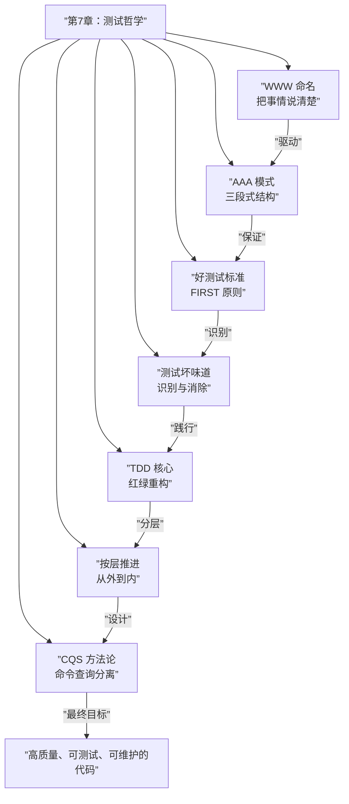

# 第43课：TDD 理念回顾与技巧总结

## 概述

本章（第7章：测试哲学）的核心不是教你具体的框架 API，而是**方法论和思维模式**。本课作为收束，回顾 TDD 哲学的关键理念，并总结实战技巧，帮助你持续践行测试驱动开发。

---

## TDD 核心理念回顾

```mermaid
graph TB
    subgraph ”第7章：测试哲学”
        WWW[”第36课：WWW 命名<br/>What + When + Want”]
        AAA[”第37课：AAA 模式<br/>Arrange + Action + Assert”]
        GOOD[”第38课：好测试标准<br/>FIRST 原则”]
        SMELL[”第39课：测试坏味道<br/>反模式识别”]
        TDD[”第40课：TDD 流程<br/>红 → 绿 → 重构”]
        LAYER[”第41课：TDD 按层推进<br/>从外到内”]
        CQS[”第42课：CQS 方法论<br/>命令查询分离”]
    end

    WWW --> GOOD
    AAA --> GOOD
    GOOD --> SMELL
    SMELL --> TDD
    TDD --> LAYER
    LAYER --> CQS
```

### 各课核心理念速查表

| 课程 | 核心理念 | 一句话概括 |
|------|----------|------------|
| 第36课 | [[0036-www-naming|WWW 命名]] | 测试方法名要说清：测什么、什么场景、期望什么 |
| 第37课 | [[0037-aaa-pattern|AAA 模式]] | 测试体三段式：准备 → 执行 → 断言 |
| 第38课 | [[0038-what-is-good-test|好测试标准]] | FIRST 原则 + 测试即设计文档 |
| 第39课 | [[0039-test-smells|测试坏味道]] | 识别并消除 Mock 过多、脆弱测试等反模式 |
| 第40课 | [[0040-test-driven-development|TDD 流程]] | 先写测试 → 最小实现 → 重构 |
| 第41课 | [[0041-tdd-by-layer|TDD 按层推进]] | Controller → Service → Repository 从外到内 |
| 第42课 | [[0042-cqs-command-query-separation|CQS 方法论]] | 命令与查询分离，让职责边界清晰 |

---

## 测试即文档

这是贯穿整个章节最核心的理念：**测试是可执行的文档，它比任何 Word 文档都更真实、更及时。**

### 业务文档 vs 测试文档

```mermaid
graph LR
    subgraph ”传统业务文档”
        DOC1[”Word 文档 📄”]
        DOC2[”Wiki 页面 📝”]
        DOC3[”接口文档 📋”]
    end

    subgraph ”测试用例”
        TEST1[”测试方法名<br/>→ 标题”]
        TEST2[”AAA 三段<br/>→ 正文”]
        TEST3[”断言<br/>→ 验收标准”]
    end

    DOC1 -.->|”❌ 容易过时”| TEST1
    DOC2 -.->|”❌ 不会自动验证”| TEST2
    DOC3 -.->|”❌ 无法强制执行”| TEST3
```

```java
/**
 * 需求 PRD 原文：
 * "已登录用户可以通过输入旧密码+新密码来修改密码。
 *  如果旧密码不匹配，系统应该拒绝修改并返回错误。"
 *
 * 测试用例：
 */
public class PasswordServiceTest {

    @Test
    void changePassword_givenCorrectOldPassword_willUpdateToNew() {
        // 文档：成功场景
    }

    @Test
    void changePassword_givenWrongOldPassword_willThrowException() {
        // 文档：异常场景
    }

    @Test
    void changePassword_givenOldPasswordSameAsNew_willThrowException() {
        // 文档：业务规则——新旧密码不能相同
    }
}
```

> **测试是活文档。** 需求变了，测试先红，然后变绿的过程就是文档更新的过程。

---

## 从微观到宏观：基础决定架构

### 微观层面的习惯

| 微观习惯 | 对应的方法论 | 效果 |
|----------|-------------|------|
| 写测试前先想好名字 | WWW 命名 | 明确测试意图 |
| 测试体分段清晰 | AAA 模式 | 提升可读性 |
| 红 → 绿 → 重构 | TDD 循环 | 保证代码质量 |
| 先写 Controller 测试 | 按层推进 | 定义接口契约 |
| 方法只做一件事 | CQS 原则 | 简化测试边界 |

### 微观习惯如何影响宏观架构

```mermaid
graph TB
    subgraph ”微观习惯”
        H1[”WWW 命名习惯”]
        H2[”AAA 结构习惯”]
        H3[”CQS 设计习惯”]
    end

    subgraph ”中观实践”
        P1[”TDD 小步迭代”]
        P2[”按层推进测试”]
        P3[”持续重构”]
    end

    subgraph ”宏观架构”
        A1[”高内聚低耦合”]
        A2[”清晰的层边界”]
        A3[”可测试的设计”]
    end

    H1 --> P1
    H2 --> P1
    H3 --> P2
    P1 --> A1
    P2 --> A2
    P2 --> A3
    P3 --> A1
    P3 --> A2
```

---

## 如何持续保持 TDD 习惯

### 常见阻力与应对

| 阻力 | 理由 | 应对策略 |
|------|------|----------|
| **时间压力** | "没时间写测试" | 从核心逻辑的 3 个关键测试开始，不追求全覆盖 |
| **惯性** | "习惯先写代码" | 强制先写测试名（WWW 三段），再写空方法体 |
| **复杂度** | "这个功能太难测试" | 拆分功能，用 CQS 分离查询和命令 |
| **维护成本** | "测试也要维护" | 用 AAA 和 Builder 简化测试代码 |
| **团队不一致** | "别人不写测试" | 做好自己的部分，用测试质量证明价值 |

### 渐进式实践路径

```
第1周：坚持 WWW 命名       →  第2周：坚持 AAA 结构
   ↓                               ↓
第3周：坚持 TDD 红绿重构     →  第4周：坚持 CQS 设计原则
   ↓                               ↓
第5周：融入日常开发习惯      →  持续改进
```

### 每日 TDD 检查清单

- [ ] 今天写的每个测试都遵循了 WWW 命名吗？
- [ ] 测试体是否有清晰的 AAA 三段分隔？
- [ ] 是否先写了测试再写的实现？
- [ ] 是否有"绿色时间"太长（一次性写过多代码）？
- [ ] 重构阶段是否保持了测试绿色？
- [ ] 是否识别并消除了测试坏味道？

---

## 本章知识全景



---

> [!NOTE] 语言迁移
> **测试哲学是语言无关的顶层思想。** 无论你使用 Java、Python、JavaScript、Go 还是 Rust，本章的所有方法论都同样适用。WWW 命名让测试意图清晰，AAA 模式让测试结构整洁，CQS 让代码职责分明——这些都不是某个语言的特性，而是优秀工程师的思维习惯。

---

## 静态收束

测试哲学的核心不是工具和框架，而是**思维方式**。WWW 命名让测试意图清晰可见，AAA 模式让测试结构规整有序，CQS 让代码职责泾渭分明。这些方法论共同构成了测试驱动开发的思维基石。

从第36课到第43课，我们完成了从"怎么写测试"到"为什么这样写测试"的认知跃迁。下一章，我们将进入 AI + TDD 的融合实践——借助 AI 的力量，让测试驱动开发的效率再上一个台阶。