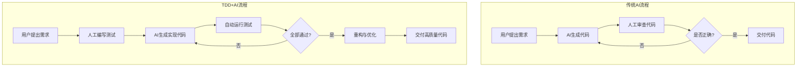

# 第44课：AI 与 TDD 的理论结合

> 覆盖知识点：KP-220 ~ KP-223

## AI 编程的三大问题

在使用 AI 辅助编程时，主要面临三类问题：

| 问题类型 | 表现形式 | 后果 |
|---------|---------|------|
| **幻觉（编译错误）** | AI 生成不存在的 API、虚构的函数签名、错误的语法结构 | 代码无法通过编译 |
| **逻辑错误（运行时错误）** | 代码能编译通过，但业务逻辑不正确，边界条件处理缺失 | 运行时行为与预期不符 |
| **代码质量差（难以维护）** | 缺乏抽象层次、命名混乱、职责不清、缺少测试覆盖 | 技术债务积累，后期维护成本激增 |

> [!quote] 核心观点
> 这三个问题本质上都是**验证缺失**的问题——AI 生成了代码，但没有配套的验证手段来保证其正确性。

## TDD 天然解决 AI 幻觉

TDD（测试驱动开发）的核心理念——**先写测试，再写实现**——恰好对应了 AI 编程的痛点：

1. **测试即契约**：测试定义了代码的"应然"行为，AI 生成的代码必须满足这个契约
2. **测试即验证**：运行测试能立即发现 AI 的幻觉和逻辑错误
3. **测试即文档**：测试用例展示了代码的正确使用方式，弥补了 AI 对上下文理解的不足

## AI + TDD 协同工作流

### 流程对比分析

| 维度 | 传统 AI 流程 | TDD + AI 流程 |
|------|-------------|--------------|
| 验证手段 | 依赖人工审查 | 自动化测试验证 |
| 错误反馈 | 延迟（审查时发现） | 即时（运行测试即发现） |
| 迭代次数 | 不确定，容易反复 | 可量化，通过测试即终止 |
| 代码质量 | 依赖提示词质量 | 测试约束保证基础质量 |
| 人工投入 | 高强度审查 | 编写测试 + 策略决策 |

## 从"帮 AI 擦屁股"到"让 AI 自我验证"

传统使用 AI 编程的模式是：AI 生成代码 → 人工审查并修正 → 再让 AI 改 → 再审查。这种模式的问题在于**人工成了 AI 的验证环**。

TDD + AI 的模式将验证环节自动化：

1. **人工编写测试**——定义什么是"正确"
2. **AI 生成实现**——尝试满足测试
3. **自动运行验证**——测试框架代替人工检查
4. **反馈闭环**——AI 根据测试结果自我修正

> [!tip] 关键转变
> 将人工从"验证者"角色转变为"设计者"角色，让 AI 承担实现和修正的工作。

## 本课小结

- AI 编程的三大问题：**幻觉、逻辑错误、代码质量差**
- TDD 通过**测试即契约、验证、文档**三方面解决这些问题
- AI + TDD 协同工作流实现了**自动化验证闭环**
- 核心转变：从**人工验证**到**AI 自我验证**

下一步：[[0045-tdd-prompts-for-ai|第45课：TDD 提示词工程]]——如何在提示词中嵌入 TDD 规则。