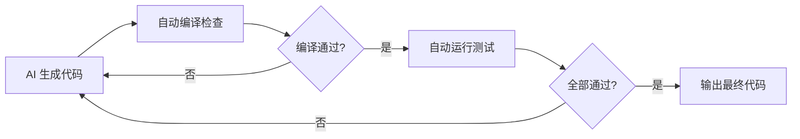
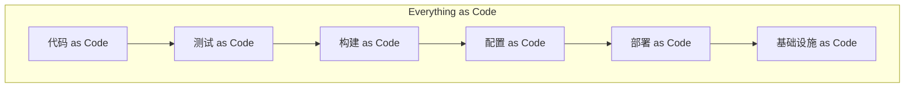

# 第46课：让 AI 一次性输出低错误率代码

> 覆盖知识点：KP-226 ~ KP-227

## AI 循环自测机制

AI 输出代码的质量可以通过**自动化的测试-修正循环**来保证。这个循环不需要人工介入，由 AI 自行完成错误的识别和修正。

### 循环自测流程详解

| 步骤 | 操作 | 验证标准 | 执行者 |
|------|------|---------|--------|
| 1 | AI 根据需求生成代码（含测试） | 功能需求匹配度 | AI |
| 2 | 自动编译检查 | 无编译错误 | 构建工具 |
| 3 | 自动运行单元测试 | 全部测试通过 | 测试框架 |
| 4 | 分析失败原因 | 识别编译/逻辑/覆盖问题 | AI |
| 5 | 根据失败反馈修正代码 | 问题根源定位准确 | AI |
| 6 | 重新编译和测试 | 回归验证 | 构建工具 |

> [!tip] 关键点
> 这个循环的核心理念是：**AI 产生的错误由 AI 自己修正**。人工只需要在最初定义"什么是正确的"（即编写测试）。

## 不需要人工介入的错误修正循环

### AI 能自动修正的错误类型

| 错误类型 | 示例 | AI 修正可行性 |
|---------|------|--------------|
| **语法错误** | 缺少括号、拼写错误 | 高——编译器反馈明确 |
| **API 调用错误** | 方法名错误、参数不匹配 | 高——编译错误信息清晰 |
| **类型不匹配** | 类型转换错误 | 高——类型系统提供约束 |
| **逻辑边界错误** | 数组越界、空指针未处理 | 中——测试失败暴露问题 |
| **业务逻辑错误** | 条件判断错误、计算错误 | 中——需要测试用例准确定义 |
| **设计模式错误** | 职责划分不当、耦合过高 | 低——需要人工设计决策 |

### 不需要人工介入的条件

要让 AI 自测循环有效工作，需要满足以下条件：

1. **测试用例完备**——测试覆盖了所有关键路径和边界条件
2. **反馈信息明确**——测试框架提供清晰的失败信息（期望值 vs 实际值）
3. **上下文充分**——AI 能访问到项目结构、已有代码和相关配置
4. **迭代次数可控**——设定最大迭代次数，避免无限循环

## Everything as Code 概念

> [!abstract] Everything as Code
> 将一切可自动化的工作流程视为代码管理——包括构建、测试、部署、配置、基础设施等。

### 在 AI+TDD 场景中的应用

| 维度 | 传统方式 | Everything as Code |
|------|---------|-------------------|
| 测试执行 | 手动运行 | CI/CD 自动触发 |
| 错误反馈 | 等待人工检查 | 即时自动化反馈 |
| 状态追踪 | 口头或文档记录 | 版本控制追踪 |
| 可重复性 | 依赖环境配置 | 声明式定义，一键复现 |
| AI 集成 | 无法自动接入 | AI 可读取、修改、执行 |

### Everything as Code 为 AI 提供的支撑

1. **版本化**——所有配置文件纳入版本控制，AI 可了解变更历史
2. **可编程**——构建脚本、部署脚本可被 AI 理解和修改
3. **可验证**——每个环节都有对应的验证步骤（编译→测试→打包）
4. **可重复**——AI 可以在沙箱环境中反复尝试和验证

> [!quote] 核心理念
> 当一切皆代码，AI 就能处理一切。自动化程度越高，AI 能独立完成的工作就越多。

## 本课小结

- **AI 循环自测机制**让 AI 自动完成"生成→验证→修正→再验证"的闭环
- 大多数编译错误和部分逻辑错误可以由 AI **自主修正**
- Everything as Code 为 AI 提供了**可编程、可验证、可重复**的基础设施
- 自动化程度直接决定了 AI **独立工作能力**的上限

下一步：[[0047-self-verification-mechanism|第47课：代码的自验证机制]]——代码自身包含验证手段。