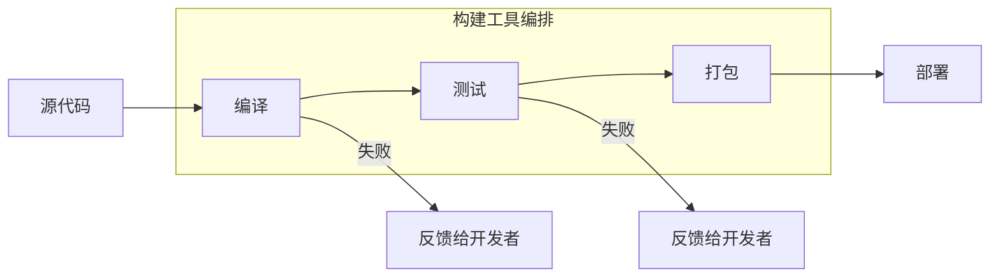
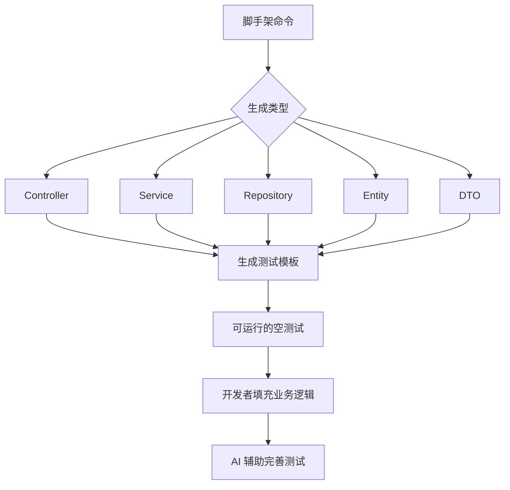
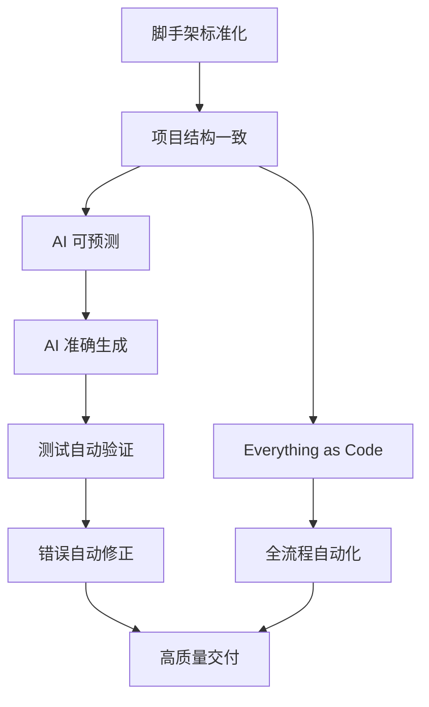

# 第47课：代码的自验证机制

> 覆盖知识点：KP-228 ~ KP-230

## 自验证 = 代码自身包含验证手段

> [!quote] 核心定义
> **自验证**（Self-Verification）是指代码自身携带验证其正确性的手段——即测试。一段"自验证"的代码，在交付时同时包含实现和验证，任何人（或 AI）都可以通过运行测试来确认代码的正确性。

### 自验证 vs 传统验证

| 维度 | 传统验证 | 自验证 |
|------|---------|--------|
| 验证时机 | 开发完成后单独编写测试 | 开发过程中测试与实现同步 |
| 验证主体 | 依赖 QA 或人工审查 | 代码自身携带测试 |
| 验证手段 | 外部独立的测试用例 | 代码仓库中的测试代码 |
| 回归能力 | 低（测试常被遗漏） | 高（每次修改都可运行） |
| AI 友好度 | 低（AI 无法自动验证） | 高（AI 可自动运行测试） |

## Everything as Code：全流程自动化

> [!abstract] Everything as Code
> 构建工具配置为代码，管理从编译到部署的完整流程：**编译 → 测试 → 打包 → 部署**。

### 全流程流水线



### 构建工具配置示例（Gradle）

```groovy
// build.gradle - Everything as Code 示例
plugins {
    id 'java'
    id 'org.springframework.boot'
    id 'io.spring.dependency-management'
}

tasks.named('test') {
    useJUnitPlatform()
    // 测试报告生成
    reports.html.required.set(true)
    // 失败时继续运行所有测试
    failFast = false
}

// 自动迁移脚本
tasks.named('flywayMigrate') {
    dependsOn 'compileJava'
}

// 代码生成任务
tasks.register('generateTestData') {
    // 根据数据库表结构自动生成测试数据
}
```

## 脚手架（Maven/Gradle）标准化项目结构

> [!tip] 脚手架的价值
> 脚手架不仅创建目录结构，更重要的是**标准化**——确保每个项目都遵循相同的工程规范，使得 AI 能够预测和理解项目布局。

### 脚手架提供的标准化内容

| 能力 | 说明 | AI 利用方式 |
|------|------|------------|
| **目录结构** | 标准 Maven/Gradle 布局 | AI 知道代码放在哪里 |
| **构建配置** | 统一依赖版本管理 | AI 可安全添加新依赖 |
| **测试配置** | 内置测试框架和 Mock 库 | AI 可直接编写测试 |
| **代码风格** | Checkstyle / SpotBugs 配置 | AI 生成符合规范的代码 |
| **CI/CD 配置** | GitHub Actions / Jenkinsfile | AI 可理解流水线流程 |

### 脚手架提供的三大能力

#### 1. 自动迁移脚本

数据库模式变更通过 Flyway / Liquibase 管理：

```sql
-- V1__create_orders_table.sql
CREATE TABLE orders (
    id BIGINT AUTO_INCREMENT PRIMARY KEY,
    user_id BIGINT NOT NULL,
    product_id BIGINT NOT NULL,
    quantity INT NOT NULL,
    status VARCHAR(20) NOT NULL,
    created_at TIMESTAMP DEFAULT CURRENT_TIMESTAMP
);
```

> AI 通过读取迁移脚本理解数据库结构，自动生成对应的 Repository 和测试代码。

#### 2. 测试配置

脚手架预置的测试基础设施：

```java
@SpringBootTest
@AutoConfigureMockMvc
@TestMethodOrder(MethodOrderer.OrderAnnotation.class)
public class BaseIntegrationTest {
    // 所有集成测试的基类
    @DynamicPropertySource
    static void configureProperties(DynamicPropertyRegistry registry) {
        registry.add("spring.datasource.url", () -> "jdbc:h2:mem:testdb");
    }
}
```

#### 3. 代码生成

脚手架内置的代码生成器按模板创建标准文件：



## 自验证机制的价值链



## 本课小结

- **自验证**就是代码自身携带测试，任何人/AI 都可立即验证
- **Everything as Code** 将构建到部署全流程代码化、自动化
- **脚手架**通过标准化项目结构为 AI 提供"可预测的上下文"
- 脚手架三大能力：**自动迁移脚本、测试配置、代码生成**

下一步：[[0048-ai-testing-interfaces|第48课：AI 测试接口层面代码]]——AI 自动按层切片测试。