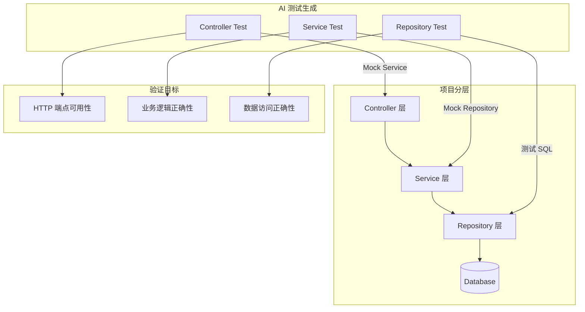
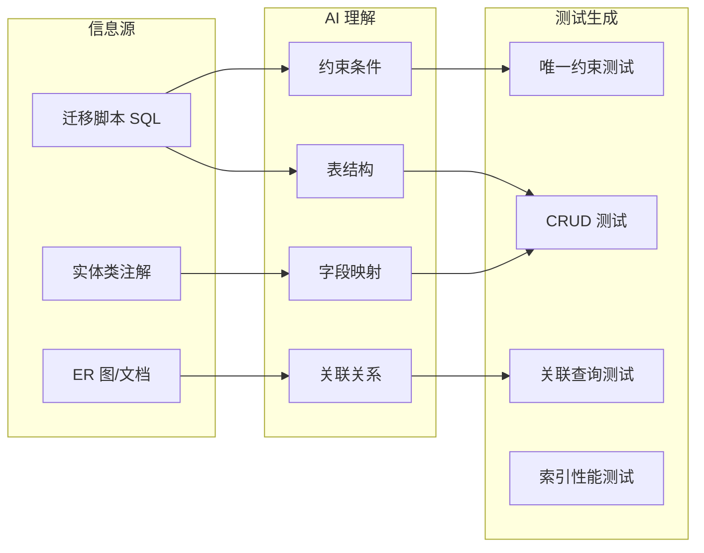

# 第48课：AI 测试接口层面代码

> 覆盖知识点：KP-231 ~ KP-232

## AI 自动按层切片测试

AI 需要理解项目的分层架构，并针对每一层生成对应的测试。这是从"AI 会写代码"到"AI 会验证代码"的关键能力。



## Controller 层测试

### 验证目标

- HTTP 端点全部可用，无遗漏
- 请求参数校验正确
- 响应状态码和格式符合约定
- 异常场景返回正确的错误信息

### AI 生成的示例

```java
@WebMvcTest(OrderController.class)
class OrderControllerTest {

    @Autowired
    private MockMvc mockMvc;

    @MockitoBean
    private OrderService orderService;

    @Test
    void shouldCreateOrderSuccessfully() throws Exception {
        // Arrange
        CreateOrderRequest request = new CreateOrderRequest(1L, 100L, 2);
        given(orderService.createOrder(any(CreateOrderRequest.class)))
                .willReturn(new OrderResponse(1L, "CREATED"));

        // Act & Assert
        mockMvc.perform(post("/api/orders")
                        .contentType(MediaType.APPLICATION_JSON)
                        .content(asJsonString(request)))
                .andExpect(status().isCreated())
                .andExpect(jsonPath("$.status").value("CREATED"));
    }

    @Test
    void shouldReturn400WhenProductIdIsNull() throws Exception {
        // Arrange
        CreateOrderRequest request = new CreateOrderRequest(null, null, 0);

        // Act & Assert
        mockMvc.perform(post("/api/orders")
                        .contentType(MediaType.APPLICATION_JSON)
                        .content(asJsonString(request)))
                .andExpect(status().isBadRequest());
    }
}
```

## Service 层测试

### 验证目标

- 业务逻辑正确性（正常路径）
- 边界条件和异常处理
- 事务行为
- 依赖协作的正确性

### AI 生成的示例

```java
@ExtendWith(MockitoExtension.class)
class OrderServiceTest {

    @Mock
    private OrderRepository orderRepository;

    @Mock
    private ProductService productService;

    @InjectMocks
    private OrderService orderService;

    @Test
    void shouldCreateOrderWhenProductIsAvailable() {
        // Arrange
        CreateOrderRequest request = new CreateOrderRequest(1L, 100L, 2);
        given(productService.checkStock(100L, 2)).willReturn(true);
        given(orderRepository.save(any(Order.class)))
                .willReturn(new Order(1L, 1L, 100L, 2, "CREATED", LocalDateTime.now()));

        // Act
        OrderResponse response = orderService.createOrder(request);

        // Assert
        assertThat(response.getStatus()).isEqualTo("CREATED");
        then(orderRepository).should().save(any(Order.class));
    }

    @Test
    void shouldThrowExceptionWhenStockInsufficient() {
        // Arrange
        CreateOrderRequest request = new CreateOrderRequest(1L, 100L, 999);
        given(productService.checkStock(100L, 999)).willReturn(false);

        // Act & Assert
        assertThrows(InsufficientStockException.class,
                () -> orderService.createOrder(request));
        then(orderRepository).should(never()).save(any());
    }
}
```

## Repository 层测试

### 验证目标

- SQL 语句正确性
- 数据映射正确性
- 查询结果完整性
- 数据库约束正确性

### AI 生成的示例

```java
@DataJpaTest
@AutoConfigureTestDatabase(replace = AutoConfigureTestDatabase.Replace.ANY)
class OrderRepositoryTest {

    @Autowired
    private OrderRepository orderRepository;

    @Autowired
    private TestEntityManager entityManager;

    @Test
    void shouldFindOrdersByUserId() {
        // Arrange
        Order order1 = new Order(null, 1L, 100L, 2, "CREATED", LocalDateTime.now());
        Order order2 = new Order(null, 1L, 101L, 1, "PAID", LocalDateTime.now());
        Order order3 = new Order(null, 2L, 102L, 3, "CREATED", LocalDateTime.now());
        entityManager.persist(order1);
        entityManager.persist(order2);
        entityManager.persist(order3);

        // Act
        List<Order> userOrders = orderRepository.findByUserId(1L);

        // Assert
        assertThat(userOrders).hasSize(2);
        assertThat(userOrders).extracting(Order::getUserId)
                .allMatch(id -> id.equals(1L));
    }
}
```

## AI 理解数据库表结构

> [!abstract] 关键能力
> 要让 AI 生成有效的 Repository 测试，AI 必须理解数据库的表结构、字段类型、约束关系和索引设计。

### AI 如何获取数据库结构信息



### 提示词中提供的数据库信息

```sql
-- 数据库表结构（供 AI 参考）
CREATE TABLE orders (
    id          BIGINT AUTO_INCREMENT PRIMARY KEY,
    user_id     BIGINT       NOT NULL,
    product_id  BIGINT       NOT NULL,
    quantity    INT          NOT NULL CHECK (quantity > 0),
    status      VARCHAR(20)  NOT NULL DEFAULT 'CREATED',
    created_at  TIMESTAMP    NOT NULL DEFAULT CURRENT_TIMESTAMP,
    updated_at  TIMESTAMP    DEFAULT CURRENT_TIMESTAMP ON UPDATE CURRENT_TIMESTAMP,
    
    INDEX idx_user_id (user_id),
    INDEX idx_status (status),
    CONSTRAINT fk_user FOREIGN KEY (user_id) REFERENCES users(id),
    CONSTRAINT fk_product FOREIGN KEY (product_id) REFERENCES products(id)
);
```

## 接口层面验证：Controller 端点全部可用无遗漏

> [!warning] 重要原则
> 每个 Controller 端点都必须有对应的测试。没有测试的端点等于没有验证，等于可能在生产环境中静默失败。

### 端点覆盖率检查清单

| 检查项 | 验证方式 | 示例 |
|--------|---------|------|
| 正常请求 | 状态码 200/201 | `POST /api/orders` 创建成功 |
| 参数校验失败 | 状态码 400 | 缺少必填字段 |
| 资源不存在 | 状态码 404 | 订单 ID 不存在 |
| 权限不足 | 状态码 403 | 无权限访问 |
| 未认证 | 状态码 401 | 未提供 Token |
| 服务异常 | 状态码 500 | 内部服务崩溃 |
| 请求体格式错误 | 状态码 400 | JSON 解析失败 |

## 本课小结

- AI 按**分层架构**自动生成测试：Controller → Service → Repository
- **Controller 测试**验证端点可用性和 HTTP 行为
- **Service 测试**验证业务逻辑和异常处理
- **Repository 测试**验证 SQL 和数据映射
- AI 需要通过**迁移脚本/实体类**理解数据库结构
- **端点覆盖率**是接口层面验证的核心指标

下一步：[[0049-tdd-ai-summary|第49课：TDD + AI 编程手法总结]]——全景总结与对比。