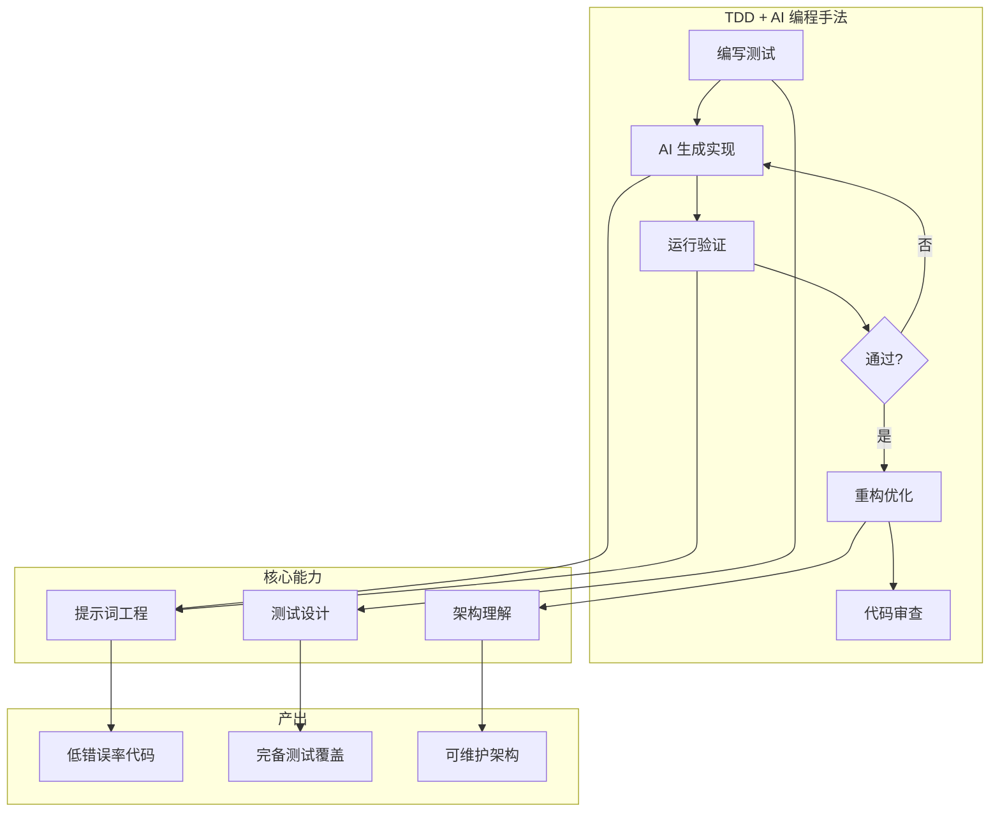
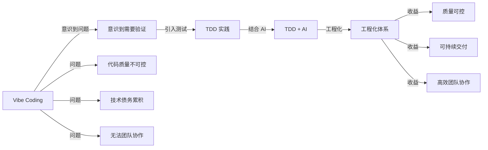

# 第49课：TDD + AI 编程手法总结

> 覆盖知识点：KP-233 ~ KP-234

## 全景总结

## 从"Vibe Coding"到"TDD + AI 工程化"

### Vibe Coding 的特征

- **随性生成**：凭感觉让 AI 生成代码，缺乏系统规划
- **代码即结果**：关注"能跑就行"，忽略测试和质量
- **被动验证**：依赖人工运行和检查
- **短期有效**：小项目可以，大项目技术债务快速积累

### TDD + AI 工程化的特征

- **测试先行**：测试是代码行为的契约和规范
- **自动化验证**：AI 生成 → 自动运行测试 → 自动修正
- **架构驱动**：代码结构由架构设计驱动，AI 在架构框架内工作
- **长期可持续**：测试覆盖保证重构安全，技术债务可控
- **可复现**：AI 在相同的工程上下文下可复现相同质量的输出

### 转变路径

## 基础能力决定 AI 辅助效果

> [!quote] 核心理念
> **理解代码才能用好 AI。** AI 不是替代开发者，而是放大开发者的能力。基础越扎实，AI 的效果越好。

### 开发者需要具备的基础能力

| 能力领域 | 具体技能 | 为什么对 AI 辅助重要 |
|---------|---------|-------------------|
| **测试设计** | 如何编写可读、可维护的测试 | 你定义"正确"，AI 负责实现 |
| **重构技巧** | 识别坏味道、安全重构手法 | 你指导 AI 优化代码结构 |
| **架构理解** | 分层、依赖注入、接口设计 | 你设计架构，AI 填充细节 |
| **调试能力** | 定位问题、分析根因 | 你分析测试失败原因，AI 修复 |
| **代码审查** | 识别潜在问题、质量评估 | 你审查 AI 输出，确保质量 |

## 传统开发 vs TDD+AI 开发对比

| 维度 | 传统开发 | TDD + AI 开发 |
|------|---------|--------------|
| **开发流程** | 需求 → 编码 → 测试（滞后） | 需求 → 测试（先行） → AI 编码 |
| **验证方式** | 开发完成后手动测试 | 开发过程中自动化测试持续验证 |
| **错误发现** | 后期发现，修复成本高 | 即时发现，修复成本低 |
| **代码质量** | 依赖开发者经验 | 测试约束 + AI 辅助双重保障 |
| **重构安全** | 低（缺少测试保护） | 高（完备测试覆盖） |
| **AI 角色** | 代码生成器（人类验证） | 实现者 + 自我验证者 |
| **开发者角色** | 编码者 | **设计者 + 审查者** |
| **上手门槛** | 低（能写代码即可） | 中（需要测试和设计能力） |
| **长期维护** | 困难（技术债务累积） | 容易（测试即文档） |
| **团队协作** | 代码耦合，冲突频繁 | 测试契约明确，协作顺畅 |

## TDD + AI 编程手法的核心原则

### 三条黄金法则

1. **先写测试，再写代码**——AI 也必须遵守 TDD 的顺序
2. **测试是契约，不是附属品**——测试定义了什么是"完成"
3. **AI 负责实现，人类负责设计**——不要让 AI 做架构决策

### 实践检查清单

- [ ] 是否在提示词中明确了 TDD 规则？
- [ ] 是否先编写了测试再让 AI 生成代码？
- [ ] 测试是否覆盖了正常路径、边界条件和异常场景？
- [ ] AI 生成的代码是否通过了所有测试？
- [ ] 代码是否经过重构优化？
- [ ] 测试是否足够清晰，能作为文档使用？
- [ ] 是否建立了自动化的验证反馈循环？

## 本课小结

- TDD + AI 编程手法是从 **"随性生成"到"工程化生产"** 的转变
- **基础能力决定 AI 辅助效果**——没有扎实的 TDD 功底，AI 只会放大混乱
- **开发者角色转变**：从编码者 → 设计者 + 审查者
- TDD + AI 在 **代码质量、重构安全、长期维护** 方面全面优于传统开发

下一步：[[0050-course-summary|第50课：课程总结与展望]]——整个课程的回顾与学习路径建议。