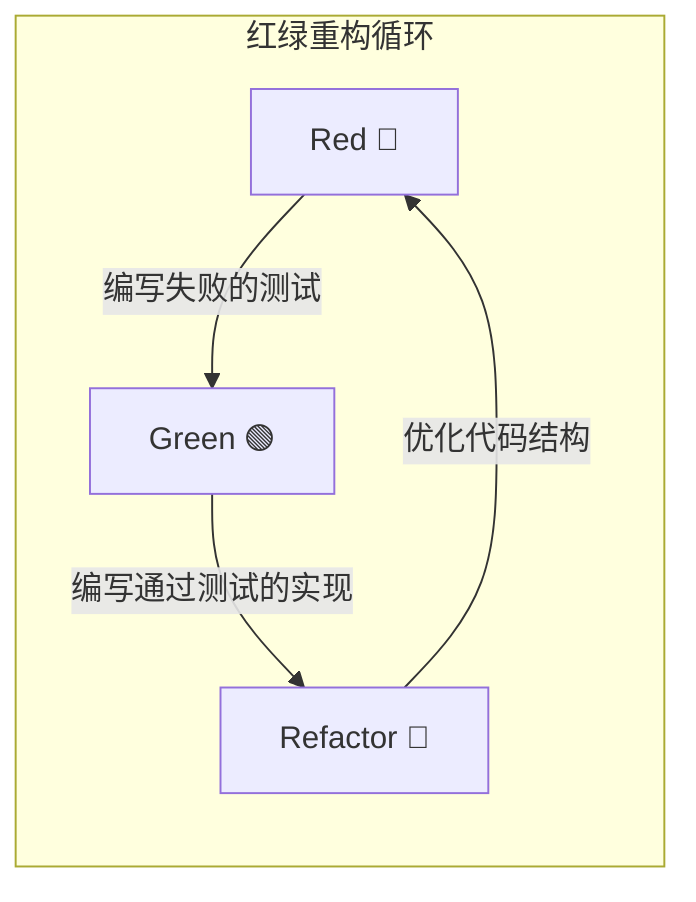
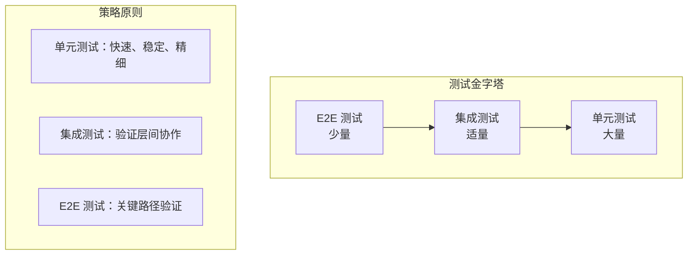
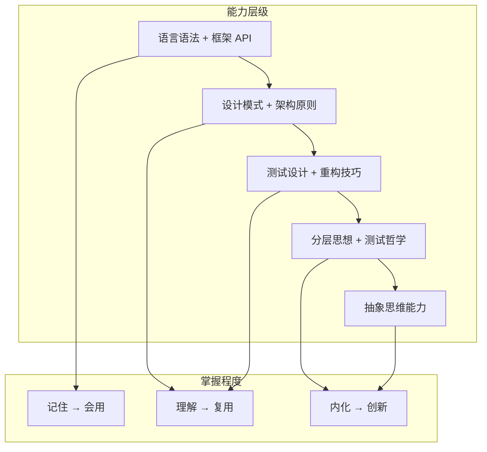

# 第50课：课程总结与展望

> 覆盖知识点：KP-250 ~ KP-257

## 红绿重构贯穿全程的重要性



> [!quote] 核心思想
> **红绿重构**不是一个技术步骤，而是一种**思维方式**。它贯穿了从问题定义到代码交付的每一个环节。

| 阶段 | 动作 | 产出 |
|------|------|------|
| **Red（红）** | 先写测试，定义"什么是正确" | 一个明确的行为契约 |
| **Green（绿）** | 编写最简实现通过测试 | 一个可工作的代码 |
| **Refactor（重构）** | 在测试保护下优化代码 | 一个高质量的代码 |

## 测试范围认知决定测试策略

### 测试金字塔的再认识



### 范围决策矩阵

| 场景 | 推荐测试类型 | 原因 |
|------|-------------|------|
| 纯业务逻辑 | 单元测试 | 快速验证，精确反馈 |
| 数据库操作 | Repository 测试 | 验证 SQL 和数据映射 |
| HTTP 接口 | Controller 测试 | 验证端点行为 |
| 跨服务调用 | 集成测试 | 验证协作正确性 |
| 用户主流程 | E2E 测试 | 验证端到端可用性 |

> [!tip] 关键认知
> 没有"最好"的测试类型，只有**最适合当前场景**的测试策略。测试范围的选择取决于：验证目标、反馈速度、维护成本。

## 重构技巧需要刻意练习

重构不是"顺便做的事"，而是一项需要**刻意练习**的技能。

### 安全重构的前提

1. **完备的测试覆盖**——没有测试保护，重构就是冒险
2. **小步提交**——每次只做一种重构手法，随时可以回退
3. **编译器作为安全网**——利用类型系统发现断裂点
4. **IDE 重构工具**——让工具做机械操作，减少人为错误

### 常见重构手法回顾

| 手法 | 适用场景 | 关键步骤 |
|------|---------|---------|
| Extract Method | 方法过长、职责不单一 | 识别内聚代码块 → 提取为新方法 → 参数传递 |
| Rename | 命名表意不清 | 全局重命名 → 更新所有引用 |
| Move Field/Method | 类职责错位 | 确定目标类 → 移动成员 → 更新引用 |
| Extract Class | 类承担过多职责 | 识别内聚字段/方法 → 创建新类 → 委托 |
| Introduce Parameter Object | 参数列表过长 | 封装参数为对象 → 替换所有调用 |

## 分层测试思想跨语言通用

> [!abstract] 分层测试的通用性
> 学习的是**思想**，不是框架。无论使用 Java、Python、Go、JavaScript 还是其他语言，分层测试的思想是通用的。

| 层次 | Java 实现 | Python 实现 | Go 实现 | JS/TS 实现 |
|------|-----------|-------------|---------|-----------|
| Controller | Spring MockMvc | Django Test Client | httptest | Supertest |
| Service | JUnit + Mockito | unittest + mock | testing + mock | Jest + mocks |
| Repository | DataJpaTest | pytest-django | sqlmock | DB mocking |
| E2E | Selenium/RestAssured | Playwright/Selenium | Selenium | Playwright/Cypress |

## 测试哲学跨语言通用

### AAA（Arrange-Act-Assert）

所有测试架构都遵循的三段式：

```
// Arrange - 准备测试环境
// Act     - 执行被测操作
// Assert  - 验证执行结果
```

### WWW（White-What-Why）

测试命名的三层含义：

```
test[被测方法]_Should[期望行为]_When[场景条件]
// White: 被测单元
// What:  期望行为
// Why:   触发条件
```

### CQS（Command-Query Separation）

命令和查询分离原则指导测试设计：

| 方法类型 | 特征 | 测试重点 |
|---------|------|---------|
| **Command（命令）** | 修改状态，返回 void | 验证状态变化和副作用 |
| **Query（查询）** | 不修改状态，返回值 | 验证返回值正确性 |

> [!quote] 核心认知
> 这些测试哲学不是 JUnit 的特性，也不是 Spring 的特性，而是**软件工程的通用智慧**。你学会的是一套可以在任何语言、任何框架中复用的思维模式。

## 基础是计算机最重要的部分



> [!tip] 给学习者的建议
> **不要急于追求框架的新特性。** 打好基础——测试设计、重构技巧、分层思想——这些才是能让你在任何技术栈中都游刃有余的能力。

## 测试即设计，测试即文档

### 测试即设计

- 测试约束了代码的行为，驱动了代码的可测试性设计
- 可测试的代码 = 低耦合、高内聚、职责单一的代码
- 测试是**设计工具**，不仅仅是验证工具

### 测试即文档

- 测试是**可执行的文档**——永远和代码同步
- 好的测试告诉读者：**这个类做什么、怎么做、边界在哪里**
- 新人加入团队，读测试比读文档更快理解业务逻辑

## 多看多练，不必死记注解

> [!quote] 最终建议
> 注解记不住没关系，概念不理解才需要担心。**多看、多练、多思考**，而不是死记硬背 API 和注解。

### 学习路径建议

1. **基础阶段**：掌握 TDD 循环（红绿重构），从简单的业务逻辑开始
2. **进阶阶段**：学习分层测试策略，理解不同测试类型的使用场景
3. **高阶阶段**：结合 AI 辅助，建立自动化验证体系
4. **融会贯通阶段**：将测试哲学内化为设计思维，在任何项目中自然使用

### 推荐继续学习的方向

- [[reference/ai-tdd-prompts|AI+TDD 提示词模板]]——持续更新提示词库
- 深入学习重构手法（推荐书籍：《重构：改善既有代码的设计》）
- 研究不同语言/框架的测试最佳实践
- 探索 CI/CD 流水线中的测试集成

---

> [!done] 结语
> 感谢你完成了整个课程的学习。TDD 不仅是一种编程技术，更是一种**思维方式的转变**。当你开始用"先写测试"的视角看待编程时，你会发现代码质量、设计能力和协作效率都会有质的飞跃。
> 
> 结合 AI 的能力，TDD 的力量被进一步放大——AI 不再是"幻觉制造机"，而是你手中最强大的**工程化生产力工具**。
> 
> **测试是契约，代码是承诺。** 祝你编码愉快，测试全绿。

## 课程总回顾

| 章节 | 内容 | 关键收获 |
|------|------|---------|
| 第1-2章 | TDD 基础与工具链 | JUnit 5、Mockito、测试分类 |
| 第3章 | 分层测试 | Controller/Service/Repository 测试 |
| 第4章 | 测试进阶 | 参数化测试、异常测试、Mock 技巧 |
| 第5章 | 重构基础 | 重构手法、坏味道识别、安全重构 |
| 第6章 | 重构进阶 | 设计模式重构、大型重构策略 |
| 第7章 | 重构实战 | 真实项目重构案例 |
| 第8章 | AI + TDD | 提示词工程、自验证机制、分层测试 |
| 第9章 | 课程总结 | 测试哲学、学习路径、最终建议 |