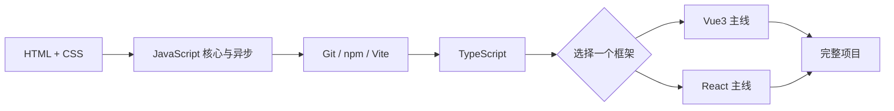

# coderwhy 2023 前端系统课

这是一套从原课程资料、代码、Xmind 和课堂笔记整理出的知识库。阅读笔记用于建立概念，项目验收用于确认真正掌握。

## 快速主线

## 核心主线

| 阶段 | 笔记入口 | 掌握目标 | 前置 |
|------|------|------|------|
| 01 | [[module-html-css\|HTML + CSS]] | 语义化、布局、响应式页面 | 无 |
| 02 | [[module-javascript-basics\|JavaScript 基础、DOM/BOM]] | 语法、DOM、事件、浏览器 API | 01 |
| 03 | [[module-javascript-advanced\|JavaScript 核心与异步]] | 原型、闭包、this、Promise、模块化 | 02 |
| 04 | [[module-frontend-engineering\|Git / npm / Vite 工程化]] | 版本控制、依赖管理、现代开发服务器 | 03 |
| 05 | [[module-typescript\|TypeScript]] | 类型系统、泛型、工具类型、工程配置 | 04 |
| 06A | [[module-vue3\|Vue3 主线（任选）]] | Composition API、Router、Pinia | 05 |
| 06B | [[module-react\|React 主线（任选）]] | JSX、Hooks、Router、状态管理 | 05 |
| 07 | [[PROJECT-PRACTICE\|完整项目与验收清单]] | 需求、组件、接口、测试、部署闭环 | 06A 或 06B |

## 按需专题

| 专题 | 入口 |
|------|------|
| jQuery 维护旧项目 | [[module-jquery\|jQuery 模块]] |
| 深入 Webpack / Gulp / Rollup | [[module-build-tools\|构建工具模块]] |
| 第二个前端框架 | [[module-react\|React 模块]] 或 [[module-vue3\|Vue3 模块]] |
| Node 服务端 | [[module-node-advanced\|Node 模块]] |
| SSR | [[module-ssr\|SSR 模块]] |
| 小程序与跨平台 | [[module-miniprogram\|小程序模块]] / [[module-uniapp-taro\|跨平台模块]] |
| 可视化 | [[module-visualization\|可视化模块]] |

## 学习方法

- 先读学习目标和正文，再合上答案完成自测题。
- 每个核心阶段完成对应项目；不能只以“看完笔记”作为完成标准。
- Vue 和 React 先选一个深入，另一个作为后续专题。
- 旧技术和工具原理按工作需要查阅，不阻塞主线进度。

## 参考

- [[00-course-map\|快速课程地图]]
- [[PROJECT-PRACTICE\|项目实践与验收清单]]
- [[reference/glossary\|术语表]]
- [[reference/cheatsheet\|速查表]]
