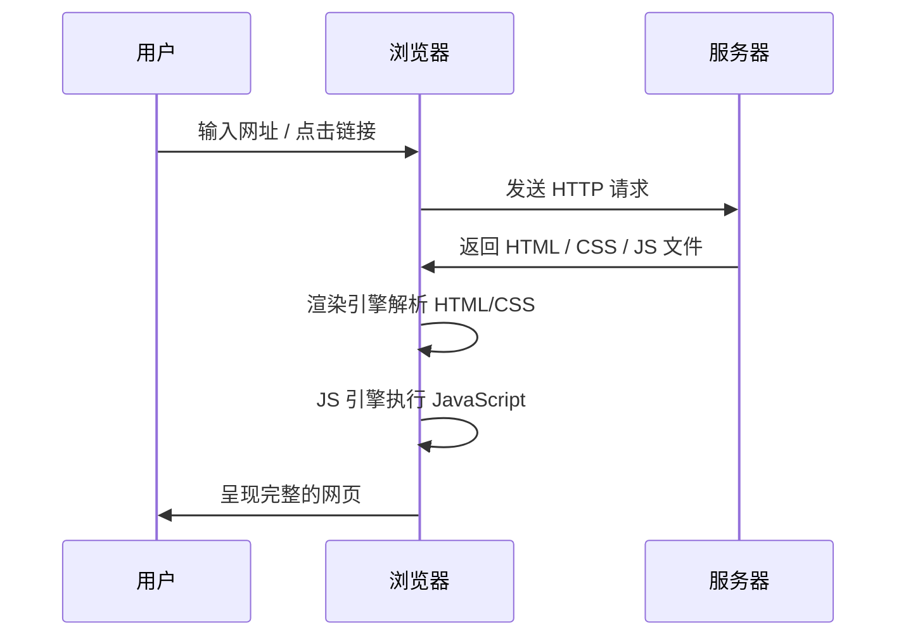

# 第01课：HTML+CSS 基础入门

## 学习目标

- 理解软件开发和前端开发的体系
- 掌握网页的显示过程和网页的组成部分
- 认识浏览器及其内核（渲染引擎）
- 使用 VSCode 开发第一个 HTML 网页
- 理解 HTML 元素的结构（标签、属性、嵌套）
- 初步了解 CSS 的作用和编写方式

---

## 一、邂逅前端开发

### 1.1 软件开发体系

一个完整的应用程序通常包含以下开发方向：

- **服务器开发**：后端逻辑、数据库、API
- **移动端开发**：iOS、Android
- **Web 开发**：浏览器端网页
- **桌面开发**：Windows、macOS（也可用 Electron 技术栈如 VSCode）

### 1.2 前端开发的任务

前端开发不只是写网页，还包括：

- **Web 开发**：网站 / Web 应用
- **小程序开发**：微信、支付宝等平台
- **移动端开发**：React Native、Flutter
- **桌面端开发**：Electron（VSCode、Slack）
- **服务器开发**：Node.js（全栈方向）

### 1.3 学习建议

- 学习新知识时，先了解它的**历史、局限性和本质**
- 对知识进行分类：
  - **常用知识**：必须非常熟练
  - **不常用知识**：知道有它，知道在哪里查

---

## 二、邂逅 Web 开发

### 2.1 网站与网页

- **网站**：由多个网页组成的集合
- **网页**：网站中的单个页面，由 HTML/CSS/JavaScript 构成

### 2.2 网页的显示过程



**从用户角度**：

1. 输入网址或点击链接
2. 浏览器向服务器发送请求
3. 服务器返回网页文件（HTML / CSS / JS）
4. 浏览器渲染并展示

**从服务器角度**：服务器是一台高性能计算机，存储着网页资源，通过网络协议（HTTP/HTTPS）响应客户端请求。

### 2.3 网页的三大组成部分

| 技术 | 作用 | 比喻 |
|------|------|------|
| **HTML** | 网页的结构 | 毛坯房的结构图纸 |
| **CSS** | 网页的样式（美化） | 装修风格 |
| **JavaScript** | 网页的交互（灵魂） | 水电智能系统 |

> [!NOTE]
> 本阶段课程主要学习 HTML 和 CSS，JavaScript 将在后续阶段深入学习。

---

## 三、浏览器和浏览器内核

### 3.1 常见浏览器

| 浏览器 | 内核（渲染引擎） |
|--------|----------------|
| Chrome | Blink（WebKit 分支） |
| Safari | WebKit |
| Firefox | Gecko |
| Edge | Blink（Chromium 内核） |

### 3.2 浏览器核心：渲染引擎

渲染引擎负责解析 HTML 和 CSS，生成最终的视觉页面。主要工作流程：

1. 解析 HTML 生成 DOM 树
2. 解析 CSS 生成 CSSOM 树
3. 合并生成渲染树（Render Tree）
4. 布局（Layout / Reflow）：计算元素位置和大小
5. 绘制（Paint）：将内容绘制到屏幕上

---

## 四、开发第一个网页

### 4.1 使用 VSCode

推荐安装插件：

- **Live Server**：实时预览网页
- **Prettier**：代码格式化
- **Auto Rename Tag**：自动重命名配对标签

### 4.2 HTML 基本结构

```html
<!DOCTYPE html>
<html>
  <head>
    <meta charset="UTF-8" />
    <title>我的第一个网页</title>
  </head>
  <body>
    <h1>欢迎来到 HTML 世界</h1>
    <p>这是我的第一个段落。</p>
  </body>
</html>
```

### 4.3 什么是 HTML

**HTML**（HyperText Markup Language）即**超文本标记语言**：

- **标记语言**：使用标签（标记）来描述内容
- **超文本**：超越了普通文本，可以包含图片、音频、视频、超链接等

### 4.4 剖析元素结构

```html
<!-- 一个完整的 HTML 元素 -->
<p class="intro">这是一段文字</p>
```

| 组成部分 | 说明 | 示例 |
|---------|------|------|
| 开始标签 | 包含元素名和属性 | `<p class="intro">` |
| 结束标签 | 以 `/` 开头 | `</p>` |
| 内容 | 标签包裹的文字或子元素 | `这是一段文字` |
| 属性 | 提供额外信息 | `class="intro"` |

### 4.5 元素的嵌套

元素可以嵌套（即一个元素内部包含其他元素），形成树形结构：

```html
<div>
  <h1>标题</h1>
  <p>段落内容</p>
</div>
```

> [!TIP]
> VSCode 中创建新 HTML 文件后，输入 `!` 并按下 Tab 键，可以快速生成 HTML 骨架。

### 4.6 HTML 注释

```html
<!-- 这是 HTML 注释，浏览器不会显示 -->
<p>可见内容</p>
```

快捷键：`Ctrl + /`（Windows/Linux）或 `Cmd + /`（Mac）

---

## 五、邂逅 CSS

### 5.1 CSS 是什么

**CSS**（Cascading Style Sheets）即**层叠样式表**，用来美化网页：

- 添加各种样式（颜色、字体、背景等）
- 控制布局（浮动、定位、弹性盒子等）

### 5.2 CSS 规则语法

```css
选择器 {
  属性名: 属性值;
}
```

示例：

```css
h1 {
  color: red;
  font-size: 32px;
}
```

### 5.3 三种 CSS 编写方式

| 方式 | 语法 | 适用场景 |
|------|------|---------|
| 内联样式 | `style="color: red"` | 单元素测试 |
| 内部样式 | `<style>` 标签在 head 中 | 单页面 |
| 外部样式 | `<link>` 引入 .css 文件 | 多页面复用（推荐） |

**内联样式**：

```html
<h1 style="color: blue; font-size: 24px;">蓝色标题</h1>
```

**内部样式**：

```html
<head>
  <style>
    h1 {
      color: green;
    }
  </style>
</head>
```

**外部样式**（推荐）：

```html
<head>
  <link rel="stylesheet" href="style.css" />
</head>
```

```css
/* style.css */
h1 {
  color: purple;
}
```

### 5.4 CSS 注释

```css
/* 这是 CSS 注释 */
p {
  color: gray;
}
```

---

## 六、常见的 CSS 属性

```css
div {
  font-size: 16px;      /* 字体大小 */
  color: #333;          /* 文字颜色 */
  background-color: #f0f0f0; /* 背景颜色 */
  width: 200px;         /* 宽度 */
  height: 100px;        /* 高度 */
}
```

---

## 自测问题

<details>
<summary>1. 网页的三大组成部分是什么？分别起什么作用？</summary>

HTML（结构）、CSS（样式）、JavaScript（交互）。
</details>

<details>
<summary>2. 什么是渲染引擎？Chrome 浏览器的渲染引擎是什么？</summary>

渲染引擎负责解析 HTML 和 CSS 并生成视觉页面。Chrome 使用 Blink 引擎（WebKit 分支）。
</details>

<details>
<summary>3. CSS 的三种编写方式分别是什么？推荐使用哪一种？</summary>

内联样式、内部样式、外部样式。推荐使用外部样式，便于多页面复用和维护。
</details>

<details>
<summary>4. HTML 元素由哪几个部分组成？</summary>

开始标签、结束标签、内容、属性。
</details>

<details>
<summary>5. 写出一个包含标题和段落的最小 HTML 文档。</summary>

```html
<!DOCTYPE html>
<html>
<head>
  <title>示例</title>
</head>
<body>
  <h1>标题</h1>
  <p>段落</p>
</body>
</html>
```

</details>

---

> 下一课：[[0002-html-elements|第02课：HTML 常见元素]]