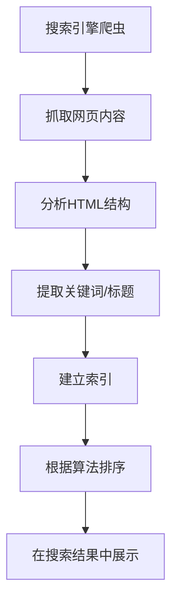
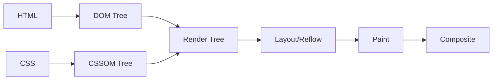

# 第03课：HTML 额外知识补充

## 学习目标

- 理解字符实体的作用并会使用常见字符实体
- 理解 URL 的组成格式
- 掌握 iframe 元素的使用
- 了解 SEO 优化原理
- 理解计算机中进制和颜色的表示方法
- 了解浏览器渲染流程

---

## 一、字符实体

### 1.1 为什么需要字符实体

在 HTML 中，某些字符有特殊含义（如 `<`、`>`、`&`），不能直接显示。例如：

```html
<!-- 这样写会被浏览器误认为是标签 -->
<p>1 < 2</p>   <!-- ❌ 浏览器会把 < 当作标签开始 -->
```

需要使用**字符实体**来表示这些特殊字符：

```html
<p>1 &lt; 2</p>  <!-- ✅ 正确显示 "1 < 2" -->
```

### 1.2 常见字符实体

| 显示结果 | 字符实体 | 说明 |
|---------|----------|------|
| ` ` | `&nbsp;` | 空格（non-breaking space） |
| `<` | `&lt;` | 小于号（less than） |
| `>` | `&gt;` | 大于号（greater than） |
| `&` | `&amp;` | 和号（ampersand） |
| `"` | `&quot;` | 双引号（quotation mark） |
| `'` | `&apos;` | 单引号（apostrophe） |
| `©` | `&copy;` | 版权符号 |
| `®` | `&reg;` | 注册商标 |

```html
<p>&copy; 2026 版权所有</p>
<p>HTML &amp; CSS 基础课程</p>
<p>价格：1999&nbsp;元（不断行空格）</p>
```

> [!TIP]
> `&nbsp;` 常用于防止单词换行，或在需要多个连续空格时使用。但排版布局建议用 CSS 的 `padding` 或 `margin` 代替。

---

## 二、URL

### 2.1 URL 和 URI 的区别

- **URI**（Uniform Resource Identifier）：统一资源标识符，用于标识一个资源
- **URL**（Uniform Resource Locator）：统一资源定位符，是 URI 的子集，除了标识还提供定位信息（网络地址）

简单理解：**URL 是 URI 的一种**，日常开发中大多数情况说的 URI 实际上就是 URL。

### 2.2 URL 的格式

```
协议://主机:端口/路径/文件名?查询#片段id
```

```mermaid
graph LR
    A[协议] --> B[://]
    B --> C[主机名]
    C --> D[:端口]
    D --> E[/路径]
    E --> F[?查询参数]
    F --> G[#片段ID]
```

**示例**：

```
https://www.example.com:443/products/index.html?category=phone&page=1#reviews
```

| 组成部分 | 说明 | 示例 |
|---------|------|------|
| 协议 | 通信规则 | `https://` |
| 主机 | 域名或 IP 地址 | `www.example.com` |
| 端口 | 服务器端口号（可省略） | `:443`（HTTPS 默认） |
| 路径 | 资源在服务器上的位置 | `/products/index.html` |
| 查询参数 | `?key=value` 形式，多个用 `&` 连接 | `?category=phone&page=1` |
| 片段 ID | 页面内锚点定位 | `#reviews` |

---

## 三、iframe 元素

### 3.1 iframe 基本使用

`iframe` 可以在当前页面中嵌入另一个网页：

```html
<iframe src="https://www.example.com" width="800" height="600"></iframe>
```

### 3.2 iframe 和 a 元素结合

```html
<!-- iframe 设置 name -->
<iframe name="content" width="100%" height="500"></iframe>

<!-- a 链接的 target 指向 iframe 的 name -->
<a href="page1.html" target="content">页面1</a>
<a href="page2.html" target="content">页面2</a>
```

点击链接时，页面会在 iframe 中打开。

### 3.3 iframe 的局限性

- 某些网页禁止被嵌套（通过 `X-Frame-Options` 响应头控制）
- 安全原因（点击劫持攻击）
- SEO 不友好

> [!NOTE]
> 现代前端开发中，iframe 使用较少，主要用于嵌入第三方内容（如地图、视频、支付页面）。

---

## 四、元素语义化和 SEO

### 4.1 SEO 优化原理

**SEO**（Search Engine Optimization，搜索引擎优化）的目的是让网站在搜索引擎结果中排名更靠前。

**SEO 流程**：



**前端 SEO 优化手段**：

1. 合理的语义化标签（`h1`、`nav`、`article` 等）
2. 设置正确的 `<title>` 和 `<meta description>`
3. 使用 `alt` 属性描述图片内容
4. 优化 URL 结构
5. 提升页面加载速度

### 4.2 meta 元素与 SEO

```html
<head>
  <meta charset="UTF-8" />
  <meta name="description" content="前端教程 - HTML CSS JavaScript 系统学习" />
  <meta name="keywords" content="前端, HTML, CSS, JavaScript" />
  <meta name="author" content="coderwhy" />
  <title>前端系统教程 | coderwhy</title>
</head>
```

---

## 五、进制和颜色表示

### 5.1 计算机中的进制

| 进制 | 基数 | 数字范围 | 表示方式 |
|------|------|---------|---------|
| 二进制 | 2 | 0~1 | `0b1010` |
| 八进制 | 8 | 0~7 | `0o12` |
| 十进制 | 10 | 0~9 | `10` |
| 十六进制 | 16 | 0~9, A~F | `0xA` 或 `#A` |

### 5.2 CSS 中的颜色表示

**颜色关键字**：

```css
color: red;
color: blue;
color: green;
color: transparent;
```

**RGB 十六进制**：

```css
/* #RRGGBB */
color: #ff0000;  /* 红色 */
color: #00ff00;  /* 绿色 */
color: #0000ff;  /* 蓝色 */
color: #000000;  /* 黑色 */
color: #ffffff;  /* 白色 */

/* 缩写：每两位相同可缩写 */
color: #ff0000 → #f00
color: #aabbcc → #abc
```

**RGB 函数**：

```css
color: rgb(255, 0, 0);     /* 红色 */
color: rgb(0, 255, 0);     /* 绿色 */
color: rgba(255, 0, 0, 0.5); /* 红色半透明 */
```

> [!TIP]
> RGB 取值范围：0~255（每个通道）。`rgba` 中的 `a` 是 alpha 通道，取值范围 0~1，表示透明度。

---

## 六、link 元素补充

```html
<!-- 链接网站图标 -->
<link rel="icon" href="favicon.ico" type="image/x-icon" />

<!-- 链接 CSS 样式表 -->
<link rel="stylesheet" href="style.css" />

<!-- DNS 预解析（优化加载速度） -->
<link rel="dns-prefetch" href="//cdn.example.com" />
```

---

## 七、浏览器的渲染流程



1. **解析 HTML** → 生成 DOM 树
2. **解析 CSS** → 生成 CSSOM 树
3. **合并** → 生成渲染树（Render Tree）
4. **布局** → 计算元素位置和大小（Layout/Reflow）
5. **绘制** → 将内容绘制到屏幕（Paint）
6. **合成** → 将图层合成最终页面（Composite）

> [!NOTE]
> 理解渲染流程对前端性能优化至关重要。例如，`transform` 和 `opacity` 的变化只触发 Composite，性能更好；而修改 `width`/`height` 会触发 Reflow，性能开销大。

---

## 自测问题

<details>
<summary>1. 写出小于号、大于号和空格的字符实体。</summary>

`&lt;`（小于号）、`&gt;`（大于号）、`&nbsp;`（空格）。
</details>

<details>
<summary>2. URL 由哪些部分组成？举例说明。</summary>

协议 + 主机 + 端口 + 路径 + 查询参数 + 片段ID。示例：`https://www.example.com:443/products?id=1#top`。
</details>

<details>
<summary>3. 什么是 SEO？前端可以从哪些方面优化 SEO？</summary>

搜索引擎优化。前端手段：使用语义化标签、设置 title 和 meta description、图片添加 alt、优化 URL 结构、提升页面速度。
</details>

<details>
<summary>4. 如何用十六进制表示红色？如何用 rgba 表示半透明的蓝色？</summary>

红色十六进制：`#ff0000` 或 `#f00`。半透明蓝色：`rgba(0, 0, 255, 0.5)`。
</details>

<details>
<summary>5. 浏览器渲染流程中，Reflow 和 Paint 分别指什么？</summary>

Reflow（布局）：计算元素的几何位置和大小。Paint（绘制）：将元素的内容绘制到屏幕上。
</details>

---

> 下一课：[[0004-css-intro|第04课：邂逅 CSS]]