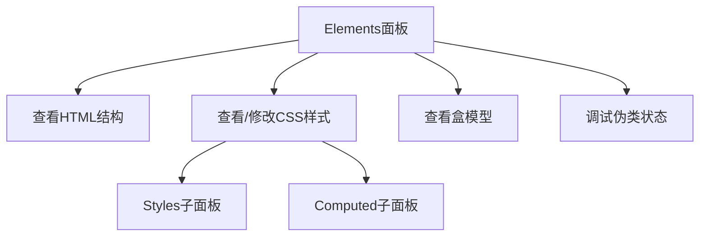

# 第04课：邂逅 CSS

## 学习目标

- 理解 CSS 的概念和作用
- 掌握 CSS 的三种引入方式（内联、内部、外部）
- 掌握基本 CSS 语法规则
- 了解常见 CSS 选择器（元素、类、id）
- 学会使用 Chrome 开发者工具调试 CSS

---

## 一、认识 CSS

### 1.1 CSS 是什么

**CSS**（Cascading Style Sheets，层叠样式表）是一种用于描述 HTML 文档样式的语言。

- **美化网页**：设置颜色、字体、背景、边框等
- **控制布局**：浮动、定位、弹性盒子、网格等
- **层叠**：多个样式规则可以同时作用于同一个元素，通过优先级决定最终效果

### 1.2 CSS 的历史

- CSS1（1996）：基本样式
- CSS2（1998）：定位、浮动等布局能力
- CSS3（2010+）：模块化发展，新增动画、变换、媒体查询、Flexbox/Grid 等

> [!NOTE]
> 现代 CSS 采用**模块化**方式发展，不再有 CSS4 的说法，而是各个模块独立升级版本。

### 1.3 CSS 规则语法

```css
选择器 {
  属性名1: 属性值1;
  属性名2: 属性值2;
  属性名3: 属性值3;
}
```

**示例**：

```css
h1 {
  color: red;
  font-size: 32px;
  text-align: center;
}
```

---

## 二、CSS 的三种编写方式

### 2.1 内联样式（Inline Styles）

直接在 HTML 元素的 `style` 属性中编写 CSS：

```html
<h1 style="color: blue; font-size: 24px;">蓝色标题</h1>
<p style="background-color: yellow; padding: 10px;">带背景的段落</p>
```

**特点**：
- 仅作用于当前元素
- 优先级高（仅次于 `!important`）
- 不利于复用和维护
- 不推荐在正式项目中使用

### 2.2 内部样式（Internal Styles）

在 `<head>` 中使用 `<style>` 标签：

```html
<!DOCTYPE html>
<html>
<head>
  <style>
    h1 {
      color: green;
      font-size: 28px;
    }
    p {
      color: #333;
      line-height: 1.6;
    }
  </style>
</head>
<body>
  <h1>绿色标题</h1>
  <p>深灰色段落文本。</p>
</body>
</html>
```

**特点**：
- 作用于当前页面的所有匹配元素
- 可用于单页面应用或邮件模板
- 多页面无法复用

### 2.3 外部样式（External Styles）

将 CSS 写在独立的 `.css` 文件中，通过 `<link>` 引入：

**index.html**：

```html
<!DOCTYPE html>
<html>
<head>
  <link rel="stylesheet" href="style.css" />
</head>
<body>
  <h1>外部样式标题</h1>
  <p>外部样式段落。</p>
</body>
</html>
```

**style.css**：

```css
h1 {
  color: purple;
  font-family: "Microsoft YaHei", sans-serif;
}
p {
  font-size: 16px;
  color: #666;
}
```

**特点**：
- **推荐使用**，实现结构与样式分离
- 多页面共享同一个 CSS 文件
- 浏览器可缓存 CSS 文件，提升加载速度

### 2.4 @import 方式

在 CSS 文件中引入另一个 CSS 文件：

```css
/* main.css */
@import url("reset.css");
@import url("theme.css");

body {
  font-family: sans-serif;
}
```

> [!WARNING]
> `@import` 会导致额外的 HTTP 请求，推荐使用 `<link>` 代替。

### 2.5 三种方式对比

| 方式 | 语法 | 复用性 | 优先级 | 推荐度 |
|------|------|--------|--------|--------|
| 内联样式 | `style="..."` | 不可复用 | 最高 | 不推荐 |
| 内部样式 | `<style>` 标签 | 当前页面 | 中等 | 单页面可用 |
| 外部样式 | `<link>` 引入 | 多页面共享 | 最低 | **强烈推荐** |

---

## 三、CSS 注释

```css
/* 这是单行注释 */

/*
  这是多行注释
  可以跨越多行
*/

/* 常用技巧：通过注释来标识不同区域 */
/* ========== 布局样式 ========== */
/* ========== 组件样式 ========== */
```

---

## 四、CSS 选择器入门

选择器用于选中 HTML 元素，以便应用样式。

### 4.1 元素选择器

```css
/* 选中所有 h1 元素 */
h1 {
  color: navy;
}

/* 选中所有 p 元素 */
p {
  font-size: 14px;
}
```

### 4.2 类选择器

```css
/* 选中所有 class="highlight" 的元素 */
.highlight {
  background-color: yellow;
}

/* 选中所有 class="error" 的元素 */
.error {
  color: red;
  font-weight: bold;
}
```

```html
<p class="highlight">高亮文本</p>
<p class="error">错误提示</p>
<p class="highlight error">既高亮又加粗的文本</p>
```

> [!TIP]
> 一个元素可以有多个类名，用空格分隔：`class="highlight error"`。

### 4.3 ID 选择器

```css
/* 选中 id="main-title" 的元素 */
#main-title {
  font-size: 36px;
  text-align: center;
}
```

```html
<h1 id="main-title">页面主标题</h1>
```

> [!WARNING]
> `id` 在页面中必须是**唯一**的。ID 选择器的优先级高于类选择器。

---

## 五、常见 CSS 属性速览

```css
div {
  /* 文本颜色 */
  color: #333;

  /* 背景颜色 */
  background-color: #f5f5f5;

  /* 字体大小 */
  font-size: 16px;

  /* 宽度和高度 */
  width: 200px;
  height: 100px;

  /* 边框 */
  border: 1px solid #ccc;

  /* 内外间距 */
  padding: 10px;
  margin: 10px;
}
```

---

## 六、Chrome 开发者工具

### 6.1 打开方式

- 右键网页 → 检查（Inspect）
- 快捷键：`F12` 或 `Ctrl + Shift + I`（Win）/ `Cmd + Option + I`（Mac）

### 6.2 Elements 面板



**常用操作**：

1. **查看元素**：点击左上角箭头图标，再点击页面元素
2. **修改样式**：在 Styles 面板中直接修改 CSS 值，实时预览
3. **添加样式**：在 Styles 面板点击空白处，输入新样式
4. **切换伪类**：点击 `:hov` 按钮，强制 `:hover`、`:active` 等状态
5. **查看盒模型**：在 Computed 面板下方查看 content/padding/border/margin

### 6.3 盒模型可视化

Chrome DevTools 的 Computed 面板下方会显示当前元素的盒模型示意图，直观展示 content、padding、border、margin 的尺寸。

---

## 七、案例：星球介绍页面

```html
<!DOCTYPE html>
<html>
<head>
  <style>
    .planet {
      width: 300px;
      background-color: #e8f4fd;
      border-radius: 10px;
      padding: 20px;
      margin: 20px;
    }
    .planet h2 {
      color: #2c3e50;
    }
    .planet p {
      color: #555;
      font-size: 14px;
    }
  </style>
</head>
<body>
  <div class="planet">
    <h2>地球</h2>
    <p>地球是太阳系八大行星之一，是人类目前已知唯一存在生命的行星。</p>
  </div>
  <div class="planet">
    <h2>火星</h2>
    <p>火星是太阳系由内往外数的第四颗行星，表面有氧化铁呈现红色。</p>
  </div>
</body>
</html>
```

---

## 自测问题

<details>
<summary>1. CSS 的全称是什么？它的作用是什么？</summary>

Cascading Style Sheets（层叠样式表）。用于美化网页（颜色、字体、背景等）和控制布局。
</details>

<details>
<summary>2. CSS 的三种引入方式分别是什么？推荐使用哪一种？</summary>

内联样式（`style` 属性）、内部样式（`<style>` 标签）、外部样式（`<link>` 引入 .css 文件）。推荐使用外部样式。
</details>

<details>
<summary>3. 元素选择器、类选择器、ID 选择器的语法分别是什么？</summary>

元素选择器：`h1 { }`；类选择器：`.class-name { }`；ID 选择器：`#id-name { }`。
</details>

<details>
<summary>4. 如何利用 Chrome 开发者工具调试 CSS？</summary>

打开 F12 → Elements 面板 → Styles 子面板，可以查看和实时修改元素的 CSS 属性。
</details>

<details>
<summary>5. 一个元素可以同时应用多个类吗？语法是什么？</summary>

可以。语法：`class="class1 class2"`，多个类名用空格分隔。
</details>

---

> 下一课：[[0005-css-text-font|第05课：CSS 文本和字体]]