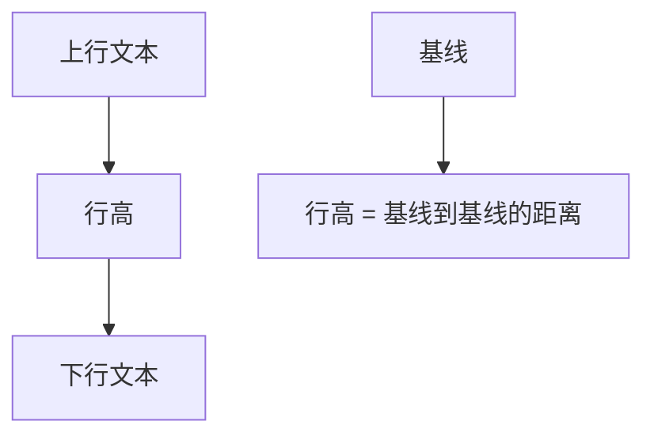

# 第05课：CSS 文本和字体

## 学习目标

- 掌握 CSS 文本相关属性（text-decoration、text-align、text-indent 等）
- 掌握 CSS 字体相关属性（font-size、font-family、font-weight 等）
- 理解 line-height 的含义和应用
- 掌握 font 缩写属性的使用
- 了解 em、rem 等单位

---

## 一、CSS 文本属性

### 1.1 text-decoration（文本装饰线）

```css
.underline {
  text-decoration: underline;   /* 下划线 */
}
.overline {
  text-decoration: overline;    /* 上划线 */
}
.line-through {
  text-decoration: line-through; /* 删除线 */
}
.none {
  text-decoration: none;        /* 无装饰线（常用于去除a标签下划线） */
}
```

```html
<p class="underline">这是下划线</p>
<p class="overline">这是上划线</p>
<p class="line-through">这是删除线</p>
<a href="#" class="none">没有下划线的链接</a>
```

> [!TIP]
> `text-decoration: none` 最常见的用途是去除 `a` 元素的默认下划线。

### 1.2 text-transform（文本大小写变换）

```css
.uppercase {
  text-transform: uppercase;  /* 全部大写 */
}
.lowercase {
  text-transform: lowercase;  /* 全部小写 */
}
.capitalize {
  text-transform: capitalize; /* 首字母大写 */
}
```

### 1.3 text-indent（首行缩进）

```css
p {
  text-indent: 2em;  /* 首行缩进2个字符 */
}
```

- `px`：具体的像素值
- `em`：相对单位，1em 等于当前字号的大小

```css
/* 字号16px，2em = 32px */
p {
  font-size: 16px;
  text-indent: 2em; /* 缩进32px */
}
```

### 1.4 text-align（文本对齐）

```css
.left {
  text-align: left;     /* 左对齐（默认） */
}
.center {
  text-align: center;   /* 居中对齐 */
}
.right {
  text-align: right;    /* 右对齐 */
}
.justify {
  text-align: justify;  /* 两端对齐 */
}
```

**text-align 的作用范围**：它作用于**块级元素**中的**行内内容**（文本、图片、行内级元素）。

```css
/* 让 div 中的文本居中 */
div {
  text-align: center;
}

/* 让 div 中的图片居中 */
div {
  text-align: center;
}

/* 让 div 中的行内块级元素居中 */
div {
  text-align: center;
}
```

> [!WARNING]
> `text-align: center` 只能让**行内级元素**居中，不能直接让**块级元素**居中。块级元素居中需用 `margin: 0 auto`。

### 1.5 letter-spacing 和 word-spacing

```css
.letter-spacing {
  letter-spacing: 5px;   /* 字符间距 */
}
.word-spacing {
  word-spacing: 10px;    /* 单词间距（对中文无效） */
}
```

---

## 二、CSS 字体属性

### 2.1 font-size（字体大小）

```css
.text-px {
  font-size: 20px;   /* 像素值 */
}
.text-em {
  font-size: 2em;    /* 相对父元素的字号 */
}
.text-rem {
  font-size: 2rem;   /* 相对根元素（html）的字号 */
}
.text-percent {
  font-size: 200%;   /* 相对于父元素字号的百分比 */
}
```

**常见取值**：

| 值 | 类型 | 说明 |
|----|------|------|
| `16px` | 绝对 | 最常用的像素值 |
| `1em` | 相对 | 相对于父元素的 font-size |
| `1rem` | 相对 | 相对于根元素（html）的 font-size |
| `100%` | 相对 | 相对于父元素的 font-size |

### 2.2 font-family（字体种类）

```css
body {
  font-family: "Microsoft YaHei", "PingFang SC", "Helvetica Neue", sans-serif;
}
```

**工作原理**：

1. 浏览器依次查找列表中字体
2. 如果在操作系统中找到该字体，就使用它
3. 都没找到则使用浏览器默认字体

**常见字体栈**：

```css
/* 无衬线字体（推荐） */
font-family: -apple-system, BlinkMacSystemFont, "Segoe UI", Roboto, "Helvetica Neue", Arial, "Noto Sans", sans-serif;

/* 中文字体 */
font-family: "PingFang SC", "Microsoft YaHei", "Hiragino Sans GB", sans-serif;

/* 衬线字体 */
font-family: Georgia, "Times New Roman", serif;

/* 等宽字体 */
font-family: "Courier New", Consolas, monospace;
```

> [!NOTE]
> `sans-serif`、`serif`、`monospace` 是通用字体族（generic family），是最后的后备选项，无需加引号。

### 2.3 font-weight（字体粗细）

```css
.bold {
  font-weight: bold;    /* 加粗，相当于 700 */
}
.normal {
  font-weight: normal;  /* 正常，相当于 400 */
}
.custom {
  font-weight: 600;     /* 数字：100~900 */
}
.lighter {
  font-weight: lighter; /* 更细 */
}
```

| 值 | 说明 |
|----|------|
| `normal` 或 `400` | 正常粗细 |
| `bold` 或 `700` | 加粗 |
| `100`~`900` | 数字值（需字体支持） |

### 2.4 font-style（字体风格）

```css
.italic {
  font-style: italic;   /* 斜体 */
}
.oblique {
  font-style: oblique;  /* 倾斜（类似斜体） */
}
```

> [!TIP]
> `italic` 是字体的斜体版本，`oblique` 是普通字体的倾斜。大多数浏览器中两者效果相似。

### 2.5 font-variant（小型大写字母）

```css
.small-caps {
  font-variant: small-caps;  /* 小写字母显示为小型大写字母 */
}
```

### 2.6 line-height（行高）

**定义**：两行文本基线（baseline）之间的距离。



```css
.line-height-px {
  line-height: 30px;     /* 固定值 */
}
.line-height-normal {
  line-height: normal;   /* 默认值，约1.2倍 */
}
.line-height-number {
  line-height: 1.5;      /* 相对于font-size的倍数 */
}
.line-height-percent {
  line-height: 150%;     /* 相对于font-size的百分比 */
}
```

**行高的应用场景**：

1. **文本垂直居中**：设置 `line-height` 等于容器 `height`

```css
.btn {
  height: 40px;
  line-height: 40px;   /* 文本垂直居中 */
}
```

2. **控制行间距**：设置合适的行高让阅读更舒适

```css
article {
  font-size: 16px;
  line-height: 1.8;    /* 舒适的行间距 */
}
```

**文本高度与行距**：

```
行距 = line-height - font-size

例如：font-size: 16px, line-height: 1.5
→ line-height = 16 × 1.5 = 24px
→ 行距 = 24 - 16 = 8px（上下各4px）
```

### 2.7 font 缩写属性

```css
/* 完整语法 */
font: font-style font-variant font-weight font-size/line-height font-family;

/* 常用写法 */
font: 16px/1.5 "Microsoft YaHei", sans-serif;
font: bold 20px/1.8 "PingFang SC", sans-serif;
font: italic normal 500 18px/1.6 "Helvetica Neue", sans-serif;
```

**注意事项**：

- `font-size` 和 `font-family` 是**必填项**
- `line-height` 通过 `/` 跟在 `font-size` 后面
- 其他属性可省略

```css
/* 正确 */
p {
  font: 16px/1.8 "Microsoft YaHei", sans-serif;
}

/* 错误 — 缺少 font-family */
p {
  font: 16px/1.8;
}
```

**与单独属性对比**：

```css
/* 单独属性 */
p {
  font-style: italic;
  font-weight: bold;
  font-size: 18px;
  line-height: 1.6;
  font-family: "Microsoft YaHei", sans-serif;
}

/* 缩写（等价） */
p {
  font: italic bold 18px/1.6 "Microsoft YaHei", sans-serif;
}
```

---

## 三、综合示例

```html
<!DOCTYPE html>
<html>
<head>
  <style>
    body {
      font: 16px/1.8 "PingFang SC", "Microsoft YaHei", sans-serif;
      color: #333;
    }
    h1 {
      font-size: 32px;
      font-weight: 700;
      text-align: center;
      text-decoration: underline;
    }
    .article {
      text-indent: 2em;
    }
    .highlight {
      font-weight: bold;
      color: #e74c3c;
    }
    .note {
      font-size: 14px;
      color: #999;
      text-align: right;
    }
  </style>
</head>
<body>
  <h1>CSS 文本与字体</h1>
  <p class="article">
    这是一段正文，首行缩进2个字符。<span class="highlight">这是高亮文本</span>，使用加粗和红色突出显示。
  </p>
  <p class="note">—— 排版示例</p>
</body>
</html>
```

---

## 自测问题

<details>
<summary>1. 如何让文本首行缩进2个字符？</summary>

使用 `text-indent: 2em;`，`2em` 相对于当前字号的两个字符宽度。
</details>

<details>
<summary>2. `line-height` 是什么？如何用 line-height 实现单行文本垂直居中？</summary>

行高是两行文本基线之间的距离。设置 `line-height` 等于容器 `height` 即可实现单行文本垂直居中。
</details>

<details>
<summary>3. `text-align: center` 能让块级元素居中吗？</summary>

不能。`text-align: center` 只对行内级内容（文本、行内元素、行内块级元素）有效。块级元素居中要用 `margin: 0 auto`。
</details>

<details>
<summary>4. font 缩写属性的必填项是什么？</summary>

`font-size` 和 `font-family` 是必填项。`line-height` 可选，用 `/` 跟在 `font-size` 后面。
</details>

<details>
<summary>5. `em` 和 `rem` 的区别是什么？</summary>

`em` 相对于父元素的 font-size；`rem` 相对于根元素（html）的 font-size。
</details>

---

> 下一课：[[0006-css-selectors|第06课：CSS 选择器详解]]