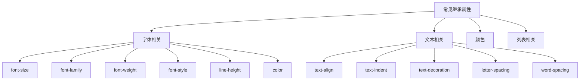
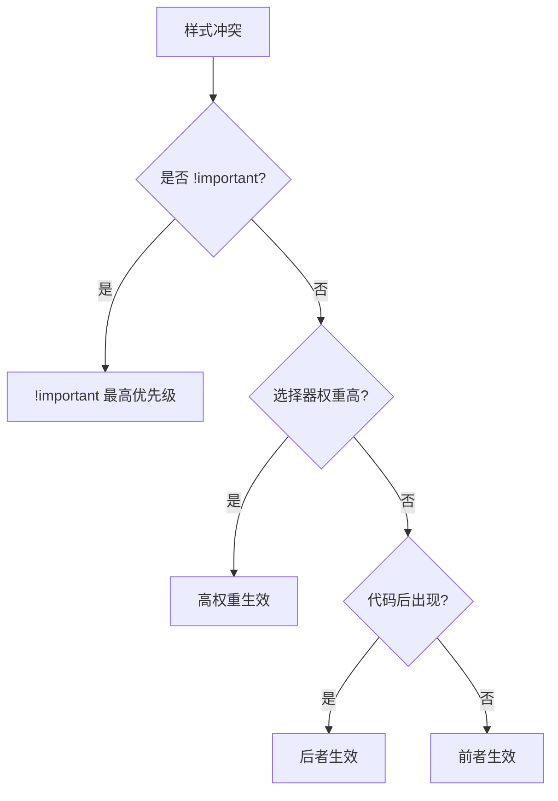
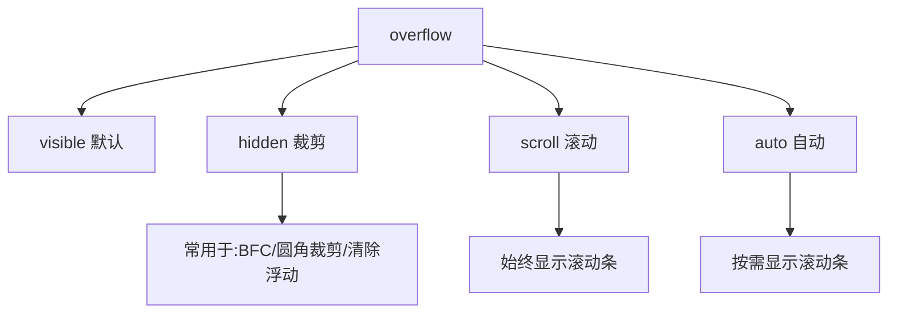

# 第07课：CSS 继承层叠与元素类型

## 学习目标

- 理解 CSS 属性的继承机制
- 掌握层叠的规则和优先级计算
- 掌握 display 属性（block / inline-block / inline）
- 理解元素类型的行为差异
- 掌握元素隐藏的多种方法及其区别
- 了解 HTML 嵌套规范

---

## 一、CSS 属性继承

### 1.1 什么是继承

如果给某个元素设置了某个 CSS 属性，而该属性具有**继承性**，那么该元素的所有**子元素**会默认继承该属性值。

```css
body {
  color: #333;           /* 子元素默认继承文字颜色 */
  font-family: "PingFang SC", sans-serif;  /* 子元素默认继承字体 */
  font-size: 16px;      /* 子元素默认继承字号 */
}

p {
  /* 没有设置 color，从 body 继承 #333 */
  /* 没有设置 font-family，从 body 继承 */
}
```

### 1.2 常见的继承属性



> [!TIP]
> 不需要记所有继承属性。规律是：**与文本/字体相关的属性**大多可继承；**与布局/盒模型相关的属性**（width、height、padding、border、margin）不可继承。不确定时查 MDN 文档。

### 1.3 显式继承

使用 `inherit` 关键字强制继承：

```css
a {
  color: inherit;  /* 强制继承父元素的颜色，即使 a 标签有默认颜色 */
}
button {
  font-family: inherit;  /* 强制继承字体 */
}
```

---

## 二、CSS 属性层叠

### 2.1 什么是层叠

同一个 CSS 属性可以对同一个元素设置多次，最终生效的值由**层叠规则**决定。

```css
/* 同一个属性设置了三次，哪个生效？ */
p {
  color: blue;
}

p {
  color: red;  /* 后面覆盖前面（优先级相同） */
}

.special {
  color: green; /* 类选择器优先级更高 ✅ */
}
```

### 2.2 层叠规则

当样式冲突时，按以下顺序判断：

1. **重要性**：`!important` 优先级最高
2. **选择器权重**：ID > 类/属性/伪类 > 元素
3. **代码顺序**：权重相同时，后面的覆盖前面的



### 2.3 权重计算

| 选择器 | 权重 |
|--------|------|
| `!important` | 10000 |
| 内联样式（`style=""`） | 1000 |
| ID 选择器 | 100 |
| 类选择器 / 伪类 / 属性选择器 | 10 |
| 元素选择器 / 伪元素 | 1 |
| 通配选择器 `*` | 0 |
| 继承的样式 | 无（被覆盖） |

**示例计算**：

```css
/* 权重：10 */
.container { color: red; }

/* 权重：1 */
div { color: blue; }

/* 权重：1 + 10 = 11 */
div .text { color: green; }

/* 权重：100 + 1 = 101 */
#main p { color: purple; }
```

> [!WARNING]
> 尽量避免使用 `!important`，它会破坏层叠规则，导致后续维护困难。

---

## 三、元素类型（display）

### 3.1 display 的三种基本值

| 值 | 特性 | 常见元素 |
|----|------|---------|
| `block` | 独占一行，可设置宽高，默认宽度 100% | div、p、h1~h6、ul、ol、li |
| `inline-block` | 同行显示，可设置宽高，默认宽高由内容决定 | img、input、button |
| `inline` | 同行显示，不可设置宽高，宽高由内容决定 | span、a、strong、em |

```css
/* 相互转换 */
div {
  display: inline;   /* 块级元素转为行内级 */
}

span {
  display: block;    /* 行内级元素转为块级 */
}

a {
  display: inline-block;  /* 行内级转为行内块级 */
}
```

### 3.2 块级元素（block）

```css
.block-demo {
  display: block;
  width: 300px;       /* ✅ 可设置宽度 */
  height: 150px;      /* ✅ 可设置高度 */
  margin: 20px;       /* ✅ 边距正常生效 */
  padding: 10px;      /* ✅ 内边距正常生效 */
}
```

- 独占一行（垂直排列）
- 可设置 width 和 height
- 默认宽度为父容器的 100%
- 默认高度由内容决定

### 3.3 行内级元素（inline）

```css
.inline-demo {
  display: inline;
  width: 200px;       /* ❌ 不生效 */
  height: 100px;      /* ❌ 不生效 */
  margin: 20px;       /* ⚠️ 只有左右 margin 生效 */
  padding: 10px;      /* ⚠️ padding 在垂直方向会覆盖但不占据空间 */
}
```

- 与其他行内级元素在同一行显示
- **不能设置宽度和高度**
- 宽高由内容决定
- 上下 `margin` 和 `padding` 不占据布局空间

### 3.4 行内块级元素（inline-block）

```css
.inline-block-demo {
  display: inline-block;
  width: 200px;       /* ✅ 可设置宽度 */
  height: 100px;      /* ✅ 可设置高度 */
  margin: 20px;       /* ✅ 边距正常生效 */
}
```

- 与其他行内级元素在同一行显示（不独占一行）
- 可设置宽度和高度
- 默认宽度由内容决定

---

## 四、元素的隐藏方法

| 方法 | 说明 | 是否占据空间 | 子元素影响 |
|------|------|-------------|-----------|
| `display: none` | 完全消失 | 不占据 | 全部隐藏 |
| `visibility: hidden` | 不可见 | 占据 | 全部隐藏 |
| `opacity: 0` | 透明 | 占据 | 全部透明 |
| `rgba()` 背景透明 | 仅背景透明 | 占据 | 不影响子元素 |

```css
.hidden-none {
  display: none;           /* 完全消失，不占空间 */
}

.hidden-visibility {
  visibility: hidden;      /* 不可见，但仍占空间 */
}

.hidden-opacity {
  opacity: 0;              /* 完全透明，但仍占空间，可交互 */
}

.hidden-rgba {
  background-color: rgba(255, 0, 0, 0.3);  /* 仅背景半透明 */
}
```

---

## 五、overflow

```css
.box {
  width: 200px;
  height: 100px;
  overflow: visible;  /* 默认值，溢出内容可见 */
  overflow: hidden;   /* 溢出内容裁剪 */
  overflow: scroll;   /* 始终显示滚动条 */
  overflow: auto;     /* 溢出时显示滚动条，否则不显示 */
  overflow: clip;     /* 类似 hidden，但不允许程序滚动 */
}
```



---

## 六、HTML 嵌套规范

```html
<!-- ✅ 正确 -->
<div>
  <p>段落内容</p>
  <span>行内元素</span>
</div>

<!-- ❌ 错误：p 元素不能嵌套块级元素 -->
<p>
  <div>不应该在 p 里面</div>
</p>

<!-- ❌ 错误：行内元素不能嵌套块级元素 -->
<span>
  <div>不应该在 span 里面</div>
</span>
```

**核心规则**：

1. **块级元素**可以嵌套其他元素（包括块级和行内级）
2. **`p` 元素**不能嵌套块级元素（包括 div 和其他块级元素）
3. **行内级元素**不能嵌套块级元素
4. `<a>` 标签可以嵌套块级元素（HTML5 中放宽限制）

---

## 自测问题

<details>
<summary>1. CSS 中哪些属性具有继承性？有什么规律？</summary>

与文本/字体相关的属性大多可继承，如 color、font-size、font-family、line-height、text-align 等。与盒模型/布局相关的属性不可继承。
</details>

<details>
<summary>2. 块级元素、行内级元素、行内块级元素的核心区别是什么？</summary>

块级元素独占一行，可设宽高；行内级元素同行显示，不可设宽高；行内块级元素同行显示，可设宽高。
</details>

<details>
<summary>3. `display: none` 和 `visibility: hidden` 有什么区别？</summary>

`display: none` 从文档流中移除，不占空间；`visibility: hidden` 只是不可见，仍占空间。
</details>

<details>
<summary>4. `opacity: 0` 和 `visibility: hidden` 有什么区别？</summary>

`opacity: 0` 使元素完全透明但仍可交互（如点击事件）；`visibility: hidden` 不可见且不可交互。两者都占据空间。
</details>

<details>
<summary>5. 选择器权重相同时，如何决定哪个样式生效？</summary>

权重相同时，后定义的样式覆盖先定义的样式（代码顺序决定）。
</details>

---

> 下一课：[[0008-css-box-model|第08课：CSS 盒子模型]]