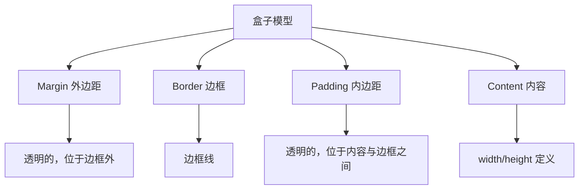
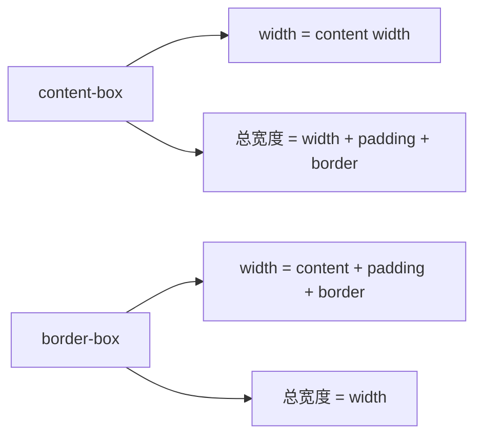

# 第08课：CSS 盒子模型

## 学习目标

- 理解盒子模型的四个组成部分
- 掌握 padding、border、margin 的使用
- 理解 margin 的传递和折叠问题
- 掌握 box-sizing 的作用和用法
- 掌握水平居中的不同方案
- 了解 outline、box-shadow、border-radius

---

## 一、认识盒子模型

### 1.1 什么是盒子模型

在 CSS 中，**每一个 HTML 元素都可以看作一个盒子**。这个盒子由四个部分组成：



**从内到外**：

```
Margin（外边距）
  ┌──────────────────────────────┐
  │  Border（边框）               │
  │  ┌────────────────────────┐  │
  │  │  Padding（内边距）       │  │
  │  │  ┌────────────────┐    │  │
  │  │  │  Content       │    │  │
  │  │  │  内容区域       │    │  │
  │  │  └────────────────┘    │  │
  │  └────────────────────────┘  │
  └──────────────────────────────┘
```

### 1.2 盒子模型属性

```css
div {
  width: 300px;        /* 内容区域宽度 */
  height: 200px;       /* 内容区域高度 */
  padding: 20px;       /* 内边距 */
  border: 2px solid #333;  /* 边框 */
  margin: 30px;        /* 外边距 */
}
```

---

## 二、Content（内容）

```css
.box {
  width: 300px;         /* 内容宽度 */
  height: 200px;        /* 内容高度 */
  min-width: 200px;     /* 最小宽度 */
  max-width: 500px;     /* 最大宽度 */
  min-height: 100px;    /* 最小高度 */
  max-height: 400px;    /* 最大高度 */
}
```

---

## 三、Padding（内边距）

### 3.1 语法

```css
/* 4个值：上 右 下 左（顺时针） */
padding: 10px 20px 30px 40px;

/* 3个值：上 左右 下 */
padding: 10px 20px 30px;

/* 2个值：上下 左右 */
padding: 10px 20px;

/* 1个值：四个方向相同 */
padding: 10px;
```

等价写法：

```css
padding-top: 10px;
padding-right: 20px;
padding-bottom: 10px;
padding-left: 20px;
```

### 3.2 padding 对盒子大小的影响

```css
.box {
  width: 200px;
  height: 100px;
  padding: 20px;
  /* 实际占用的宽度 = 200 + 20*2 = 240px */
  /* 实际占用的高度 = 100 + 20*2 = 140px */
}
```

> [!NOTE]
> padding 会增大盒子占用的空间。如果不想手动计算，可使用 `box-sizing: border-box`。

---

## 四、Border（边框）

### 4.1 三个要素

```css
border-width: 2px;        /* 边框粗细 */
border-style: solid;      /* 边框样式 */
border-color: #333;       /* 边框颜色 */

/* 缩写 */
border: 2px solid #333;
```

**border-style 取值**：

| 值 | 说明 |
|----|------|
| `none` | 无边框（默认） |
| `solid` | 实线 |
| `dashed` | 虚线 |
| `dotted` | 点线 |
| `double` | 双实线 |

**单独设置各方向**：

```css
border-top: 1px solid red;
border-right: 2px dashed blue;
border-bottom: 3px dotted green;
border-left: 4px double orange;
```

### 4.2 border-radius（圆角）

```css
.rounded {
  border-radius: 10px;         /* 四个角统一 */
}

.circle {
  width: 100px;
  height: 100px;
  border-radius: 50%;          /* 正圆 */
}

.radius-different {
  border-radius: 10px 20px 30px 40px;  /* 左上 右上 右下 左下 */
}
```

### 4.3 利用 border 制作三角形

```css
.triangle {
  width: 0;
  height: 0;
  border: 50px solid transparent;
  border-top-color: #e74c3c;   /* 只保留上边颜色 */
}
```

---

## 五、Margin（外边距）

### 5.1 基本用法

```css
/* 与 padding 语法相同 */
margin: 10px;                 /* 四个方向 */
margin: 10px 20px;            /* 上下 左右 */
margin: 10px 20px 30px;       /* 上 左右 下 */
margin: 10px 20px 30px 40px;  /* 上 右 下 左 */
```

### 5.2 margin 的传递

当父元素没有 `padding` 或 `border` 时，子元素的 `margin-top`/`margin-bottom` 会传递给父元素：

```html
<!-- 期望：子元素距离父元素顶部30px -->
<!-- 实际：父元素距离外部顶部30px，子元素紧贴父元素顶部 -->
<div class="parent">
  <div class="child">子元素</div>
</div>
```

```css
.parent {
  background-color: #f0f0f0;
  /* 没有 padding 或 border */
}
.child {
  margin-top: 30px;  /* 不会生效在子元素上，而是传递给了父元素 */
}
```

**解决方案**：

```css
/* 方案一：给父元素加 padding */
.parent {
  padding-top: 1px;
}

/* 方案二：给父元素加 border */
.parent {
  border-top: 1px solid transparent;
}

/* 方案三：触发父元素的 BFC */
.parent {
  overflow: hidden;
}
```

### 5.3 margin 的折叠

相邻两个块级元素的 `margin-top` 和 `margin-bottom` 会发生折叠（取较大值）：

```html
<div class="box1">第一个盒子（margin-bottom: 30px）</div>
<div class="box2">第二个盒子（margin-top: 20px）</div>
<!-- 两者间距 = max(30, 20) = 30px，不是 50px -->
```

```css
.box1 {
  margin-bottom: 30px;
}
.box2 {
  margin-top: 20px;
}
/* 实际间距 = 30px，不是 50px */
```

> [!TIP]
> 避免 margin 折叠的方法：将元素放到不同的 BFC 中，或只使用一个方向的外边距（建议只使用 `margin-bottom` 或 `margin-top` 之一）。

### 5.4 margin 水平居中

```css
.block-center {
  width: 300px;
  margin: 0 auto;      /* 水平居中（必须有宽度） */
}
```

---

## 六、box-sizing

### 6.1 content-box 和 border-box

```css
/* 默认值：width/height 只包含内容区域 */
.content-box {
  box-sizing: content-box;
  width: 200px;
  padding: 20px;
  border: 2px solid #333;
  /* 实际宽度 = 200 + 20*2 + 2*2 = 244px */
}

/* border-box：width/height 包含 padding 和 border */
.border-box {
  box-sizing: border-box;
  width: 200px;
  padding: 20px;
  border: 2px solid #333;
  /* 实际宽度 = 200px（padding 和 border 向内挤压内容区域） */
  /* 内容区域宽度 = 200 - 20*2 - 2*2 = 156px */
}
```



### 6.2 推荐用法

```css
/* 全局设置 border-box */
*, *::before, *::after {
  box-sizing: border-box;
}
```

> [!TIP]
> `box-sizing: border-box` 已被广泛接受为最佳实践，它让宽度设置更符合直觉。大多数 CSS 框架（如 Bootstrap）都默认使用它。

---

## 七、outline（外轮廓）

```css
.btn:focus {
  outline: 2px solid #3498db;  /* 聚焦时显示外轮廓 */
}

/* 通常去除输入框默认轮廓，用自定义样式代替 */
input {
  outline: none;
  border: 1px solid #ccc;
}
input:focus {
  border-color: #3498db;
}
```

`outline` 和 `border` 的区别：

- `outline` 不占据空间，不影响盒子大小
- `outline` 不能单独设置各边
- `outline` 不一定是矩形（某些浏览器中会跟随 border-radius）

---

## 八、box-shadow（盒子阴影）

```css
/* box-shadow: offset-x offset-y blur spread color inset */
.box-shadow {
  box-shadow: 5px 5px 10px 0 rgba(0, 0, 0, 0.3);
}

/* 常见阴影 */
.shadow-light {
  box-shadow: 0 2px 8px rgba(0, 0, 0, 0.1);
}

/* 多重阴影 */
.shadow-multi {
  box-shadow:
    0 2px 4px rgba(0, 0, 0, 0.1),
    0 8px 16px rgba(0, 0, 0, 0.1);
}
```

---

## 九、text-shadow（文字阴影）

```css
.text-shadow {
  text-shadow: 2px 2px 4px rgba(0, 0, 0, 0.3);
  /* offset-x offset-y blur color */
}
```

---

## 十、水平居中方案总结

| 元素类型 | 方案 |
|---------|------|
| 行内级元素（文本、span、img） | 父元素设置 `text-align: center` |
| 块级元素（有宽度） | 自身设置 `margin: 0 auto` |
| 块级元素（无宽度） | 父元素 `text-align: center`，子元素 `display: inline-block` |
| 多个行内块级元素 | 父元素 `text-align: center` |

```css
/* 行内级元素居中 */
.parent {
  text-align: center;
}

/* 块级元素居中 */
.child {
  width: 300px;
  margin: 0 auto;
}
```

---

## 自测问题

<details>
<summary>1. 盒子模型由外到内由哪四个部分组成？</summary>

Margin（外边距）→ Border（边框）→ Padding（内边距）→ Content（内容）
</details>

<details>
<summary>2. `box-sizing: border-box` 和 `content-box` 有什么区别？</summary>

`content-box`：width/height 只包含内容区域；`border-box`：width/height 包含内容 + padding + border，总宽度不变。
</details>

<details>
<summary>3. margin 的传递和折叠分别是什么？</summary>

传递：子元素的 margin-top 传递给父元素（父元素无 padding/border 时）。折叠：相邻两个块级元素的垂直 margin 取最大值。
</details>

<details>
<summary>4. 如何让一个块级元素水平居中？</summary>

设置固定的宽度，然后使用 `margin: 0 auto`。
</details>

<details>
<summary>5. `border-radius: 50%` 和固定的 px 值有什么区别？</summary>

`50%` 相对于盒子尺寸的百分比，宽高相等时为正圆。固定 px 值（如 `10px`）是固定的圆角大小，不会随盒子尺寸变化。
</details>

---

> 下一课：[[0009-css-background|第09课：CSS 背景设置]]