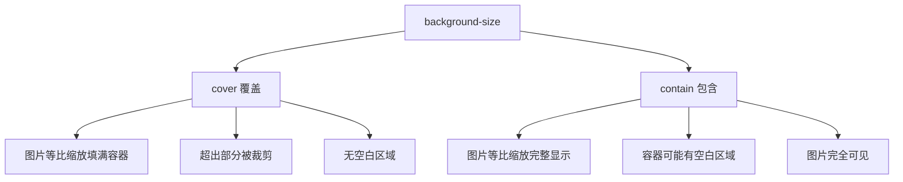
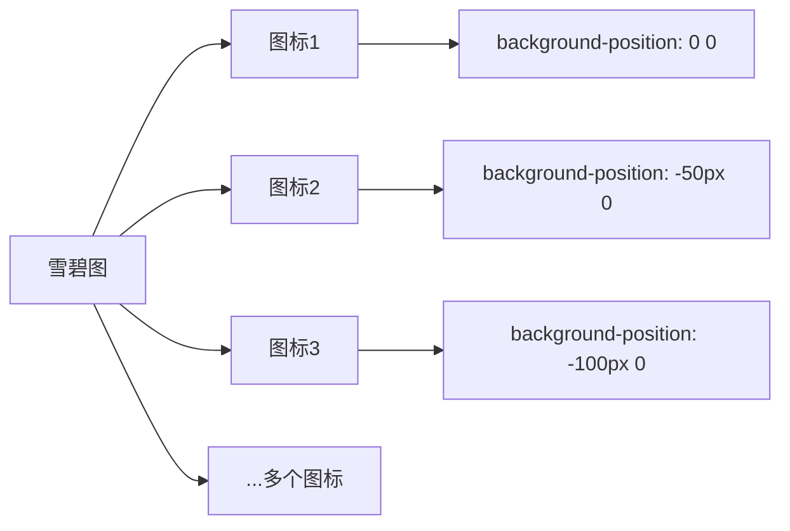

# 第09课：CSS 背景设置

## 学习目标

- 掌握 background 系列属性的使用
- 理解 background 缩写属性
- 了解 CSS Sprite（雪碧图）的原理和使用
- 了解网络字体 @font-face 的使用
- 了解字体图标的使用方法

---

## 一、background 系列属性

### 1.1 background-color（背景颜色）

```css
.bg-color {
  background-color: #3498db;
  background-color: rgb(52, 152, 219);
  background-color: rgba(52, 152, 219, 0.5);  /* 半透明 */
  background-color: transparent;  /* 透明（默认） */
}
```

### 1.2 background-image（背景图片）

```css
.bg-image {
  background-image: url("image.png");
  background-image: url("https://example.com/bg.jpg");

  /* 多个背景图片 */
  background-image: url("top.png"), url("bottom.png");

  /* 渐变色也是背景图片 */
  background-image: linear-gradient(to bottom, #3498db, #2ecc71);
}
```

### 1.3 background-repeat（背景重复）

```css
.bg-repeat {
  background-repeat: repeat;      /* 默认，平铺 */
  background-repeat: no-repeat;   /* 不平铺 */
  background-repeat: repeat-x;    /* 水平平铺 */
  background-repeat: repeat-y;    /* 垂直平铺 */
}
```

### 1.4 background-size（背景尺寸）

```css
.bg-size {
  /* 具体值 */
  background-size: 200px 100px;   /* 宽度200px，高度100px */

  /* 百分比 */
  background-size: 50% 50%;       /* 相对于元素尺寸的50% */

  /* 覆盖：保持比例，覆盖整个区域（可能裁剪） */
  background-size: cover;

  /* 包含：保持比例，完全显示（可能有空白） */
  background-size: contain;
}
```

**cover vs contain**：



### 1.5 background-position（背景定位）

```css
.bg-position {
  /* 关键字 */
  background-position: center;           /* 居中 */
  background-position: top left;         /* 左上 */
  background-position: center bottom;    /* 中下 */
  background-position: right center;     /* 右中 */

  /* 具体值 */
  background-position: 20px 30px;       /* 距左边20px，距顶部30px */

  /* 百分比 */
  background-position: 50% 50%;         /* 居中 */

  /* 混合 */
  background-position: right 20px bottom 30px;  /* 距右侧20px，距底部30px */
}
```

### 1.6 background-attachment（背景附着）

```css
.bg-attachment {
  background-attachment: scroll;   /* 默认，随页面滚动 */
  background-attachment: fixed;    /* 固定在视口 */
  background-attachment: local;    /* 随元素内容滚动 */
}
```

`background-attachment: fixed` 常用于创建**视差滚动**效果：

```css
.parallax {
  background-image: url("bg.jpg");
  background-attachment: fixed;
  background-size: cover;
  background-position: center;
  height: 500px;
}
```

### 1.7 background 缩写属性

```css
/* 完整顺序：color image repeat position/size attachment */
background: #f0f0f0 url("bg.png") no-repeat center/cover fixed;

/* 常用简写 */
background: #333;
background: url("bg.png") no-repeat center;
background: linear-gradient(#e74c3c, #c0392b);
```

**等价于**：

```css
background-color: #f0f0f0;
background-image: url("bg.png");
background-repeat: no-repeat;
background-position: center;
background-size: cover;
background-attachment: fixed;
```

### 1.8 background-image 和 img 的选择

| 场景 | 推荐方式 |
|------|---------|
| 内容性图片（产品图、头像） | `` 元素 |
| 装饰性图片（背景、花纹） | CSS `background-image` |
| 需要 SEO 优化的图片 | `` 元素（加 alt） |
| 需要打印的图片 | `` 元素 |
| 图标 | CSS 背景或字体图标 |

---

## 二、CSS Sprite（雪碧图 / 精灵图）

### 2.1 什么是雪碧图

将多个小图标合并到一张大图片中，通过 `background-position` 定位显示不同的图标。



### 2.2 使用示例

```css
.icon {
  width: 48px;
  height: 48px;
  background-image: url("sprites.png");
  background-repeat: no-repeat;
}

.icon-home {
  background-position: 0 0;          /* 第一个图标 */
}

.icon-user {
  background-position: -48px 0;      /* 第二个图标 */
}

.icon-settings {
  background-position: -96px 0;      /* 第三个图标 */
}
```

**优点**：
- 减少 HTTP 请求数
- 图片总大小比单张小图总和要小

**缺点**：
- 维护麻烦（增删图标需要重新制作雪碧图）
- 现代替代方案：字体图标、SVG sprite、HTTP/2 多路复用

---

## 三、网络字体（@font-face）

### 3.1 什么是网络字体

使用 CSS 的 `@font-face` 规则，加载服务器上的字体文件，使网页在用户的电脑上也能显示指定字体。

```css
/* 定义字体 */
@font-face {
  font-family: "MyFont";
  src: url("fonts/MyFont.woff2") format("woff2"),
       url("fonts/MyFont.woff") format("woff");
  font-weight: normal;
  font-style: normal;
}

/* 使用字体 */
body {
  font-family: "MyFont", "PingFang SC", sans-serif;
}
```

### 3.2 字体格式兼容性

```css
@font-face {
  font-family: "CustomFont";
  src: url("font.woff2") format("woff2"),   /* 现代浏览器 */
       url("font.woff") format("woff"),      /* 较老浏览器 */
       url("font.ttf") format("truetype");   /* 备选 */
}
```

> [!NOTE]
> WOFF2 是最推荐的网络字体格式，压缩率最高。可以使用字体转换工具（如 font-forge、transfonter.org）将 TTF 转为 WOFF2。

---

## 四、字体图标

### 4.1 什么是字体图标

字体图标将图标制作成字体文件，通过字符编码或 CSS 类名来显示图标。

**常用字体图标库**：

- [Font Awesome](https://fontawesome.com/)
- [Iconfont（阿里巴巴矢量图标库）](https://www.iconfont.cn/)
- [Material Icons](https://material.io/icons/)

### 4.2 使用字体图标

```html
<!-- 方式一：使用字符实体 -->
<i class="iconfont">&#xe60c;</i>

<!-- 方式二：使用类名（推荐） -->
<i class="iconfont icon-home"></i>
<i class="iconfont icon-user"></i>
<i class="iconfont icon-search"></i>
```

```css
/* 引入字体图标样式 */
@import url("//at.alicdn.com/t/font_xxxxx.css");

/* 自定义样式 */
.iconfont {
  font-size: 24px;
  color: #333;
}

.iconfont:hover {
  color: #3498db;
}
```

### 4.3 字体图标的优点

- **矢量缩放**：不会失真
- **CSS 控制**：可通过 CSS 改变颜色、大小、阴影
- **减少请求**：多个图标合并为一个字体文件

---

## 五、cursor 属性

```css
.cursor-pointer {
  cursor: pointer;      /* 手型（链接） */
}
.cursor-default {
  cursor: default;      /* 默认箭头 */
}
.cursor-text {
  cursor: text;         /* 文本输入 */
}
.cursor-move {
  cursor: move;         /* 移动 */
}
.cursor-not-allowed {
  cursor: not-allowed;  /* 不允许 */
}
.cursor-wait {
  cursor: wait;         /* 等待 */
}
.cursor-crosshair {
  cursor: crosshair;    /* 十字线 */
}
```

---

## 自测问题

<details>
<summary>1. `background-size: cover` 和 `contain` 的区别是什么？</summary>

`cover` 等比例缩放填满容器（可能裁剪）；`contain` 等比例缩放完整显示（可能有空白）。
</details>

<details>
<summary>2. 什么是 CSS Sprite？有什么优缺点？</summary>

雪碧图是将多个小图标合并到一张图片中，通过 background-position 定位显示不同图标。优点：减少 HTTP 请求；缺点：维护麻烦，增删图标需重新生成。
</details>

<details>
<summary>3. background 缩写属性的完整顺序是什么？</summary>

`background: color image repeat position/size attachment;`
</details>

<details>
<summary>4. `@font-face` 的作用是什么？写一个基本示例。</summary>

加载网络字体文件，使网页显示指定字体。示例：

```css
@font-face {
  font-family: "MyFont";
  src: url("font.woff2") format("woff2");
}
body { font-family: "MyFont", sans-serif; }
```

</details>

<details>
<summary>5. 装饰性图片应该使用 `img` 还是 `background-image`？</summary>

装饰性图片使用 CSS `background-image`；内容性图片（产品图、头像）使用 `` 元素。
</details>

---

> 下一课：[[0010-html-advanced|第10课：HTML 高级元素]]