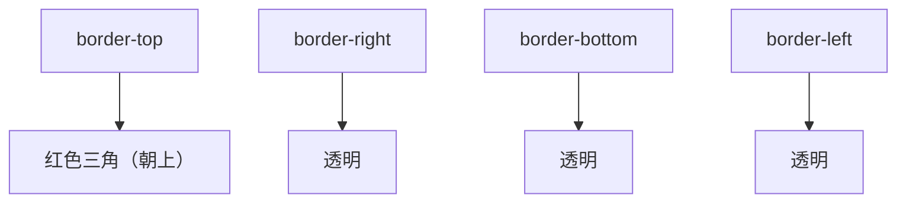

# 第11课：Emmet 和结构伪类

## 学习目标

- 掌握 Emmet 语法快速编写 HTML/CSS
- 掌握结构伪类选择器（nth-child、nth-of-type 等）
- 掌握否定伪类 :not() 的使用
- 了解利用 border 制作图形

---

## 一、Emmet 语法

Emmet 是 VSCode 内置的快速编写 HTML/CSS 的插件，通过缩写展开生成完整代码。

### 1.1 HTML 快速编写

```html
<!-- 输入 ! 然后按 Tab/Enter -->
<!-- 生成完整的 HTML 骨架 -->
```

| 缩写 | 展开结果 |
|------|---------|
| `!` | HTML5 文档骨架 |
| `div` | `<div></div>` |
| `p` | `<p></p>` |
| `a` | `<a href=""></a>` |
| `img` | `` |
| `input:text` | `<input type="text" name="" id="" />` |

### 1.2 嵌套语法

```html
<!-- > 子元素 -->
div>ul>li
<!-- 展开 -->
<div>
  <ul>
    <li></li>
  </ul>
</div>

<!-- + 兄弟元素 -->
div+p+bq
<!-- 展开 -->
<div></div>
<p></p>
<blockquote></blockquote>

<!-- ^ 上一级 -->
div>ul>li^div
<!-- 展开 -->
<div>
  <ul>
    <li></li>
  </ul>
  <div></div>
</div>

<!-- * 重复 -->
ul>li*5
<!-- 展开 -->
<ul>
  <li></li>
  <li></li>
  <li></li>
  <li></li>
  <li></li>
</ul>

<!-- () 分组 -->
div>(header>ul>li*2)+footer>p
<!-- 展开 -->
<div>
  <header>
    <ul>
      <li></li>
      <li></li>
    </ul>
  </header>
  <footer>
    <p></p>
  </footer>
</div>
```

### 1.3 属性和文本

```html
<!-- [] 属性 -->
a[href="https://example.com" target="_blank"]
<!-- 展开 -->
<a href="https://example.com" target="_blank"></a>

<!-- {} 文本 -->
p{这是段落文本}
<!-- 展开 -->
<p>这是段落文本</p>

<!-- 组合 -->
ul>li.item${列表项$}*3
<!-- 展开 -->
<ul>
  <li class="item1">列表项1</li>
  <li class="item2">列表项2</li>
  <li class="item3">列表项3</li>
</ul>
```

### 1.4 CSS 缩写

```css
/* CSS 属性缩写 */
w200     →  width: 200px;
h100     →  height: 100px;
m10      →  margin: 10px;
p20      →  padding: 20px;
bgc      →  background-color: #fff;
c        →  color: #000;
fs16     →  font-size: 16px;
fw700    →  font-weight: 700;
lh1.5    →  line-height: 1.5;
ta:c     →  text-align: center;
td:n     →  text-decoration: none;
db       →  display: block;
dib      →  display: inline-block;
di       →  display: inline;
bdt      →  border-top: ;
bgr:n    →  background-repeat: no-repeat;
bgz:cv   →  background-size: cover;
```

---

## 二、结构伪类

### 2.1 nth-child

`:nth-child()` 根据元素在其父元素中的**位置**来匹配元素。

```css
/* 第2个子元素 */
li:nth-child(2) { color: red; }

/* 所有奇数位置的子元素（第1、3、5...） */
li:nth-child(odd) { background: #f9f9f9; }
li:nth-child(2n+1) { background: #f9f9f9; }

/* 所有偶数位置的子元素（第2、4、6...） */
li:nth-child(even) { background: #eef; }
li:nth-child(2n) { background: #eef; }

/* 前3个 */
li:nth-child(-n+3) { border-bottom: 1px solid #ccc; }

/* 第2个到第5个 */
li:nth-child(n+2):nth-child(-n+5) { color: blue; }

/* 从第3个开始 */
li:nth-child(n+3) { color: green; }
```

### 2.2 nth-of-type

`:nth-of-type()` 根据元素在其父元素中**同类型元素**的位置来匹配：

```html
<div class="container">
  <p>第一个段落</p>
  <span>第一个span</span>
  <p>第二个段落</p>
  <span>第二个span</span>
  <p>第三个段落</p>
</div>
```

```css
/* 选中第二个 p（不是整体第二个子元素） */
.container p:nth-of-type(2) { color: red; }

/* 选中第二个 span */
.container span:nth-of-type(2) { color: blue; }
```

### 2.3 nth-child vs nth-of-type

```html
<div class="demo">
  <h2>标题</h2>
  <p>段落1</p>
  <p>段落2</p>
</div>
```

```css
/* nth-child(2)：寻找第二个子元素 */
.demo :nth-child(2) {
  color: red;  /* 选中「段落1」，因为它是第二个子元素 */
}

/* nth-of-type(2)：寻找第二个 p 元素 */
.demo p:nth-of-type(2) {
  color: blue;  /* 选中「段落2」，因为它是第二个 p */
}
```

### 2.4 其他结构伪类

```css
/* 第一个子元素 */
li:first-child { }

/* 最后一个子元素 */
li:last-child { }

/* 唯一子元素 */
p:only-child { }

/* 空元素（没有子节点） */
div:empty { display: none; }

/* 根元素（相当于 html） */
:root { }

/* 倒数第2个 */
li:nth-last-child(2) { }

/* 倒数第一个同类型元素 */
li:nth-last-of-type(1) { }
```

---

## 三、否定伪类 :not()

```css
/* 选中所有不是 .special 的 li */
li:not(.special) {
  color: #666;
}

/* 选中所有不是第一个的 p */
p:not(:first-child) {
  text-indent: 2em;
}

/* 选中所有没有被禁用的 input */
input:not([disabled]) {
  border-color: #3498db;
}
```

> [!NOTE]
> `:not()` 参数接受简单选择器（元素、类、ID、伪类等），不能接受组合选择器（如 `div .box`）。

---

## 四、利用 border 制作图形

### 4.1 三角形原理

边框交汇处是斜角连接的，当元素宽高为 0 时，四边形成四个三角形：

```css
.triangle {
  width: 0;
  height: 0;
  border: 50px solid transparent;
  border-top-color: #e74c3c;
  /* 结果：朝上的红色三角形 */
}
```



**各种方向的三角形**：

```css
/* 向上 */
.triangle-up {
  width: 0;
  height: 0;
  border-left: 30px solid transparent;
  border-right: 30px solid transparent;
  border-bottom: 40px solid #e74c3c;
}

/* 向下 */
.triangle-down {
  border-left: 30px solid transparent;
  border-right: 30px solid transparent;
  border-top: 40px solid #e74c3c;
}

/* 向左 */
.triangle-left {
  border-top: 30px solid transparent;
  border-bottom: 30px solid transparent;
  border-right: 40px solid #3498db;
}

/* 向右 */
.triangle-right {
  border-top: 30px solid transparent;
  border-bottom: 30px solid transparent;
  border-left: 40px solid #2ecc71;
}
```

---

## 五、Chrome 调试技巧

### 5.1 强制元素状态

在 Elements → Styles 面板中，点击 `:hov` 按钮，可以强制元素处于 `:hover`、`:active`、`:focus`、`:visited` 状态，方便调试动态伪类样式。

### 5.2 查看伪元素

在 Elements 面板中，伪元素（`::before`、`::after`）会显示在父元素下，可以查看和修改它们的样式。

---

## 自测问题

<details>
<summary>1. Emmet 中 `>`、`+`、`^`、`*` 分别代表什么？</summary>

`>` 子元素、`+` 兄弟元素、`^` 上一级、`*` 重复。
</details>

<details>
<summary>2. `:nth-child(2)` 和 `:nth-of-type(2)` 有什么区别？</summary>

`:nth-child(2)` 匹配父元素的第二个子元素（所有类型）；`:nth-of-type(2)` 匹配同类型中的第二个。
</details>

<details>
<summary>3. 如何用 nth-child 选中前 3 个元素？</summary>

`:nth-child(-n+3)`
</details>

<details>
<summary>4. 如何用 border 制作一个朝上的三角形？</summary>

```css
width: 0; height: 0;
border-left: 30px solid transparent;
border-right: 30px solid transparent;
border-bottom: 40px solid red;
```

</details>

<details>
<summary>5. `:not(.disabled)` 选中什么元素？</summary>

选中所有不包含 `disabled` 类的元素。
</details>

---

> 下一课：[[0012-css-positioning|第12课：CSS 元素定位]]