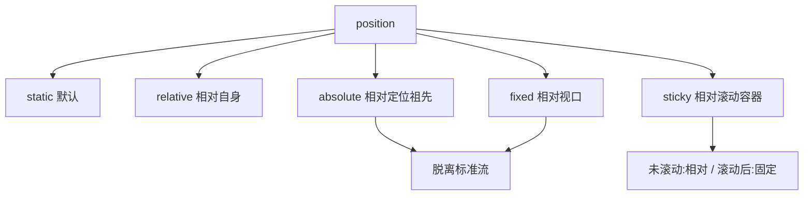
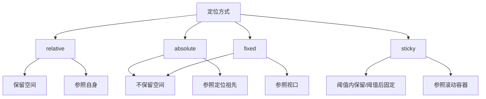

# 第12课：CSS 元素定位

## 学习目标

- 理解标准流（Normal Flow）的概念
- 掌握 position 的五个值（static/relative/absolute/fixed/sticky）
- 理解「子绝父相」布局模式
- 掌握定位元素的特性和脱离标准流的影响
- 掌握 z-index 的使用
- 理解包含块（Containing Block）的概念

---

## 一、标准流（Normal Flow）

默认情况下，元素按照**标准流**（Normal Flow）布局：

- **块级元素**：从上到下垂直排列（独占一行）
- **行内级元素**：从左到右水平排列

定位（position）和浮动（float）可以让元素脱离标准流，实现更灵活的布局。

---

## 二、position 属性总览

| 值 | 参照对象 | 是否脱离标准流 | 说明 |
|----|---------|--------------|------|
| `static` | 无 | 否 | 默认值，标准流定位 |
| `relative` | 自身原来的位置 | 否 | 相对定位，保留原位置空间 |
| `absolute` | 最近的定位祖先 | 是 | 绝对定位，不保留原空间 |
| `fixed` | 视口（viewport） | 是 | 固定定位，不随页面滚动 |
| `sticky` | 最近的滚动容器 | 特殊 | 粘性定位，相对/固定混合 |



---

## 三、相对定位 relative

### 3.1 基本用法

```css
.relative-box {
  position: relative;
  top: 30px;       /* 向下移动30px */
  left: 50px;      /* 向右移动50px */
  /* 或使用 right/bottom */
}
```

### 3.2 特性

1. **相对于自身原来的位置**进行偏移
2. **不脱离标准流**，原来的位置空间被保留
3. 可以使用 `top`、`right`、`bottom`、`left` 四个方向

```html
<div class="box">正常位置</div>
<div class="box relative">相对定位：向下30px，向右50px</div>
<div class="box">正常位置</div>
```

```css
.relative {
  position: relative;
  top: 30px;
  left: 50px;
}
/* 第二个 div 偏移后，第三个 div 不会填补第二个原来的位置 */
```

### 3.3 应用场景

- 微调元素位置
- 作为绝对定位元素的**参照容器**（子绝父相）

---

## 四、绝对定位 absolute

### 4.1 基本用法

```css
.absolute-box {
  position: absolute;
  top: 0;
  left: 0;
}
```

### 4.2 参照对象（包含块）

绝对定位元素的参照对象是**最近的祖先定位元素**（position 值不为 static 的祖先元素）。如果所有祖先都没有定位，则相对于**视口**（initial containing block）。

### 4.3 子绝父相

这是最常用的定位模式：

```html
<div class="parent">
  <div class="child">绝对定位的子元素</div>
</div>
```

```css
.parent {
  position: relative;   /* 父元素相对定位 */
  width: 400px;
  height: 300px;
  background: #f0f0f0;
}

.child {
  position: absolute;   /* 子元素绝对定位 */
  top: 20px;
  right: 20px;
  width: 100px;
  height: 50px;
  background: #3498db;
}
```

> [!TIP]
> 父元素也可以是 `absolute` 或 `fixed`，但最常用的是 `relative`（因为它不脱离标准流）。

### 4.4 绝对定位的特性

1. **脱离标准流**（不占据空间，后面的元素会上移填补）
2. 可以任意设置宽度和高度
3. 默认宽度和高度由**内容决定**（类似 inline-block）
4. **不再向父元素汇报宽高**（父元素无法感知子元素的存在）
5. 内部元素依然按照标准流布局
6. 可通过 `left + right + margin: auto` 实现居中

**水平居中公式**：

```css
/* 包含块的宽度 = left + right + margin-left + margin-right + width */
.child {
  position: absolute;
  left: 0;
  right: 0;
  width: 200px;
  margin: 0 auto;     /* 水平居中 */
}

/* 垂直居中 */
.child {
  position: absolute;
  top: 0;
  bottom: 0;
  height: 100px;
  margin: auto 0;     /* 垂直居中 */
}

/* 水平垂直同时居中 */
.child {
  position: absolute;
  inset: 0;           /* 相当于 top:0; right:0; bottom:0; left:0; */
  width: 200px;
  height: 100px;
  margin: auto;
}
```

### 4.5 案例：网易云音乐卡片

```html
<div class="music-card">
  
  <span class="play-count">▶ 12.5万</span>
  <span class="duration">03:45</span>
</div>
```

```css
.music-card {
  position: relative;
  width: 200px;
}

.music-card img {
  width: 100%;
  display: block;
}

.play-count {
  position: absolute;
  top: 5px;
  right: 8px;
  color: white;
  font-size: 12px;
}

.duration {
  position: absolute;
  bottom: 5px;
  right: 8px;
  color: white;
  font-size: 12px;
}
```

---

## 五、固定定位 fixed

### 5.1 基本用法

```css
.fixed-header {
  position: fixed;
  top: 0;
  left: 0;
  right: 0;
  height: 60px;
  background: #333;
  color: white;
  z-index: 100;
}

.fixed-back-to-top {
  position: fixed;
  bottom: 30px;
  right: 30px;
  width: 50px;
  height: 50px;
  background: #3498db;
  border-radius: 50%;
}
```

### 5.2 特性

1. **脱离标准流**
2. 参照对象始终是**视口**（viewport）
3. **不随页面滚动**而移动
4. 可以任意设置宽高，宽度默认由内容决定

### 5.3 应用场景

- 固定导航栏（顶部）
- 回到顶部按钮
- 侧边悬浮广告
- 固定底部栏

```css
/* 固定底部导航 */
.fixed-bottom {
  position: fixed;
  bottom: 0;
  left: 0;
  right: 0;
  height: 50px;
  background: #fff;
  border-top: 1px solid #eee;
}
```

---

## 六、粘性定位 sticky

### 6.1 基本用法

```css
.sticky-nav {
  position: sticky;
  top: 0;          /* 当距离视口顶部0px时固定 */
  background: #fff;
  z-index: 10;
}
```

### 6.2 特性

1. **混合了 relative 和 fixed** 的行为
2. 未达到阈值时，表现为相对定位（relative）
3. 达到阈值后（如 `top: 0`），表现为固定定位（fixed）
4. 参照对象是**最近的滚动容器**

```html
<div class="container">
  <section>
    <h2 class="sticky-title">第一部分</h2>
    <p>内容...</p>
  </section>
  <section>
    <h2 class="sticky-title">第二部分</h2>
    <p>内容...</p>
  </section>
</div>
```

```css
.sticky-title {
  position: sticky;
  top: 0;
  background: #f5f5f5;
  padding: 10px;
}
/* 滚动时，标题会吸附在顶部，直到下一个标题将其顶走 */
```

---

## 七、z-index

`z-index` 控制定位元素的**层叠顺序**（谁在上面）。

```css
.box1 {
  position: absolute;
  z-index: 10;   /* 在上面 */
}

.box2 {
  position: absolute;
  z-index: 5;    /* 在下面 */
}
```

### 规则

1. 只对**定位元素**（position 不为 static）有效
2. **兄弟元素**之间比较 z-index，数值大的在上面
3. 默认值为 `auto`（相当于 0）
4. 父子关系时，子元素在父元素之上

```html
<div class="parent" style="position: relative; z-index: 1;">
  <div class="child" style="position: absolute; z-index: 999;">
    子元素在父元素之上
  </div>
</div>
<div class="sibling" style="position: relative; z-index: 2;">
  兄弟元素 z-index 更大，在第一个父元素之上
  <!-- 但子元素（z-index: 999）依然在兄弟之上吗？不，子元素受父元素 z-index 约束 -->
</div>
```

> [!WARNING]
> z-index 的比较发生在**同一个层叠上下文**中。父元素的 z-index 会影响子元素的层叠顺序。不要设置过大的 z-index 值（如 99999），使用 10 以内的递进即可。

---

## 八、定位元素总结



---

## 自测问题

<details>
<summary>1. 相对定位（relative）和绝对定位（absolute）的主要区别是什么？</summary>

relative 相对于自身原位置偏移，不脱离标准流（保留原空间）；absolute 相对于最近的定位祖先，脱离标准流（不保留空间）。
</details>

<details>
<summary>2. 什么是「子绝父相」？</summary>

子元素使用 absolute 定位，父元素使用 relative 定位。这样子元素相对于父元素定位，而父元素仍保留在标准流中。
</details>

<details>
<summary>3. 固定定位（fixed）的参照对象是什么？</summary>

视口（viewport），与页面滚动无关。
</details>

<details>
<summary>4. `z-index` 对哪些元素有效？</summary>

只对定位元素（position 不为 static）有效。
</details>

<details>
<summary>5. 如何利用 absolute 实现元素的水平垂直居中？</summary>

```css
.element {
  position: absolute;
  inset: 0;
  width: 200px;
  height: 100px;
  margin: auto;
}
```

</details>

---

> 下一课：[[0013-css-float|第13课：CSS 浮动]]