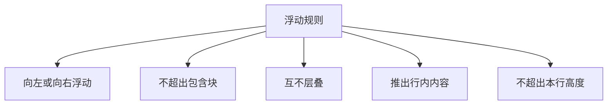
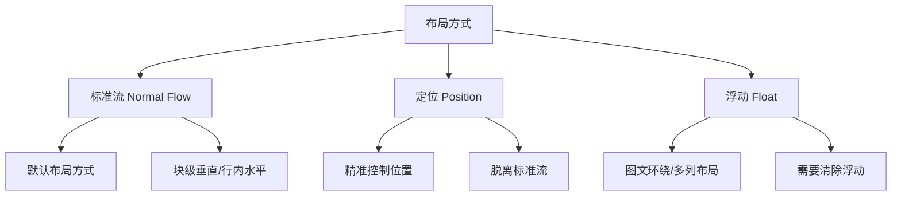

# 第13课：CSS 浮动

## 学习目标

- 理解浮动的设计初衷（图文环绕）
- 掌握 float 的取值和浮动规则
- 掌握清除浮动的多种方法
- 理解 BFC 的概念和应用
- 了解标准流、定位、浮动三种布局方式的对比

---

## 一、认识浮动

### 1.1 浮动的设计初衷

浮动（float）最初的设计目的是实现**图文环绕效果**——让文字环绕在图片周围。

```css
img {
  float: left;
  margin-right: 10px;
}
```

```html
<div>
  
  <p>这段文字会环绕在图片的右侧和下方显示，形成图文环绕的效果。浮动最初就是为了实现这种布局而设计的。</p>
</div>
```

### 1.2 float 取值

```css
float: none;   /* 默认值，不浮动 */
float: left;   /* 向左浮动 */
float: right;  /* 向右浮动 */
```

---

## 二、浮动规则

### 规则一：向左或向右浮动

元素会向左或向右移动，直到碰到父元素的边缘或另一个浮动元素的边缘。

### 规则二：不能超出包含块

浮动元素的左边界（左浮）或右边界（右浮）不会超出包含块的边界。

### 规则三：浮动元素不能层叠

浮动元素之间不会相互覆盖，它们会水平排列，一行装不下时自动换行。

### 规则四：行内级元素被推出（图文环绕）

浮动元素会将其后的行内级内容（文本、行内元素）推开，形成环绕效果。

### 规则五：浮动不能超出本行的高度



```css
/* 基本浮动布局 */
.float-left {
  float: left;
  width: 100px;
  height: 100px;
  margin: 10px;
  background: #3498db;
}

.float-right {
  float: right;
  width: 100px;
  height: 100px;
  margin: 10px;
  background: #e74c3c;
}
```

---

## 三、浮动的问题：高度塌陷

### 3.1 什么是高度塌陷

当父元素的所有子元素都浮动时，父元素会失去高度（高度为 0），因为浮动元素脱离了标准流。

```html
<div class="parent">
  <div class="child">浮动元素</div>
  <div class="child">浮动元素</div>
</div>
```

```css
.parent {
  border: 2px solid #333;
  /* 没有设置高度，子元素都浮动时，父元素高度为0 */
}

.child {
  float: left;
  width: 100px;
  height: 100px;
  background: #3498db;
}
```

### 3.2 清除浮动的多种方法

#### 方法一：在父元素末尾添加空元素并清除浮动

```html
<div class="parent">
  <div class="child">浮动元素</div>
  <div class="child">浮动元素</div>
  <div style="clear: both;"></div>  <!-- 添加空元素 -->
</div>
```

#### 方法二：使用伪元素清除浮动（推荐）

```css
.clearfix::after {
  content: "";
  display: block;
  clear: both;
}
```

```html
<div class="parent clearfix">
  <div class="child">浮动元素</div>
  <div class="child">浮动元素</div>
</div>
```

#### 方法三：触发父元素的 BFC

```css
.parent {
  overflow: hidden;    /* 或 auto / scroll */
  /* 或 display: flow-root; */
}
```

#### 方法四：父元素也浮动（不推荐）

```css
.parent {
  float: left;
}
```

#### 方法五：父元素固定高度

```css
.parent {
  height: 100px;    /* 不灵活，不推荐 */
}
```

> [!TIP]
> 推荐使用方法二（清除浮动的通用类 `.clearfix`）。它在保持语义化的同时，兼容性最好。

---

## 四、BFC（Block Formatting Context）

### 4.1 什么是 FC

**FC**（Formatting Context，格式化上下文）是 CSS 渲染时的一块区域，它决定了区域内元素如何布局以及与其他区域的交互。

- **BFC**（Block Formatting Context）：块级格式化上下文
- **IFC**（Inline Formatting Context）：行内格式化上下文

### 4.2 什么是 BFC

BFC 是一个独立的渲染区域，**内部的元素布局不会影响外部**。

### 4.3 触发 BFC 的条件

```css
/* 以下任意一个属性都能触发 BFC */
float: left / right;
overflow: hidden / auto / scroll;
display: inline-block / flow-root / table-cell / flex / grid;
position: absolute / fixed;
```

### 4.4 BFC 的应用

**1. 清除浮动高度塌陷**：

```css
.parent {
  overflow: hidden;  /* 触发 BFC，使父元素包含浮动子元素的高度 */
}
```

**2. 防止 margin 折叠**：

```css
/* 将两个兄弟元素放在不同的 BFC 中，防止 margin 折叠 */
.box1 {
  margin-bottom: 30px;
}

.box2-wrapper {
  overflow: hidden;  /* 触发 BFC */
}
.box2 {
  margin-top: 20px;
}
```

**3. 防止元素被浮动元素覆盖**：

```css
.float-box {
  float: left;
  width: 200px;
  height: 200px;
}

.text-box {
  overflow: hidden;  /* 触发 BFC，不环绕浮动元素 */
}
```

### 4.5 BFC 的布局规则

1. BFC 内部块级元素从上到下垂直排列
2. 同一 BFC 中相邻元素的 margin 会折叠
3. BFC 的区域不会与浮动元素重叠
4. BFC 在计算高度时，会包含内部的浮动元素

---

## 五、浮动案例练习

### 5.1 去除图片底部间隙

```css
/* 方法一：将图片设为块级 */
img {
  display: block;
}

/* 方法二：设置 vertical-align */
img {
  vertical-align: bottom;
}
```

### 5.2 百度页码

```html
<div class="pagination">
  <a href="#" class="prev">上一页</a>
  <a href="#">1</a>
  <a href="#" class="active">2</a>
  <a href="#">3</a>
  <a href="#">4</a>
  <a href="#">5</a>
  <a href="#" class="next">下一页</a>
</div>
```

```css
.pagination {
  overflow: hidden;  /* 或使用 clearfix */
}

.pagination a {
  float: left;
  padding: 5px 12px;
  margin: 0 2px;
  border: 1px solid #ddd;
  color: #333;
  text-decoration: none;
}

.pagination a.active {
  background: #4a90d9;
  color: #fff;
  border-color: #4a90d9;
}
```

### 5.3 京东多列布局

```css
.item {
  float: left;
  width: 25%;        /* 四列布局 */
  padding: 10px;
  box-sizing: border-box;
}

/* 响应式：两列布局 */
@media (max-width: 768px) {
  .item {
    width: 50%;
  }
}
```

---

## 六、三种布局方式对比



| 布局方式 | 优点 | 缺点 | 适用场景 |
|---------|------|------|---------|
| 标准流 | 简单、默认 | 布局能力有限 | 常规文档流 |
| 定位（position） | 精准控制位置 | 脱离标准流，可能覆盖其他元素 | 弹窗、固定导航、微调 |
| 浮动（float） | 图文环绕、多列 | 需要清除浮动，有副作用 | 图文混合、早期多列布局 |
| Flex（下节课） | 灵活的一维布局 | 不支持二维 | 现代一维布局 |
| Grid（后续） | 强大的二维布局 | 学习成本高 | 复杂网格布局 |

> [!NOTE]
> 在现代前端开发中，大部分浮动的布局场景已被 Flexbox 和 Grid 取代。浮动主要用于**图文环绕**等特定场景。

---

## 自测问题

<details>
<summary>1. 浮动的设计初衷是什么？</summary>

实现图文环绕效果——让文字环绕在图片周围。
</details>

<details>
<summary>2. 浮动会导致什么问题？</summary>

父元素高度塌陷：子元素浮动后脱离标准流，父元素无法感知子元素的高度。
</details>

<details>
<summary>3. 写出推荐的浮动清除方法。</summary>

使用 `.clearfix::after { content: ""; display: block; clear: both; }` 伪元素方法。
</details>

<details>
<summary>4. 什么是 BFC？如何触发 BFC？</summary>

BFC（块级格式化上下文）是一个独立的渲染区域。触发方式包括：float、overflow: hidden、display: inline-block/flex/flow-root、position: absolute/fixed 等。
</details>

<details>
<summary>5. BFC 有哪些应用场景？</summary>

清除浮动高度塌陷、防止 margin 折叠、防止元素被浮动元素覆盖。
</details>

---

> 下一课：[[0014-flexbox-grid|第14课：Flex 和 Grid 布局]]