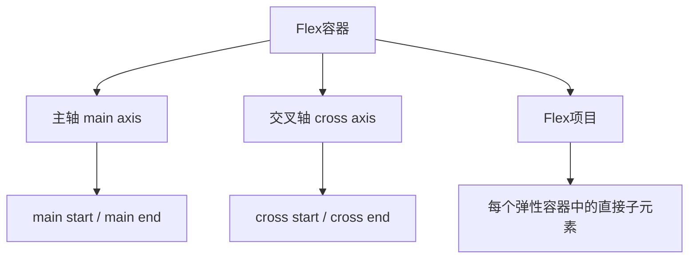
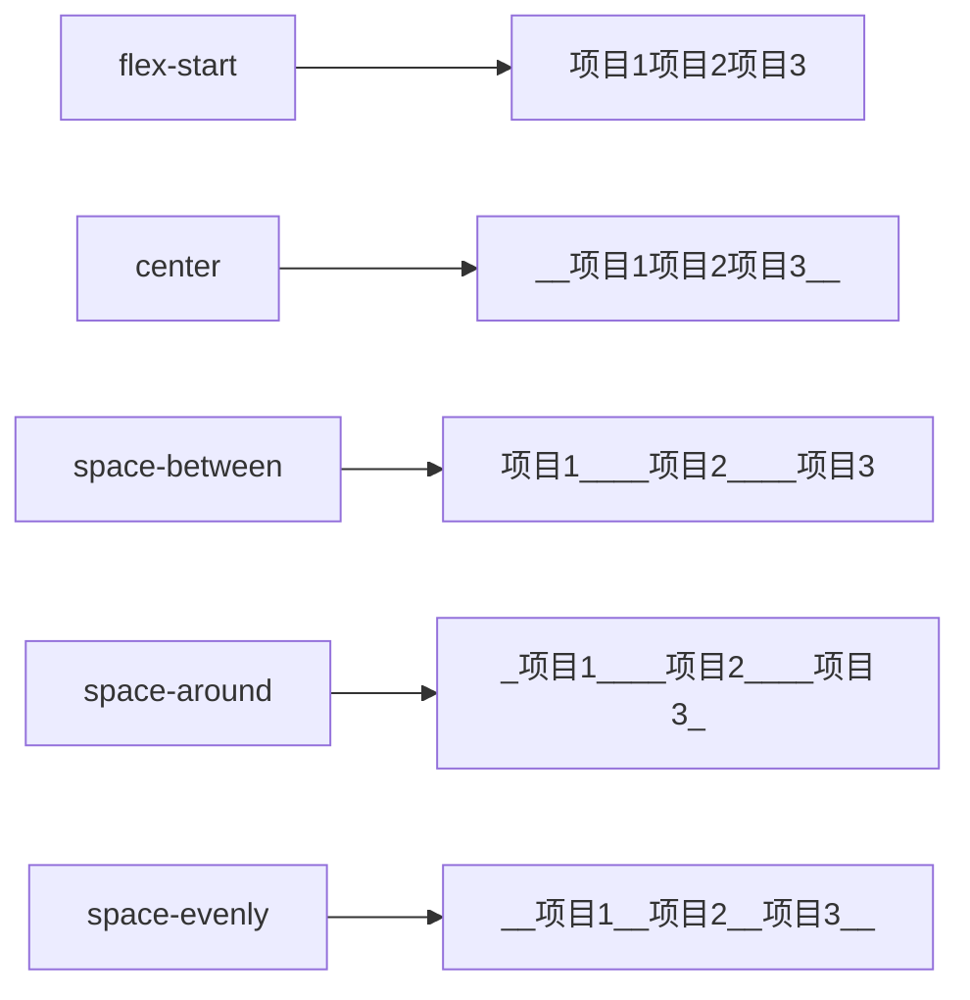
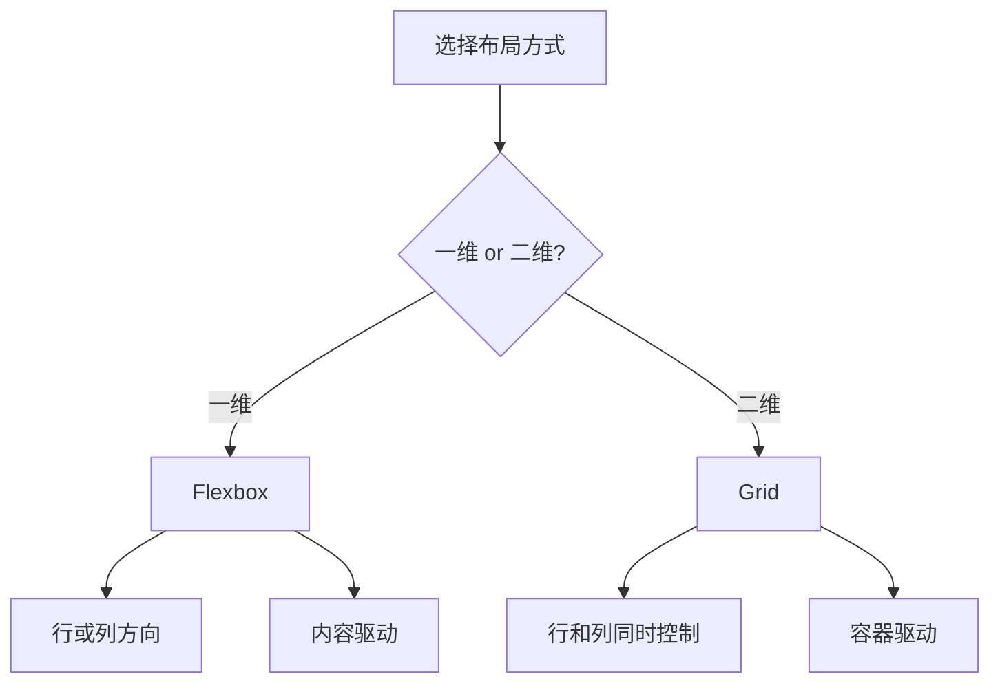

# 第14课：Flex 和 Grid 布局

## 学习目标

- 理解 Flex 布局的核心概念
- 掌握 Flex 容器的所有属性
- 掌握 Flex 项目的所有属性
- 理解 Grid 布局的基本概念
- 学会选择合适的布局方式

---

## 一、Flex 布局概述

### 1.1 认识 Flex 布局

Flex（Flexible Box，弹性盒子）是一种**一维**布局模型，专注于在行或列方向上分配空间和对齐元素。

```css
/* 开启 Flex 布局 */
.container {
  display: flex;   /* 块级弹性容器 */
  /* 或 display: inline-flex; 行内级弹性容器 */
}
```

### 1.2 Flex 布局的核心概念



- **主轴（Main Axis）**：由 `flex-direction` 决定方向
- **交叉轴（Cross Axis）**：与主轴垂直
- **Flex 项目（Flex Item）**：容器中的直接子元素

---

## 二、Flex 容器属性

### 2.1 flex-direction（主轴方向）

```css
.container {
  flex-direction: row;             /* 默认值，水平从左到右 */
  flex-direction: row-reverse;     /* 水平从右到左 */
  flex-direction: column;          /* 垂直从上到下 */
  flex-direction: column-reverse;  /* 垂直从下到上 */
}
```

### 2.2 flex-wrap（是否换行）

```css
.container {
  flex-wrap: nowrap;     /* 默认值，不换行（项目可能被压缩） */
  flex-wrap: wrap;       /* 换行 */
  flex-wrap: wrap-reverse; /* 反向换行 */
}
```

### 2.3 flex-flow（缩写）

```css
.container {
  flex-flow: row wrap;   /* flex-direction + flex-wrap */
}
```

### 2.4 justify-content（主轴对齐方式）

```css
.container {
  justify-content: flex-start;    /* 默认值，起始对齐 */
  justify-content: flex-end;      /* 终点对齐 */
  justify-content: center;        /* 居中对齐 */
  justify-content: space-between; /* 两端对齐，项目间间距相等 */
  justify-content: space-around;  /* 项目两侧间距相等 */
  justify-content: space-evenly;  /* 项目间距完全相同 */
}
```



### 2.5 align-items（交叉轴对齐 - 单行）

```css
.container {
  align-items: stretch;      /* 默认值，拉伸填满交叉轴 */
  align-items: flex-start;   /* 交叉轴起始对齐 */
  align-items: flex-end;     /* 交叉轴终点对齐 */
  align-items: center;       /* 交叉轴居中 */
  align-items: baseline;     /* 基线对齐 */
}
```

> [!TIP]
> `align-items: center` 是实现 Flex 子元素垂直居中最常用的方法之一。

### 2.6 align-content（交叉轴对齐 - 多行）

```css
.container {
  align-content: flex-start;    /* 起始对齐 */
  align-content: flex-end;      /* 终点对齐 */
  align-content: center;        /* 居中 */
  align-content: space-between; /* 两端对齐 */
  align-content: space-around;  /* 均匀分布 */
  align-content: stretch;       /* 拉伸（默认） */
}
```

> [!NOTE]
> `align-content` 只在**多行** Flex 容器中生效（`flex-wrap: wrap`）。单行时使用 `align-items`。

---

## 三、Flex 项目属性

### 3.1 order（排列顺序）

```css
.item:nth-child(1) { order: 3; }
.item:nth-child(2) { order: 1; }  /* 排第一 */
.item:nth-child(3) { order: 2; }
```

默认值为 `0`，数值越小越靠前。

### 3.2 align-self（单个项目对齐）

```css
.container {
  align-items: flex-start;  /* 整体靠上 */
}

.item-center {
  align-self: center;       /* 这个项目居中 */
}

.item-bottom {
  align-self: flex-end;     /* 这个项目靠下 */
}
```

### 3.3 flex-grow（放大比例）

```css
.item {
  flex-grow: 0;   /* 默认值，不放大 */
}

.item:nth-child(1) { flex-grow: 1; }  /* 占剩余空间的1份 */
.item:nth-child(2) { flex-grow: 2; }  /* 占剩余空间的2份 */
.item:nth-child(3) { flex-grow: 1; }  /* 占剩余空间的1份 */
```

当容器有剩余空间时，`flex-grow` 决定如何分配。

### 3.4 flex-shrink（缩小比例）

```css
.item {
  flex-shrink: 1;   /* 默认值，空间不足时会缩小 */
}

.item-no-shrink {
  flex-shrink: 0;   /* 不缩小 */
}
```

当容器空间不足时，`flex-shrink` 决定各项目如何压缩。

### 3.5 flex-basis（基础尺寸）

```css
.item {
  flex-basis: auto;    /* 默认值，取项目的原始宽高 */
  flex-basis: 200px;   /* 基础尺寸200px */
  flex-basis: 50%;     /* 相对于容器 */
  flex-basis: 0;       /* 从0开始计算（常用于平均分配） */
}
```

### 3.6 flex 缩写属性

```css
/* flex: flex-grow flex-shrink flex-basis */
.item {
  flex: 1;              /* flex: 1 1 0% */
  flex: 1 1 auto;       /* 默认值 */
  flex: 0 0 auto;       /* 不放大不缩小 */
  flex: 0 0 200px;      /* 固定宽度200px */
  flex: 1 0 200px;      /* 基础200px，有剩余空间则放大 */
}

/* 最常用：平均分配空间 */
.item {
  flex: 1;
}
```

---

## 四、Flex 布局完整示例

```html
<!DOCTYPE html>
<html>
<head>
  <style>
    .container {
      display: flex;
      flex-wrap: wrap;
      justify-content: space-between;
      align-items: center;
      height: 300px;
      padding: 10px;
      background: #f0f0f0;
    }
    .item {
      flex: 0 0 30%;       /* 固定宽度30%，不放大不缩小 */
      height: 100px;
      background: #3498db;
      color: white;
      display: flex;       /* 子项目也使用 flex 居中内容 */
      align-items: center;
      justify-content: center;
      margin-bottom: 10px;
    }
  </style>
</head>
<body>
  <div class="container">
    <div class="item">1</div>
    <div class="item">2</div>
    <div class="item">3</div>
    <div class="item">4</div>
    <div class="item">5</div>
    <div class="item">6</div>
  </div>
</body>
</html>
```

---

## 五、Grid 布局基础

### 5.1 认识 Grid

Grid（网格布局）是一种**二维**布局模型，能同时处理行和列。

```css
.container {
  display: grid;   /* 块级网格容器 */
  /* 或 display: inline-grid; */
}
```

### 5.2 定义行和列

```css
.container {
  display: grid;
  grid-template-columns: 1fr 1fr 1fr;  /* 三列等宽 */
  grid-template-rows: 100px 200px;      /* 两行 */
}

/* 等价写法 */
.container {
  grid-template-columns: repeat(3, 1fr);  /* 重复3次1fr */
  grid-template-rows: 100px 200px;
}

/* 固定+弹性混合 */
.container {
  grid-template-columns: 200px 1fr 200px;  /* 两侧固定，中间自适应 */
}
```

### 5.3 gap（间距）

```css
.container {
  gap: 20px;           /* 行和列间距 */
  row-gap: 10px;       /* 行间距 */
  column-gap: 20px;    /* 列间距 */
}
```

### 5.4 项目放置

```css
.item {
  grid-column: 1 / 3;   /* 从列线1到列线3（占2列） */
  grid-row: 1 / 2;      /* 从行线1到行线2（占1行） */
}

/* 缩写 */
.item {
  grid-area: 1 / 1 / 3 / 3;  /* row-start / col-start / row-end / col-end */
}
```

### 5.5 Grid 对齐属性

```css
.container {
  justify-items: center;     /* 水平方向对齐（每格内） */
  align-items: center;       /* 垂直方向对齐（每格内） */
  justify-content: center;   /* 整个网格水平对齐 */
  align-content: center;     /* 整个网格垂直对齐 */
}

.item {
  justify-self: end;         /* 单个项目水平对齐 */
  align-self: start;         /* 单个项目垂直对齐 */
}
```

### 5.6 Grid vs Flex



| 布局 | 维度 | 适用场景 |
|------|------|---------|
| Flex | 一维（行或列） | 导航栏、列表、卡片行、居中 |
| Grid | 二维（行+列） | 页面整体布局、复杂网格、图片墙 |

> [!NOTE]
> Flex 和 Grid 不是互斥的，可以结合使用。例如：用 Grid 做页面整体布局，页面内的组件用 Flex 布局。

---

## 自测问题

<details>
<summary>1. Flex 布局的核心概念有哪些？</summary>

Flex 容器、Flex 项目、主轴（main axis）、交叉轴（cross axis）、main start/end、cross start/end。
</details>

<details>
<summary>2. `justify-content` 和 `align-items` 分别控制哪个轴的排列？</summary>

`justify-content` 控制主轴排列；`align-items` 控制交叉轴排列。
</details>

<details>
<summary>3. `flex: 1` 展开后的完整值是什么？</summary>

`flex: 1 1 0%`（flex-grow: 1, flex-shrink: 1, flex-basis: 0%）。
</details>

<details>
<summary>4. `flex-grow` 和 `flex-shrink` 分别用于什么场景？</summary>

`flex-grow` 在容器有剩余空间时分配空间；`flex-shrink` 在容器空间不足时控制压缩比例。
</details>

<details>
<summary>5. Flex 和 Grid 各自的优势是什么？如何选择？</summary>

Flex 适合一维布局（行或列），内容驱动；Grid 适合二维布局（同时控制行和列），容器驱动。页面整体布局用 Grid，组件内部用 Flex。
</details>

---

> 下一课：[[0015-css-transform-animation|第15课：CSS 形变动画]]