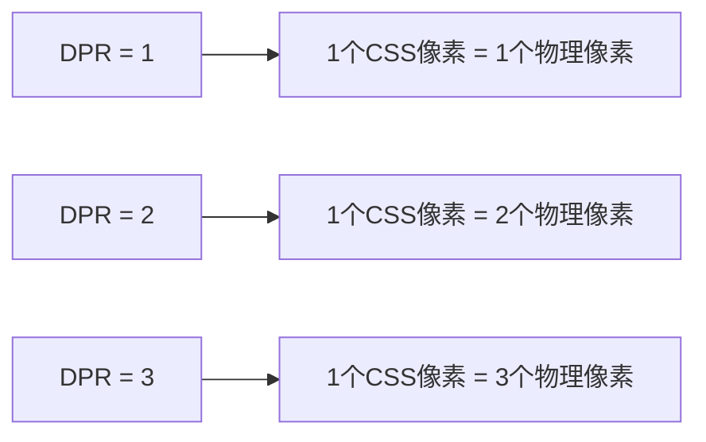
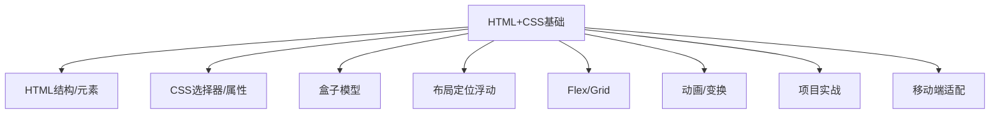

# 第17课：CSS 补充主题

## 学习目标

- 理解 CSS 中的各种单位
- 掌握移动端适配的常见方案
- 理解 viewport 的概念和配置
- 理解像素的概念（物理像素、逻辑像素、DPR、PPI）
- 了解 CSS 预处理器（Less）
- 掌握媒体查询的使用

---

## 一、CSS 单位

### 1.1 绝对单位

| 单位 | 说明 |
|------|------|
| `px` | 像素（CSS 中最常用的绝对单位） |
| `cm` | 厘米 |
| `mm` | 毫米 |
| `in` | 英寸（1in = 96px） |
| `pt` | 点（1pt = 1/72in） |
| `pc` | 派卡（1pc = 12pt） |

> [!NOTE]
> 在 Web 开发中，`px` 是最常用的绝对单位。其他绝对单位（cm、mm、in）很少使用。

### 1.2 相对单位

| 单位 | 参照对象 | 说明 |
|------|---------|------|
| `em` | 父元素的 font-size | 常用于文本缩进和间距 |
| `rem` | 根元素（html）的 font-size | 常用于响应式布局 |
| `%` | 父元素的对应属性值 | 最常见的相对单位 |
| `vw` | 视口宽度的 1% | 常用于移动端适配 |
| `vh` | 视口高度的 1% | 常用于全屏布局 |
| `vmin` | vw 和 vh 中较小的值 | 适配横竖屏切换 |
| `vmax` | vw 和 vh 中较大的值 | 较少使用 |

```css
html {
  font-size: 16px;   /* 定义 rem 基准值 */
}

.rem-demo {
  font-size: 1rem;    /* 16px */
  padding: 2rem;      /* 32px */
  margin: 0.5rem;     /* 8px */
}

.vw-demo {
  width: 50vw;        /* 视口宽度的50% */
  height: 100vh;      /* 视口高度的100% */
  font-size: 4vw;     /* 视口宽度的4%（响应式字号） */
}
```

---

## 二、深入理解像素

### 2.1 三种像素概念

| 概念 | 说明 |
|------|------|
| **物理像素**（设备像素） | 屏幕上的真实物理发光点 |
| **逻辑像素**（设备独立像素） | CSS 使用的像素单位 |
| **CSS 像素** | 我们编写 CSS 时使用的 px 单位 |

### 2.2 DPR（设备像素比）



**DPR** = 物理像素 / 逻辑像素

- iPhone SE：DPR = 2
- iPhone 12 Pro Max：DPR = 3
- 普通电脑显示器：DPR = 1

### 2.3 PPI（像素密度）

PPI（Pixel Per Inch）每英寸像素数，表示屏幕的精细程度。

```
PPI = √(宽像素² + 高像素²) / 屏幕对角线英寸数
```

PPI 越高，屏幕显示越细腻。超过 300 PPI 通常称为「视网膜屏」。

---

## 三、viewport（视口）

### 3.1 三种视口

```mermaid
graph TD
    A[viewport] --> B[布局视口 layout viewport]
    A --> C[视觉视口 visual viewport]
    A --> D[理想视口 ideal viewport]
    
    B --> E[默认宽度980px]
    B --> F[决定CSS布局]
    
    C --> G[当前屏幕可见区域]
    
    D --> H[设备理想的视口宽度]
    D --> I[手机通常为375/414/390px]
```

### 3.2 理想视口设置

```html
<meta name="viewport" content="width=device-width, initial-scale=1.0,
  maximum-scale=1.0, minimum-scale=1.0, user-scalable=no" />
```

| 属性 | 说明 |
|------|------|
| `width=device-width` | 布局视口宽度等于设备宽度 |
| `initial-scale=1.0` | 初始缩放比例为1 |
| `maximum-scale=1.0` | 最大缩放比例 |
| `minimum-scale=1.0` | 最小缩放比例 |
| `user-scalable=no` | 禁止用户缩放 |

> [!TIP]
> 这段代码几乎是每个移动端页面的标配，必须写上。

---

## 四、媒体查询

### 4.1 三种使用方式

**方式一：@media 规则**：

```css
/* 当视口宽度 ≤ 768px 时应用 */
@media (max-width: 768px) {
  .container {
    width: 100%;
  }
  .sidebar {
    display: none;
  }
}

/* 当视口宽度在 768px ~ 1024px 之间 */
@media (min-width: 768px) and (max-width: 1024px) {
  .container {
    width: 750px;
  }
}

/* 当视口宽度 ≥ 1024px */
@media (min-width: 1024px) {
  .container {
    width: 960px;
  }
}
```

**方式二：link 元素**：

```html
<link rel="stylesheet" href="mobile.css" media="(max-width: 768px)" />
<link rel="stylesheet" href="desktop.css" media="(min-width: 769px)" />
```

**方式三：@import 规则**：

```css
@import url("mobile.css") (max-width: 768px);
```

### 4.2 媒体类型

```css
/* 所有设备（默认） */
@media all { }

/* 打印样式 */
@media print {
  .nav, .footer { display: none; }
}

/* 屏幕 */
@media screen { }
```

### 4.3 常用断点（Breakpoints）

```css
/* 手机 */
@media (max-width: 575px) { }

/* 平板 */
@media (min-width: 576px) and (max-width: 991px) { }

/* 桌面 */
@media (min-width: 992px) and (max-width: 1199px) { }

/* 大屏桌面 */
@media (min-width: 1200px) { }
```

---

## 五、移动端适配方案

### 5.1 方案对比

| 方案 | 说明 | 推荐度 |
|------|------|--------|
| 百分比 | 不同属性参照不同，容易混乱 | 不推荐 |
| rem + 动态 font-size | 通过 JS 动态设置 html 的 font-size | 可用 |
| vw 方案 | 直接用 vw 作为单位 | **推荐** |
| flex 弹性布局 | 结合 vw/rem 使用 | 推荐 |

### 5.2 rem 适配方案

**原理**：根据视口宽度动态设置 html 的 `font-size`，让 `rem` 单位随视口变化。

**方案一：媒体查询**：

```css
html {
  font-size: 16px;
}
@media (min-width: 375px) {
  html { font-size: 16px; }
}
@media (min-width: 414px) {
  html { font-size: 17.6px; }
}
@media (min-width: 750px) {
  html { font-size: 32px; }
}
```

**方案二：JS 动态设置**：

```javascript
// 以 375px 设计稿为例，1rem = 10vw
function setRem() {
  const width = document.documentElement.clientWidth;
  const rem = width / 10;  // 1rem = 10vw
  document.documentElement.style.fontSize = rem + 'px';
}
setRem();
window.addEventListener('resize', setRem);
```

**方案三：lib-flexible**（阿里方案）：

```html
<script src="https://cdn.jsdelivr.net/npm/lib-flexible/flexible.js"></script>
```

### 5.3 vw 适配方案（推荐）

**原理**：直接用 `vw` 作为单位，相对于视口宽度。

```css
/* 设计稿宽度 750px，元素宽度 300px */
/* 换算：300 / 750 * 100 = 40vw */
.element {
  width: 40vw;
  height: 20vw;
  font-size: 4vw;
}
```

**px 转 vw 工具**：

- 手动：`vw = (设计稿中的px / 设计稿总宽度) × 100`
- Less 混入：
  ```less
  @design-width: 750;
  .px2vw(@px) {
    @result: (@px / @design-width * 100) + 0vw;
  }
  ```
- VSCode 插件：px to rem & rpx & vw

### 5.4 rem + vw 结合

```css
/* 1rem = 10vw（视口宽度为375px时，1rem = 37.5px） */
html {
  font-size: 10vw;
}

/* 限制最大最小字号 */
@media (max-width: 320px) {
  html { font-size: 32px; }
}
@media (min-width: 750px) {
  html { font-size: 75px; }
}
```

---

## 六、CSS 预处理器（Less）

### 6.1 CSS 的弊端

- 没有变量机制
- 不支持嵌套，选择器冗余
- 不支持复用（mixins）
- 没有计算能力

### 6.2 Less 基础语法

```less
// 1. 变量
@primary-color: #3498db;
@font-size: 16px;

body {
  color: @primary-color;
  font-size: @font-size;
}

// 2. 嵌套（& 表示父选择器）
.nav {
  display: flex;

  &-item {
    padding: 10px;
    color: @primary-color;
  }

  &:hover {
    color: darken(@primary-color, 10%);
  }
}

// 3. 计算
@base-width: 200px;
.box {
  width: @base-width + 100px;
  height: @base-width * 0.5;
}

// 4. 混入（Mixins）
.border-radius(@radius: 4px) {
  border-radius: @radius;
  -webkit-border-radius: @radius;
}

.card {
  .border-radius(8px);
  border: 1px solid #eee;
}

// 5. Maps（类似对象）
@theme: {
  primary: #3498db;
  danger: #e74c3c;
}

.btn {
  color: @theme[primary];
}

// 6. 继承
.error {
  border: 1px solid #e74c3c;
  color: #e74c3c;
}
.serious-error {
  &:extend(.error);
  border-width: 2px;
}
```

**Less 编译后的 CSS**：

```css
body {
  color: #3498db;
  font-size: 16px;
}
.nav {
  display: flex;
}
.nav-item {
  padding: 10px;
  color: #3498db;
}
.nav:hover {
  color: #217bbd;
}
```

> [!NOTE]
> Less 文件需要在开发环境中编译为 CSS。常用编译方式：Node.js（lessc）、Webpack Loader、VSCode 插件（Easy LESS）。

---

## 七、综合：响应式布局示例

```css
/* 基础样式：移动优先 */
.container {
  display: flex;
  flex-wrap: wrap;
}

.item {
  flex: 0 0 100%;      /* 手机：单列 */
  padding: 15px;
}

/* 平板：两列 */
@media (min-width: 576px) {
  .item {
    flex: 0 0 50%;
  }
}

/* 桌面：四列 */
@media (min-width: 992px) {
  .item {
    flex: 0 0 25%;
  }
}
```

---

## 自测问题

<details>
<summary>1. `em`、`rem`、`vw`、`vh` 分别相对什么？</summary>

em 相对父元素 font-size；rem 相对根元素 font-size；vw 相对视口宽度；vh 相对视口高度。
</details>

<details>
<summary>2. 物理像素、逻辑像素、DPR 三者有什么关系？</summary>

DPR = 物理像素 / 逻辑像素。例如 DPR 为 2 时，1 个 CSS 像素对应 2x2 个物理像素。
</details>

<details>
<summary>3. 移动端 viewport 标签如何设置？为什么重要？</summary>

`<meta name="viewport" content="width=device-width, initial-scale=1.0">`。它告诉浏览器使用设备宽度作为视口宽度，使得移动端页面按正确比例显示。
</details>

<details>
<summary>4. 媒体查询的常用断点有哪些？</summary>

手机：`max-width: 575px`；平板：`576px ~ 991px`；桌面：`992px ~ 1199px`；大屏：`min-width: 1200px`。
</details>

<details>
<summary>5. Less 中 `&` 符号的作用是什么？</summary>

`&` 表示当前父选择器，用于编写伪类（如 `&:hover`）或 BEM 命名（如 `&__item`）。
</details>

---

## 课程总结

恭喜你完成了 **Module 01: HTML+CSS 基础原理** 全部 17 课的学习！



**下一阶段**：进入 Module 02，学习 JavaScript 基础编程。

---

> 下一阶段：[[0001-html-css-basics|返回第01课：HTML+CSS 基础入门]]（复习）